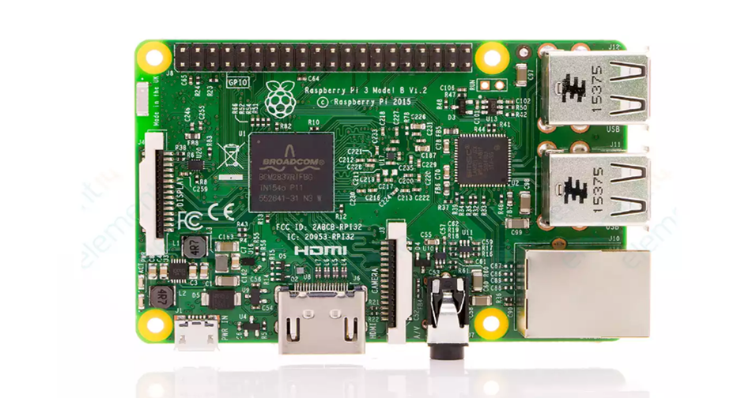
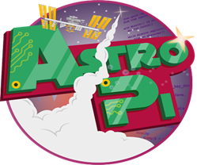
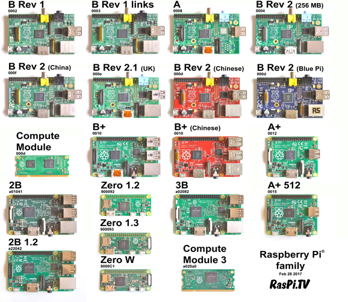
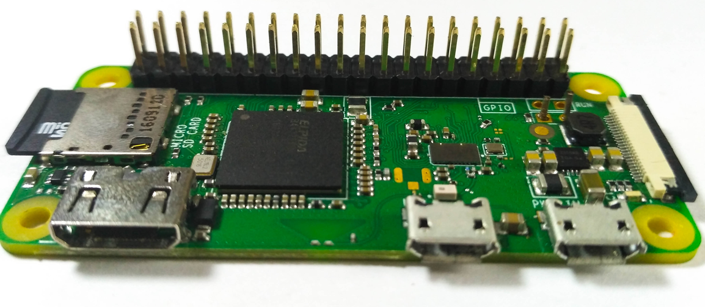
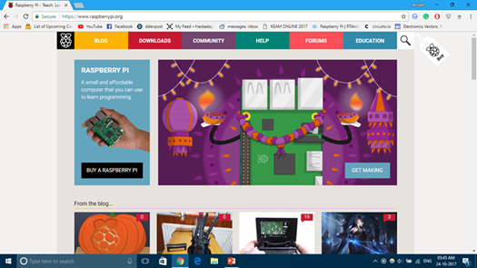
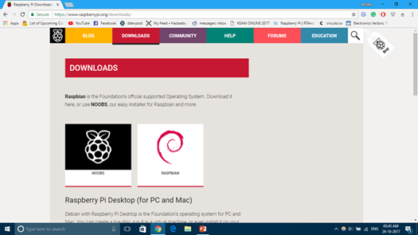
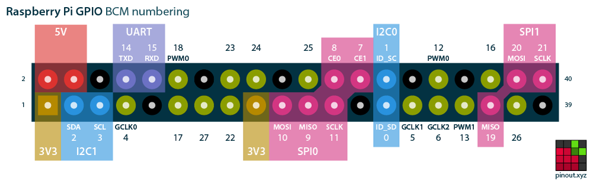

## What is Raspberry Pi?

Raspberry Pi is an extremely sleek and tiny computer. It is about the size of a normal credit card and runs on Linux based operating systems by default. This board can be considered a minified version of the motherboard in your PC. It probably can't offer the same level of processing capability as a normal PC, but it gets the job done.

The Raspberry Pi is a full computer. It has a processor, graphics processor, and memory - everything you have in your PC, but a lot smaller. The Raspberry Pi can be used in situations where a full computer could be used. Some may use it to replace desktop computers, while others use them as personal mini servers, as media portals for TVs, or as cores to power fun projects. It can act as the brain of a robot, a controller a greenhouse, or even just the switch of a light bulb. The Raspberry Pi can be programmed to control and read electronic components using its GPIO pins. There are endless possibilities.

Just like how you need to hook up your CPU to a monitor, keyboard, mouse, and LAN, the Raspberry Pi also needs to be connected to external accessories. It offers USB ports for interfacing keyboard and mouse, an HDMI (High Definition Multimedia Interface) port to connect a monitor/TV, 3.5mm audio jack with composite video output for using with old RCA television, Camera connector, display connector and an Ethernet port to gain internet access. It also has inbuilt WiFi and Bluetooth. (Some specifications may differ depending on the model of your Pi - see [Choose your Pi](https://hackclub.com/workshops/choose_your_pi) for more information)

The Raspberry Pi is usually powered by a 5v power supply. Unlike normal computers which usually run on hard drives, the raspberry pi uses SD cards that acts as the storage device. The OS is also preloaded onto the SD card. You can use SD cards of various capacities: 8GB, 16GB, 32GB, etc.

What the Raspberry Pi attracts people to the most is its availability of the 40 GPIO pins.

## The Story of Raspberry Pi

The Raspberry Pi came alive when the Raspberry Pi foundation based in UK thought of launching a cheap single-board computer to advocate for better computer science education in schools. But it has became so popular that the Raspberry Pi has been adopted by many hobbyists and engineers. Raspberry Pis are often used to prototype IoT devices, in entertainment equipment, and in robots. One of the main reason for the rapid growth of the Raspberry Pi is its strong community support and resources.

The Raspberry Pi foundation has sold more than 11 million Pi’s. Even the International Space Station have two Raspberry Pi's :)

# Specification and other details

There are different versions of the Raspberry Pi available. Some of the are:

1. Raspberry Pi 3 (Model B/B+)
2. Raspberry Pi Zero W
3. Raspberry Pi 2 (Model B)
4. Raspberry Pi Model A+
5. Raspberry Pi Model B+

## Raspberry Pi 3 specs

**Processor:** 1.2GHz quad-core ARM processor

**Memory:** 1GB Networking: Ethernet, wireless

**Connectivity:** HDMI out, analogue audio/video out (3.5 mm headphone hack), Bluetooth 4.1, 4× USB 2.0 in, micro USB power, 40-pin GPIO, Camera Module port (CSI), Display Module port (DSI), micro SD card slot

**Dimensions:** 86 × 56 × 17 mm

**Weight:** 45 g

## Pi Zero W specs:

**Processor:** 1GHz single-core ARM processor

**Memory:** 512MB

**Networking:** Wireless

**Connectivity:** Mini HDMI out, Bluetooth 4.1, micro USB in, micro USB power, 40-pin GPIO, Camera Module port (CSI), micro SD card slot

**Dimensions:** 65 × 30 × 5 mm

**Weight:** 9 g

# Raspberry Pi Operating Systems

Raspberry Pi supports a wide variety of Linux based Operating systems like Raspbian, Kodi, Ubuntu MATE, LibreELEC, also an IoT version of Windows 10 known as Windows 10 IoT Core and some unofficial third party operating systems like Kali Linux, RTAndroid, Flint OS, RetroPie.

Officially supported operating systems can be downloaded from [https://raspberrypi.org](https://www.raspberrypi.org).

## Raspberry Pi GPIO pinout

> Credits: [https://pinout.xyz](https://pinout.xyz)

For more information, visit the [official site](https://www.raspberrypi.org) of Raspberry Pi. They have a lot of resources and materials to get you started 😊
