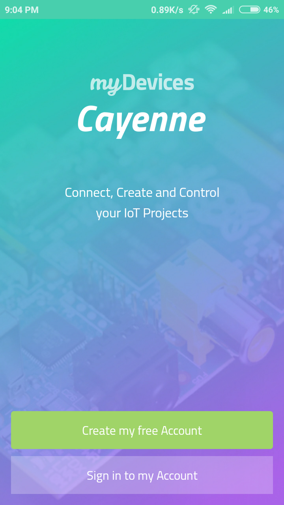
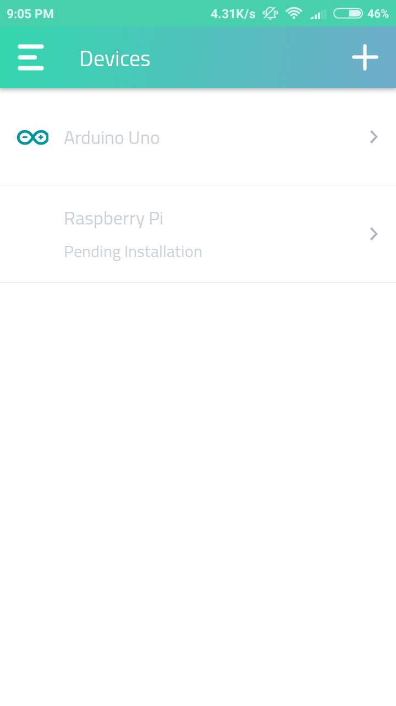
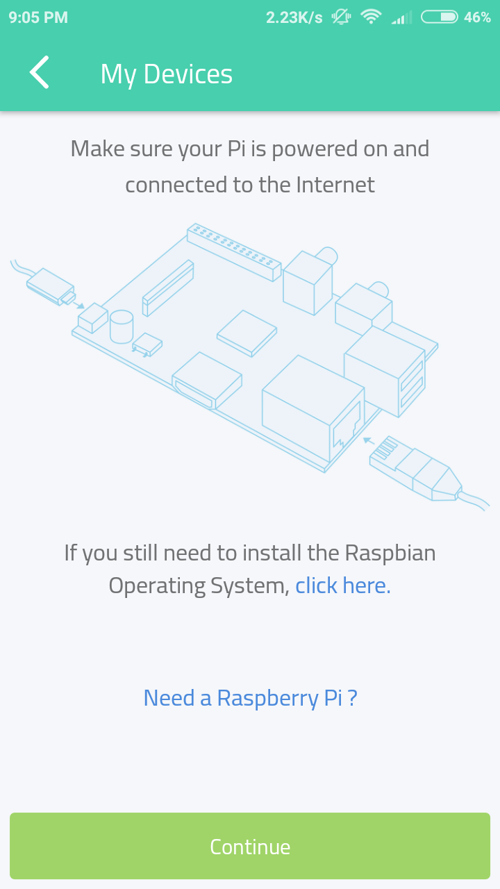
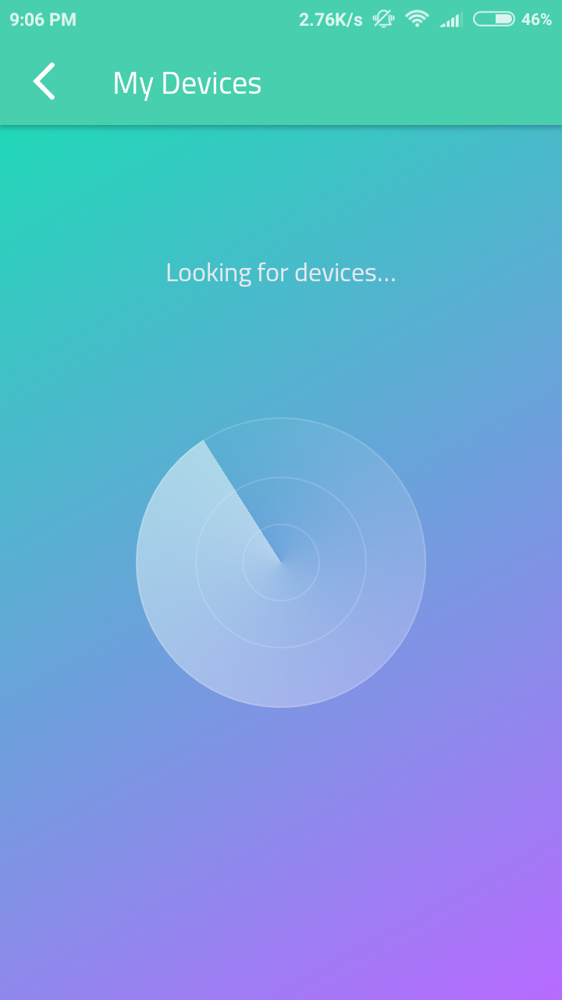
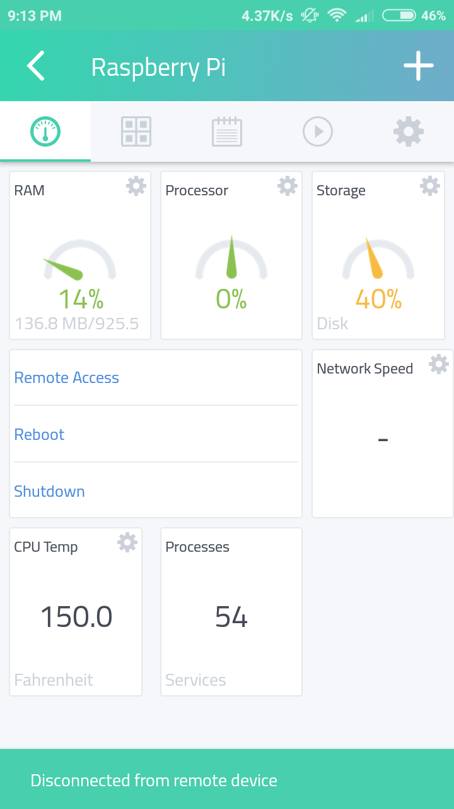
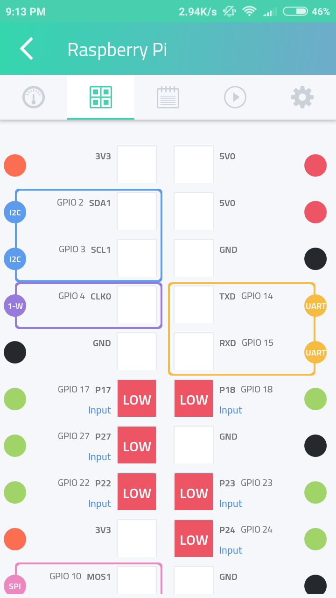
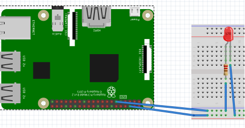
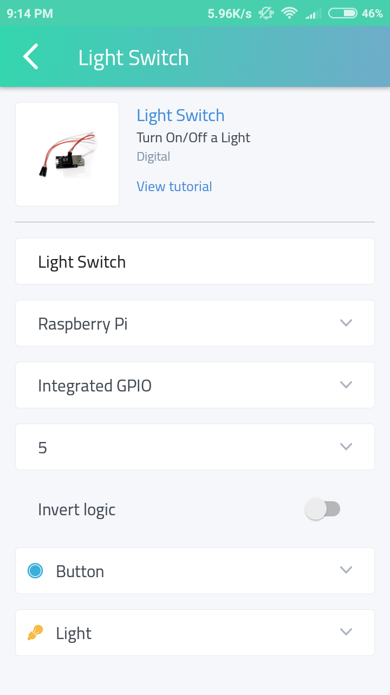

# Simple IoT project with Raspberry Pi & Cayenne

Raspberry Pi with its new models has become an integral part of IoT projects. 

By IoT, it means a device connected to the internet that can be controlled and monitored through the internet. In this project, we are going to use a "drag and drop" IoT project builder platform known as [Cayenne](http://cayenne.mydevices.com). With this platform, we can read sensor data, control actuators etc. 

As a beginner step to the IoT project, we are going to control an LED using the Cayenne app (Cayenne can also be used through your PC's browser)

## Things Needed

- Raspberry Pi connected to the internet
- Breadboard
- An LED
- 220ohm resistor
- Female to male jumper wires

Turn on your Raspberry Pi and connect to your network.

Then download the Cayenne app from the [Google Play Store](https://play.google.com/store/apps/details?id=com.mydevices.cayenne&hl=en) or use their [website](http://cayenne.mydevices.com). 

Create your free account.

Click the **+** on the right top side to add new devices. 

Select Raspberry Pi icon

Follow the instructions above and search for your Raspberry Pi

(Don't forget to connect your phone to the same network as the Pi)

It will automatically detect your Raspberry Pi otherwise type in the IP address of your Pi.

Select your Raspberry and click setup. This will then initialize the installation of required files on to the Raspberry Pi.

It will take 5 min or so to complete this setup. Once it is done select your device from the interface.

You can see various parameter on the screen, on the other tab you can see the state and details about GPIO.

Connect your LED to your Raspberry Pi using a breadboard and two jumper wires. Follow the diagram. 

Positive end of the LED to the GPIO 17 of Raspberry Pi. Follow the Raspberry Pi GPIO spec sheet for clarification. 

The negative end to any of the GND available in the Raspberry Pi.

(Don't forget the resistor. Directly plugging the LED can sometimes damage it)

Click the + icon available on the top right section of the first tab and select light from the actuators and then light switch. 

- First field: Name it as light switch
- Second field: select your device as Raspberry Pi
- Third field: Select integrated GPIO
- Fourth filed: choose 11,  since we have connected our LED to GPIO 17  that is to pin 11.
- Enable Invert Logic
- Leave the other two fields as it is.
- Then click add button given below.

That's it, you have configured your Raspberry Pi. A button should appear on the interface. Now click that button you have created you should see the LED turning ON.

You have made your very first IoT project. Since it is easy to use Cayenne you can make you or own projects by hooking up different actuators and sensors.

You just need to have that maker mind and an urge to know how things work. If you have any doubt, Google your way. That's how real makers do it 😉

*Follow up projects and tutorials will be added in the future updates.*
