This workshop will introduce you to the world of IoT ( Internet of things ). It will be a very short and simple workshop and can be completed within 30 minutes!

## Resources

The final version of the code is available at the **master branch** of this [repository](https://github.com/bajpai244/iotworkshop). You can use it as a help in this workshop.

## Project Demo

To see what you will make, click [here](https://www.youtube.com/watch?v=PcS9evUyXaE&feature=youtu.be) or click on the image below, it will take you to Youtube where the demo is available.

<a href="https://www.youtube.com/watch?v=PcS9evUyXaE&feature=youtu.be" target="blank" >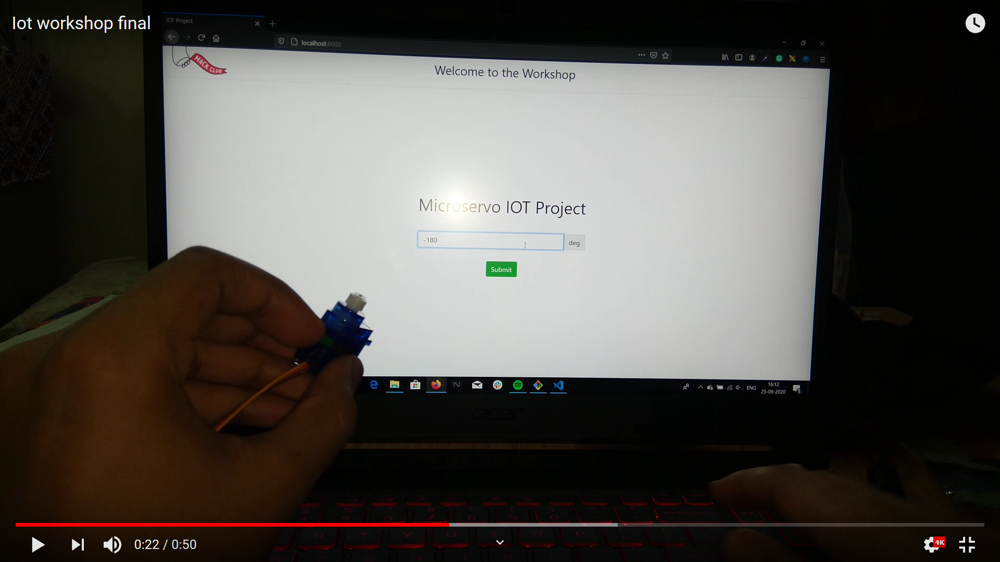</a>

You will notice that on entering an angle on the website and clicking submit the servo motor will rotate to the specified angle.

## Prerequisites

The workshop is for anyone with the knowledge of :

- Javascript ( basics )
- Arduino ( basics )
- Node js ( basics )

You don't need to be a guru in any of them, so a beginner with basic knowledge of them can easily complete this workshop.

## Components Required

You will require the following things to complete this workshop:

1. Arduino IDE ( it is free to download , download it from [here](https://www.arduino.cc/en/main/software#download) )

2. Arduino Uno

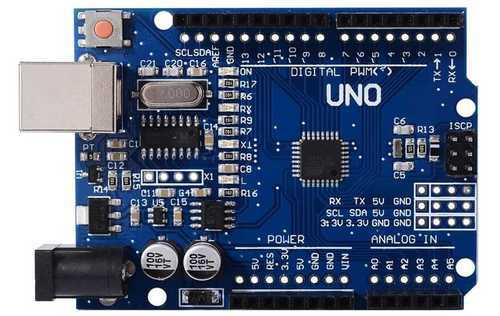

3. Servo Motor ( SG-90 )

   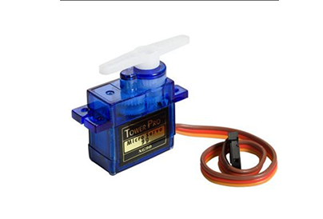

4. Jumper Wires ( male-to-male )

   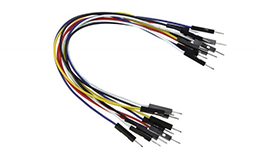

5. Node.js ( it is free to download , download it from [here](https://nodejs.org/en/download/) )

## Step 1

### Download the template

I have made a template so that setting up this workshop becomes really easy for you.

Go to: [https://github.com/bajpai244/iotworkshop](https://github.com/bajpai244/iotworkshop) and either [clone the repository](https://docs.github.com/en/enterprise/2.13/user/articles/cloning-a-repository) or if you don't have git then download it in zip format and then extract it.

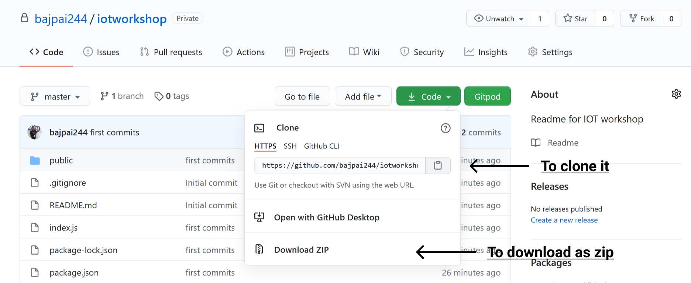

## Step 2

### Installing Packages

Now open the cloned folder or extracted folder inside a terminal ( you can use any terminal of your choice ).

Now simply type **npm install and hit Enter.** This will install all the required packages for you.

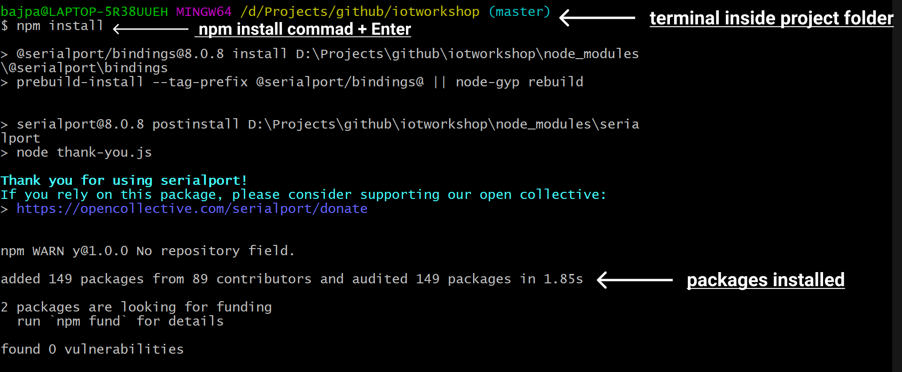

## Step 3

### Make the circuit

Make your circuit by following the below circuit diagram:

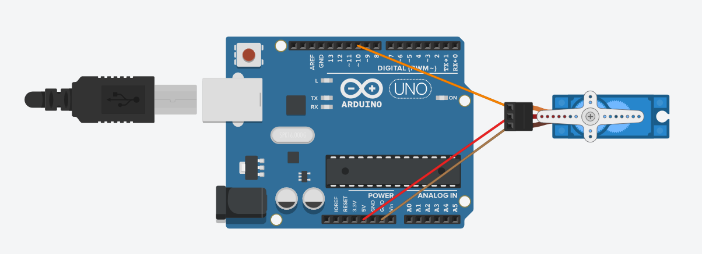

**Wire Configuration:**

| Wire Number | Wire Colour |                                                 Description |
| ----------- | :---------: | ----------------------------------------------------------: |
| 1           |    Brown    |               Ground wire connected to the ground of system |
| 2           |     Red     |                      Powers the motor typically +5V is used |
| 3           |   Orange    | PWM signal is given in through this wire to drive the motor |

## Step 4

### Working with index.js

Now open the index.js file of the folder ( inside a code editor ). It will be completely empty.

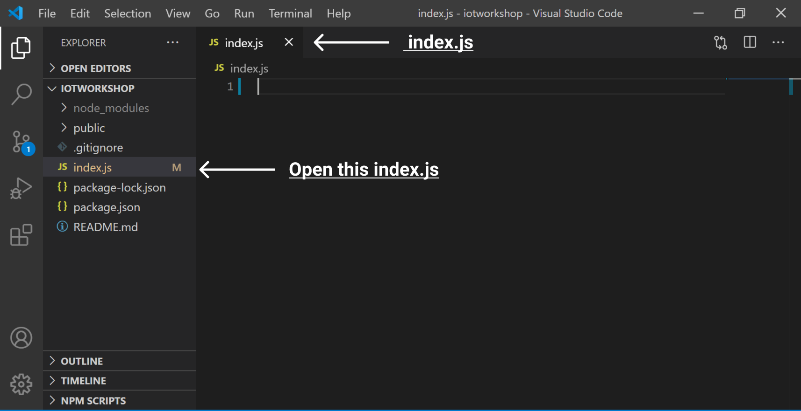

Now add the following code inside it:-

```js
const five = require('johnny-five')
const express = require('express')
const ws = require('ws')
```

Here we have done the following:

- We imported [johnny-five](http://johnny-five.io/), [express](https://expressjs.com/), and [ws](https://www.npmjs.com/package/ws).
- johnny-five will helps us to make robotics and IoT projects with Javascript.
- express is the de facto standard server framework for Node.js. We will use it to create our server.
- ws is the de facto for implementing [WebSocket](https://developer.mozilla.org/en-US/docs/Web/API/WebSockets_API) for Node.js.
- WebSocket enables bidirectional communication between the client and the server.
- WebSocket will enable our website to communicate in real-time with our Arduino.

Now **add the following code** to the existing index.js code:

```js
// add the following code to index.js

const board = new five.Board()
let servo = null

const app = express()

app.use(express.static('public'))

const server = app.listen(8000, function () {
  console.log('Listening on port ' + 8000)
})
```

We have done the following here:

- board variable stores the object returned by five.Board().
  servo variable is null and will be used later in the program.

- The app variable will be used to configure our express server.

- The app.use(express.static('public')) will statically serve all the files in our public folder.

- public folder contains a .html,.js, and .css file each ( they will automatically be served).

- app.listen will make the server run on a particular port in our case **8000**. It has a callback function that logs on the console when it is up and running.

- The server variable will store object returned from app.listen() and will be used later.

## Step 4

### Working with the board variable

Now we are going to initialize the board variable, add the following code to your existing index.js code:

```js
// add the following code to index.js

board.on('ready', function () {
  console.log('### Board ready!')
  servo = new five.Servo(10)
})
```

1. We have added a **.on** listener to the board, this will execute when the board is ready to use and the callback function will log on the terminal as feedback that the board is ready.

2. **new five.Servo(10)** will return an object which can interact with a Servo Motor connected on _PWM pin 10_ and will be stored in Servo Variable.

## Step 5

### creating WebSocket server

Now we will create a WebSocket server for real-time communication between our server and our website. Add the following to your index.js.

```js
const wsServer = new ws.Server({ server })

wsServer.on('connection', function (socket) {
  console.log('ws:connection established')
  socket.on('message', function (angle) {
    servo.to(angle)
  })
})
```

1. Here ws.Server takes _server_ as an argument where _server_ is the object returned by our app.listen() method. wsServer stores the object returned from new ws.Server({ server }).

2. wsServer has a **_.on listener_** which will call the callback function when wsServer's connection event occurs.

3. The callback function will first log to the terminal as feedback.

4. socket argument of callback function has _message event_. We have added a listener to it.

5. When we will receive a message from the website we will rotate the Servo Motor to the angle specified in the message.

6. Here servo.to(angle) rotates the motor to the angle specified in its argument.
   Here angle variable is the angle passed to us as a WebSocket message.

### Final index.js code

**After following all the above steps** your index.js code will look like this:

```js
const five = require('johnny-five')
const express = require('express')
const ws = require('ws')

const board = new five.Board()
let servo = null

const app = express()

app.use(express.static('public'))

const server = app.listen(8000, function () {
  console.log('Listening on port ' + 8000)
})

board.on('ready', function () {
  console.log('### Board ready!')
  servo = new five.Servo(10)
})

const wsServer = new ws.Server({ server })

wsServer.on('connection', function (socket) {
  console.log('ws:connection established')
  socket.on('message', function (angle) {
    servo.to(angle)
  })
})
```

I have removed all the comments from the code.

## Step 6

### Configuring the Arduino

Now we will be configuring our Arduino.

Make sure Arduino Uno is selected as the board in your IDE.

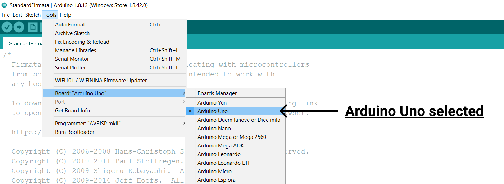

Open your Arduino IDE and plug your Arduino into the system ( via its USB cable ).
Now do the following:

1. Click on **file** in menu bar.
2. Select **Examples**.
3. Select **Firmata**.
4. Select **StandardFirmata**

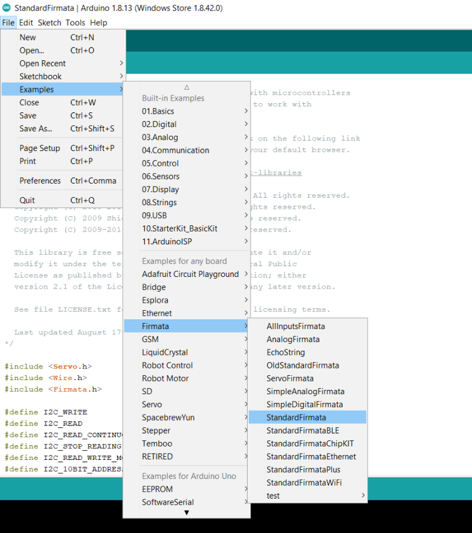

After doing this some code will be shown on your IDE, leave it as it is.

### Upload code to Arduino

Now upload the code to your Arduino board.

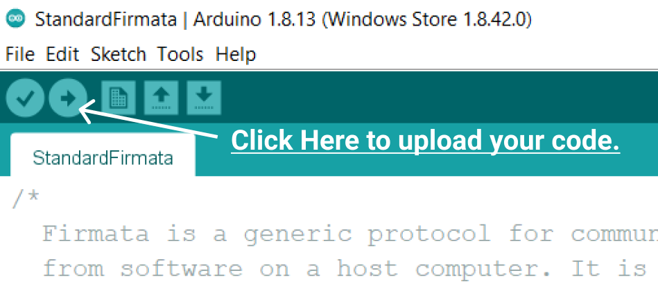

To confirm upload is done look at the bottom-left part of your screen if **Done uploading** is written there then you can close the IDE.

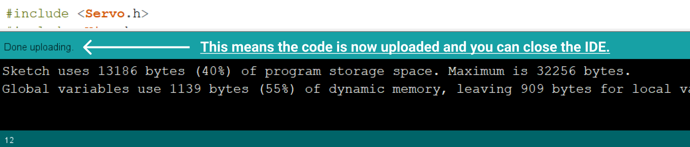

This ends up the Arduino configuration part.

## Step 7

### Working with the frontend

I have already created the frontend for us so that we can focus more on the logic part, you can still customize it to your need.

script.js is the js file of our fronted and styles.css is the stylesheet and all of them are already connected to the index.html file.

### working with script.js

Now open script.js file ( js file for our website ). It is inside the public folder.

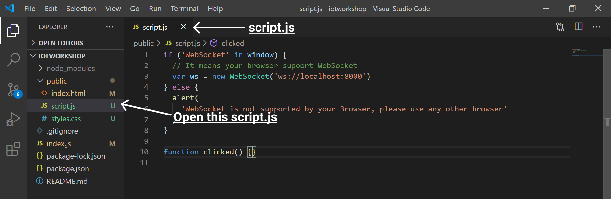

- I have already added some code there, the first if-else conditional will check whether your browser supports WebSocket or not, and if it supports WebSocket then it will create a WebSocket client **ws**.

- It has an argument _"ws://localhost:8000"_ which will specify that it needs to connect to the WebSocket server at localhost:8000 ( see it is ws not http ).

- The clicked() function in your code is the function that will execute when we will click the submit button.

### working with clicked() function

Now inside your clicked() function add the following code:

```js
function clicked() {
  const input = document.getElementById('angle').value
  const intInput = Number.parseInt(input)

  if (isNaN(intInput) == false) {
    ws.send(intInput)
  } else {
    alert('Please Enter A valid Number')
  }
}
```

Here the following is happening:

1. input stores the value of the input element which will receive the angle ( its id is angle ).
2. intInput stores the integer value of the angle.
3. isNan(intInput) will be false if the number is valid, if invalid it will be true.
4. Therefore when **isNan(intInput)==false** we send the angle to our server which will rotate our Servo Motor!

This was the last step that involved coding in this workshop. Now it is time to run your code and see the magic.

## Run your code

### Magic time!

It is time to run our code!

1. Make sure Arduino is connected to the system.
2. Open the terminal inside your project folder and type **node index** and hit enter.

   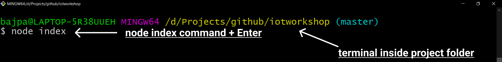

3. wait for the console to show the message _'### Board ready!'_.

   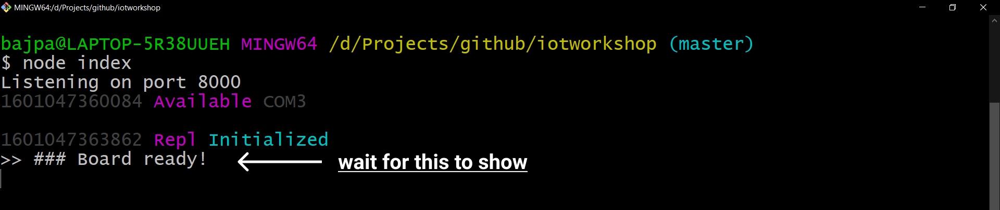

4. Open the browser and type localhost:8000 in your browser.

   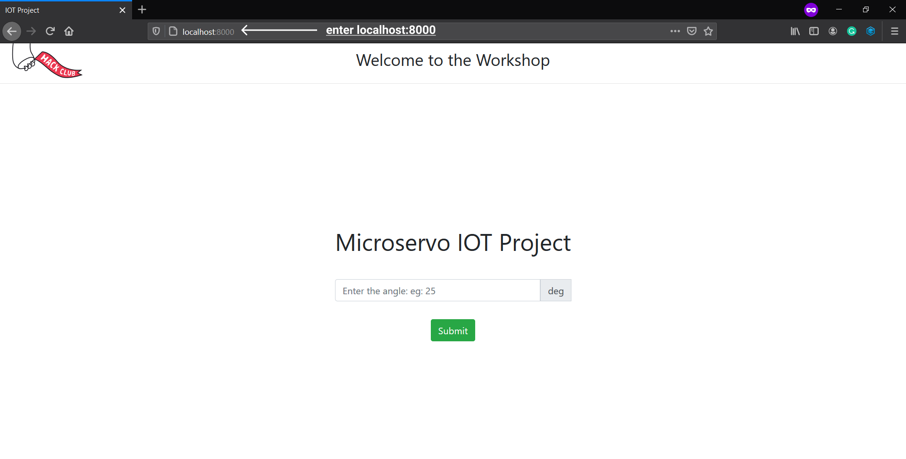

5. Now enter any angle (numerical value) and click the submit button to see the magic.
   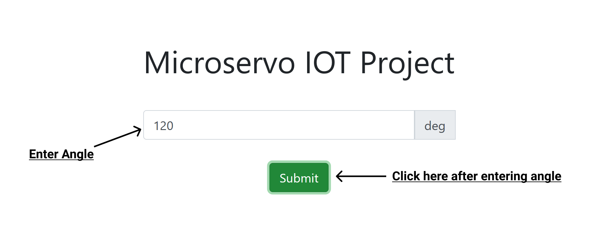


## Next Steps!

I know it feels awesome to make it but don't stop here, Create whatever you can from this crazy trick and share it with us in the [`#ship`](https://app.slack.com/client/T0266FRGM/C0M8PUPU6) channel of [Hack Club's Slack](https://hackclub.com/slack/).

johnny-five supports a lot of other components and boards, check out their [website](http://johnny-five.io/), and make some other cool projects with it!

If you have any doubts or queries regarding this workshop then reach out to me on Hack Club's Slack My username is Harsh Bajpai!
