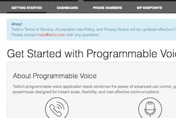
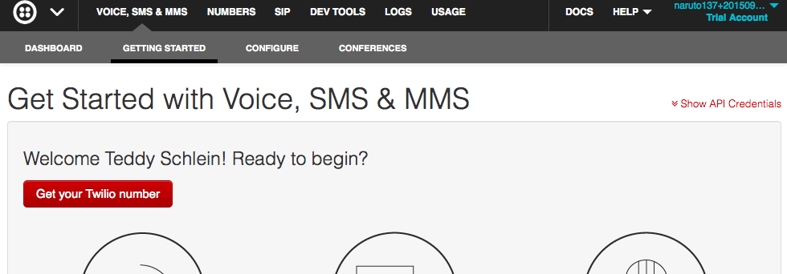
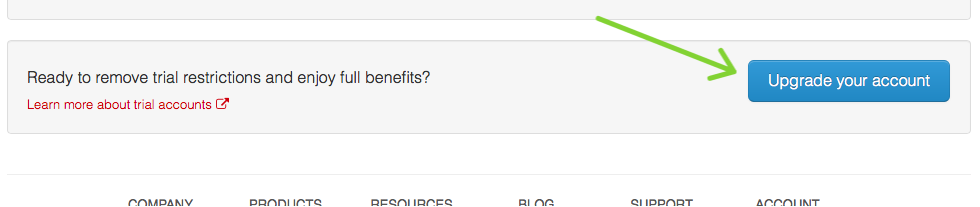
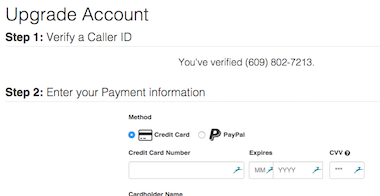
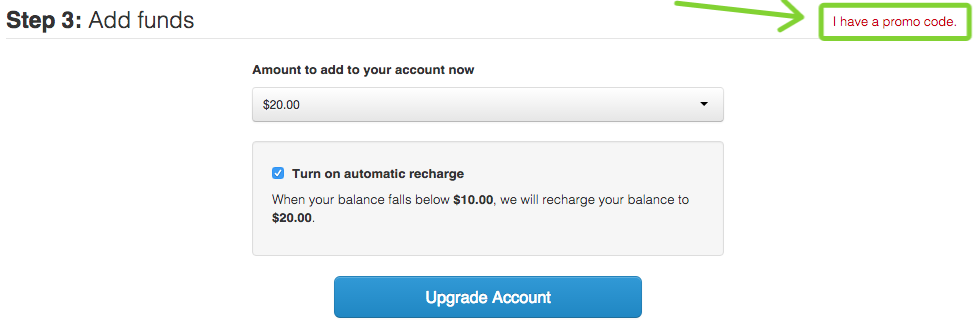
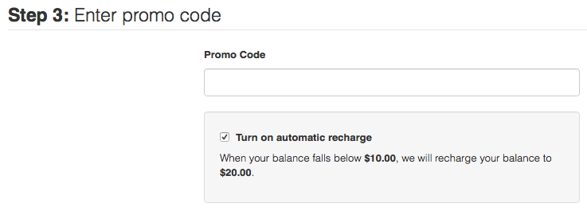
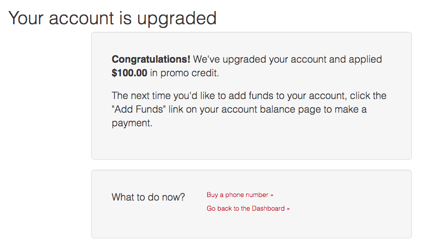
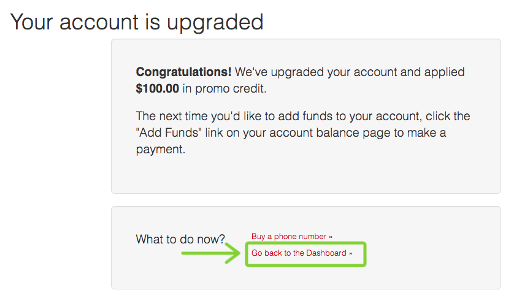
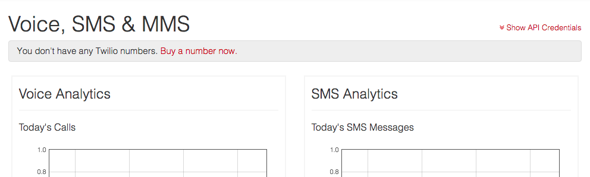
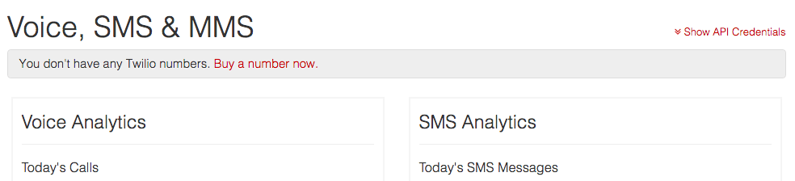

# Twilio Signup Instructions

By the end of this tutorial, you will have a Twilio account SID and
authentication token.

[Twilio](https://twilio.com) is the service that lets you easily send and
receive text messages and phone calls using minimal code. They gave every Hack
Club member $100 worth of Twilio credit.

## Creating an Account

1. Open https://www.twilio.com/signup
2. Fill in your information
  - Note that there are 3 questions like "What are you building?". Don't bother
    answering them correctly. Just choose the first answer you see and move on.
3. Click "Get Started" button to move to the next step
4. Twilio then asks you to enter a phone number. Do that.
5. Click "Text Me" and continue following remaining directions until you see
   this screen:

   > 

6. Then scroll all the way down:

   > 

7. Click the "Upgrade your account" button

   > 

8. You will see this screen:

   > 

9. Fill in the below information.
  - Leave the "Company/Project URL" and "Phone Number" fields blank
  - For the credit card information, although Twilio is giving each member
    $100 worth of credit, you still need a credit card to signup. To make your
    life as easy as possible, we've provided a credit card you can use for
    signup. Don't worry -- this isn't our actual credit card, it has a $1 limit
    on it and the address is Hack Club's business address.

    | Field              | Value                                 |
    | ------------------ | ------------------------------------- |
    | Credit Card Number | `4859106516337671`                    |
    | Expires            | `03/2020`                             |
    | CVV                | `660`                                 |
    | Cardholder Name    | `Zach Latta`                          |
    | Street Address     | `4080 18th Street, San Francisco, CA` |
    | Zip Code           | `94114`                               |

10. Click "I have a promo code."

    > 

11. The promo code is `HackClubRocks`:
    1. Enter the promo code
    2. Uncheck "Turn on automatic recharge"

      > 

12. After making sure that all the information you entered is correct, click the
    "Upgrade Account" button.

13. You should be greeted by a message that looks something like the below
    image. If you get an error, send a message to the `#meta` channel in
    [the Slack](../../../SLACK.md) mentioning `@staff` and someone from the Hack
    Club team will work with you to get it sorted out.

    > 

14. Click on "Go back to the Dashboard »"

    > 

15. You will be taken to this screen:

    > 

16. Click on "Show API Credentials"

    > 

17. Write down your account SID and authentication token somewhere that you can
easily retrieve them. Make sure you remember which one is which. In my case,
  - my account SID is `AC6f0013735dcb2fa4db7e35baa5c7e344`
  - my authentication token is `fb83ceb820510cf695cf1f45b157c12f`

18. Great! We have what we need!
