# Twilio Signup Instructions

By the end of this tutorial, you will have a Twilio Account SID and Auth Token.

[Twilio](https://twilio.com) is the service that lets you easily send and
receive text messages and phone calls minimal code. It's used heavily in one of
our workshops and it's great for projects workshops use it.

Twilio is giving every Hack Club member $100 worth of Twilio credit. This guide
will walk you through the process if signing up for a Twilio Account.

## Creating an Account

Open [https://www.twilio.com/](https://www.twilio.com/)

Click the `SIGN UP` button:

> 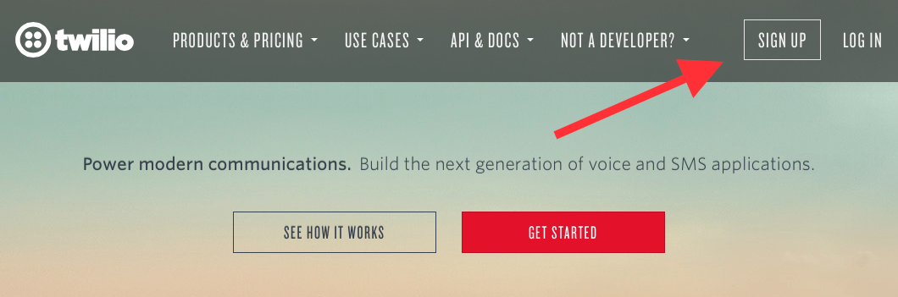

Fill in your name, email, and password:

**Important**: _Make sure you use your actual email address_

> 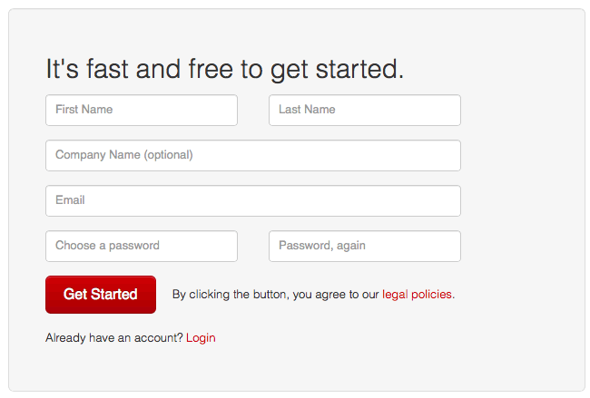

Type in a phone number that you have access to right now that can receive text
messages

> 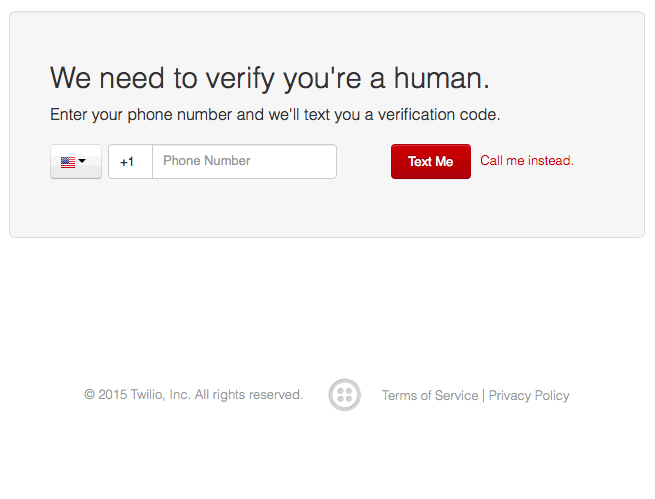

Twilio will send you a text message with a numeric verification code:

> 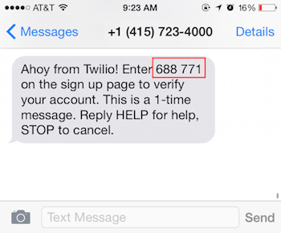

Take that verification code (my code was `688 771`) and enter it on the website.
You might also have a captcha to fill out as well:

## IMPORTANT NOTE

Do **NOT** buy your own phone number or else the twilio-basic library we use
will NOT work. The twilio-basic script will buy the phone number for you and
will do some configuration on the phone number it buys.

If however you're dead set on choosing your own phone number and want to buy
your own phone number you'll have to manually set the sms callback URL yourself

To build the the URL for the phone number `+1-484-681-2377`,

- Remove all of the dashes and plusses
  - `14846812377`
- Remove the 1
  - `4846812377`
- Take those digits and append them to "https://dweet.io/dweet/for/"
  - `https://dweet.io/dweet/for/4846812377`

For the phone number `+1-415-238-0812` the url would be
`https://dweet.io/dweet/for/4152380812`

To set this as your callback URL, go to the Twilio [incoming phone numbers page]
(https://www.twilio.com/user/account/phone-numbers/incoming)

> 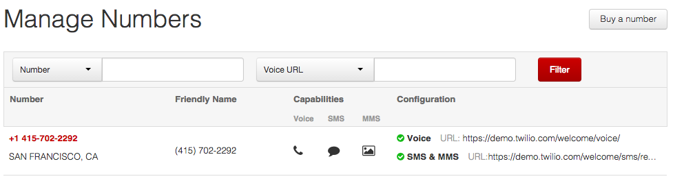

Click on your phone number

> 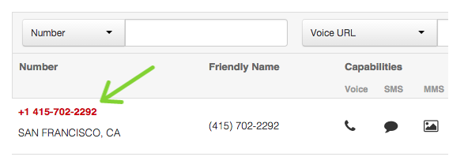

Scroll all the way down until you see "SMS & MMS"

Then in the "Request URL", paste in the URL that you made above

> 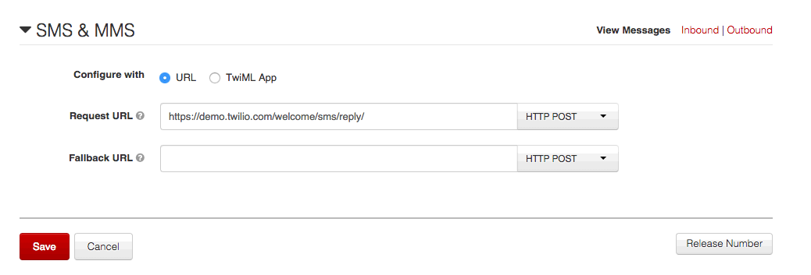

Make sure that the right side is HTTP POST (it should be the default)

> 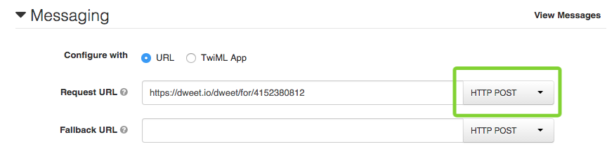

Then click the "Save" button at the bottom

## Upgrading Your Account

> 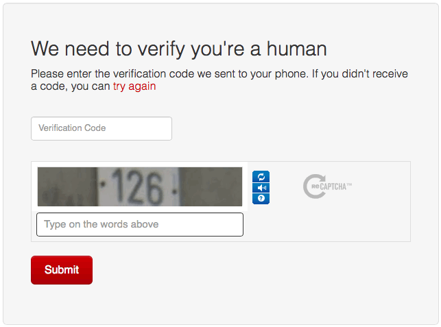

Scroll all the way down:

> 

Click the "Upgrade your account" button

> 

You will see this screen:

> 

**Important:** _Do not press the button that submits the form until the
directions tell you to_

### Credit Card Info

Although Twilio is giving each member $100 worth of credit, you still
need a credit card to signup for Twilio.

For your convenience, we have provided a credit card to signup with below. You
may use your own card as well (your card will not be charged if you turn off
automatic recharging).

| Field              | Value                               |
|--------------------|-------------------------------------|
| Credit Card Number | `4847356897256173`                  |
| Expires            | `09/2021`                           |
| CVV                | `917`                               |
| Cardholder Name    | `Jonathan Leung`                    |
| Street Address     | `200 Haverford Road, Wynnewood, PA` |
| Zip Code           | `19096`                             |

We enter this info below:

> 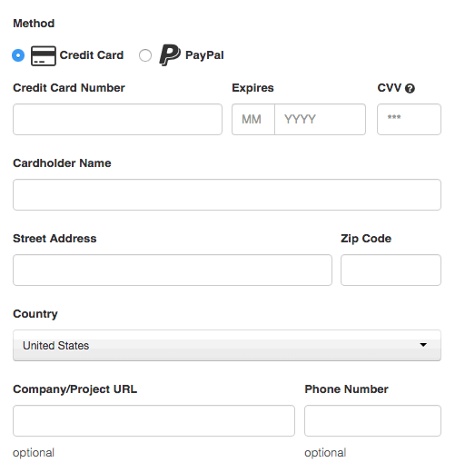

Leave the "Company/Project URL" and "Phone Number" fields blank

> 

**Entering The Promo Code**

Click "I have a promo code."

> 

To get the actual promo code:

- Ask your club leader for the Twilio promo code
- If you are the club leader, send an email to the email address
  `jonathanleung1337@gmail.com` with your full name and school and ask for the
  Twilio promo code. They will respond to you quickly.

After obtaining the promo code:

- Enter the promo code
- Uncheck "Turn on automatic recharge"

> 

After making sure that all the information you entered is correct, click the
"Upgrade Account" button.

> 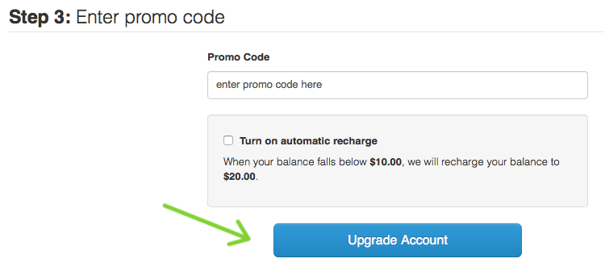

You should be greeted a message that looks something like this:

> 

Click on "Go back to the Dashboard »"

> 

You will be taken to this screen:

> 

Click on "Show API Credentials"

> 

Write down your **ACCOUNT SID** and **AUTH TOKEN** somewhere that you
easily locate again. Make sure you remember which one is which.

In my case, my ACCOUNT SID is `AC6f0013735dcb2fa4db7e35baa5c7e344`
and my AUTH TOKEN is `fb83ceb820510cf695cf1f45b157c12f`.

We have what we need!

## If You Live Outside of the North America

You will want to purchase a phone number from your country. It is important
that you do this now.

# Feedback

_Did you find anything confusing or not working in this segment of the
tutorial? Tell us about it
[here](https://docs.google.com/forms/d/1IxbiDtyP-UOx3hRGu3o2I-iVll95xQ6I_pW8JS3TZ2k/viewform?entry.1677546962=Signing+up+for+Twilio)._
