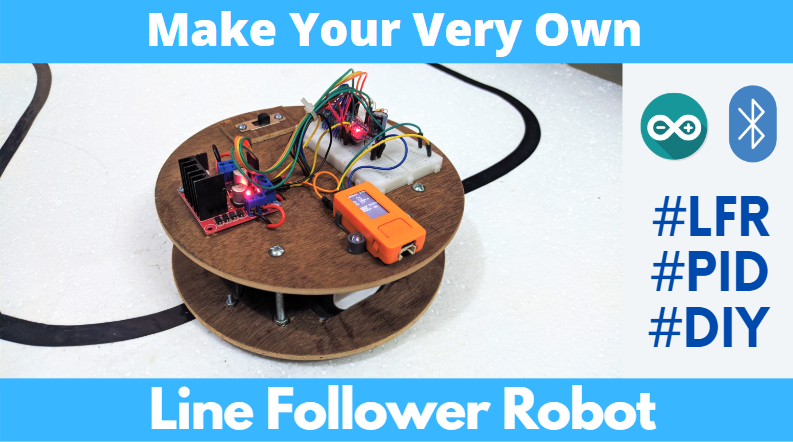
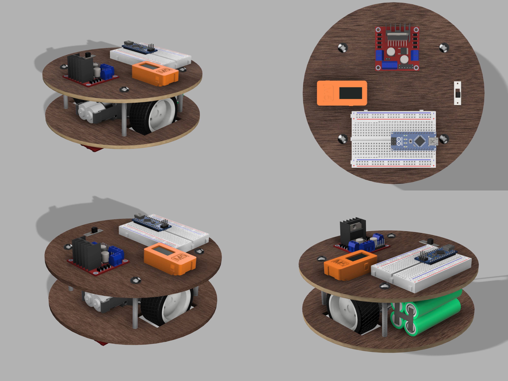
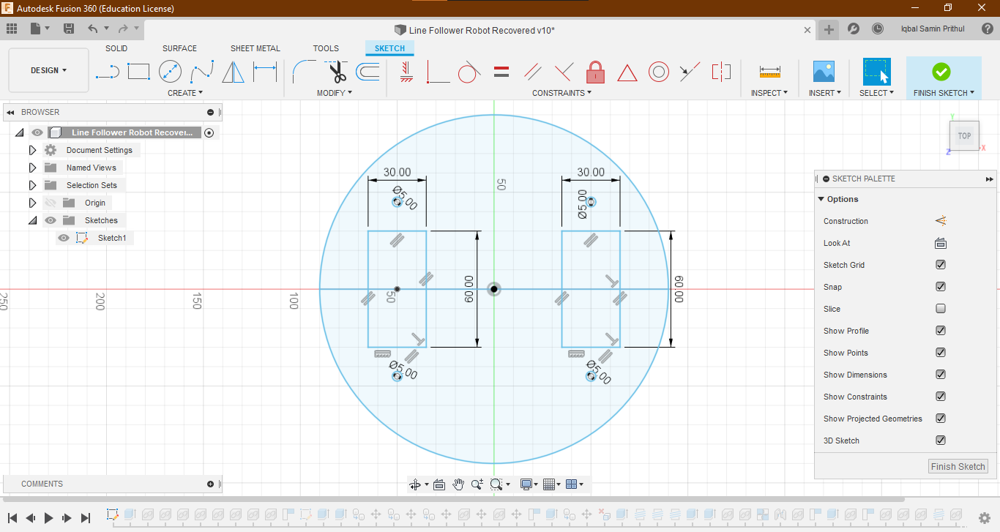
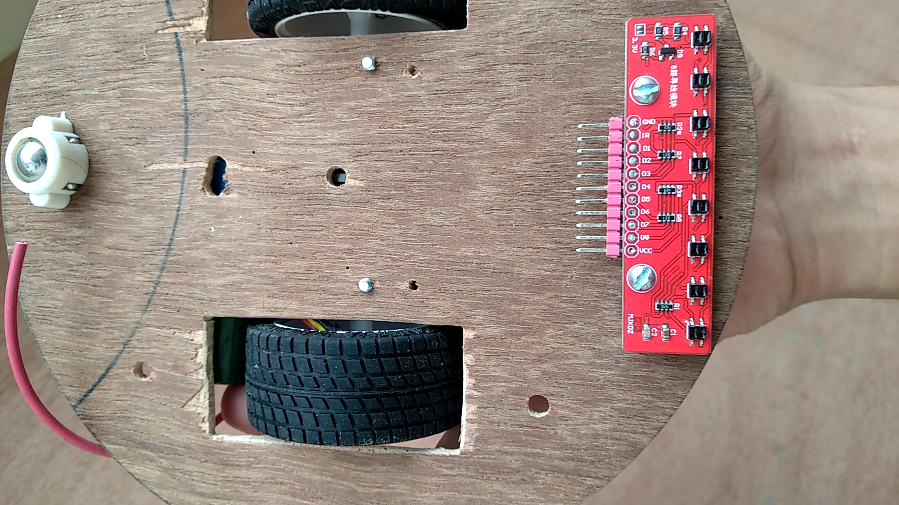

# Line Following Robot

A Line Following Robot is a great way to enter the world of Robotics. Not only is it a fun to watch little robot, but it's also widely used from airport to even in [Tesla's factory](https://youtu.be/mr9kK0_7x08?t=404). 
And now, you can make one yourself at home! This workshop will guide you through the complete build and coding process so you can get started even without much experience with Arduino and programming voodoo stuff. So buckle up!

## What you'll need:
I added links to some products that are commonly not available. Others should be easy to find online or in your nearby electronics/hobby shop.
 - Chassis kit, something like [this](https://www.banggood.com/2WD-Mini-Round-Double-Deck-Smart-Robot-Chassis-Car-DIY-Kit-p-1147036.html?rmmds=search&cur_warehouse=CN)  will work great.
	***or***, if you decide to make your own chassis:
	 - 2x [Motors with gearbox](https://www.banggood.com/65-x-26mm-Plastic-Tire-Wheel-DC-3-6v-Gear-Motor-For-Arduino-Smart-Car-p-997113.html) or one of these [twin motor gearbox](https://www.pololu.com/product/61)
	 - 2x Wheels
	 - 1x [Ball Caste](https://www.banggood.com/KittenBot-2Pcs-Robot-Chassis-Universal-Wheels-With-M3-Screw-For-Arduino-Smart-Car-Kit-p-1280639.html)r
	 - Plywood, 4-5mm thickness works great.
	 - 4x Bolts and 12x Nuts
	 - Extra screws to mount all the hardware to the wood.
- 1x Arduino Nano or Uno. (or any other microcontroller board if you know what you are doing)
- 1x L298n Motor driver module
- 1x [QTR-8a](https://www.pololu.com/product/960) or, [QTR-8RC](https://www.pololu.com/product/961) IR Reflectance sensor array.
- 1x Half sized breadboard
- Some [jumper wires](https://www.banggood.com/65pcs-Male-To-Male-Breadboard-Wires-Jumper-Cable-Dupont-Wire-Bread-Board-Wires-p-91799.html)
- Battery (more about it later)
- 1x [M5StickC](https://m5stack.com/products/stick-c) ESP32 module with display 
  or a [bluetooth module](https://www.banggood.com/search/hc-05.html) *(optional)*
- 1x XL6009 votlage boost converter *(optional)*

I will be explaining about some of the parts in later steps
	


## Part 1: The build

### Check out the Build Video:
I made a video summarizing the build and working mechanism, so that you can get an image of the whole process. Pardon my newbie video making skills. Click the image below to watch it.

[](http://www.youtube.com/watch?v=kM0dcchr15E "Line Following Robot Build")

### Choosing the battery:
Choosing the right battery is fairly important for your robot to work properly. Lithium batteries would be the best option to get a decent amount of run time out of a single charge. In terms of voltage, if you decide to power your robot directly from the battery, you should choose one with a voltage of *at least  7V*, in order to make sure the Arduino and everything else is powered properly. 
The LiPo batteries used for radio controlled models are widely available for cheap, like [this one on HobbyKing](https://hobbyking.com/en_us/turnigy-2200mah-2s-30c-lipo-pack.html?queryID=f7fcc34b646a0f038fc4b743d9276066&objectID=18290&indexName=hbk_live_magento_en_us_products). However, you can simply use some rechargeable AA cells, 4 should give you a nice and stable 6V. 
For me, I had to use what I had lying around. I had some 18650 Lithium cells collected from old laptop batteries. I made a pack of 2 cell battery. If you don't know what I mean, take a look [here](https://www.youtube.com/watch?v=UjG2QGOC4aA)

### XL6009 voltage booster module (optional but recommended):
I added a a voltage booster module to increase or *boost* the battery voltage up to 9 volts. This supplies a stable 9V to the robot in spite of what the battery voltage is. So I don't have to worry about the lower voltages causing the motors to go slower and messing up your PID tuning.

### Making the chassis:
*Feel free to skip this step if you decided to buy a chassis.*

The chassis is something that you can either make yourself, or buy for pretty cheap. I went with the make option because I had some motor with gearbox and wheels lying around. And of course, making is more fun.



I made a 3D model in Fusion 360 to help me make sure everything would fit in the way I want. It also helped me to cut the woods to the exact shape that I would need for everything to fit nicely. Note that I did update the design as I built the robot. I didn't plan the whole design all at once before starting the build. Feel free to take a look or download the 3D design file [here.](https://a360.co/3dcqOXr)

The robot consists of two round wooden plates held together with bolts and nuts. The bottom and top plates are 180mm diameter round shapes cut out of 4mm plywoods.

I copied the bottom plate drawing from Fusion 360 onto a sheet of plywood and cut out the round shape. Your design may vary depending on the motor and wheels that you use.

The cut doesn't have to be exactly round since we will next use a bolt and nut to connect it to a drill, in order to sand it down to a nice and round shape. 


Then I cut out the top plate with the exact same diameter as the bottom one. For now it doesn't need any cutouts or holes.
These plates will be held together later on using bolts and nuts. So I taped the two plates together and made 4 holes for M5 bolts to pass through later on. You *should do it in this step* because drilling the holes later will make it hard to align the two plates and you will end up with an ugly looking robot.

### Populating the bottom plate:
Next we will start populating the bottom plate. The *bottom plate holds the gearbox, ball caster, IR sensor array, battery and the optional XL6009 voltage booster module*.
The assembly is hopefully pretty easy to understand from the video. But I will just go over it adding some notes.
First, start by mounting the gearbox and wheel set. I just used some M3 bolts and nuts to mount everything. You can then start mounting the infrared sensor array, the ball caster and the XL6009 voltage booster board (optional). 


*Note that the array of sensors should be mounted low so that they are really close to the ground.* 

So lastly we'll mount the battery right above where the ball caster is. This shifts the center of gravity of the robot backwards and therefore, the robot always stays on it's wheels and ball caster. Mounting the battery will depend on the type of battery you used. But generally it's never a good idea to hot glue batteries, since heat can damage them or even cause fire hazard. So I prefer using double sided tapes to mount the battery. You may want to use some velcros if you think you might need to take the battery out later to charge it.

### Populating the top plate:
The *top plate holds the Arduino on a breadboard, motor driver, the on/off switch and the optional M5StickC Module.*
Mark where the holes need to be and drill all the holes, in order to connect the parts with nuts and bolts. Using a powered hand drill makes the whole process really fast and clean. The breadboard can be mounted using the double sided tape that it comes with.

I had to cut a hole on the plywood for the sliding switch. You can use any switch that you like or have lying around. Just make sure that it's rated to handle at least 2A of current or more. Once you are done with these, we can start putting the two plates together.

### Connecting the two plates together:
I simply used four M5 bolts and three nuts for each of them to hold the two plates together. It's a really simple process but makes a really strong structure. You could also use some standoffs instead. I just used what I had lying around.

### Wiring everything together:
This part should be done with care. Doing something wrong will result in the release of magic smoke when you power the robot. I made a wiring diagram to make things easier.


You can just use jumper wires to connect the digital circuitries. For wiring the battery, boost converter module and the motors, you will have to solder some wires yourself. You can connect your battery directly to the motor driver through a switch if you don't want to use the voltager booster board.

## Part 2: How it works

The way this robot works is actually pretty simple. It is based on a PID controller, which is a mathematical equation in the code that takes an input value and spits out an output value. It then has a feedback which basically tells it how much the input value is off from what we set it to be, it's called the *error*. The PID controller will do whatever it can with the output to make sure the error stays at, or as close as possible, to 0.

If we look at our robot, the input is coming from the 8 line sensors underneath the robot. The sensors gives us a value between 0 and 7000, 0 meaning the line is all way to the left of the robot and 7000 meaning it's on the right of the robot. The PID controllers work is to keep the value at 3500 while the robot is moving, which would mean the line is right in the middle of the robot. If it's not, the PID controllers output changes, which then changes the speed of the motors, turning the robot and bringing the line back to the middle of the robot.


## Part 3: Uploading the code
Here's the code. I added comment throughout the codes explaining every little thing that I thought might be a bit confusing. Take a look below or download it [here](blahbalh.com). 
```cpp
/* Line Following Robot Code
   By: Iqbal Samin Prithul

   Feel free to use or change the code however you like.
   PID code inspired from Pololus 3Pi Robot code*/

#include <QTRSensors.h>
#include <SoftwareSerial.h>

#define USE_BLUETOOTH_SERIAL    //simply comment out this line if you are not using Bluetooth Serial

//-------------------Variables for the motors--------------------
const int M1A = 3;   // Motor 1 direction pin A
const int M1B = 9;   // Motor 1 direction pin B
const int M2A = 10;  // Motor 2 direction pin A
const int M2B = 11;  // Motor 2 direction pin B

int maximum = 60;  // Maximum speed in 8 byte PWM value (0-255)
// 60 is a good starting point when tuning the PID values

//---------------Variable used in PID controller--------i-------
int error = 0;
unsigned int last_proportional = 0;
long integral = 0;

// Note: These are just values that worked for me. You will have to tune these for your robot
float Kp = 1.9;        		 // proportional divider constant
unsigned long Ki = 10000.0;  // integral divider constant
float Kd = 5.0;         	 // derivative multiplier constant


//-------------------Setting up the sensors--------------------
const int NUM_SENSORS = 8;             // number of sensors used
const int NUM_SAMPLES_PER_SENSOR = 4;  // average 4 analog samples per sensor reading
const int EMITTER_PIN = 2;             // emitter is controlled by digital pin 2

// sensors 0 through 5 are connected to analog inputs 0 through 5, respectively
QTRSensorsAnalog qtra((unsigned char[]) {
  A0, A1, A2, A3, A4, A5, A6, A7
}, NUM_SENSORS, NUM_SAMPLES_PER_SENSOR, EMITTER_PIN);

unsigned int sensorValues[NUM_SENSORS];

//-------------Setting up software serial and timer------------
unsigned long timer = 0;
SoftwareSerial mySerial(4, 5); // RX, TX

void setup() {
  Serial.begin(9600);
  Serial.println("hello");

  mySerial.begin(9600);
  mySerial.println("hello");


  // initialize all the motor driver input pins as outuput in HIGH state.
  pinMode(M1A, OUTPUT);
  pinMode(M1B, OUTPUT);
  pinMode(M2A, OUTPUT);
  pinMode(M2B, OUTPUT);
  digitalWrite(M1A, HIGH);
  digitalWrite(M2A, HIGH);
  digitalWrite(M1B, HIGH);
  digitalWrite(M2B, HIGH);

  pinMode(LED_BUILTIN, OUTPUT);
  digitalWrite(LED_BUILTIN, HIGH);    // turn on Arduino's LED to indicate we are in calibration mode
  for (int i = 0; i < 400; i++)  // make the calibration take about 10 seconds
  {
    qtra.calibrate();       // reads all sensors 10 times at 2.5 ms per six sensors (i.e. ~25 ms per call)
  }
  digitalWrite(LED_BUILTIN, LOW);     // turn off Arduino's LED to indicate we are through with calibration

  // print the calibration minimum values measured when calibrating
  for (int i = 0; i < NUM_SENSORS; i++)
  {
    Serial.print(qtra.calibratedMinimumOn[i]);
    Serial.print(' ');
  }
  Serial.println();

  // print the calibration maximum values measured when calibrating
  for (int i = 0; i < NUM_SENSORS; i++)
  {
    Serial.print(qtra.calibratedMaximumOn[i]);
    Serial.print(' ');
  }
  Serial.println();
  Serial.println();
  delay(1000);
}


void loop()
{
  unsigned int position = qtra.readLine(sensorValues);

  //  Serial.println(position);

  // The "proportional" term should be 0 when we are on the line. This is the error
  int proportional = (int)position - 3500;

  // Compute the derivative (change) and integral (sum) of the position.
  int derivative = proportional - last_proportional;
  integral += proportional;

  // Remember the last error
  last_proportional = proportional;

  // This is where the magic happens. This equation below is the PID controller
  int power_difference = proportional / Kp + integral / Ki + derivative * Kd;

  // Make sure the difference is never above the maximum value or below the negative maximum value
  if (power_difference > maximum)
    power_difference = maximum;
  if (power_difference < -maximum)
    power_difference = -maximum;


  if (power_difference < 0)
    set_motors(maximum + power_difference, maximum);
  else
    set_motors(maximum, maximum - power_difference);

#ifndef USE_BLUETOOTH_SERIAL
  // Print some values through the Bluetooth Serial module. In my case, the Bluetooth on the M5StickC
  if ((millis() - timer) > 2000) {
    mySerial.print(proportional);
    mySerial.print(',');
    mySerial.print(power_difference);
    mySerial.print(' ');
    mySerial.print(' ');
    mySerial.print(Kp);
    mySerial.print(',');
    mySerial.print(Ki);
    mySerial.print(',');
    mySerial.print(Kd);
    mySerial.print(',');
    mySerial.println(maximum);

    timer = millis();
  }
  // This let's us change the Kp, Ki, Kd or the maximum speed value over Bluetooth.
  // For example, just type pValue to change Kp variable. For example p1.65 sets Kp to 1.65
  if (mySerial.available() > 0) {
    int yyy = mySerial.read();
    mySerial.println(char(yyy));
    switch (yyy) {
      case 112:  //p
        Kp = mySerial.parseFloat();
        mySerial.print("Kp set to: ");
        mySerial.println(Kp);
        break;
      case 105://i
        Ki = mySerial.parseFloat();
        mySerial.print("Ki set to: ");
        mySerial.println(Ki);
        break;
      case 100://d
        Kd = mySerial.parseFloat();
        mySerial.print("Kd set to: ");
        mySerial.println(Kd);
        break;
      case 109: //m
        maximum = mySerial.parseInt();
        mySerial.print("Speed set to: ");
        mySerial.println(maximum);
        break;
    }
  }
#endif
}

// This function let's us drive the motors simply using two values between -255 and 255.
// A negavtive value means the motor will go backward, and positive will make the motor go forward.
// First value is for motor 1 or in my case, the left motor, and the second value is for the right motor.
void set_motors(int speed1, int speed2) {
  byte M1ASpeed = speed1 > 0 ? speed1 : 0;
  byte M1BSpeed = speed1 > 0 ? 0 : speed1 * -1;
  analogWrite(M1A, M1ASpeed);
  analogWrite(M1B, M1BSpeed);

  byte M2ASpeed = speed2 > 0 ? speed2 : 0;
  byte M2BSpeed = speed2 > 0 ? 0 : speed2 * -1;
  analogWrite(M2A, M2ASpeed);
  analogWrite(M2B, M2BSpeed);
}
```
### Controlling it over Bluetooth:
I added an ESP32 module that has Bluetooth built-in. It's running a simple code that just receives the Arduinos data, and sends it to my phone using Bluetooth. It also takes any input from the phone sends it to the Arduino. It made tuning the PID constants a lot easier, rather than having to upload a code everytime I want to change the values. Maybe storing the values in the built-in EEPROM would be a nice little update.
I also explained the Bluetooth function at the end of the video.

## Tuning the PID constants:
Your robots performance will depend on how well you tune the P, I and D constants in the code. You can tune them in this part of the code:
```cpp
float Kp = 1.9;         	// proportional divider constant
unsigned long Ki = 10000;   // integral divider constant
float Kd = 5.0;         	// derivative multiplier constant
```
I recommend starting with a really large intergral divider constant, something like 100,000 to basically make sure it has no effects. Then tinker with the Kp and Kd variables. Kd should be bigger than Kp. First try to get the robot to follow the line with oscillation. Then eventually turn up the derivative value to kind of dampen the oscillation. Remember that increasing Kp makes the robot less responsive since it is dividing the error value and affecting the motor speeds directly. Increasing the Kd also makes the robot a little less responsive but it might act differently based on how much the robot is turning. Lastly you can slowly start reducing the integral divider to make your robot further responsive. Having more effect in the integral component means that you will probably need to increase the proportional constant a little bit or you will start oscillating.

All and all, you will have to play around with the constants until you reach perfection. This is the most tiem consuming but probably the most fun part in the making of this robot. You can get the robot going really fast without ever losing track if you do a good job with the tuning.

## Next steps:
Great job! Now you have a working line following robot! 

Now you can get creative and start adding more functions. Maybe have a grabbing arm and make it move obstacles on the way? Maybe make it controllable using a phone over Bluetooth? How about using faster motors to make it go faster? Maybe you can win a line following robot race in a maker fair somewhere! Making it solve a maze made out of black lines also sounds like a great idea. Your creativity is the limit.

I myself am now working on making an app that will easily let me change the Kp, Ki and Kd values. I will eventually be adding a manual control function, and also connect the ESP32 to the internet using Wi-Fi to do more cool stuff later on.

So I hope you enjoyed this workshop and learned something new as well. If you make this robot, be sure to share it on the internet to inspire more people to make the same.

**Thank you :)**

