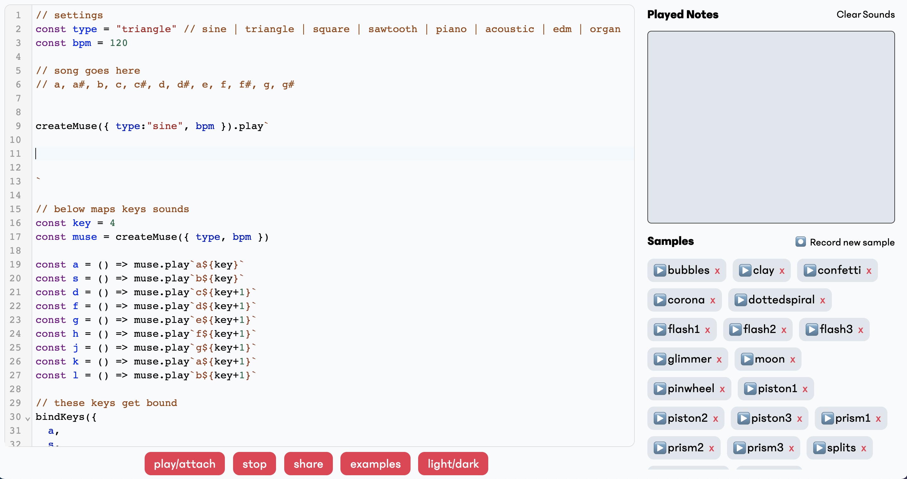
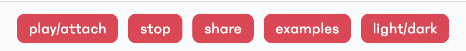

# Muse

Muse is a simple language for making music. It is embedded inside of JavaScript. You can get started with Muse as your first experience programming or you can make complicated JavaScript laced compositions if you're an audio algorithm wizard.

To get a sense of how small Muse is the samples below uses pretty much every construct in the language.

```
[ a4+ ;- c5 ;- e5 ;- ] x 2
[ a4+ ;- c5 ;- e5 ;- ] ^ 5 x 2
[ a4+ ;- c5 ;- e5 ;- ] _ 3 x 2
```

For a quick introduction to Muse you can watch [this video](https://youtu.be/hAcQ2x1PTYM).

For more documentation refer to the [GitHub repository](https://github.com/hackclub/muse).

Launch the editor by clicking the image below:

[](https://muse.hackclub.dev/)

Here are some slightly more involved pieces which will give you a sense of some things you can do in Muse. 

[Fill-up Glassy](https://hackclub.github.io/muse/?file=recYJJltQstKbefwZ) is an example that uses only synthesized sounds.

[Samples in the Klerb](https://hackclub.github.io/muse/?file=recwU2R3A0KfL11Ka) is an example that uses only samples.


Of course you can mix synthesized sounds and samples (and add your own samples)!

## Tips on composing your first song

## How does it work?

Muse makes use of some really interesting techniques and technologies. Digging into the codebase you can learn about parsers (specifically [parser combinators](https://fsharpforfunandprofit.com/posts/understanding-parser-combinators/)), [language grammars](https://en.wikipedia.org/wiki/Backus%E2%80%93Naur_form), [compilers](https://en.wikipedia.org/wiki/Compilers:_Principles,_Techniques,_and_Tools), [tagged template literals](https://patelhemil.medium.com/magic-of-tagged-templates-literals-in-javascript-e0e2379b1ffc), the [Web Audio API](https://developer.mozilla.org/en-US/docs/Web/API/Web_Audio_API), RegEx, and a whole lot more. Of course you don't need to deal with any of this to use Muse!

## Sharing Your Muse Song

We'd love to hear what you made in Muse. To share your song with the Hack Club community join the ship channel in the Hack Club Slack and submit the link generated by pressing the share button.



You can also pop the link into the sharing input box shown below!


