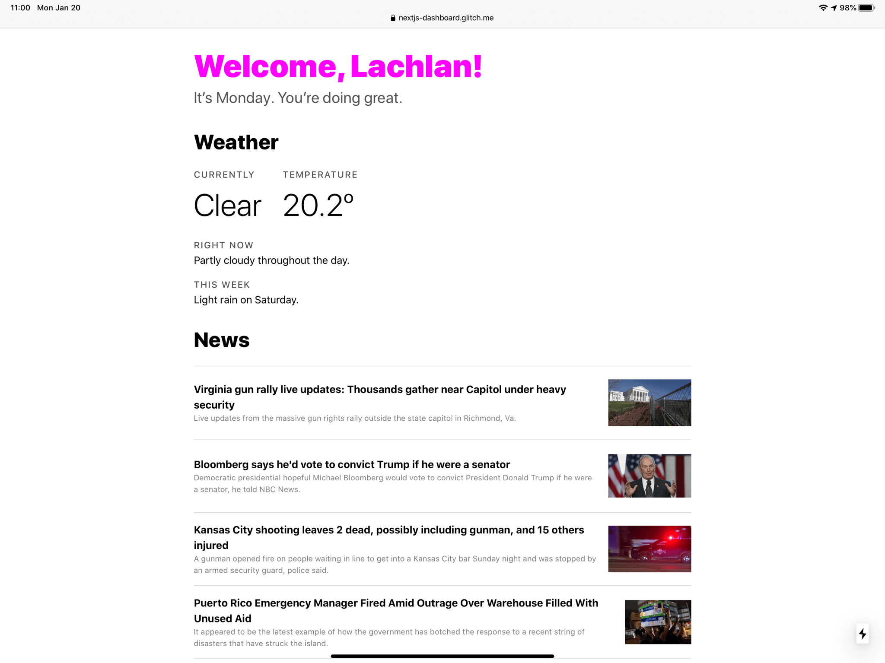

*(Note: this workshop assumes the React/Next.js skills explained in the [Next.js Starter](/nextjs_starter) workshop.)*

For your Next(.js) steps, we’re building a personal dashboard with React & Next.js that shows weather, news headlines, & whatever else you want. Let’s get going!



[**See the live demo**](https://nextjs-dashboard.glitch.me)

## Getting started

To get started, create a new Node project on the code editor of your choice, with three dependencies: `next`, `react`, & `react-dom`. Or, [remix this on Glitch](https://glitch.com/~hackclub-next-starter).

Remember, `pages/index.js` is the most important file. Whatever is returned by `export default () => (…)` gets rendered on your homepage.

Let’s get something going on the homepage: (put your own name in, of course)

```js
import React from 'react'

export default () => (
  <div>
    <h1>Welcome, YOURNAME!</h1>
    <p>
      Powered by <a href="https://newsapi.org/">NewsAPI</a> and{' '}
      <a href="https://darksky.net/poweredby/">Dark Sky</a>
    </p>
  </div>
)
```

## Registering for API keys

Before we begin coding, you’ll need to sign up for a [Dark Sky API key](https://darksky.net/dev/). Go ahead and visit the site and sign up. Once you’re logged in, you’ll reach a page that says “Your Secret Key.” Leave this site open, you’ll need the key in just a moment.

Go sign up for an [News API key](https://newsapi.org/). After signing up, you’ll see “API key.” Also keep this open.

## Fetching the weather

First, let’s make a Weather component. Click ”New File,” then enter `components/weather.js`.

Let’s get started: (be sure to replace the key with your Dark Sky key)

```js
import React, { Component } from 'react'

const API_KEY = 'MY_DARK_SKY_KEY'

class Weather extends Component {
  render() {
    return (
      <div>
        <h2>Weather</h2>
      </div>
    )
  }
}

export default Weather
```

Head back to `pages/index.js`, and on the second line, add the `import Weather` line & then render the `<Weather />` component.

```js
import React from 'react'
import Weather from '../components/weather'

export default () => (
  <div>
    <h1>Welcome, YOURNAME!</h1>
    <Weather />
    …
  </div>
)
```

Check out the preview—our components are working!

We need a way to fetch the weather data from Dark Sky now. Luckily, there’s a handy library called [`isomorphic-unfetch`](https://github.com/axios/axios) to make it easy.

Click “Packages” in the sidebar, then type in `axios`. Click and install it. In the terminal in the corner, you can see repl.it installing the library for you.

Before we can add the fetching itself, we’ll need to show that data is loading. head back to `components/Weather.js`:

```js
import React, { Component } from 'react'
import fetch from 'isomorphic-unfetch'

const API_KEY = '…'

class Weather extends Component {
  state = {
    currently: 'loading'
  }

  render() {
    return (
      <div>
        <h2>Weather</h2>
        <p>The current temperature is: {this.state.currently}</p>
      </div>
    )
  }
}

export default Weather
```

(If your editor is showing a red dot next to `state =`, ignore it. We’re using some new JavaScript syntax some editors don’t know about.)

Now, when the component “mounts” (is initialized on the page), let’s fetch the weather and save it to our state. Remember, every time we call `setState` in React, the component re-renders, so the new temperature will show as soon as it’s loaded.

```js
import React, { Component } from 'react'
import fetch from 'isomorphic-unfetch'

const API_KEY = 'ba95c43d421868c0b135e734fde3f264'

class Weather extends Component {
  state = {
    currently: 'loading',
    forecast: {}
  }

  componentDidMount() {
    const url = 'https://cors-anywhere.herokuapp.com/https://api.forecast.io/forecast/'

    const success = position => {
      const { latitude, longitude } = position.coords
      fetch(`${url}${API_KEY}/${latitude},${longitude}`)
        .then(res => res.json())
        .then(forecast => this.setState({ forecast, currently: 'success' }))
        .catch(() => this.setState({ currently: 'error' }))
    }

    const error = () => {
      alert('Unable to retrieve your location for weather')
    }

    navigator.geolocation.getCurrentPosition(success, error)
  }

  render() {
    const { currently, forecast } = this.state
    return (
      <div>
        <h2>Weather</h2>
        {currently === 'success' ? (
          <>
            <div className="stat">
              <p className="label">Currently</p>
              <p className="value">{forecast.currently.summary}</p>
            </div>
            <div className="stat">
              <p className="label">Temperature</p>
              <p className="value">{forecast.currently.temperature}º</p>
            </div>
            <p>
              <span className="label">Right now</span>
              {forecast.hourly.summary}
            </p>
            <p>
              <span className="label">This week</span>
              {forecast.daily.summary}
            </p>
          </>
        ) : currently === 'error' ? (
          <p>There was an error :(</p>
        ) : (
          <p>Loading…</p>
        )}
      </div>
    )
  }
}

export default Weather
```

On the `const url` line, you’ll notice we’re using this other URL with `cors-anywhere` in it. This is an inelegant hack to get our site working: Dark Sky only wants you to make “proper” requests from your servers, but since we just want to get this working in our browser, we’re using this other utility.

## Getting the news headlines

We’ll be using the News API now, with a very similar structure to the Weather component. We need to fetch the news, save it to state, then render the list of articles. Open `components/news.js`:

```js
import React, { Component } from 'react'
import fetch from 'isomorphic-unfetch'

const API_KEY = '…'

class News extends Component {
  state = {
    currently: 'loading',
    news: []
  }

  componentDidMount() {
    const url =
      'https://newsapi.org/v1/articles?source=google-news&sortBy=top&apiKey='

    fetch(url + API_KEY)
      .then(res => res.json())
      .then(news => this.setState({ news, currently: 'success' }))
      .catch(() => this.setState({ currently: 'error' }))
  }

  render() {
    const { currently, news } = this.state
    return (
      <div>
        <h2>News</h2>
        {currently === 'loading' ? (
          <p>Loading…</p>
        ) : currently === 'error' ? (
          <p>There was an error :(</p>
        ) : (
          <ul>
            {news.articles.map(article => (
              <li key={article.url}>
                <a href={article.url}>{article.title}</a>
              </li>
            ))}
          </ul>
        )}
      </div>
    )
  }
}

export default News
```

You’ll need to use the component though :) So head back to `pages/index.js`, and add `import News from '../components/news'` near the top and add the component to the body. Like this:

```js
import React from 'react'
import Weather from '../components/weather'
import News from '../components/news'

export default () => (
  <div>
    <h1>Welcome, YOURNAME!</h1>
    <Weather />
    <News />
    <footer>
      Powered by <a href="https://newsapi.org/">NewsAPI</a> and{' '}
      <a href="https://darksky.net/poweredby/">Dark Sky</a>
    </footer>
  </div>
)
```

## Styling the news

We’ve got the basics of our news headlines. Let’s make it look incredible. Try experimenting with the CSS now! Add a `<style jsx>` tag like below and play around. Don’t just copy this example, try your own :)

```js
import React, { Component } from 'react'
import fetch from 'isomorphic-unfetch'

const API_KEY = '…'

class News extends Component {
  state = {
    currently: 'loading',
    news: {}
  }

  componentDidMount() {
    const url =
      'https://newsapi.org/v1/articles?source=google-news&sortBy=top&apiKey='

    fetch(url + API_KEY)
      .then(res => res.json())
      .then(news => this.setState({ news, currently: 'success' }))
      .catch(() => this.setState({ currently: 'error' }))
  }

  render() {
    const { currently, news } = this.state
    return (
      <div>
        <h2>News</h2>
        {currently === 'loading' ? (
          <p>Loading…</p>
        ) : currently === 'error' ? (
          <p>There was an error :(</p>
        ) : (
          <ul>
            {news.articles.map(article => (
              <li key={article.url}>
                <a href={article.url}>
                  <strong>{article.title}</strong>
                  <span>{article.description}</span>
                </a>
                
              </li>
            ))}
          </ul>
        )}
        <style jsx>{`
          ul {
            list-style: none;
            padding: 0;
            border-top: 1px solid #ddd;
          }
          li {
            display: flex;
            align-items: center;
            padding: 0.5rem 0;
            border-bottom: 1px solid #ddd;
          }
          a {
            color: inherit;
            text-decoration: none;
            flex: 1 1 auto;
          }
          img {
            margin-left: 1rem;
            display: inline-block;
            width: 8rem;
            height: 6rem;
            object-fit: contain;
          }
          strong {
            line-height: 1;
            margin-bottom: 0.25rem;
          }
          span {
            display: block;
            font-size: 0.75rem;
            color: gray;
          }
        `}</style>
      </div>
    )
  }
}

export default News
```

Tip: want to explore what other data you can show about articles? This example also shows the image, but there’s author, name of site, time, and lots more. Inside `render()`, before `return`, add `console.log(news)`. Now right-click & “Inspect Element” in your browser, go to the “Console” section, and you can see a list of all the articles with all their fields displayed. Try adding more of these fields to your site.

## Keep going!

Now it’s your time to shine! Keep playing around with the content, styling, add in more components, make it stunning. There are tons more APIs available than just for news & weather—you could get time zones around the world, popular images, Reddit posts, Tweets, almost anything you can think of.

You can also improve the site itself, even just with small additions like showing the day of the week. On `pages/index.js`, try this:

```js
export default () => (
  <div>
    <h1>Welcome, YOURNAME!</h1>
    <p>
      Hello, it’s {new Date().toLocaleDateString('en-us', { weekday: 'long' })}
      {'. '}
      You’re doing great.
    </p>
    …
  </div>
)
```
