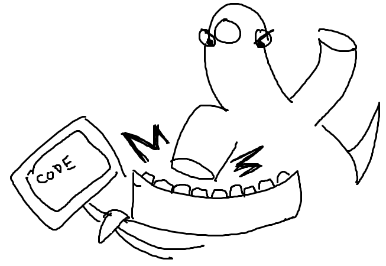
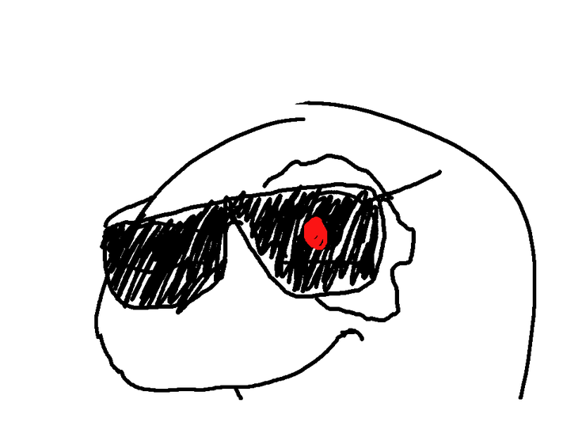

“Who is Orpheus?” You may ask, “and what does she have to do with me learning to code?”

You may have already visited [Orpheus’s warehouse](https://github.com/hackclub/dinosaurs) and learned that Prophet Orpheus is Hack Club's mascot who takes the form of a nondescript dinosaur.

She is always getting into crazy adventures, from stealing food to going to the moon. Orpheus is usually drawn in black and white in limited drawing programs like MS Paint or Pinta.

“Ugh, ugly.” You think, and your eyes are still fixed on the screen while your fingers are doing that clicky-clack thing on your keyboard. Or maybe you are watching those beautiful motion pictures drawn by professionals called “anime”, and compared to that you will never get the eternal beauty and the true spirit of Orpheus.

### The Dinosaur Who Masters The Superpower

We said coding is a superpower. But nobody has mastered the superpower yet - except her. She learns everything by herself… by reading docs, workshops, and asking her fellow hackers. She then writes workshops, at least attempts to write them… and through inspiring more hackers of Hack Clubs to code together, she becomes the only organism on Earth that has mastered the superpower of coding. But the community of superpower is spreading fast - more and more students have started practicing the superpower, and here’s the mind-blowing part of the story - students don’t just get this superpower from their ordinary classes! The superpower spreads from Orpheus as a center to a group of enthusiastic leaders of Hack Clubs, and then to the students, then other students…

### Always Confused & Always learning

The dinosaur herself is always confused. Always, like most of the time, she doesn't know what she is doing. You will almost never see her without a question mark over her head. But this is the kind of quality that motivated her to learn more. She travels through the wires and optic fibers of the internet, jumping in between our Slack channels, and from computers to computers of our student hackers. She learns every day.

### “The Orpheus Is Watching You”

Orpheus has become one of the most powerful members of Hack Club. If you don’t know yet… Your club leader is secretly assisted by Orpheus. They talk every week, and the classic conversations usually start with “Hey, you're looking great today!” She manages the data of every Hack Club, making sure that you are learning the superpower the right way every week; she talks to leaders, telling them the horrific news that “on average you have 21.05 people attend your meetings”... Orpheus has been a part of Hack Club and will continue to be the core member of the core team...

### The Dinosaur Who Can Never Look Back

> or else that means acknowledging its past and accepting the fate of the dinosaurs
> right now, it is still able to exist through the engagement of modern constructions
> like reading books and chasing after money
> only ever living in the present
> engaging with the idea that it's still alive
> Much like its Greek namesake, who couldn't give up on the idea that his wife is dead
> until he is finally forced to "look back"
>
> -- [nathanielthealligator](http://nathanielthealligator.tumblr.com/)
