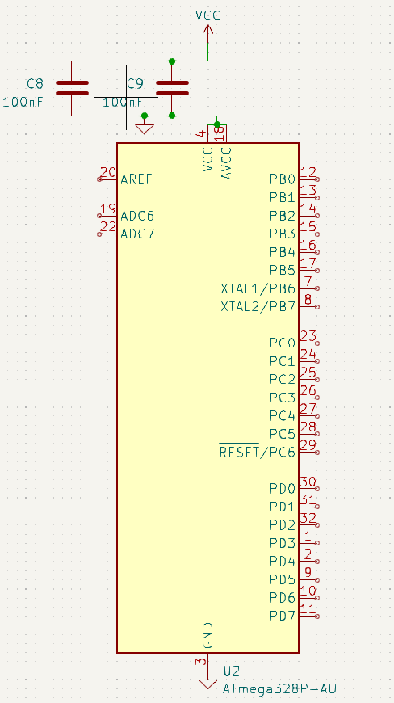
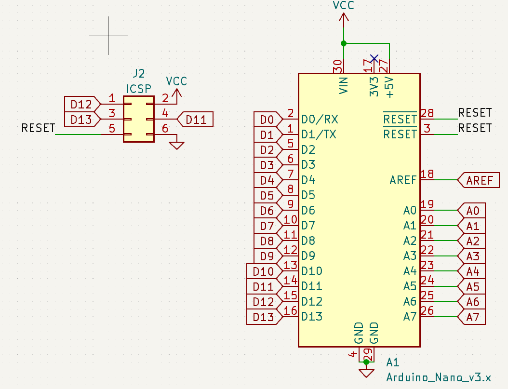
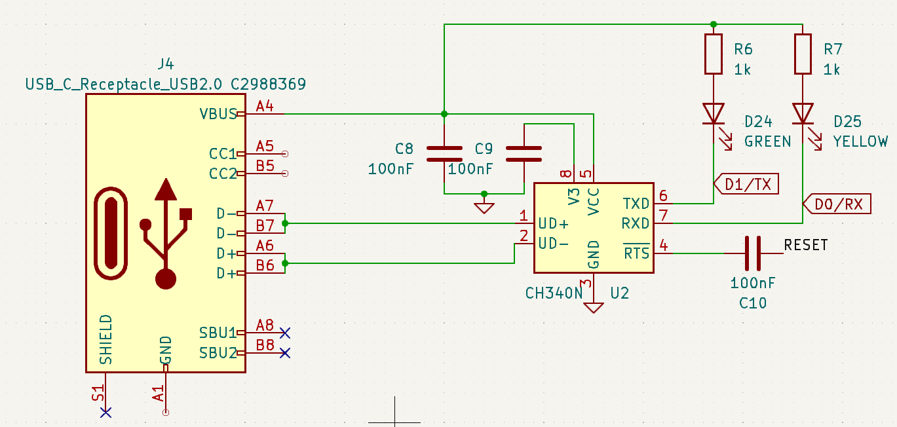

In this workshop we will make a an Arduino Nano-compatible PCB with NeoPixels.

<details>
<summary>Prerequisites</summary>
If you are not already familiar with the basics of using an ECAD tool like EasyEDA or KiCAD, check out @maggie's workshop on designing a PCB Business card:
<iframe width="560" height="315" src="https://www.youtube-nocookie.com/embed/enMtMOgimm4" title="YouTube video player" frameborder="0" allow="accelerometer; autoplay; clipboard-write; encrypted-media; gyroscope; picture-in-picture; web-share" allowfullscreen></iframe>

Recommend a KiCAD video???

In addition, the rest of the workshop assumes you know basic electronics terms like:
1. Resistor: describe resistor
2. Capacitor: describe capacitor
</details>

## Part Selection

Step 0 of designing a board is to clearly what problem you need the board to solve. Here, we are making a fancy level. The primary goal is demonstrating different electronics concepts related to PCB making. The secondary goal is to have an attractive and fun level.

Now, Step 1 of designing a board is selecting your core components.

1. Microcontroller: Atmega328P. The Atmega series is the most robust and common 8-bit MCU in the maker community, being used in nearly all Arduinos ever since the beginning. Additionally, it requires very few external components and runs over a wide range of voltages (1.8V-5.5V). It's also one of the very few microcontrollers that is a *Basic Part* on JLCPCB. And, is available in a QFP package so it can be hand-soldered. Many other microcontrollers are cheaper and faster than the Atmega328P, but none are as robust.

2. USB-Serial Interface: CH340N. Because the Atmega328P doesn't have built-in USB, we need a USB-UART IC. @hugo said that the CH340C worked well for him, and it's very cheap, so I'm using it too. The CH340N is the cheapest IC from the CH340 series that has an integrated clock, meaning fewer components are needed.

3. LEDs: WS2812B or equivalent. The size is dictated by your PCB design, you could get the original 5x5mm WS2812, or 3.5x3.5mm WS2812-MINI, or 2x2mm WS2812-2020 or an equivalent clone.

4. Pinout: While not technically a component, we will follow the standard Arduino Nano pinout. This really doesn't matter, unless you value your future self's sanity when trying to wire up new components.


Okay, now on to the actual circuitry.

## Core (Microcontroller)

First, we place the heart of our system, the ATMEGA328P, in the TQFP pacakge.

### Power



Then, we need to connect the core power pins to power *nets*, and place *decoupling capacitors*.

Nets:  Explain

Decoupling Capacitor: explain

### Clock

Now that our MCU is powered, it needs a clock to tick to. We can later configure the ATMega328P to use our 16MHz crystal here rather than run at its default of 1MHz in software.

This crystal needs an accompanying capacitor connected to ground on each pin. 

<details>
<summary>How to calculate the value of these capacitors?</summary>

```
C = 2 * CL - CS
```
Here, C is the capacitor we need, CL is the load capacitance specified by the crystal manufacturer, and CS is the stray capacitance of the microcontroller pin. In our case CL (of the crystal) is 9pF and CS (of XTAL1/2) is 6pF (as specified by the datasheet).

So, we use 12pF capacitors.
</details>

### Reset


The bar over RESET means that it is active low, 0V will reset the MCU and it should be at 5V during normal operation. The SPST button here is JLCPCB's basic push button which connects it to the pin to ground when pressed. 

The resistor R6 is a pull-up resistor, a high-resistance resistor that gently pulls the RESET pin HIGH without passing too much current through it. This allows the switch to pull the RESET pin down without causing a short circuit, while preventing random noise from flipping RESET.

This line is also **labeled** as RESET. This connects it to the RESET *net*. If we place another RESET label somewhere else in the circuit, our ECAD tool will understand that these two points have to be connected together.


### Label Pinout


After this, we need labels telling us which MCU pin is which Arduino Nano pin.

## Headers


First, we have the traditional Arduino Nano pinout connected to our labels, telling the ECAD software we want these headers connected to the prespecified microcontroller pins. Since this whole board is running at 5V, just mark 3V3 as NC (No Connetion).

We also have the ICSP header, which is used for flashing the Arduino's bootloader. It has all the SPI pins in one neat package, MISO, MOSI, SCK, RESET, VCC, GND.

## USB

We start with the 16 Pin USB 2.0 Type C receptacle, C2988369.


NC: SBU1/2 and Shield (shield is only for hosts).
GND goes to our ground net.
Mark VBUS with a net, and then run it through a diode to the VCC net, which powers everything else on this board. Since we are powering a bunch of LEDs I picked the biggest diode JLCPCB had (as a basic part). This diode prevents current from going backwards into your computer if both USB and 5V pins are plugged in.

Then, to tell the USB-C port that we are drawing power from it, CC1 and CC2 have to each be connected to 5.1k resistors to ground. That tells the USB-C power adapter that we can draw up to 5V 3A.




Now, we can connect our UART chip, the CH340N. Both D+ and D- from the USB C connector go to D+/- on the CH340N. As specified in its datasheet, both V3 and VCC get 100nF decoupling capacitors. RTS goes to RESET through another 100nF capacitor, this capacitor makes the RESET pin briefly pulse low, until it is charged up again.

TXD and RXD (belonging to the *device* i.e. this MCU), are connected to their microcontroller pins D1 and D0 respectively with some status LEDs.

### Done!

Now you have a simple Arduino Nano Compatible Board Schematic! Check out Part 2 to actually turn this into a PCB, or check out Part 3 to add more features to this board.

