<!--KiCAD version, maybe make an EasyEDA version later?-->

In this workshop we will turn our schematic from Part 1 into an actual PCB.

Prerequisites

The rest of the workshop assumes you understand PCB Basics like:
1. Layers: describe 
2. Traces: A continous stretch of copper that connects multiple parts.

Some tips by [@camdan.me](https://hackclub.slack.com/team/U04J96SRS5B)

**KiCAD Layers:**
`F.Cu`/`B.Cu`: The layers of copper on your PCB. The conductive traces on your board should live on these layers. Separate conductive traces can not cross each other on the same layer, you must use a via to connect two layers and not cross traces on the same side of the board.
`F.Silkscreen`/`B.Silkscreen`: The printed (silkscreened) layers on your PCB. These are either white or black and must be monochrome (you can't have gradients, everything must be a clear line). Anything can go on these layers, they are simply printed.
`F.Paste`/`B.Paste`: This is the mask for the solder paste. Anything that will be soldered needs to have paste on it. You probably don't need to mess with this layer unless you know what you're doing, it should be automatically handled by your part footprints.
`F.Mask`/`B.Mask`: The is is the mask for the soldermask. The soldermask is the colored coating that goes on the board. By default, it covers everything except pads and is what gets printed on. Removing soldermask can be used to expose copper for cool effects.
Objects > Ratlines: These have no impact on the final production of your board, they are simply guides to tell you where you still need to draw traces.
`Edge.Cuts`: This is the actual outline of how your board will be cut.
Multi-Layer: This holds, as the name suggests, multilayer elements such as vias or holes.
`User.Comments`: This layer has information that will not be printed on the board and is only visible in KiCAD. Think of it as comments in your code.

Reminders:
- Make sure you draw your traces! You shouldn't have any ratlines on your board when you send it for production.
- Remember separate conductive traces cannot touch each other.
- You can use a combination of layers to design the look of your board.
- You almost always want to have the traces of your board covered with soldermask, but it's typically ok to have other copper regions exposed, just remember it might tarnish.
- JLCPCB engineers will review your design before production, if they spot any issues they'll send you an email to check in.

## Footprint assignment

Footprints are the exposed copper pads on the PCB for each component.

First, click on run footprint assignment tool.

In the new window, under Footprint Filters, select the first one - "filters defined in symbol" - but deselect the other two to get good filtering.

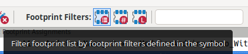

Now, you should have a window like this with some footprints autofilled, others empty.

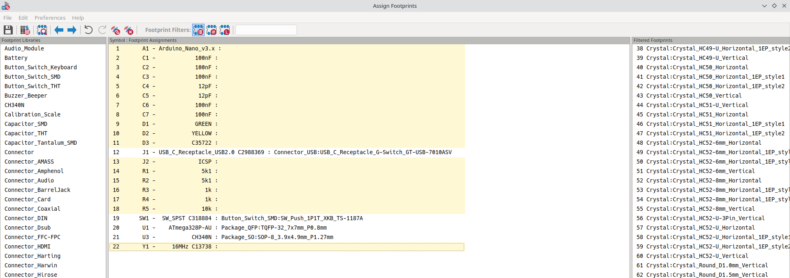

Some footprints, like the Arduino Nano outline, which is not a real component in this case, only have a few options. Double click on `Module:Arduino_Nano_WithMountingHoles` to select it.

### Generics

0402, 0603, 0805, and 1206 are common sizes of small two terminal SMD components like resistors, capacitors, and diodes. 0805 is very common and still somewhat hand solderable, so we will use 0805 for all our components.

To find our first capacitor, go to <https://jlcpcb.com/parts>. In this case, we will search for 100nF, our first capacitor.

Then, select "Basic Parts" to find the parts that don't have the extended fee and we see that they do have 0805 available. So, we can select `Capacitor_SMD:C_0805_2012Metric_Pad1.18x1.45mm_HandSolder` for all our 100nF capacitors in KiCAD. You can similarly go through each capacitor and resistor value on JLCPCB Parts and find that they have 0805 versions available. So, all capacitors will be `Capacitor_SMD:C_0805_2012Metric_Pad1.18x1.45mm_HandSolder`, all LEDs will be `LED_SMD:LED_0805_2012Metric_Pad1.15x1.40mm_HandSolder`, and all resistors will be `Resistor_SMD:R_0805_2012Metric_Pad1.20x1.40mm_HandSolder`.

### Specific Components

If you look up the Diode `C35722`, you will get its LCSC page, which says the package is `SMC(DO-214AB)`.

Going to the Datasheet also confirms this.

Then, in KiCAD, after selecting the diode, we can search for the package. While there are no results for DO-214, SMC shows up and we can select `Diode_SMD:D_SMC_Handsoldering`.

Doing the same with the Crystal will get you its package `SMD3225`, and footprint `Crystal:Crystal_SMD_3225-4Pin_3.2x2.5mm_HandSoldering`.

Similarly, for the ICSP header, you will get the right result by searching for 2.54mm (i.e. 0.1 inch pin spacing), and 2x03 (6 pins arranged in 2x3): `Connector_PinHeader_2.54mm:PinHeader_2x03_P2.54mm_Vertical`.

### Other components

You might've noticed that in my original footprint assignment window had some components filled out already. This is because chips like the ATmega328P-AU only have one footprint - that's what the `AU` designates.

Others, like the switch, were found by searching for the part number `1187A` through the footprint window.

Lastly, some components like the USB-C Receptacle can be weird. While there are hundereds of different manufacturers of USB-C ports and receptacles, there are only a few common designs. However, there is no way to confirm which part uses which design, so in this case, I went backwards - first picking the KiCAD footprint that I liked, and then finding that part of JLCPCB, which happens to be the `7010ASV`.

---

Now that our footprints are all selected, we can move on to the PCB!
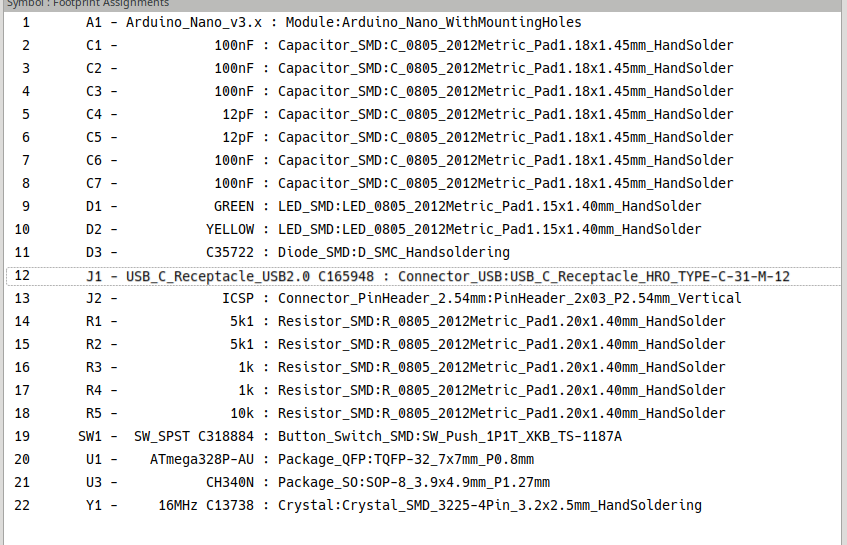

## PCB

### Setup

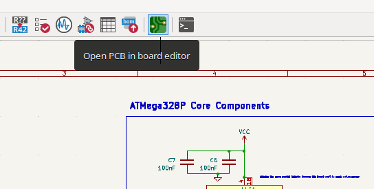

Click 'Open PCB in board editor' in the schematic view.

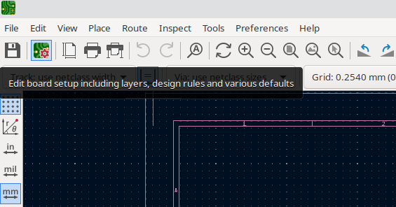

In the PCB editor, click on 'Edit board setup'. This is where we will set the constraints of our PCB fab.

<!-- can we add a toggle button for other fabs and add those settings for reference-->
Here I'm using JLCPCB's specifications, but every fab should have a document like this. Go to <https://jlcpcb.com/capabilities/pcb-capabilities> to find the latest specs, these might have changed since this guide was writen.

Go to Design Rules > Constraints.

And fill out these details.

Then, in Design Rules > Pre-defined Sizes, specify how wide you want your traces, vias, and differential pairs will be. KiCAD will let you pick between the options here when designing your board. We will set a track width of 0.3mm for signal traces, 0.5mm for power traces, and 0.7mm diameter vias with a 0.3mm hole. For slow signals/short traces this doesn't matter as much, so we will pick 0.3mm/0.3mm/0.5mm.

In Text & Graphics -> Defaults, change all Text Thicknesses that are less than .153mm to .153mm.

Then, press OK to save and exit board setup.

### Set Up Components

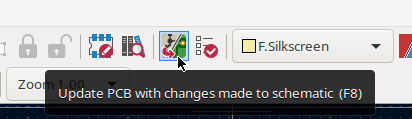

Now, in the board editor window, clicking on 'Update PCB with schematic' brings in all your components to the PCB page. If you make schematic changes, you can click on this to bring in your new parts. In the Update PCB window options, check Delete footprints and Replace footprints and click on Update PCB.

Place them off to the side for now.

### Board Edges

Now, to define the edges of our board, select the `Edge.Cuts` layer in the layer menu.

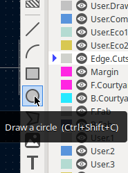

You can use the shape tools to draw the outline of the board, or...

you can go to File > Import > Graphics to import a custom SVG. You can pick whatever shape you like here.

> *Note*: In future workshops with this board, we will be adding more features such as an LED strip and accelerometer to make a level. Make sure your design will support the physical realities of being a level, such as having two points to balance on, which do not have any ports. Also, consider how your LEDs will physicall and aesthetically fit.  Make a rough paper sketch if that helps.  
> Of course, none of this applies to you if you are not building a level.

By default, your drawing probably won't fit the Arduino Nano template.

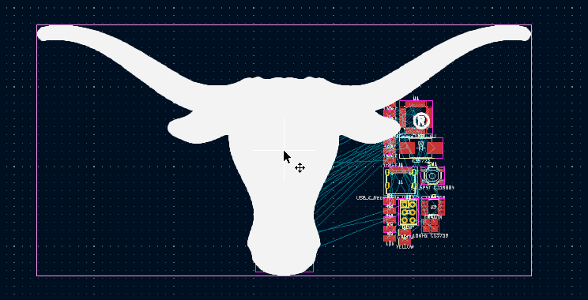

Delete the first import and go back to File > Import > Graphics. Play with the scale setting until your design snugly fits the Arduino Nano template (while leaving space for other components).

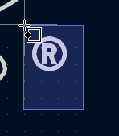

Clean up the drawing to only leave the one continuous board shape.

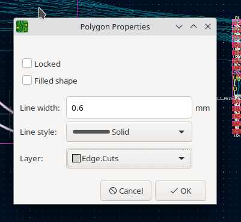

Double click the shape and set it up like the image above.
- Not Locked
- Not Filled Shape
- Line width: 0.6mm
- Line Style: Solid
- Layer: Edge.Cuts

### Components

> Note: Many of the choices in this section will depend upon your outline. Feel free to ask for help in [#onboard-help](https://k.malhotra.cc/todo.link).

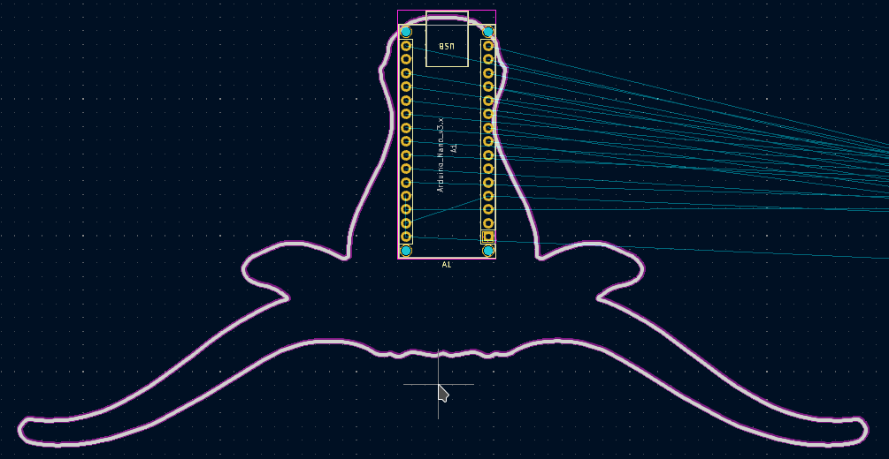
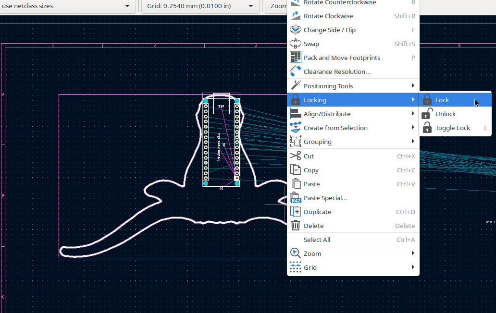
After you position the Board Edge and Arduino Template, lock them in place to avoid accidentally moving it.

Then, start placing the major components: USB Port, ICs, Microcontroller, buttons, etc. 
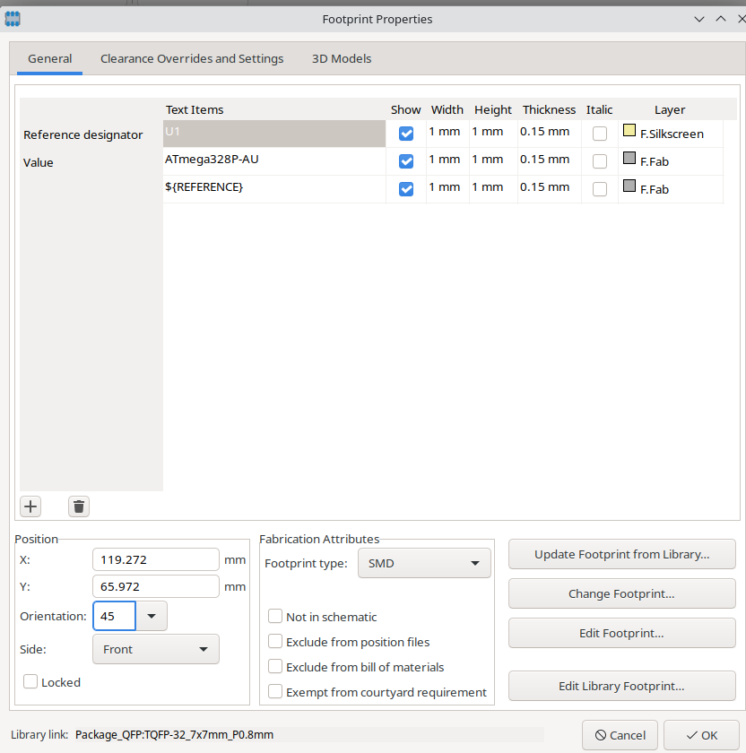
Rotate them to a position that'll make running traces convinient. For example, you want the D+ and D- pins of the USB controller to be facing the port, and the TX, RX pins to be facing your microcontroller. You can rotate things 90 degrees by pressing 'R' on your keyboard, or set a 45 degree offset by going to properties.

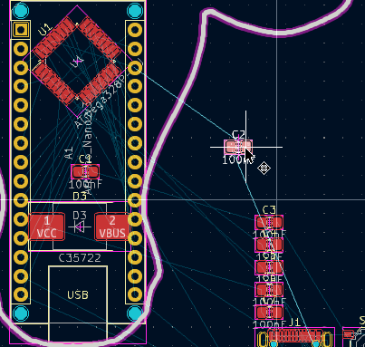
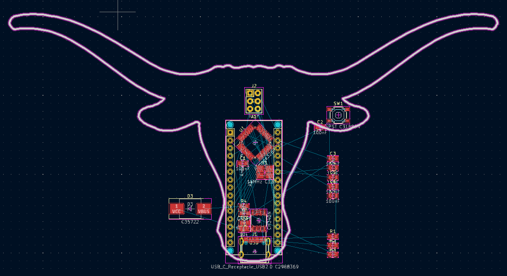
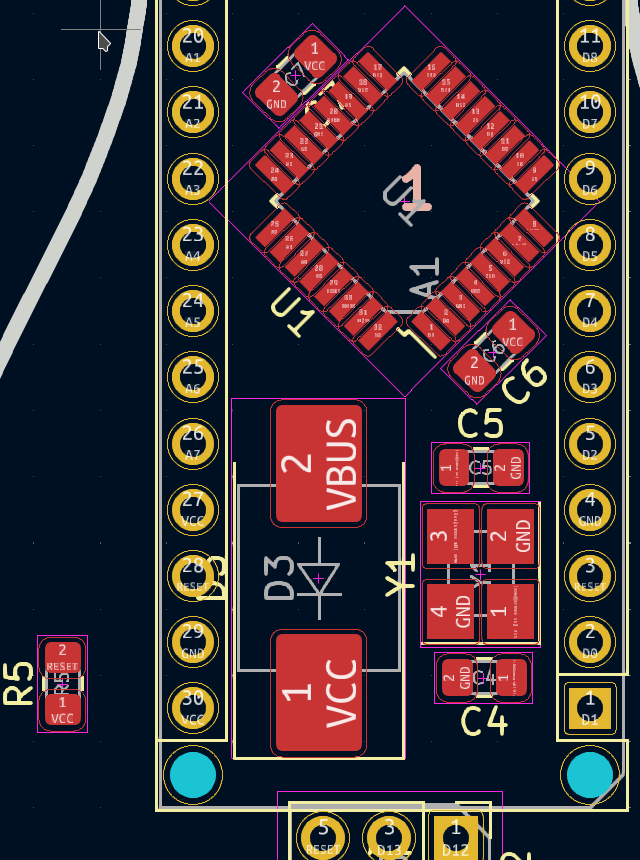

This is how I roughly layed out the core components within the Arduino Nano footprint. Some large components like the reset switch and diode are outside the main nano footprint. The red pads indicate that these are all on the `F.Cu` layer. This is the front of the PCB. While a typical Nano design needs to be two sided (have components on both the front and back) to fit within that footprint, here, we will make a larger, one-sided board to keep assembly costs down.

> Note: This layout took several rounds of iteration between layout and trace routing to generate. It's absolutely fine to come back to rearrange your components if you find your layout doesn't work when routing traces - especially if this is your first complex board.

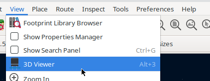

While laying out your board, the 3D viewer is a very useful tool (especially if you are hand-soldering and need more space in between components). Use 'Alt+3' to open it.

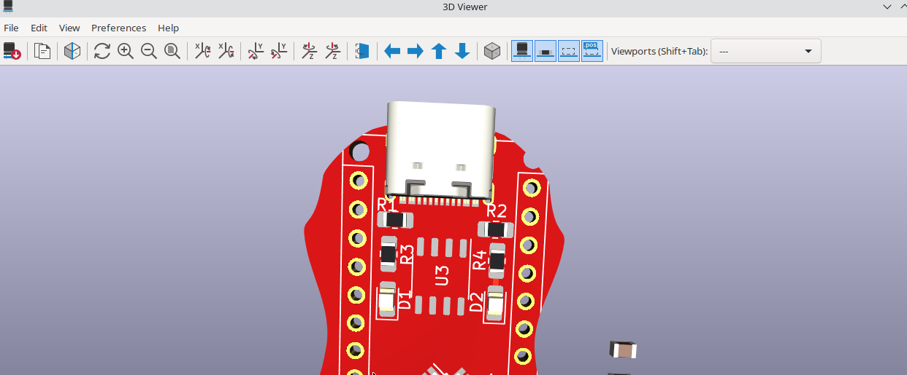
If some components are not visible, go back to your board design and double click the part to open properties.
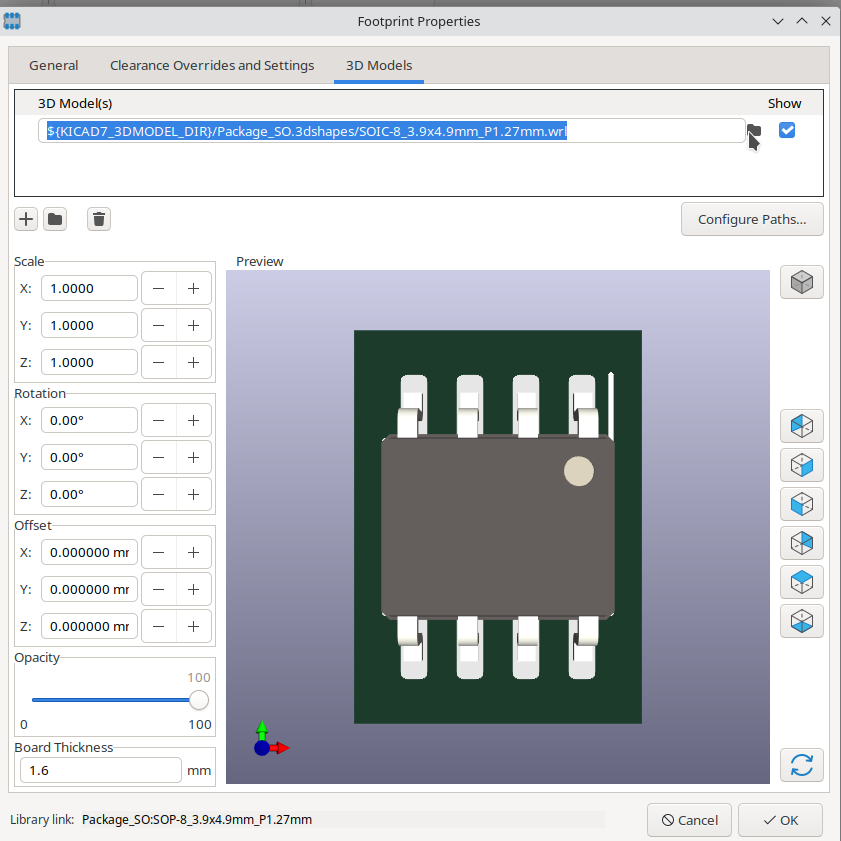

Make sure you're in properties for the whole component, not just one pad or silkscreen, and then open the '3D Models' tab. Click on the file browser for the 3D model line. These are the correct models:

- USB Connector: `${KICAD7_3DMODEL_DIR}/Connector_USB.3dshapes/USB_C_Receptacle_GCT_USB4105-xx-A_16P_TopMnt_Horizontal.wrl`
- CH340N: `${KICAD7_3DMODEL_DIR}/Package_SO.3dshapes/SOIC-8_3.9x4.9mm_P1.27mm.wrl`
- SW1: `${KICAD7_3DMODEL_DIR}/Button_Switch_SMD.3dshapes/SW_SPST_TL3342.wrl`

These may vary based on your version of KiCAD.

<!--put this somewhere else, where-->Also, you should have your schematic split screened with the PCB layout. Whenever you click on a component in one, it will be focused in the other, making it significatly easier to see what's going on.

### Routing

To route tracks, just follow the ratsnest (thin blue lines connecting matching nets), and connect the pads. Start with data signals, and do power and ground later. Try to use the higher thickness .5mm trace for sensitive or high load applications if you can fit it.

The following images are one possible order to do this process in:

Note: You can press 'X' when hovering over a pad to start a trace.

In the Apperance sidebar go to Objects > Locked Item Shadow, and hide it to clean up your layout a little bit. Feel free to play with the opacities of other elements to get to a point that you are comfortable with.

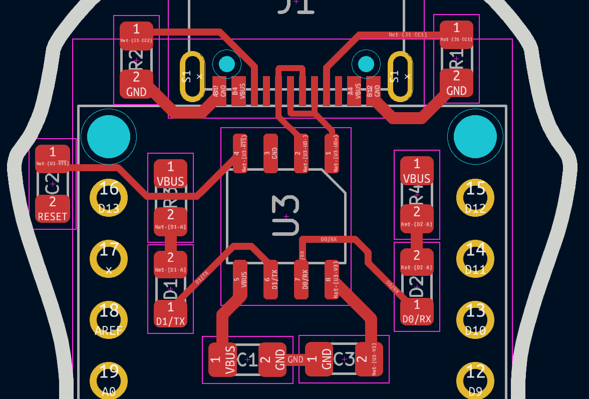
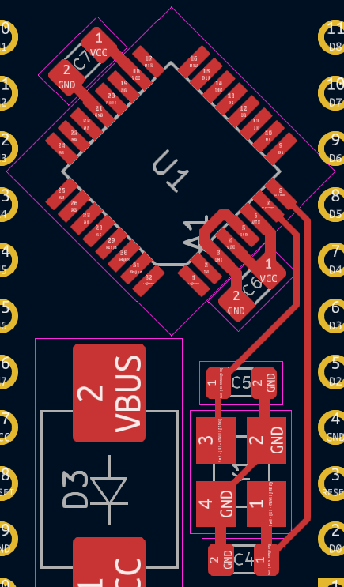
The decoupling capacitors for an IC must be right next to it. The purple lines are the 'Courtyard' - they show you how close two components can be without physically interfering, so, you keep the decoupling capacitor and IC's courtyards very close to each other.

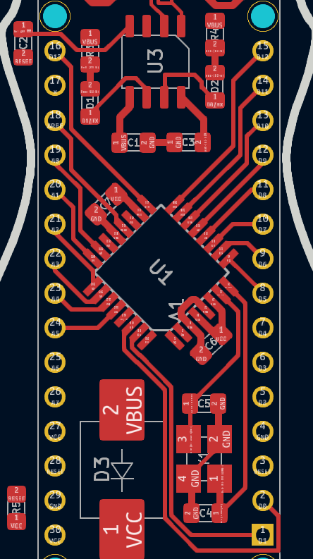
And then, connect the microcontroller pins. In my layout A0-A5, D0,D1,D5-D13 can be routed on the top layer as shown above.

> I have to emphasize, this is my layout. This is not the right layout, this is not the best layout. It's just one out of the infinite possible arrangements of these traces.

### Two layer routing

Now because our microcontroller is on the Front layer, but there is no way to directly connect D4 of the microcontroller to the header pin D4, we will have to jump to another layer. First, press 'X' to start running a trace away from D4, towards the inside of the microcontroller

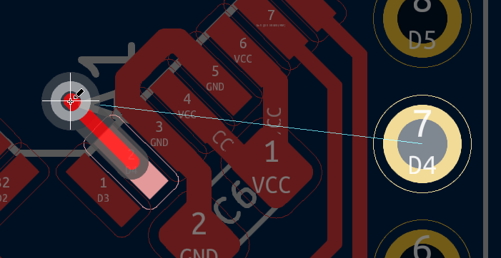

Move to some empty space then press 'V' to create a via.

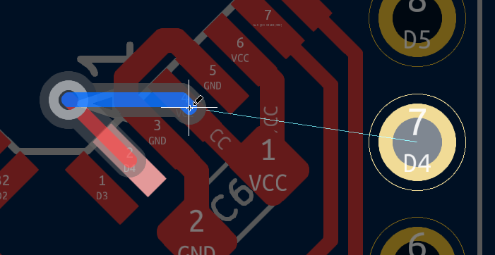

Click to place the via, and now you can drag a blue trace - on the back side of the board.

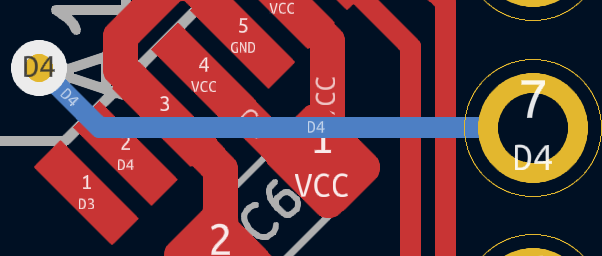

Click on D4. Since D4 and other pins are through holes, you can connect traces from either layer to them.

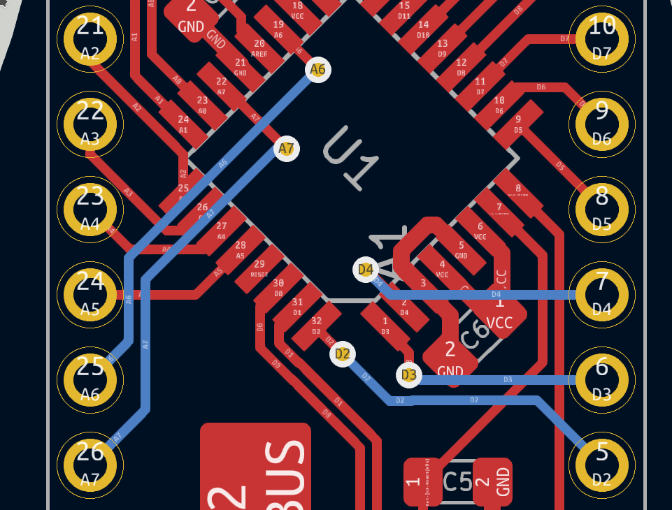

Just like D4, use vias on A6, A7, D2, and D3 to reach their respective header pins. 
- If your via is too close to a pad, solder might flow into it and prevent the pad from being properly attached, so, even though KiCAD doesn't stop you from doing that, stay a safe distance away from pads.
- Note how we used vias to cross A6 and A7. This prevented us from having to run A7 all the way outside the headers to loop around.

You can click on the blue `B.Cu` layer in the Layers sidebar to bring the Back layer traces to the front.

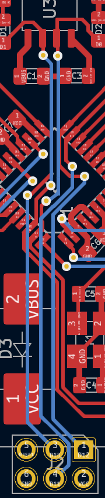

Just like that, use vias and thoughtful crossings to connect D0/D1 to the USB chip and D11/12/13 to the ICSP header.

### The other tracks

And then you can run the Reset track.

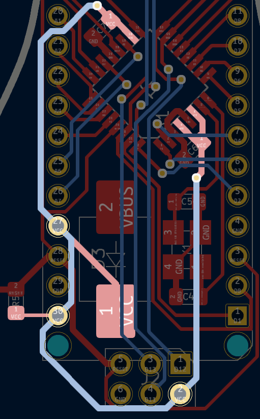

And VCC.

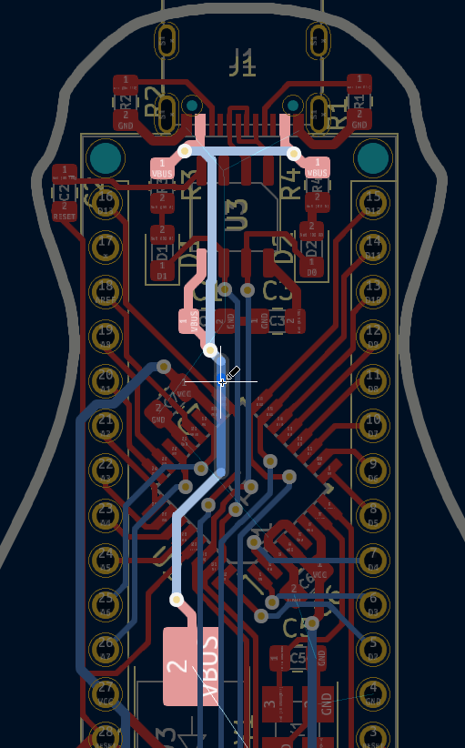

And then a little bit of finagling with the A6, A7, and D13 vias lets us run VBUS under the Microcontroller, straight up to the USB port.

Now, we only have ground pins left, and for that, we'll do something special.

### Ground Plane

A ground plane is a large continuous chunk of copper on a layer. It creates a low impedance i.e. clean and easy path for ground current to return. Having an adjacent ground plane also reduces the interference between parallel traces.  More complex 4 layer boards might even have a plane for VCC power. In this board, the ground plane will take up all the unoccupied space on the `B.Cu` layer.

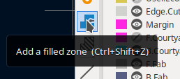

First, click on add a filled zone.

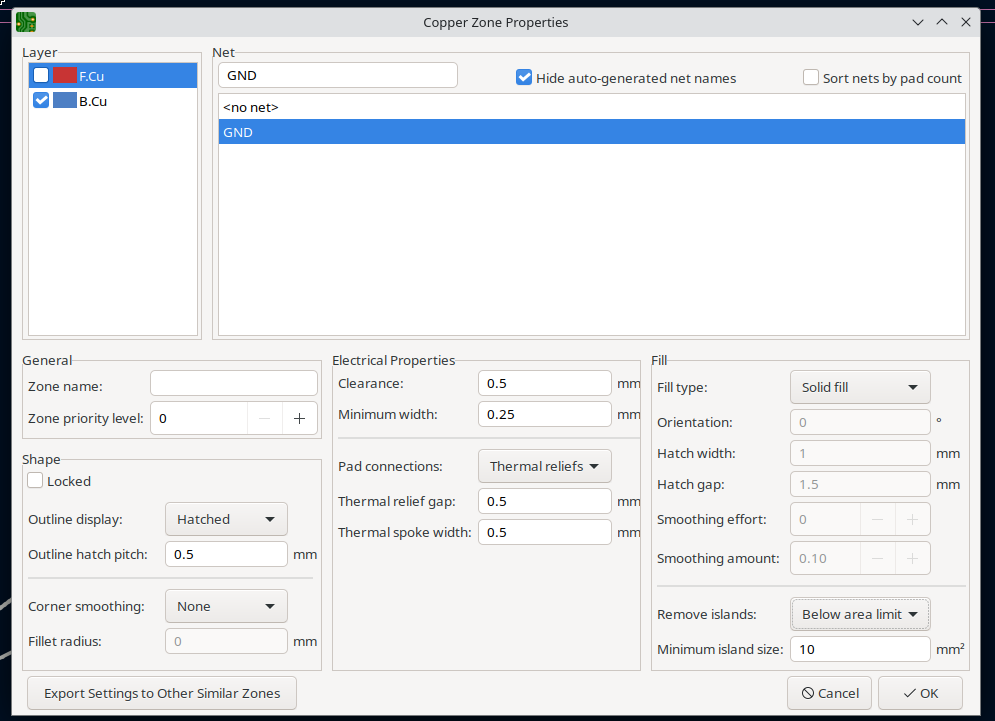

Then, click on a point far outside the edge of the board and set up the Copper Zone to be connected to ground, and to remove islands below 10mm^2.

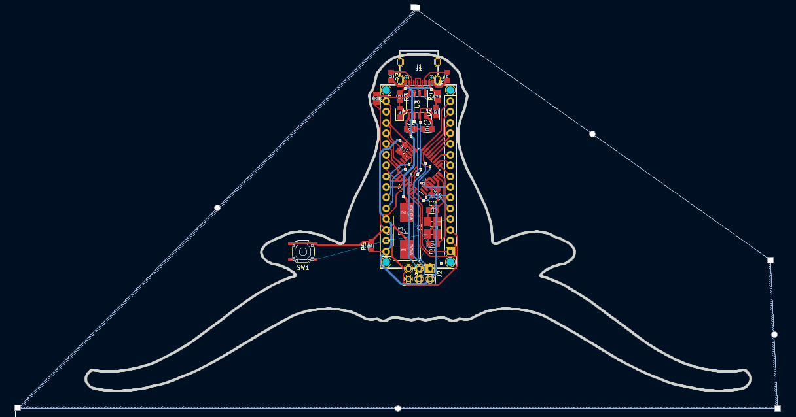

Then, draw a shape encompassing the whole board and press 'B' to build the plane.

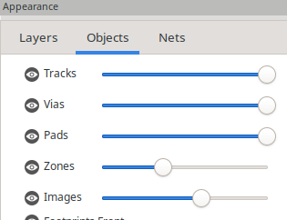

You should play with Zone opacity in the Objects sidebar to find something good for you.

Then, start dropping vias from ground pads. Press escape when it draws a blue trace, you only need the via.

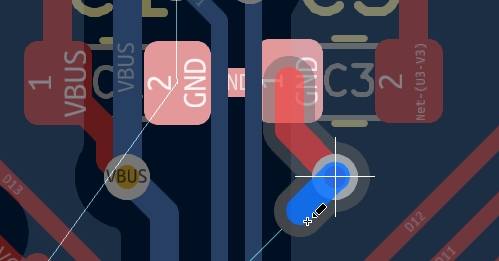
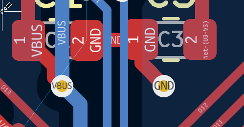

The through-holes should connect themselves to the ground plane.

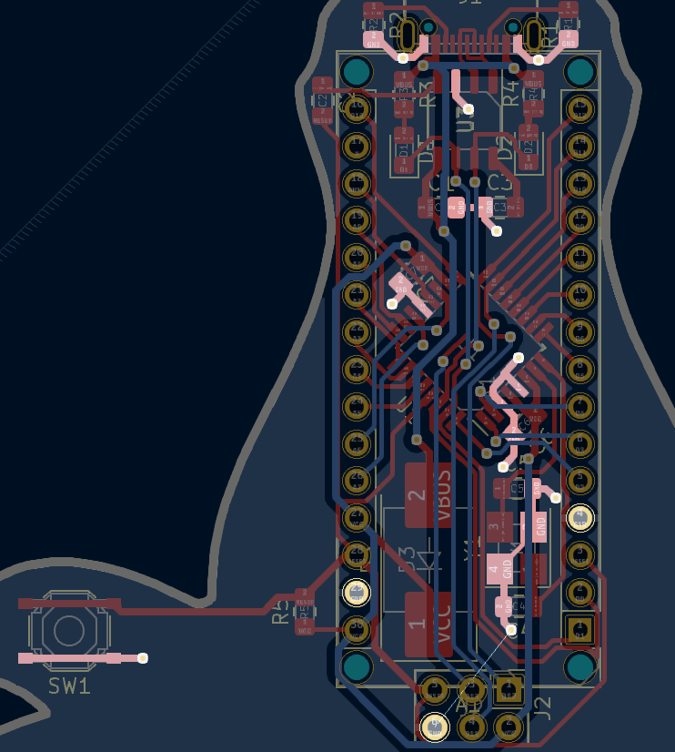

This is what all the grounds look like.

## Design Rules Checker

The Design Rules Checker (DRC) looks at the constraints we set the board up with and finds problems in the design.

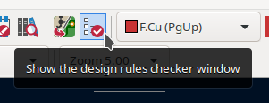

After you run the DRC with Refilling and Parity checks, you should see a bunch of errors.

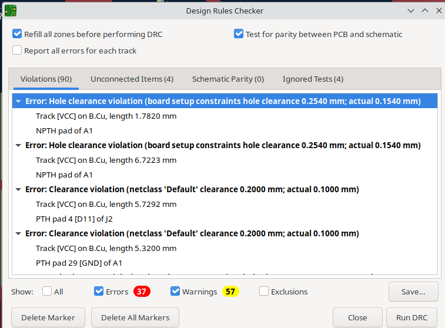

Sooo, there's 90 issues. That's not good.

Looking at the Unconnected Items tab - the most important issues:

- All 3 of the unconnected SHIELD errors can be Right Click > Excluded. Microcontrollers and complex ICs might have multiple pins that serve the same function, so KiCAD expects identically named pins to be interconnected. In this case, it's meaningless and can be ignored because it's just the USB housing.
- GND on the ICSP header is disconnected. That's a big problem.

> Note: while this solution is written as straightforward - coming up with something like this really wasn't. I spent way more than 30 mins comparing approaches before I decided on this. 

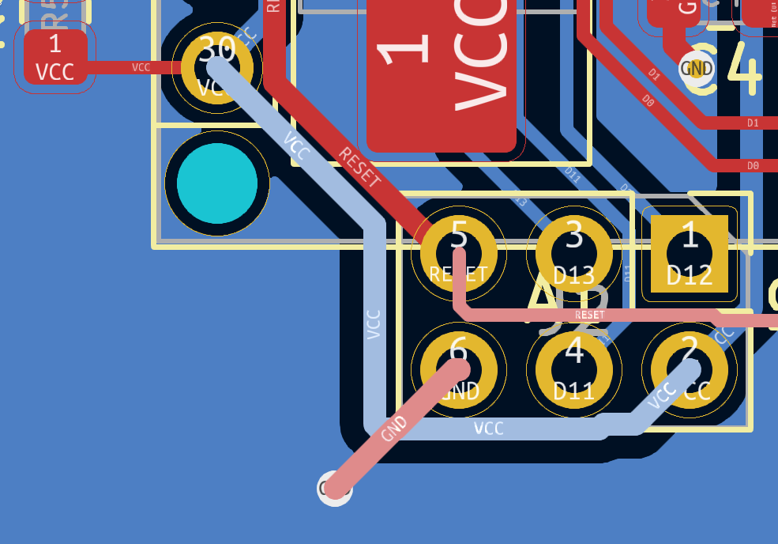

Turned out, the part of the ground plane that connected to this GND pin was disconnected from the rest. [2](#2)

The ground plane island highlighted another issue with this design. If you follow the current flow from the USB port to the bottom plane, it turns out the whole thing relies on one .3mm connection under the clock. 
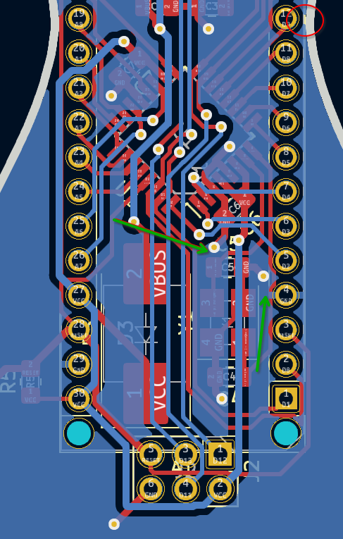

Fortunately, there's an easy solution: double click the ground plane to open properties and change clearance and minimum width to .3mm.

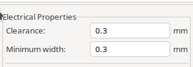

Then, the ground plane goes in between the planes and it's a continuous chunk again.
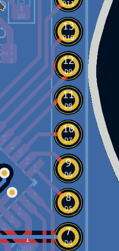

And now our board is electrically done!

You can solve other DRC issues pretty easily.
- For trace clearance issues, just move the trace away from the specified component. These sometimes pop up when rearranging components after originally placing tracks.
- You can ignore/exclude all the Courtyard Overlaps with A1. That just points out that there are components inside the Arduino template. [3](#3)
- Through-hole has 'Thermal relief connection incomplete': Make sure it's surrounded by the ground plane enough, and if it is ~110 degrees adjacent to it, try double clicking and rotating the pad 45 degrees from properties. Regenerate the plane with 'B' and it should connect  with two spokes.
- You can ignore most 'Footprint doesn't match copy' and Silkscreen. warnings. Manually fix the silkscreens that you want to see.
- And you can ignore Hole Clearance violations of J1 to J1. It seems to work just fine anyway.

## Finished Board
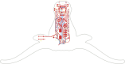

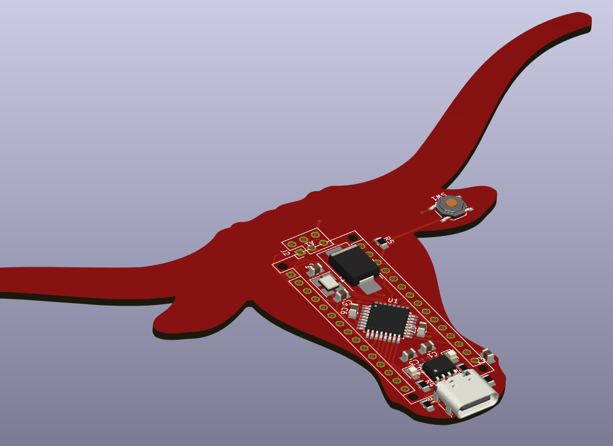
## Further Reading

1. https://eepower.com/resistor-guide/resistor-standards-and-codes/resistor-sizes-and-packages/#
2. Ideally, the ground plane would be a continuous, mostly unobstructed, chunk, but that would require more layers i.e. more complexity and cost, which is not good for this workshop.
3. If you're obsessed with details like me and want to fix it, right click A1 > Open in Footprint Editor; delete the purple courtyard. This only affects this one instance of the Arduino footprint, and won't affect future PCBs you make with KiCAD. This tells KiCAD that the Arduino is not an exclusive component, and other things can overlap it.