In this workshop we will take a KiCAD PCB and order it through JLCPCB with assembly.

If you're just jumping in, make sure you have your [DRC checked](../pcb_level_2/#design-rules-checker) from Part 2 of this workshop series.

## Install the Extension

Click on Plugin Manager on the KiCAD home page.

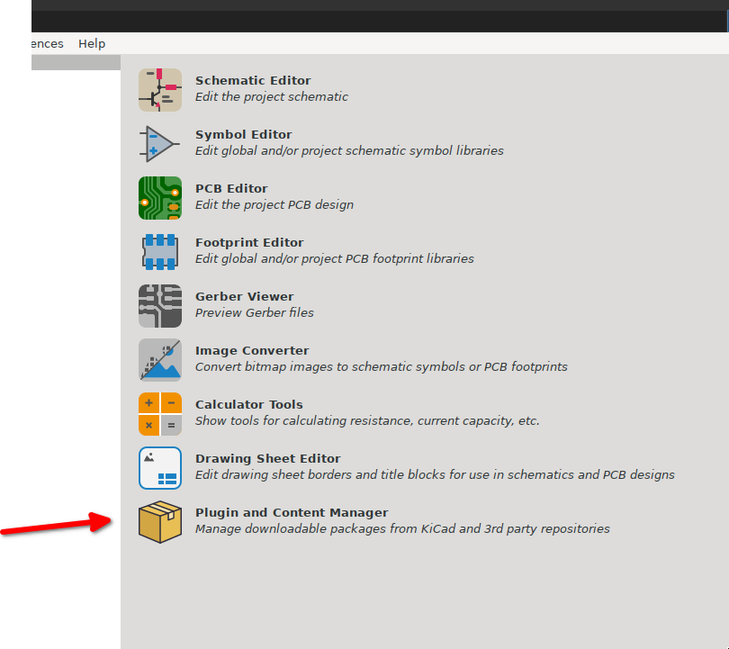

Search for 'JLC'.

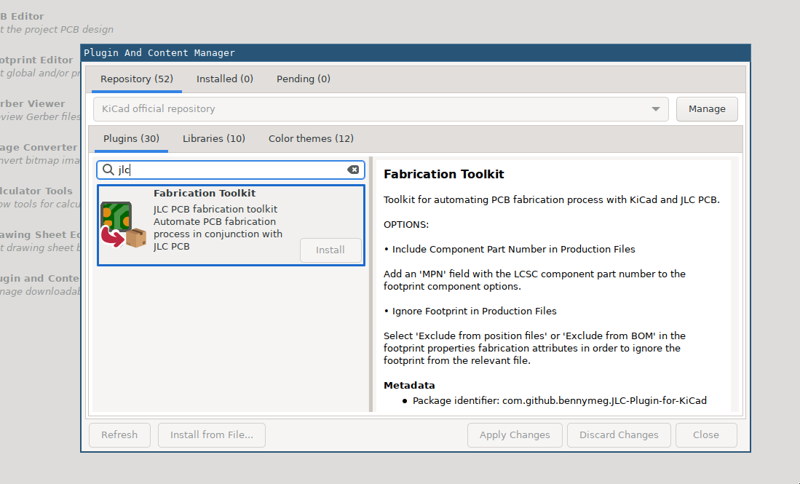

Install 'Fabrication Toolkit' and apply changes.

## Assign Part Numbers

Open your schematic. Go to Bulk Edit fields.

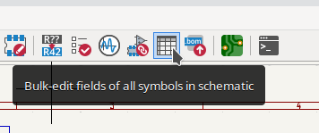

In the Field Editor window, click on 'Add Field' and add the field `LCSC`. It doesn't matter whether you have `Sim.*` or `Datasheet` fields or not.

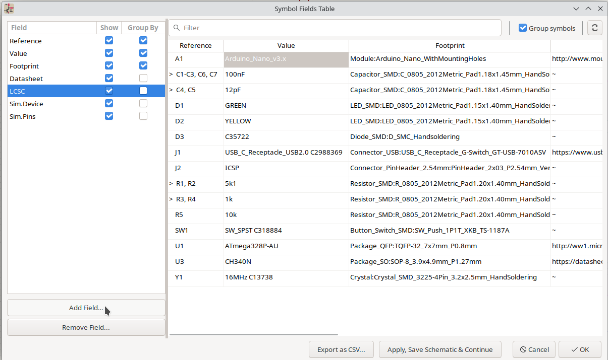

Then, search for your components at <https://jlcpcb.com/parts> and fill in the LCSC id.

For generic components, search for the Value and Footprint - `100nF 0805` - and check basic parts. You'll see a couple of different voltages, pick the lower (cheaper) one since we are only at 5V.

You don't *have* to necessarily specify the part number for generic components like 0805 resistors or capacitors, but I prefer to manually select it rather than leave it up to JLCPCB to decide.

The LCSC Part number (aka JLCPCB Part #) looks like `Cxxxx`.

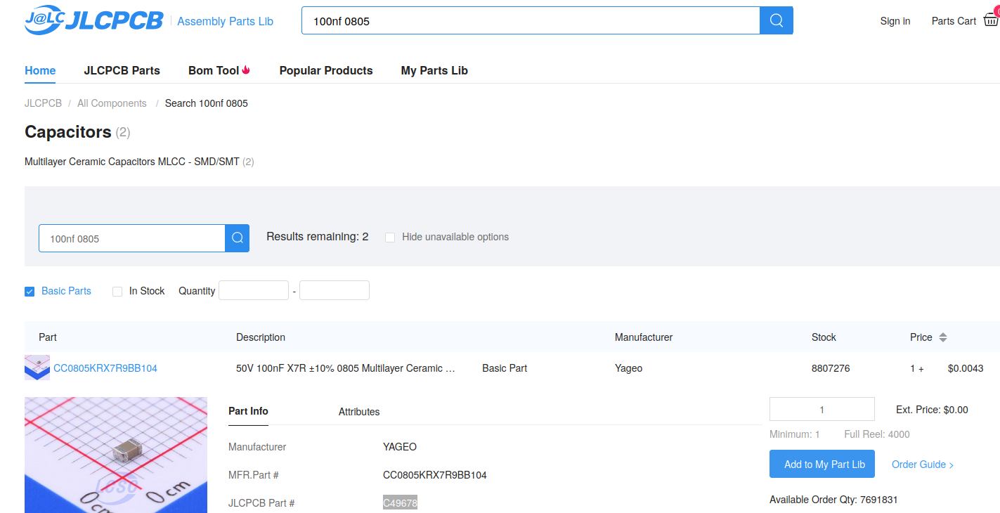

For more specific components, like the Atmega328P-AU, you should only have a couple of options and just pick the most popular one (Basic Part if possible).

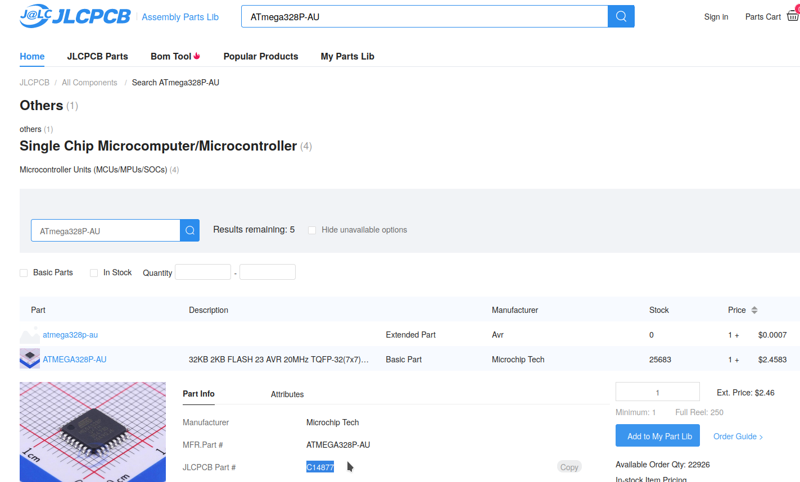

Try doing this yourself before you look at my version below.

This is what your table should look like, and then Apply and Save.

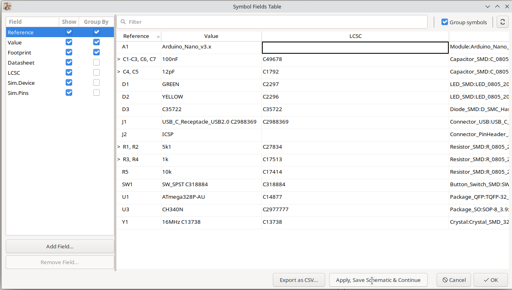

Because A1 and J2 aren't real components - we only need their footprint and pin layout, not the component itself - they don't need an LCSC part number.

  
## Export files

Now, go back to the PCB view and sync it.

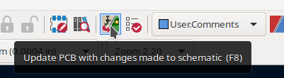

Then, click on Tools > External Plugins > Fabrication Toolkit.

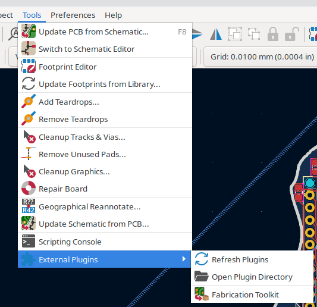

Everything you need to order your board will now be in `your_kicad_project/production/`.

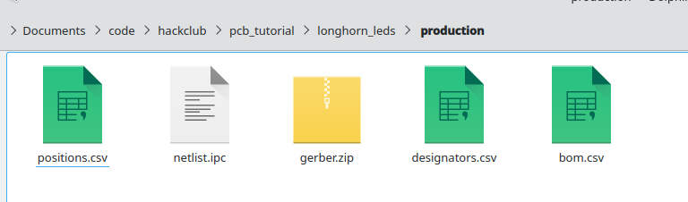

Now, log in to <https://jlcpcb.com>. Go to <https://cart.jlcpcb.com/quote> and upload `gerber.zip` into "add gerber file".

You should see something like this:
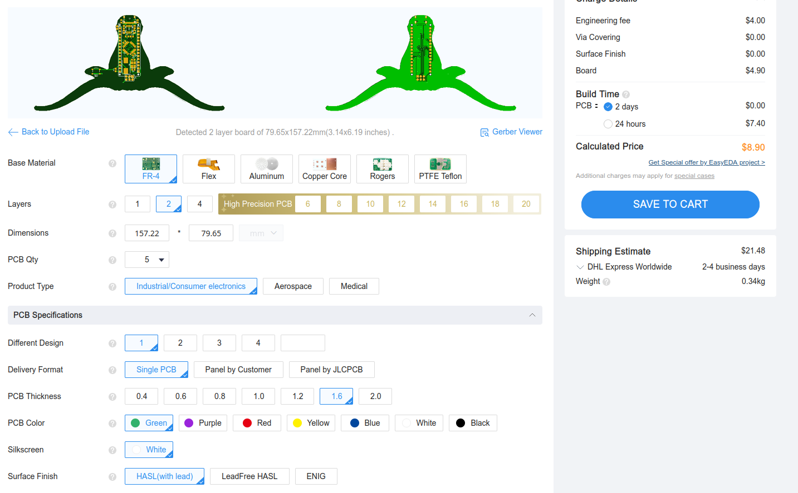

Tips:
- 5 is the minimum number of PCBs you can order.
- You can change your shipping option on the right 'Shipping Estimate' sidebar.
- Sometimes, reducing the PCB thickness from 1.6 to ~1.0 will reduce the weight of the package, and thus the shipping price without increasing manufacturing price.
- If your PCB will be handled a lot consider selecting 'LeadFree HASL' for its surface; exessive exposure to lead can be toxic.

Leave the 'High-spec options' at their defaults, and then, enable assembly. 
- You can choose to only assemble 2 boards out of 5, in which case the other 3 bare boards will be shipped to you. If you only want one PCB, this can save money on parts.
- You can only assemble one side in Economic PCB assembly.
- Standard PCB assembly with both sides is very expensive  (~$65) and will use up most of your grant money. Try to design PCBs that have components on one side and don't use any 'Standard Only' components. Or, solder the other side by hand.

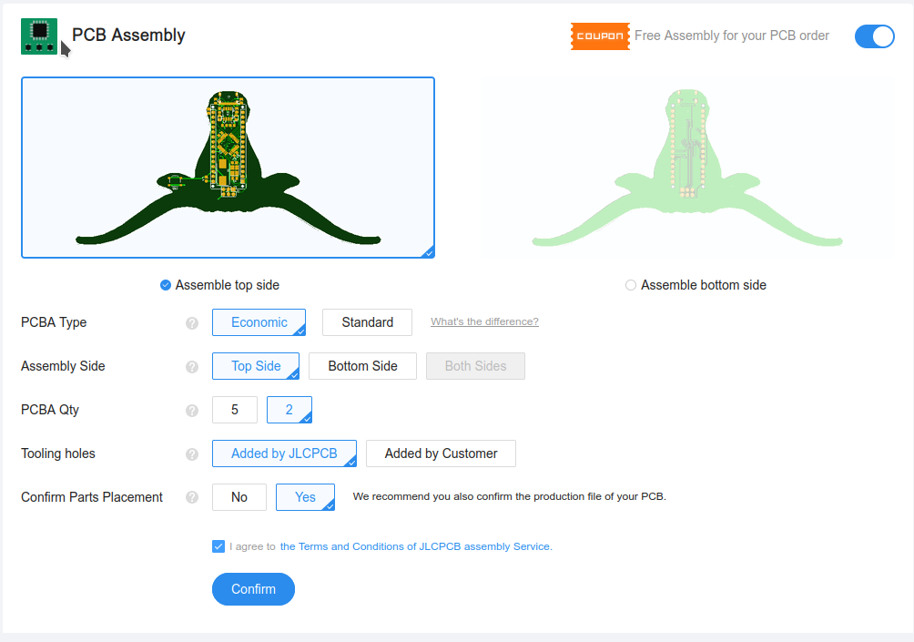
Then, on the Bill of Materials page, upload bom.csv and positions.csv from your production folder. 

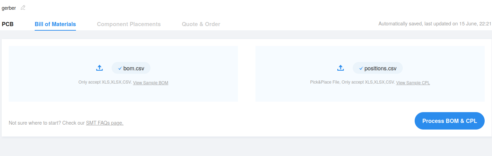

- You can save a lot of money on Extended Parts in the long run (if you plan on making many PCBs) by buying them directly and soldering them yourself [^1]. For example, basically every project has a USB-C connector, so it makes sense to buy a bunch yourself and avoid the $3 extended part fee every time you buy a board from JLCPCB.
- Virtual Components (only used for their through holes) like the Arduino Nano and ICSP header can be ignored.

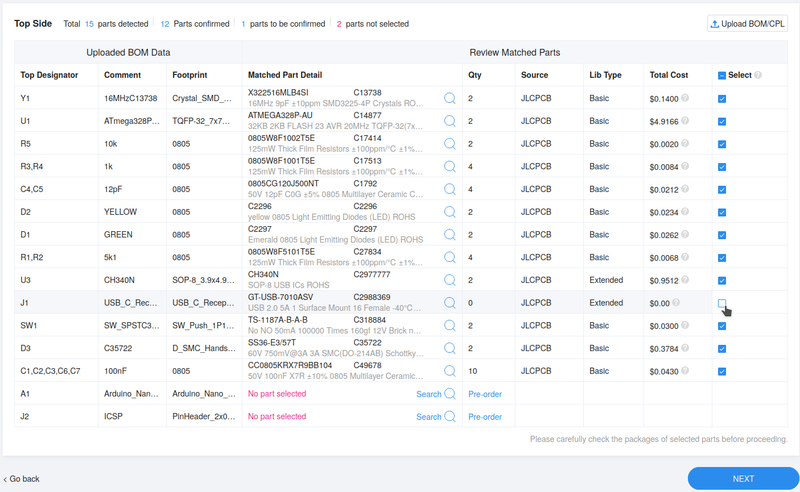
When it prompts you about unselected parts, just click 'Do not place'.

Zoom into your components on the 'Component Placements' screen and rotate them to the correct orientation if they're wrong.

If you get all parts assembled, this board (just the microcontroller and PCB) ends up being around $33.
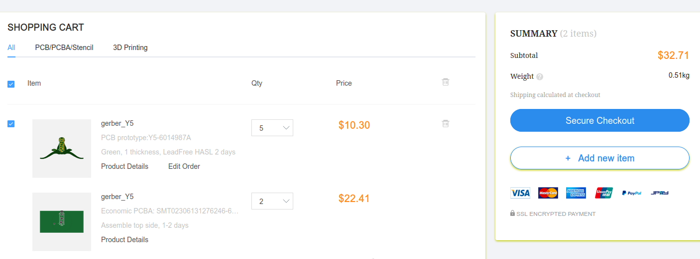

With shipping, that's $45.

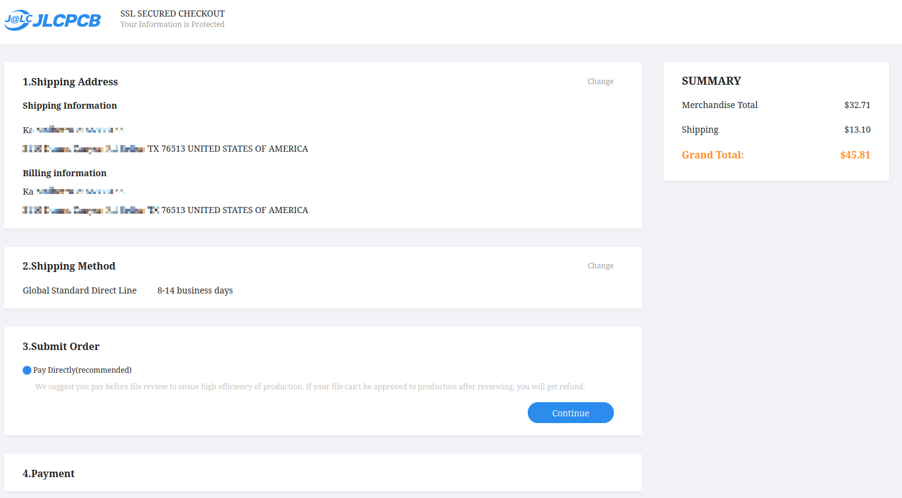

### Footprints

[^1]: You might want to edit the footprints of components you are hand-soldering. For example, to hand solder the USB-C connector, make the pads longer and remove unused ones like SBUS.