In this workshop we will add an accelerometer, battery charger, and LEDs to our microcontroller board.

## Part selection

1. Battery Charger - TP4057 - It's a basic part on JLCPCB, fairly small (SOT-23), and has two separate LEDs for charging and battery full.
2. LEDs - WS2812 or SK6812 - There are several addressable options in the WS2812 and Sk6812 series. Most of them are rated for 3.7V-5.3V and require 70% of VDD to read a logic high. Your main deciding factor here will be physical and assembly constraints. In my design, I wanted the LEDs on the opposite side of the rest of the circuit which further increased complications (getting both sides assembled is super expensive). 
   
   I ended up installing a combination of the `SK6812SIDE-A-RVS` which shines at a right angle from JLCPCB, and the `WS2812D-F5` for the back of my board, that I could solder myself. Honorable mentions go to the `SK6812MINI-E`, a reverse mounted LED which I would've totally used if my board was wide enough. There is no right answer here; everyone's design and aesthetic preferences will differ.
3. Accelerometer - LIS3DHTR - We don't need anything too fancy as we're just meausring the orientation of 1G reltive to the board. Unfortunately there are no popular and cheap 5V-compatible accelerometers. The LIS3DHTR is 1.8V to 3.6V and Arduino libraries from Adafruit and Sparkfun exist for it.

### The voltage dilemma

Now you might be noticing a problem. The accelerometer wants 1.8V - 3.6V, while the LED wants to be driven at 3.7V - 5.3V, and wants 70% of its driving voltage for signals. 
Adding to the confusion, Li-ion batteries run from 4.2V to 3.5V (for 80% discharge)[^1].

So we need a voltage regulator for the accelerometer, which leaves us with two options:
1. We can level shift between the microcontroller and accelerometer.
2. Run the microcontroller, USB chip, and accelerometer at 3.3V, and level shift to the LEDs.

With option 2, what do we need to shift? If we keep driving the LEDs at 5V, they need 70% of 5V = 3.5V to (officially[^2]) count a logic high. 
**Neat hack #1**: However, if we drop the LED's voltage by .5V or more (4.5V * 70% = 3.15V), we will be in spec. It can be lower, just not higher.

So, to sum up, we want the LEDs driven at 4.5V or less, and the microcontroller and chips to be at 3.3V.

So, our power net requirements:

1. USB_P - 4.75V - 5.25V. Raw USB.
2. VBAT - 3.0V - 4.2V. Current should only go into this through the charger, and it's connected to VDrive if and only if USB is unplugged. Connecting a Lithium Battery directly to 5V would be a recipe for disaster[^3].
3. VBUS - slightly under 5V. USB with just one diode to prevent reverse current flow.
4. VDrive - 3.5V (battery min) to 4.5V (USB Max). This will power the LEDs, smartly switching over to the batteries when USB is unplugged.
5. VCC - 3.3V. Regulated, stable power for the microcontroller, accelerometer, and USB chip.

This may seem very complicated, but it'll be clear once we start working on the schematics.

---

The rest of the parts are:

4. Voltage Regulator - XC6206P332MR. A small (SOT-23) basic LDO (Low DropOut) voltage regulator on JLCPCB Basic Parts that outputs 3.3V. This has a 250mV dropout, so it needs 3.55V in to output 3.3V, and it can take in up to 6V.
5. Switches - C40737. Just a nice small DIP switch[^4] to set different modes on our MCU.
5. P-Channel MOSFET - AO3401A. This will switch the battery onto VDrive when USB is disconnected. Same story, the best of the three available basic parts of JLCPCB; adequate current capacity and low resistance.
6. Diodes - C8678. So, we want to drop our ~5V USB input to <4.5V. While they are not perfectly linear like Ohmic resistors, diodes do vary the voltage they drop based on the current going through them. To stay in spec with both the LDO and the LEDs, we want the lowest voltage on VDrive to be >3.7V. So, our drop ranges from .5V to 1.3V (varying based on current draw). We will use two diodes (explained later), so each should have a current drop between 0.25V to 0.65V. This SS34 Diode fits the bill, and has the ability to dissipate all that heat.

## Modifications

There are 3 modifications you need to make to the old design to suit the new power layout.

1. Connect the new power rails to the right pins.  
   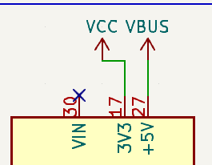
2. The USB chip now runs off 3.3V VCC, and according to [the datasheet](https://cdn.sparkfun.com/datasheets/Dev/Arduino/Other/CH340DS1.PDF), V3 and VCC need to be connected together to 3.3V. Also, lower the resistance for the LEDs because of the lower voltage. 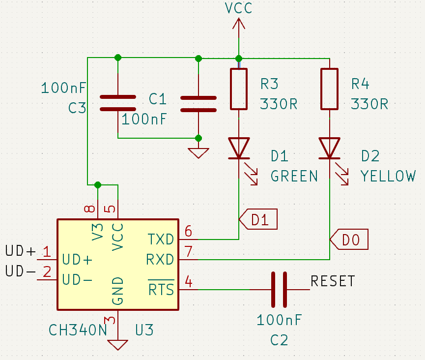
3. Change the Diode to our new one, and USB is now powering VBUS (5V rail). 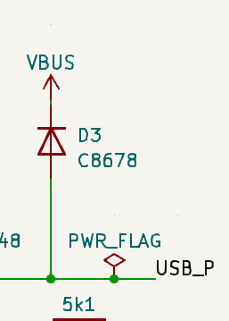

## Other peripherals

First, create a new sheet called "Devices" to store everything else and place it on your schematic.

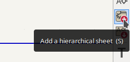

Now, you have a whole new page to store your components.

### Accelerometer

In 'Section 4: Application Hints' of the [LIS3DH datasheet](https://www.st.com/resource/en/datasheet/lis3dh.pdf), you'll see an example circuit and descriptions for what you're supposed to do to each pin. You can also look at other OSHW circuits (ex. Adafruit, Sparkfun) to understand the application of such an IC.

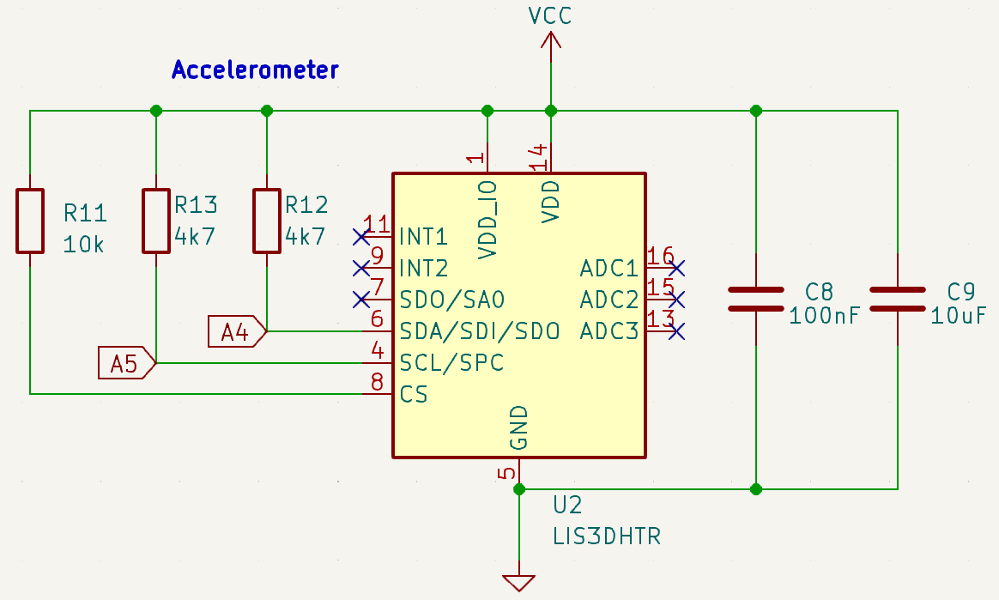

Here, everything is being powered from the 3.3V VCC. There are two decoupling capacitors (100nF and 10uF) as required by the datasheet. The two 4.7K resistors pull the I2C line high when it's not being used. CS is tied high to enable I2C communication at all times. The interrupts are not being used here since we don't need data immediately[^5].

### Configuration Switch

This is a simple set of switches which can be read with the microcontroller's internal pullup pins and will let us define aspects of the LEDs and Level in software. Consider using something that has protruding switches and is (significantly) bigger than the C40737 if you want to control it by hand.

### Battery Charging

[The datasheet](./tp4057-google-translated-datasheet.pdf) for the TP4057 recommends this circuit if we want the Red LED to light up when it's charging, the Green LED when it's charged, and both lights be off if no battery is connected.

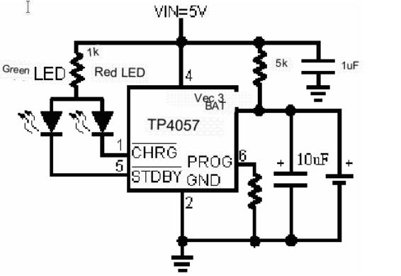

The PROG resistor determines how fast to charge the battery based on a forumla, some common values are in the datasheet:

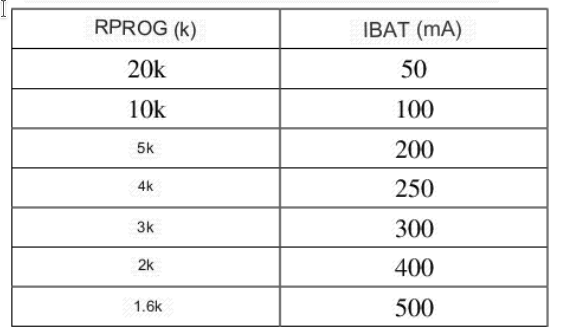

Lithium batteries should typically only be charged with up to 1C of current[^8]. For example, if you have a 300mAh battery, 1C = 300mA of charge or discharge current. Since this is an LED project, it'll require big batteries (> 500mAh), so we'll select 500mA as the charging current with a 1.6k resistor[^7].

This is the final schematic:
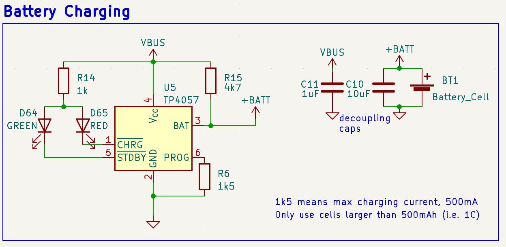

### Power Processing

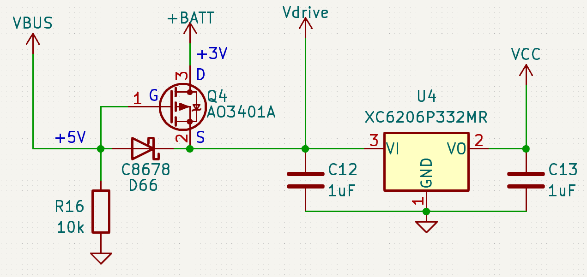

> KiCAD doesn't have a TP4057 symbol by default, see the [Component Listing](#component-listing) to download it.

As covered in [the voltage dilemma](#the-voltage-dilemma), we need several voltage rails for different applications.

The accelerometer, USB interface, and microcontroller all run off of 3.3V VCC from the voltage regulator.

The voltage regulator and LEDs are powered from VDrive, which may be powered by VBUS or VBat[^9].

The battery charger runs exclusively off of VBUS.

How does the MOSFET switch VBat onto VDrive?

This is called a Power ORing circuit.

So, I have a battery (say +3V min) and USB (nominally +5V). I want to drive VDrive from the USB when it's connected, else the battery. This is the simplest way to do that:

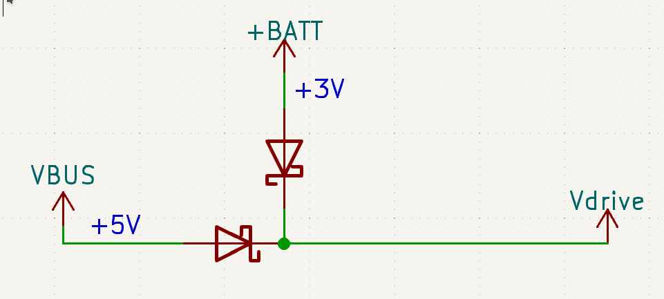

Here, the VBat Diode has one job: Protect the battery from charging directly through USB. This is because when VDrive (the junction point) is at 5V due to USB (maybe 4.6V due to the diodes), the potential at VDrive is higher than the potential at VBat. Since current flows from higher to lower potential (voltage), it won't flow from the battery (<4.2V) to VDrive (>4.5V). The diode (being a one-way valve) won't allow USB current into the battery.

The VBUS Diode prevents the battery from powering the charger, possible power LEDs or any other USB-only components.

Now, why is our MOSFET design better? It seems far more complicated. But, the trick is that instead of a fixed voltage drop, turning the MOSFET on causes the drop to be ~40 mOhms. At 1A, that is a .04V drop - significantly better than the diode's ~.3V. Not only does this save energy, it allows you to use the battery down to a lower voltage.

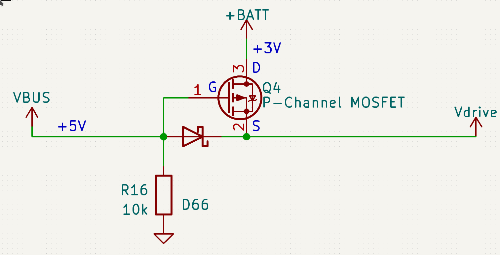

There are 3 states to this MOSFET arrangement[^10]:
1. VBUS is 5V, VBAT is 4V. (G - S) > -1. MOSFET does not conduct. Additionally, since S > D, no potential gets applied backwards onto the battery.
2. VBUS is 0V (stable because of the pull-down), VBAT (D) is 4V. G = S = 0. Now, since S < D, current can flow across the body diode. This brings S up to 3V.
3. Now, S = 3V, G = 0V, (G - S) < -1V and the MOSFET is enabled.
4. If VUSB is enabled again now, go back to step 1.

 

Additionally, the USB interface should already be protected in case VBUS is being powered by the header pin.

This design is why current coming from USB to VDrive has two diodes, and thus we picked diodes with a 0.25V to 0.65V drop (ideally a constant .3V). 

### LEDs

This is a chain of NeoPixels:

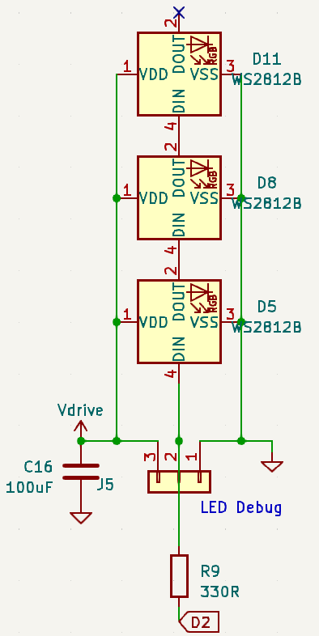

The WS2812B symbol works for any WS2812 or SK6812 LED that has 4 pins (+, -, DIN, DOUT). Since they are all logically the same, different NeoPixel form factors use the same symbol with different PCB footprints. Although they are not required, we have a capacitor to aid with sudden bursts of energy and a resistor to prevent too much current going to the LEDs data pin in case of a short[^11]. There's also a debug connector to test the LEDs from an external microcontroller, again, not required, just helpful in development.

Like I said in part selection, your NeoPixel choice will vary hugely based on your physical design and assembly technique. Feel free to ask for help in [#onboard-help](https://hackclub.slack.com/archives/C0593MG26TT) on Slack.

> Note: Each Neopixel uses up to 60mA at max brightness. While this circuit is prepared to deal with 3A, make sure your power supply and battery are too. Even though you may not be planning to set them to full birghtness (because they are insanely bright), don't go way over the limit (50 LEDs) so software bugs or electrical glitches don't burn your house down.
> Your battery MUST be at least 1000mAh (ideally more) if you have 50 LEDs = 3A. This will prevent it from triggering its overcurrent protection in case of accidental max brightness. If you're *planning* to run 50 LEDs at max brightness, I'd recommend going with at least 3000mAh battery to discharge at 1C[^12].

How to group LEDs?

From a circuit standpoint, putting LEDs in parallel is easy, you just connect their DIN pins, and leave out one of their DOUTs.

> **Note**: Carefully compare the datasheets if you're putting two different LEDs in parallel. Some LEDs are GRB, others are RGB, so won't be the same color if connected in parallel[^13].

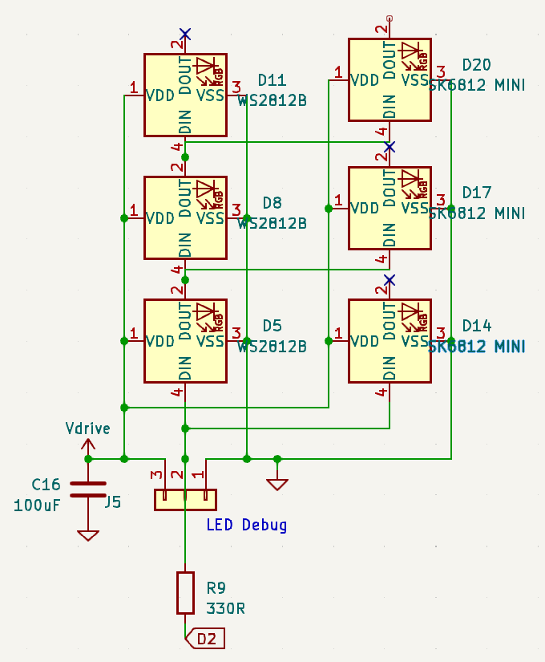

But, as you can see, it quickly turns into a mess. If you want to block sets of LEDs that will be together repeatedly (in series or in parallel) do this:

First, add a hierarchical sheet called `LED_BLOCK`. Then, put something like this in it (for parallel). Since the power symbols are globally the same, you can put them inside this drawing rather than having to connect it to every single LED group.
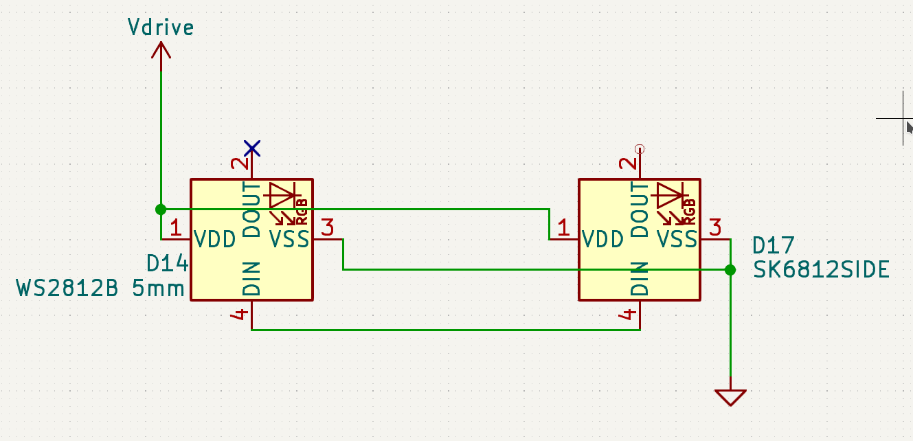

Then, add hierarchical labels from the right sidebar and called "DIN" and "DOUT".

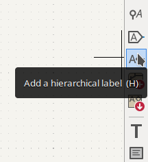

Then, connect them to the right points. Notice how we're not connecting both the LEDs outputs; they would interfere with each other. One LED is doing the talking on DOUT, while the other is a passive listener.
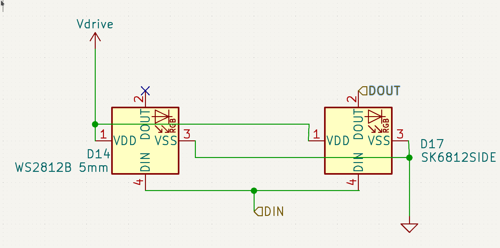

Go back to the DEVICES sheet. Then, click on 'Import a hierarchical sheet pin' to put the DIN and DOUT we defined in the last step to the outside of the block. You can delete the 'File' label.
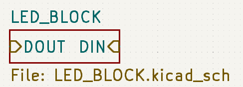

Then, copy-paste this sheet and connect it in a chain.
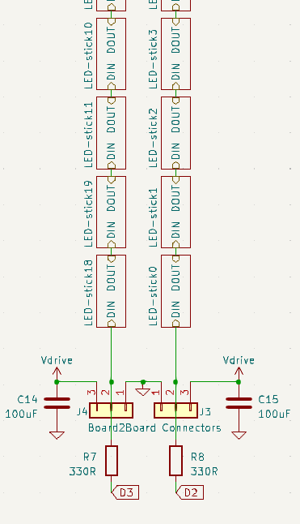

If you copy and paste them, the blocks will be linked and making a change to one will propagate throughout the rest, making iteration easier.

## Component Listing

To add symbols, see the [CH340N from Part 1](../pcb_level_1/#usb-interface). Just like that, in the PCB view, you can add custom footprint libraries. My custom symbols (TP4057) and footprints (LEDs) are in [custom-leds.pretty.zip](./custom-leds.pretty.zip), which you need can extract into your KiCAD project folder. You could also find such footprints elsewhere on the internet, or create them from the datasheet.

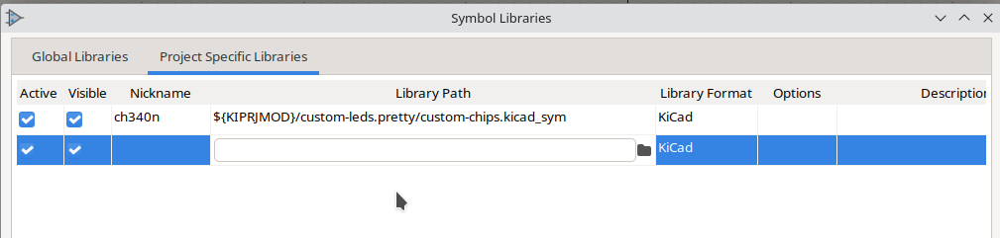
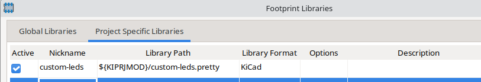

| Name         | Footprint              | LCSC Number | Reasoning |
| ------------ | ---------------------- | ----------- | --- |
| TP4057       | TSOT-23-6              | C12044      | | 
| Battery Cell (Connector, not actual batery) | jst ph-k 1x02 vertical | C131337     | You can also pick SMD connectors to trade a bit of strength for a clean back surface |
| 100uF Capacitor | 1206 | C131337     | Such a big capacitor is only available in 1206|
| Resistors/Capacitors around battery charger, accelerometer | 0402 | | I tend to avoid tiny components because they're difficult to rework in case of an error, but these chips have such small pin spacing that it's only convinient to use matching components. + I was running out of space on my board |
| Power Diode | SMA | C8678 | |
| DIP Switch | x06 1.27 7.62 kingtek | C40737 | Matched w/ datasheet of chip| 
| SK6812SIDE | SK6812-SIDE  | C2890037 | Custom made footprint, download above|
| WS2812D-F5 | WS2812 F5  | C5149201 |same|
| AO3401A | SOT-23 | C15127 | |

## PCB Design

Since your board design will be very different from mine - with a different physical shape, perhaps even different components, the following images are just for inspiration. Try arranging the components yourself.

I replaced the one big diode with the accelerometer near the MCU, to make routing easier, since they both talk I2C and use 3.3V VCC. It's using 0402 components and .2mm traces to reasonably be able to route around the incredibly tiny pins.

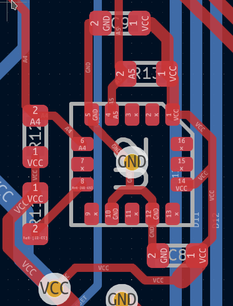
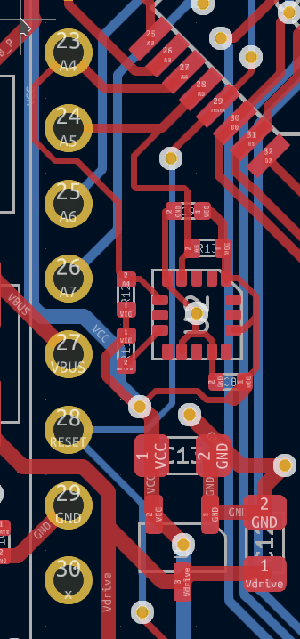

I also put the voltage regulator in that vicinty because everything that needs 3.3V VCC is inside the Arduino footprint.
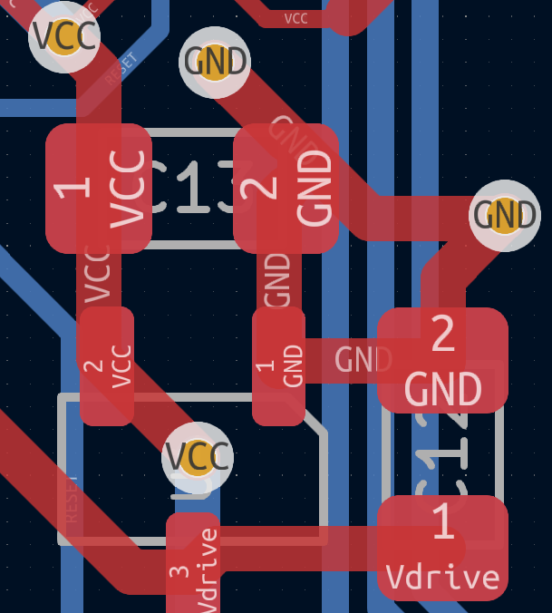

The two power diodes are off to one side, where I found some free space. That header pin is the only thing connected to VBUS, so centering the diodes approximately there reduces trace length.

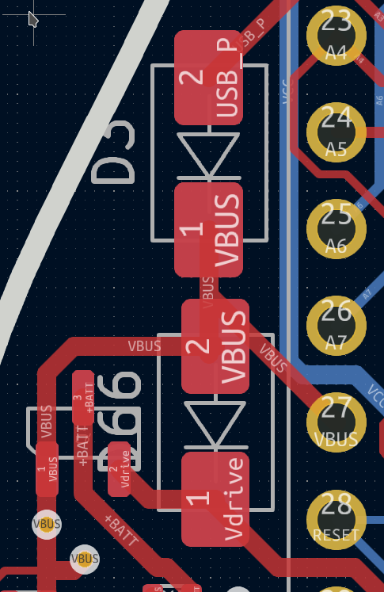
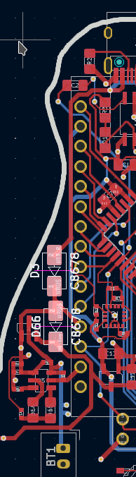

Then, the battery charger and connector is placed right next to the rest of the power management. 

> I'd recommend flipping the connector compared to how I placed it in the image because the ICSP header is obstructing my clips.
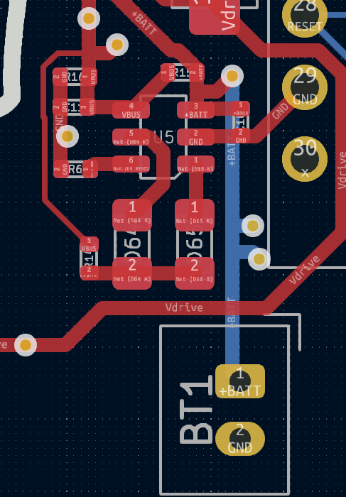

The switch is oriented (and wired in the schematic) in such a way that the switch pads and header pins are in a line.

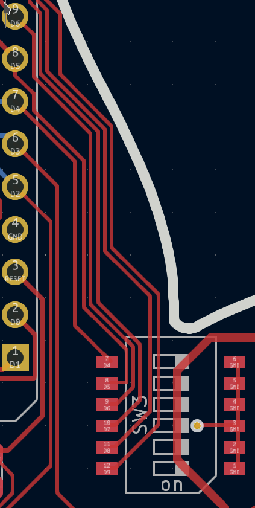

And my overly complicated parallel LEDs were laid out as shown. Of course, you can't use both at the same time due to color encoding differences (see the [LEDs section on grouping](#leds)). The through-holes provide a free via to run VDrive on the other side, and access the ground plane. If you have a penninsula like this, double-check that the ground plane isn't constricted through a bottleneck. There's no harm in running traces on top of the plane to ensure there's enough capacity. 
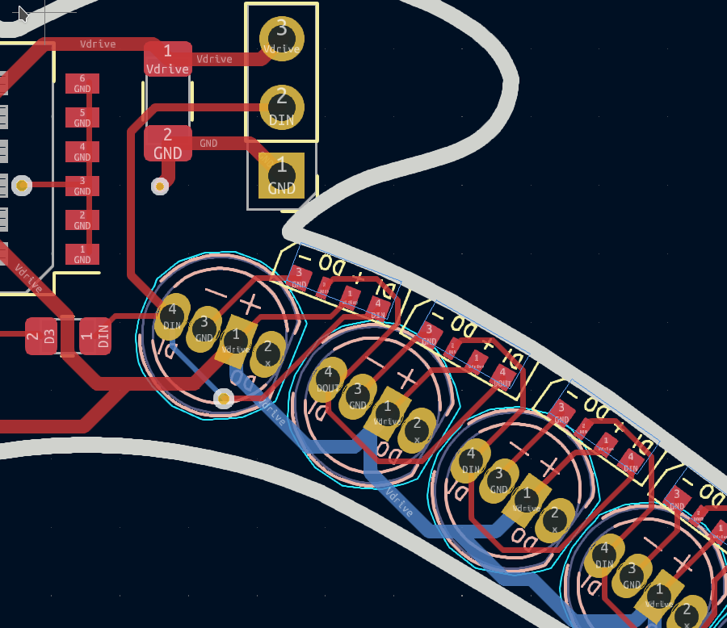

## Final Design
And that's it, you have a completed SparkleTilt!
Full Board:

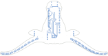

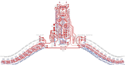

This is the full schematic:
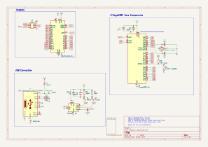
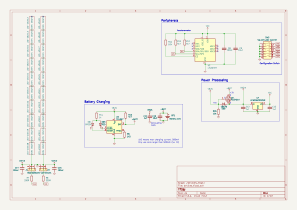
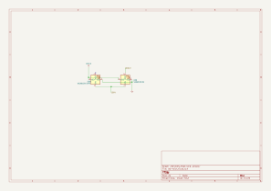

I can't wait to see how you remix this. You can share your designs and get feedback in [#onboard on Slack](https://hackclub.slack.com/archives/C056AMWSFKJ). We'll discuss programming this board in Part 5 of this workshop! (Coming Soon)

<!--the markdown renderer for GFM Workshops ought to automatically add a "Footnotes" header right around here-->
[^1]: https://learn.adafruit.com/li-ion-and-lipoly-batteries/voltages
[^2]: In practice, you may see Neopixels running happily from 3.3V microcontrollers, but can't rely on that. The MCU's voltage might be on the lower end and output slightly under 3.3V, your USB line might be outputting 5.2V and now the limit is at 3.65V, etc. It's best to keep a margin of error.
[^3]: https://youtu.be/osfgkFyq7lA?t=127
[^4]: A DIP switch is a package with multiple individual switches like this: 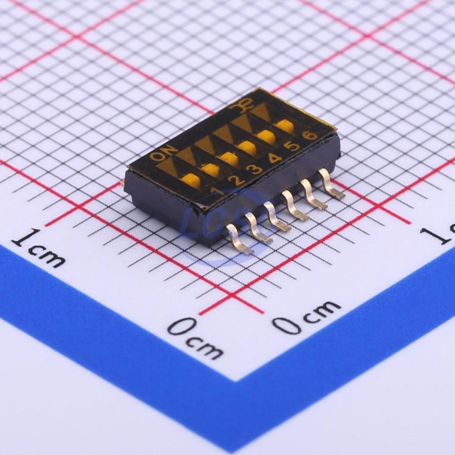{:width="50%"}
[^5]: These interrupts would be useful if you needed an event notification from the IC (is acceleration > *n*?), or you wanted every single value immediately after it was measured (integrate acceleration to velocity) (AKA Pushing data). In our case, we'll just ask the chip for the acceleration every few hundred milliseconds (AKA Polling data).
[^6]: See table on page 8 for more info.
[^7]: I used 1.5k because of 1.6ks were unavailable in my size on JLCPCB, anything in that vicinity ought to work. Similarly I used 4.7k's instead of 5k on the battery pin pull up.
[^8]: Slower charging is fine, it'll just take more time, faster could overheat the battery.
[^9]: This ORing design was inspired by [Unexpected Maker's Feather S3](https://github.com/UnexpectedMaker/esp32s3/blob/4aa7ebb8e56a60362dc5455193b5c223e020a28b/schematics/schematic-feathers3_p7.pdf). Open Source Hardware FTW!
[^10]: This video on reverse voltage protection might help understand these states: <https://youtu.be/IrB-FPcv1Dc?t=116>. We are doing practically the same thing, just checking another power supply instead of the direction of the one battery.
[^11]: It's unlikely to have a disconnected power supply but active data pin on a PCB, but the cost of adding the resistor is negligible, so might as well. It's not a big deal if you remove it.
[^12]: https://electronics.stackexchange.com/a/466498/344964 
[^13]: I learned that the hard way.