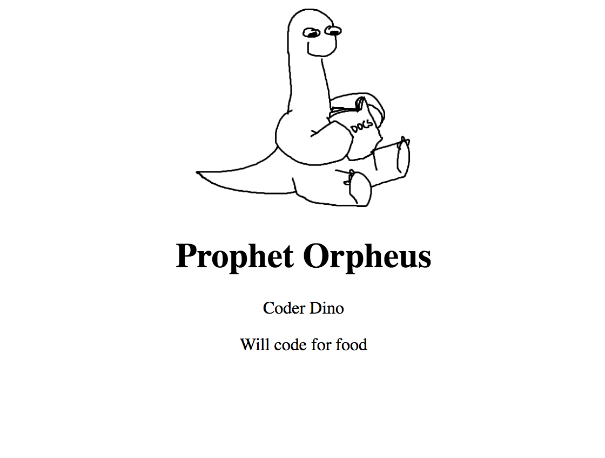
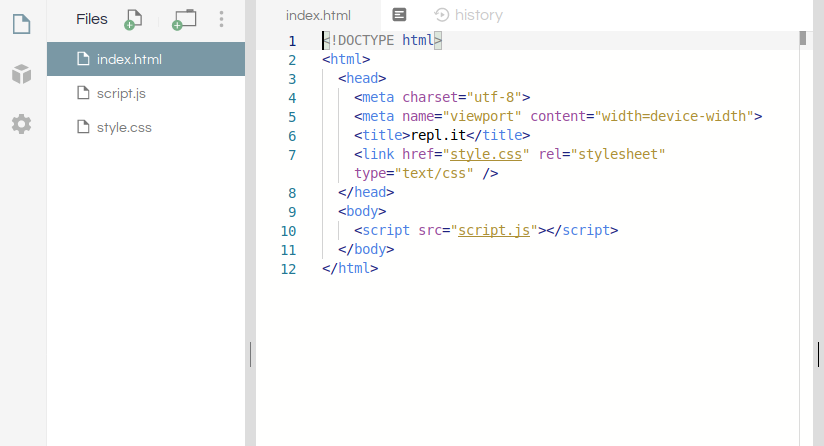
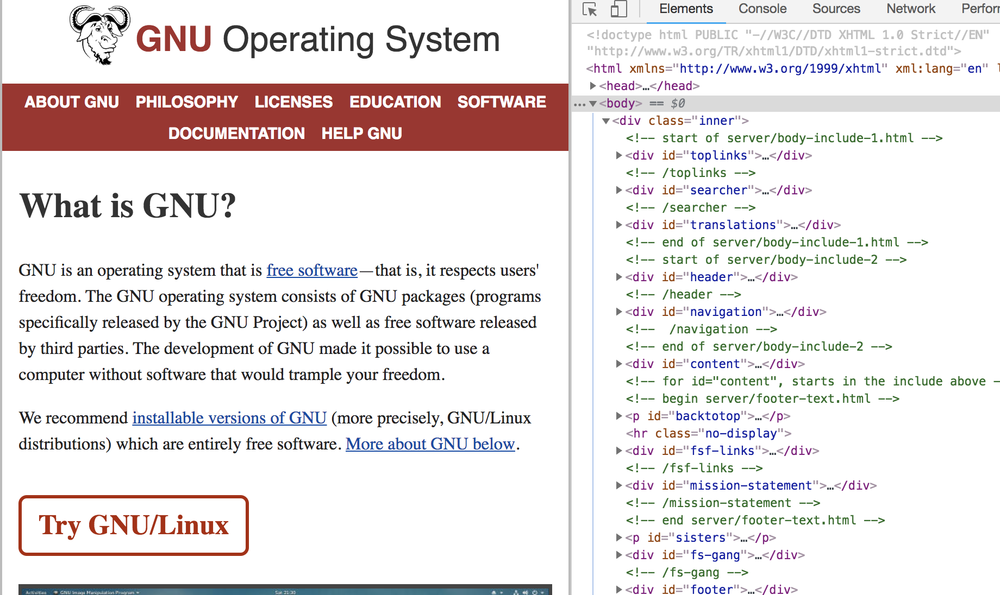
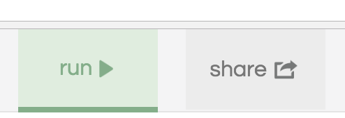
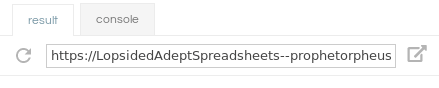
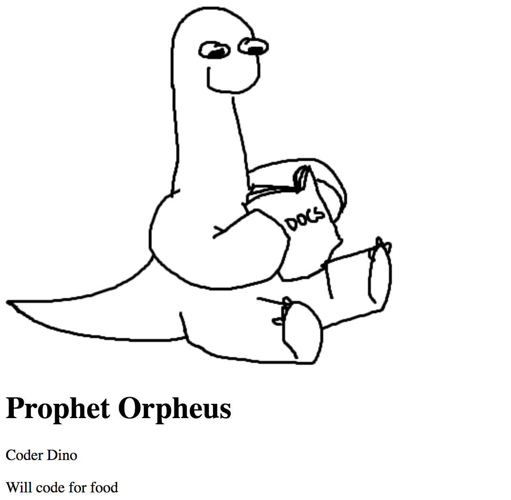
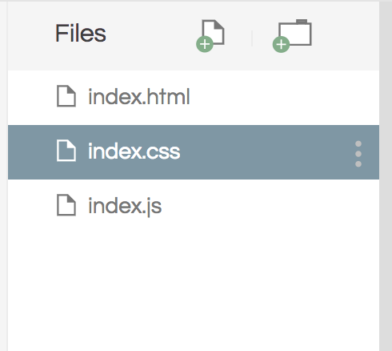
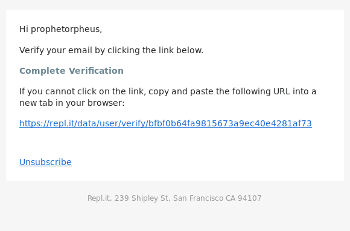
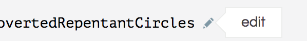

# Personal Website

Prophet Orpheus, [our mascot](https://github.com/hackclub/dinosaurs/blob/master/README.md), is here to guide you through making your own personal website.

It will look something like this:



Here's the [live demo][final_live_demo] and [final code][final_code] (see `index.html` and `index.css`).

This workshop should take around 45 minutes.

[final_live_demo]: https://website--prophetorpheus.repl.co
[final_code]: https://repl.it/@prophetorpheus/website

**Table of contents:**

- [Part I: Setup](#part-i-setup)
- [Part II: The HTML File](#part-ii-the-html-file)
- [Part III: The CSS File](#part-iii-the-css-file)
- [Part IV: Publishing](#part-iv-publishing)
- [Part V: Hacking](#part-v-hacking)
- [Part VI: Sharing with the Community](#part-vi-sharing-with-the-community)

## Part I: Setup

### Getting ready to repl it on Repl.it

[Repl.it](https://repl.it) is an online [IDE](https://en.wikipedia.org/wiki/Integrated_development_environment) with support for 40+ languages as well as frameworks and we'll be using it to make our website!

To get started go to [Repl.it](https://repl.it) and type in "HTML"

> 

Press <kbd>Enter</kbd> once you've done so and you should have your environment spin up in just a few seconds!


## Part II: The HTML File

### 1) The HTML file

HTML stands for Hypertext Markup Language. Every website from the New York Times to Twitch uses HTML to display content on the web.

You should have the `index.html` file open and you can tell we're looking at HTML because of all the angle brackets.



Go ahead and delete everything in the `index.html` file then paste in the following code

```html
<!DOCTYPE html>
<html>
  <head>
  </head>
  <body>
  </body>
</html>
```

This structure is common to all HTML pages. In fact, you can take a look for yourself! Just right click on any web page, including this one, and click "View page source" to see what's going on behind the scenes. You'll find each of these elements on every page --- the doctype, and an HTML tag wrapped around a head and body.



Before proceeding, we'll briefly go over what this template means. 

HTML works by storing information inside tags. `<html></html>` is an example of one such tag. Inside `<html></html>`, we've placed two other sets of tags: `<head></head>` (which wraps around the "head") and `<body></body>` (which wraps around the "body"). The body holds everything you would see in the actual tab/window when you open the page, while the head conveys information about the page to the browser. 

`<!DOCTYPE html>` tells the browser what version of HTML to expect. Since it is a language, HTML is constantly growing and updating, so there are multiple versions. In our case, we are going to use HTML5, the latest version.

### 2) Previewing the Page

Let's check out what our HTML file looks like in Live Preview! To do this, click on the **Run** button above the editor or press <kbd>Ctrl</kbd> / <kbd>Command</kbd> + <kbd>Enter</kbd>



From there, the live preview to the right of the editor should show what your website looks like. If you want to view it in a new tab, the URL above the website preview is the live URL for your website



You can also open the external live preview by clicking the icon that looks like a box with an arrow. This will open live preview in a new tab at the aforementioned URL


As you can see, the page is blank. This is because we haven't added anything to the `body` section yet. Let's add some content!

### 3) Adding Text to the Body

As mentioned before, all information is wrapped in tags. Tags are predefined in the language; think of them as the words in the language. For text, HTML provides a number of tags to store text. We'll be using two of the most basic ones: the h1 tag (`<h1>`) and the paragraph tag (`<p>`). The h1 tag is the first in a series of heading tags, with `h1` being the highest ranking, and `h6` being the lowest ranking. Just as with the other tags, you can place information within the these tags by surrounding your content with an opening and closing tag.

Go ahead and add your name in a heading tag, and your description in a paragraph tag, in between the opening (`<body>`) and closing (`</body>`) tags. Here is Prophet Orpheus's name and description:

```html
<!DOCTYPE html>
<html>
  <head>
  </head>
  <body>
    <h1>Prophet Orpheus</h1>
    <p>Coder Dino
    Will code for food</p>
  </body>
</html>
```

If your description was a few paragraphs, or had line breaks, you may have noticed that one `<p></p>` doesn't quite cut it. Adding extra blank lines or spaces between words in HTML does not change the spacing of the content. We can solve this by placing each paragraph in its own `<p></p>`.

```html
<!DOCTYPE html>
<html>
  <head>
  </head>
  <body>
    <h1>Prophet Orpheus</h1>
    <p>Coder Dino</p>
    <p>Will code for food</p>
  </body>
</html>
```

Run your `index.html` and refresh the Live Preview. Yay!

### 4) Adding Images to the Body

First, find an image you would like to include in your page. You can find something on Google Images, Facebook, or Imgur. We'll need the source URL of the image, so right click and select "Copy Image Address".

Images are included in HTML via the image tag, or ``. The image tag has an attribute called `src`, which will hold the _source_ URL of the image you want to display. As an example, if I were to add this picture of Prophet Orpheus, I would right click it and get the source URL, which in this case is https://github.com/hackclub/dinosaurs/raw/master/smart_dinosaur_docs.png, and put it in an image tag like so:

```html

```

You may have noticed that the image tag doesn't have a closing tag like `<h1></h1>` or `<body></body>`. That's because it is a [void element](https://www.w3.org/TR/html-markup/syntax.html#syntax-elements), meaning that it doesn't have any contents.

Go ahead and add this into your `index.html` now. I put my picture before my heading, and my code looks like this:

```html
<!DOCTYPE html>
<html>
  <head>
  </head>
  <body>
    
    <h1>Prophet Orpheus</h1>
    <p>Coder Dino</p>
    <p>Will code for food</p>
  </body>
</html>
```



Remember, you need to **Run** your program every time you want to see your updated website.

Though our website has some text on it and exists on the _internet_, we're not done. Our webpage is fully functional, but needs a little help in the look-and-feel department. Fret not. CSS will allow you to manipulate the styling of your page in all your needs.

## Part III: The CSS File

So what is CSS? CSS, also known as Cascading Style Sheets, is a language used for styling the tags (or "elements") on a web page.

While HTML oversees the content and the way it's structured, CSS is how you'll specify how you'd like your content to look --- with it you can set things like colors, spacing, and more.

### 1) Using CSS

We already have an `index.css` in the file tree and this is called an external style sheet because the CSS file is external to the HTML file (i.e., the stylesheet is not inside the HTML file).



Although we have a CSS file, until we explicitly tell the HTML file to use the CSS file, it will not use it. We must explicitly link the CSS file in the HTML. We'll do this by typing the following into the head of `index.html` (between `<head>` and `</head>`), because the head is where we tell information about the page to the browser.

```html
<link rel="stylesheet" href="index.css" />
```

`<link />` is the link tag, which describes relationships between the current file (in this case, `index.html`), and some external file (`index.css`). In our example, `rel="stylesheet"` specifies what this relationship is, i.e., that `index.css` is a stylesheet, and `href` (hypertext reference) specifies where the file can be found (in this case, it's just the filename `index.css`). The link tag, similar to the image tag, is a self-closing tag, once again denoted by the `/` that precedes the `>`.

Our HTML file now looks like so:

```html
<!DOCTYPE html>
<html>
  <head>
    <link rel="stylesheet" href="index.css"/>
  </head>
  <body>
    
    <h1>Prophet Orpheus</h1>
    <p>Coder Dino</p>
    <p>Will code for food</p>
  </body>
</html>
```

Remember to save your `index.html`.

### 2) Adding Styles to the Stylesheet

Now that we've linked our CSS file to our HTML file, let's write some CSS to resize the image.

Open up `index.css` and type the following:

```css
img {
  width: 200px;
}
```

A CSS stylesheet contains "rules," each of which consists of a selector, and attributes and values within brackets, known as a "declaration block".

In our case, the selector is `img`. This merely selects all image tags (and thus, all images). The rule then says to set the `width` (width) of all things selected (in our case, all the images) to `200px`. `px` refers to pixels, which are a unit of measurement on the screen. When this rule is applied, all the images on our page will have a width of 200 pixels.

Next, we're going to center-align the entire body section.

We'll add

```css
body {
  text-align: center;
}
```

As with resizing the image, this rule specifies that every `body` tag should have a `text-align` attribute of `center`. This centers everything on our page because all of the content in our HTML file is written inside the body tag.

Now let's change the font of our text. We'll add another attribute, `font-family`, to the `body` rule, and set the value to `"Arial"`. Now it will look like this:

```css
body {
  text-align: center;
  font-family: "Arial";
}
```

You can take this even further by adding a bit of color to the page! The attribute `color` **(spelled without a u)** allows you to set the text color, and `background-color` allows you to set a background color. You can find a list of supported color names over at [W3Schools](https://www.w3schools.com/colors/colors_names.asp). Keep in mind that it's a good idea to pick a combination of colors will keep the text readable.

```css
body {
  text-align: center;
  font-family: "Arial";
  background: azure;
  color: purple;
}
```

Now be sure to **Run** to get the most recent version of your website. Ah, it is truly beautiful to behold.


## Part IV: Publishing

To actually save your website and be able to come back to it in the future you'll need to create an account on Repl.it.

To create an account, all you need to do is [sign up](https://repl.it/signup) and click on the link they send by email.



Once you're logged into your account, you can now edit the name of your repl!



Once you're happy with the name you've given it, press <kbd>Enter</kbd> to confirm your changes (or <kbd>Escape</kbd> to cancel your name change)

Your new URL should be REPL_NAME--USERNAME.repl.co (that's two dashes before the username)

#### Celebrate!


Yes! Your website is fantastic **AND** out on the internet!

## Part V: Hacking

In this section, your challenge is to add additional features to your website to make it your own!

Want to use a different font? Google it!  
Want to add more pictures? Google it!  
Want to add more text? Your entire life story? Background image? Background music? Video? More pages? Google it!

A good way to get ideas for what to add to your website is to look at other people's websites. Find a website that you like, either from the below list or from somewhere else on the internet, pick one aspect of that website that you would like on your own website, and Google for ways to make it happen!

**Websites Made by Other Hack Club Hackers:**

- [Sophie Huang](https://sohuang.github.io/)
- [Gabriel Lazrak](http://gabriellazrak.github.io/)
- [Rebecca Jourard](https://mnefertiti.github.io/personalwhale/)
- [John Cena's](http://notbrian.github.io/john-cenas-personal-website/) (created by Brian Nguyen)
- [Jevin Sidhu](http://jevinsidhu.com/)
- [Zero Cool](https://harrison.tech/zero-cool/)
- [Chaoyi Zha](https://cydrobolt.com/)

**Websites Made by Professionals:**

- [Eel Slap](http://eelslap.com)
- [Alice Lee](http://byalicelee.com)
- [Yaron Schoen](http://yaronschoen.com)
- [Roxanne Ravago](http://www.roxanneravago.com)
- [Pushkar Modi](http://pushkarmodi.com)

### Additional Resources

These are some additional resources that you can use to make your site even better!

- [HTML Dog](http://www.htmldog.com/guides/html/beginner/): _Very beginner focused. If you're not sure which one to choose, pick this one._
- [Free Code Camp](http://www.freecodecamp.com/map): _Interactive and very methodical._
- [Treehouse](https://teamtreehouse.com/library/html/introduction/): _Their videos are extremely comprehensive and thorough._

## Part VI: Sharing with the Community

Now that you have finished building a website, you should share your beautiful creation --- because your site is on the internet, you can share it with anyone who is also online! Remember, it's as easy as giving them your URL!

You probably know the best ways to get in touch with your friends and family, but if you want to share your project with the world wide Hack Club community there is no better place to do that than on Slack.

1. In a new tab, open and follow [these directions][slack] to signup for our Slack.
2. Then, post the link to the [`#shipit`](https://hackclub.slack.com/messages/shipit) channel to share it with everyone!

[slack]: https://slack.hackclub.com/
