# Personal Website

By the end of this workshop, you will learn to make your own personal website.
It will look something like this:

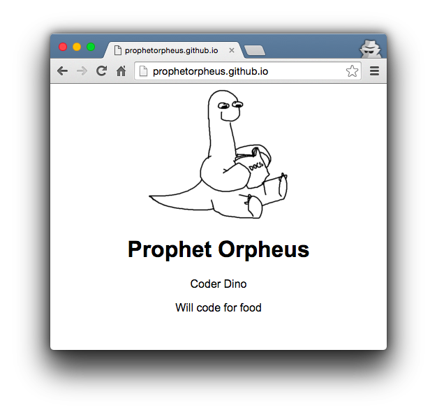

Open the [live demo][final_live_demo]. See the [final code][final_code]. This
workshop will take around 45 minutes.

[final_live_demo]: https://cdn.rawgit.com/anonymous/7a5a6cc614052c8c810f/raw/9419c5a5a4a871da091a49844ffbc46f434c01c8/index.html
[final_code]: http://jsbin.com/gist/7a5a6cc614052c8c810f?html,output

**On the way, you will:**

- Begin to learn the programming languages **HTML** & **CSS**
- Setup the coding tools **GitHub**, **Cloud9**, **Slack**, which you will use
  throughout your time in Hack Club

**Table of contents:**

- [Part I: Setup](#part-i-setup)
- [Part II: Create the Project Folder](#part-ii-create-the-project-folder)
- [Part III: HTML](#part-iii-html)
- [Part IV: CSS](#part-iv-css)
- [Part V: Publishing](#part-v-publishing)
- [Part VI: Sharing with the Community](#part-vi-sharing-with-the-community)
- [Part VII: Hacking](#part-vii-hacking)

## Part I: Setup

### 1) Sign Up for GitHub

GitHub is a website used by millions of programmers to collaborate on code.
Think Dropbox, but for code. We'll be using it to store and manage our code in
Hack Club.

1. Open https://github.com/join in a new tab and create a new account
  - Choose a username you will be proud to show future employers (ex.
    `zachlatta` and `jonleung`)
  - Use an email that you have access to, you'll need to access it
    to verify your account
  - Make sure to remember your username and password, you'll need this at every
    club meeting
  - When prompted to choose a plan, choose the **"Free"** plan
2. Open your email inbox in a new tab and look for an email from GitHub. Open it
   and click the button to verify your email
3. Open https://gh.hackclub.com in a new tab and star the project by clicking
   the button that looks like this on the top right: 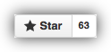

### 2) Create Your First GitHub Repository

GitHub allows us to **host** our website using a service called **GitHub
Pages**. This means that we can put the files of our website on GitHub and
GitHub will give us a URL that we can share with the world.

1. Go to https://github.com
2. Click the green **"+ New repository"** button
3. Under **"Repository name"** write your `USERNAME.github.io` except instead of
   writing `USERNAME`, write your actual GitHub username. So if your username is
   `alice1337`, write `alice1337.github.io`. You **have** to name your
   repository this in order for GitHub Pages to work correctly (we'll talk more
   about GitHub Pages later)
4. Make sure that you did the previous step correctly.
  - Is your **username** entered correctly
  - The repository name should end in **`.io`**
5. After you are sure you entered in the repository name correctly, click the
   green "Create repository" button at the bottom.
6. Copy the **"HTTPS link"** at the top. It should look like this:
   `https://github.com/username/username.github.io.git`. You will need this link
   for the next step.

### 3) Sign Up for Cloud9

Just like how we can use Google Drive to write and organize documents written in
English, we can use a service called **Cloud9** to write, save, and organize our
code. We'll be using Cloud9 to write all of our code in Hack Club.

1. In a new tab, open https://c9.io/
2. In the top right hand corner, click the button that looks like this:
   
3. Click the green **"Authorize application"** button
4. If there is a popup that asks for your email, go ahead and enter it
5. Click the gray box that says **"Create a new workspace"**
6. Set the **"Workspace name"** to `projects`
7. Make sure your workshop is set to **"Public"**
8. Under **"Clone from Git or Mercurial URL"**, paste the **HTTPS Link** that
   you copied from your GitHub repository

   > 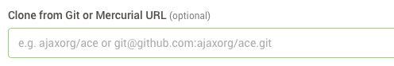

9. Make sure that you're using the **"Custom"** template
10. Without changing anything else, scroll to the bottom and click the
    green **"Create Workspace"** button

You should now see a screen looks something like this:

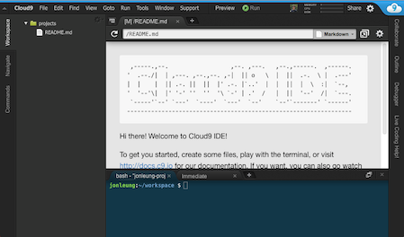

> Note:
>
> If you're waiting for a while (more than 10 seconds) and the above screen
> still doesn't load, try the following:
>
> 1. Open https://c9.io
> 2. Click on the green **"Open"** button
> 3. You should now see the screen shown above. If not, ask your facilitator for
>    help

### 3) Celebrate!

> 

Congratulations, you've officially set up all of your coding tools for the
semester!

Now we're ready to start the website!

## Part II: Create the Project Folder

We'll put each project built in Hack Club in a separate folder in Cloud9.

To start, let's create a folder for our personal website:

1. On the left side of the screen, right click the **`projects`** folder
2. Click **"New Folder"**
3. Name the folder **`personal_website`**

> 

## Part III: HTML

Every website is written with **HTML** code. HTML code is written in **HTML
files**.

> HTML stands for Hypertext Markup Language.

### 1) Create the HTML File for Your Website

1. Right click the **`personal_website`** folder you just created
2. Click **"New File"**
3. Name the file **`index.html`**
4. Double click it to open it

> 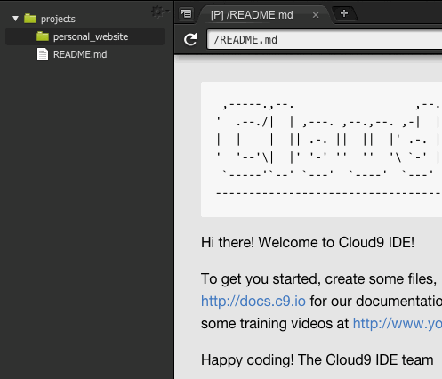

> Notes:
>
> - Just like Microsoft Word Documents end in **`.doc`**, HTML files end in
>   **`.html`**
> - Your main HTML file has to be named **`index.html`**

### 2) Adding Standard HTML Template

Every HTML file follows this template:

```html
<!DOCTYPE html>
<html>
    <head>
    </head>
    <body>
    </body>
</html>
```

Let's put this template inside of our HTML file:

1. Double click the **`index.html`** file you just created to open it
2. Retype the above HTML code into your **`index.html`** file, like so:

> 

### 3) Adding to the Template

There's a lot going on in the below template. For now, let's just understand
that there are two sections in this template, the **`head`** and the **`body`**:

```html
<!DOCTYPE html>
<html>
    <head>
            ← this section is called the "head" of the HTML document
    </head>
    <body>
            ← this section is called the "body" of the HTML document
    </body>
</html>
```

- Everything between the `<head>` and `</head>` tags is called the **head** of
  the page. `<head>` is considered an "opening tag" because it "opens" the head
  section. Since `</head>` starts with `</` (instead of just `<`), it is
  considered a "closing tag" and "closes", or indicates the end of, the head
  section.
- Similarly, everything between the `<body>` and `</body>` tags is called the
  **body** of the page. `<body>` is the opening tag and `</body>` is the closing
  tag. Together, the opening tag and the closing tag compromise the `body`
  element.
- Note: most HTML elements have an _opening tag_ and a _closing tag_. You'll
  want to get used to this pattern :smile:.

### 4) Opening the Website Preview

Let's see what our website looks like so far:

1. First, save the file by clicking **"File"** _(on the top right)_ → **"Save"**
   (or use the shortcut **CTRL + S / Command + S**)
2. Preview what the website looks like by clicking **"Preview"** → **"Live
   Preview File"**

> 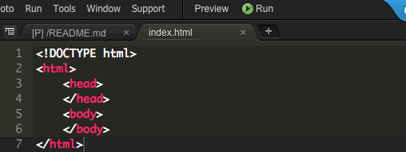

As you can see, the page is still blank. This is because we haven't added any
**content** in the **`body`** section yet. Let's add some!

### 5) Adding a Name to the Body of the HTML

Write your name in the **body** of the HTML page (between **`<body>`** and
**`</body>`**).

> 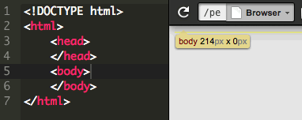

Notice that that the HTML we write is immediately updated in the preview. That's
why it's called a **"Live Preview"**

### 6) Adding a Description

Underneath on a new line, we'll add a description by typing `MVP hotline
answerer`.

> 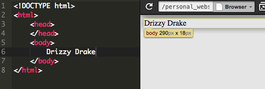

Notice that the blank line between the name and description isn't reflected on
the web page. Adding extra blank lines or spaces between words in HTML does will
not change what the website looks like.

To add spacing and other formatting, we need to use **HTML tags**.

### 7) Formatting the Heading with the Heading Tag

If we want `Drizzy Drake` to be a heading of the website, we can put it inside
of what's called a **heading tag**, like so:

```html
<h1>Drizzy Drake</h1>
```

**HTML tags**, like `h1`, tell the web browser how to interpret the text in
between the tags.

1. We can name look like a heading by surrounding it with an `h1` tag.

    > Note: In Cloud9, as soon as we write **`<h1>`**, it knows we eventually
    > want a **`</h1>`** and will add it for us. This is known as
    > **autocomplete**.

> 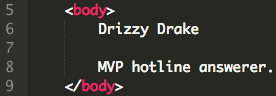

Similar to how `body` and `head` have both opening and closing tags, there are
two parts to the `h1` tag:

- **`<h1>`** is the **opening**  tag
- **`</h1>`** is the **closing** tag. Again, the difference is the **`/`**
  before the tag's name

Because the browser knows to interpret anything inside of an **`h1`** tag as a
heading, it makes the name big and bold.

### 5) Formatting the Description with a Paragraph Tag

Similarly to how we told the browser to treat **`Drizzy Drake`** as a header, I
want to tell the browser to treat **`MVP hotline answerer.`** as a paragraph.

1. Put the description inside of a **paragraph tag** like so:

```html
<p>MVP hotline answerer</p>
```

> 

Just like the **`h1`** tag, the **`p`** tag also has an opening and closing tag.

### 6) Adding An Image with the Image Tag

Now let's add a GIF to our website.

1. Open https://images.google.com in a new tab
2. Search for anything (ex. "kittens", "doge", "pepe")
3. Tell Google Images to only show GIFs (`Search tools > Type > Animated`)

     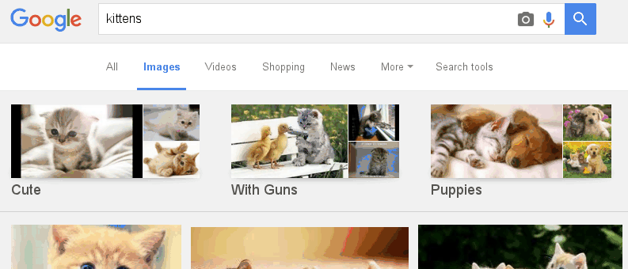

4. Click on an image once it loads, right click on it and select `Copy image
   address`

     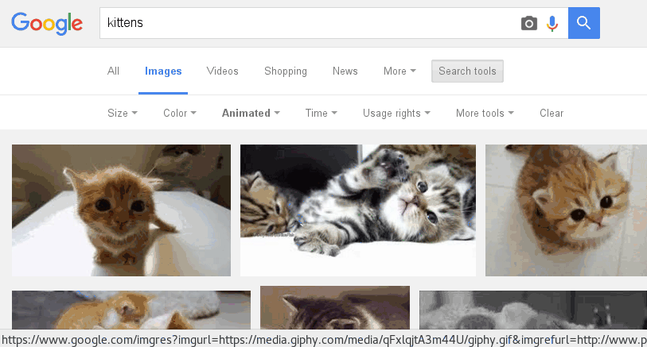

5. Insert this code for **image tag** just underneath of the **opening `body`
   tag**. Replace `IMAGE_LINK` with the link we just copied (hit `Ctrl+v` to
   paste, or `Command+v` if you're on a Mac)

  ```html
  
  ```

> 

> - **`img`** is the tag name
> - **`img`** is a **self closing tag**, meaning that there is no
>   closing tag (like **`</img>`**)
> - **`src`** is an  **attribute** of the image tag that specifies the URL of
>   the image. It stands for "source".

Hmm, our image may be too big or too small. Luckily we have this other language
called **CSS** that can help!

## Part IV: CSS

**HTML** is the **content** of a page (**words**, **images**, and **structure**).

**CSS** is the look and feel (**color**, **spacing**, and **size**).

> **CSS** stands for **Cascading Style Sheet** and is sometimes referred to just
> as a **style sheet** because it's a **"sheet"** that specifies all of the
> site's **"styles"**.

Therefore, if we want to change the **size** of the image, we use **CSS**!

### 1) Creating the CSS File

1. Right click the **`personal_website`** folder we had previously created
2. Click **"New File"**
3. Name the file **`styles.css`** (again, all lowercase)

> Note:
>
> - The **`.css` extension** tells the computer to interpret this as a `css`
>   file (just like `.html`)
> - This is called an **external style sheet** because the CSS file is
>   **external** to the HTML file (as in the stylesheet is not inside the HTML
>   file)

> 

### 2) Connecting the CSS to the HTML

Although we've created a CSS file, until we explicitly tell the HTML file to use
the CSS file, it will not use it. We have to explicitly **link** the CSS file in
the HTML.

To **link** the CSS file:

1. Type the code for the **link tag** (written below), into the **`head`**
   section of the code.

   ```html
   <link rel="stylesheet" href="styles.css">
   ```

> 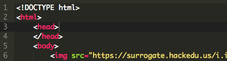

> Notes:
>
> - **`link`** is the tag name
> - **`link`** tags always belong in the **`head`** of the HTML document
> - **`link`** is a **self closing tag** like **`img`**
> - **`href`** is an **attribute** of the link tag and specifies the location of
>   the CSS file. It stands for **hypertext reference**
> - **`rel`** is an **attribute** that tells the browser to interpret the linked
>   file as a **stylesheet**

### 3) Using CSS to Resize the Image

Now that we linked our CSS file to our HTML file, let's write some CSS to resize
the image.

1. Double click **`styles.css`** to open it
2. Add the below CSS code to resize the image by typing the following code
   into the CSS file. Make sure to save after doing this. If nothing changed
   after saving, try refreshing the page.

    ```css
    img {
        width: 200px;
    }
    ```

Yay! Our image got resized!

> 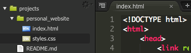

**Understanding the CSS More Deeply**

If we were to translate the code into English, this

```css
img {
    width: 200px;
}
```

 would say

- **Select** every **`img` tag** on this HTML page and set the **width** to be
  **`200px`**

> **`px`** stands for **pixels**. **Pixels** are the tiny dots that make up a
> computer screen. By setting the width to **200px**, we are saying we want
> every image on the page to span the length of 200 pixels (which is about 2
> inches on a screen). Google search
> ["What is a pixel?"](https://www.google.com/#q=what+is+a+pixel) to find out
> more.

### 4) Centering the Body

Now to center everything on the page:

1. Type the below CSS code underneath our previous CSS code. _Remember, don't
   copy and paste._

   ```css
   body {
       text-align: center;
   }
   ```
3. Save the file by clicking **"File"** → **"Save"** (or use the shortcut
   **CTRL + S / Command + S**)

> 

Now everything should be centered on the page.

#### Understanding More Deeply

If we were to translate the code into English, this

```css
body {
    text-align: center;
}
```

would say:

- **Select** every **`body` tag** on this HTML page and set the **alignment** of
  the **text** within the body tag to be **centered**

This centers everything on our page because all of the content in our HTML file
is written inside the body tag.

And because everything is in the **body** tag, everything is centered.

> Google search ["CSS text align"]
> (https://www.google.com/?gws_rd=ssl#q=css+text+align) to see what other
> alignment options are available besides **`center`**

### 5) Changing the Font

Finally let's change the font of the page. We'll change our page to `Arial`, but
feel free to use another (e.g., `Helvetica`, `Comic Sans`, or `Times New
Roman`).

Add another **CSS attribute** to the **`body` selector** so that the CSS for the
**`body`** looks like this:

  ```css
  body {
      text-align: center;
      font-family: "Arial";
  }
  ```

> 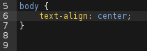
>
> Not all computers have the same fonts on them. To figure out what fonts most
> computers have on them, Google search
> ["web safe fonts"](https://www.google.com/#q=web+safe+fonts).

### 6) Celebrate!


W0000t! We've successfully added the CSS to this web page!

Now to share our creation with the world.

## Part V: Publishing

Right now we can only see our website on our own computer. Let's get a link that
we can share with anyone on the internet! We'll the previously mentioned GitHub
Pages to do this.

1. Open the terminal by pressing `alt + t` on the keyboard at the same time.
   Type in the following commands:
  - `git add --all`
  - `git commit -m "Initial commit"`
  - `git push`
2. GitHub will now ask for your username and password.
  - Go ahead and enter the username and press the enter.
  - Enter the password and press enter. _The characters won't show up on
    the screen, but rest assured, they are still being typed._
3. Now try to view the website by going to `USERNAME.github.io/personal_website`
   (make sure to replace `USERNAME` with our actual GitHub username)

#### 3) Celebrate!


Yes! Our website is now public on the internet!

## Part VI: Sharing with the Community

Now that we have finished building a website

1. In a new tab, open and follow [these directions][slack] to signup for our
   Slack.
2. Join your club's channel by asking your club leader for the name of the
   channel.
3. Post the link to your website in your club's channel.
4. Post the link to the
   [`#shipit`](https://starthackclub.slack.com/messages/shipit) channel to
   share it with everyone!

[slack]: ../../SLACK.md

## Part VII: Hacking

In this section, your challenge is to add additional features to your website to
make it your own!

A good way to get ideas for what to add to your website is to look at other
people's websites.

1. Find a website that you like, either from the below list or from somewhere
   else on the internet.
2. Decide on just one aspect of that website that you really like from their
   website that you want to try adding to your own website (maybe it's the fact
   that they have a background image, or the fact that they have music).

**Websites Made by Other Hack Club Hackers:**

- [Alyssa Sun](http://output.jsbin.com/fopoxe)
- [Rebecca Jourard](https://mnefertiti.github.io/personalwhale/)
- [John Cena's](http://nguyenbrian.github.io/john-cenas-personal-website/)
  (created by, Brian Nguyen)
- [Jevin Sidhu](http://jevinsidhu.com/)
- [Harrison Shoebridge](https://harrison.tech/zero-cool/)
- [Chaoyi Zha](https://cydrobolt.com/)

**Websites Made by Professionals:**

- [Alice Lee](http://byalicelee.com)
- [Yaron Schoen](http://yaronschoen.com)
- [Roxanne Ravago](http://www.roxanneravago.com)
- [Pushkar Modi](http://pushkarmodi.com)

### Additional Resources

Here are some additional resources that you can use to learn more about HTML &
CSS.

| Resource                                                                | Pros                                                                                   | Cons                                                                            |
| ----------------------------------------------------------------------- | -------------------------------------------------------------------------------------- | ------------------------------------------------------------------------------- |
| [HTML Dog](http://www.htmldog.com/guides/html/beginner/)                | Very beginner focused. If you're not sure which one of these to choose, pick this one. | Isn't too rich in content.                                                      |
| [Free Code Camp](http://www.freecodecamp.com/map)                       | Interactive and very methodical.                                                       | Not made for you to learn to make something that you want to show your friends. |
| [Team Tree House](https://teamtreehouse.com/library/html/introduction/) | Their videos are extremely comprehensive and thorough.                                  | It takes a _very_ long time to get through and are very passive.                |
