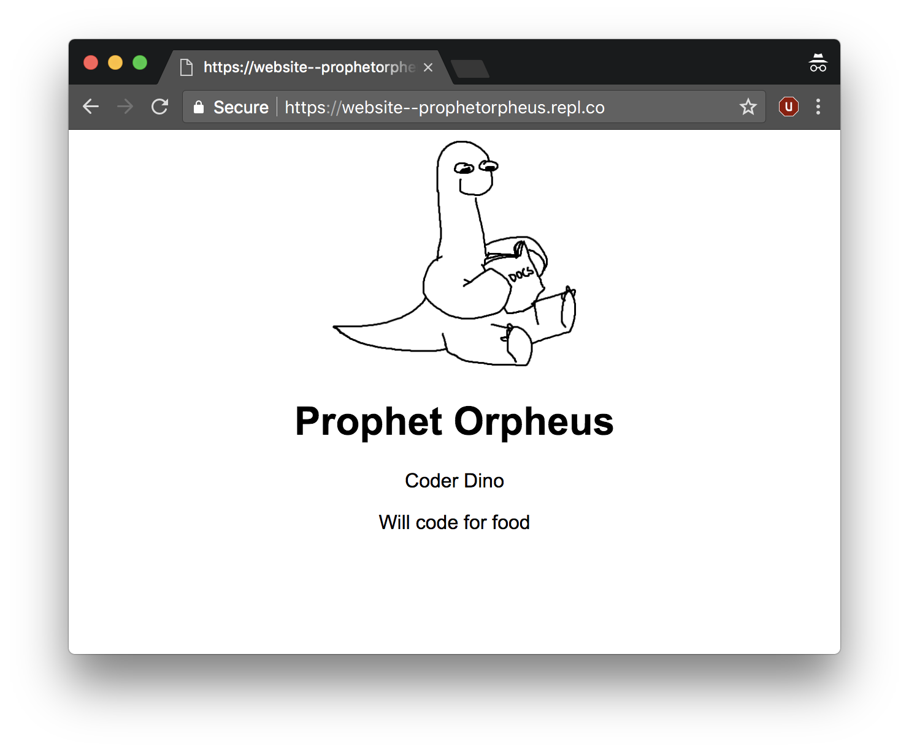

Profeta Orfeu, [nossa mascote](https://hackclub.com/workshops/orpheus), está aqui para guiá-lo a fazer seu próprio website pessoal.

Ele ficará parecido com este site:



Aqui está a [demonstração ao vivo][final_live_demo] e [código final][final_code] (veja `index.html` e `style.css`).

Este workshop deve levar cerca de 45 minutos.

[final_live_demo]:https://Website-Pessoal.hcbjcentro.repl.co
[final_code]:https://website-pessoal.hcbjcentro.repl.co/

## Parte I: Configuração

### Preparando-se para iniciar no Repl.it

O [Repl.it](https://repl.it) é um editor de código online. É similar ao Google Docs, mas tem algumas características importantes que o tornam muito melhor para digitação de código do que um editor de texto regular.

Para começar, vá para [https://repl.it/languages/html](https://repl.it/languages/html). 

Clique no botão "Sign Up" no canto superior direito.


Seu ambiente de codificação será gerado em apenas alguns segundos!


## Parte II: O arquivo HTML

### 1) O arquivo HTML

HTML significa Hypertext Markup Language (Linguagem de marcação de hipertexto). Todos os sites desde a Folha de São Paulo até a Twitch usam HTML para exibir conteúdo na web.

Você deve ter o arquivo `index.html` aberto, e um monte de texto com símbolos `<` & `>`. Isso é HTML!


O Repl.it nos dá algum código para começar, mas vamos começar do zero. Vá em frente e apague tudo no arquivo `index.html` e então **digite** o seguinte: 

```html
<!DOCTYPE html>
<html>
  <head></head>
  <body></body>
</html>
```
 **NÃO COPIE E COLE.**

Esta estrutura é comum a todas as páginas HTML. Na verdade, você pode dar uma olhada por si mesmo! Basta clicar com o botão direito em qualquer página da web, incluindo esta, e clicar em "Ver código fonte da página" (às vezes  "Inspecionar", dependendo do seu navegador) para ver o que está acontecendo nos bastidores. Você encontrará cada um destes elementos em cada página - o doctype, e uma tag HTML envolvida em torno de um head e um body.

<!-- Source https://developers.google.com/web/tools/chrome-devtools/inspect-styles/imgs/elements-panel.png -->


**Antes de prosseguir, vamos rever brevemente o que significa nosso template atual.**

O HTML funciona através do armazenamento de informações dentro das tags. O `<html></html>` é um exemplo de uma dessas tags. Dentro de `<html></html>`, colocamos dois outros conjuntos de tags: `<head></head>` (que envolve o "head") e `<body></body>` (que envolve o "body"). O body contém tudo o que você veria na aba/janela real quando você abre a página, enquanto o head transmite informações sobre a página para o navegador.

O `<!DOCTYPE html>` diz ao navegador qual versão do HTML deve esperar. Por ser uma linguagem, o HTML está em constante crescimento e atualização, portanto, há múltiplas versões. Em nosso caso, vamos utilizar o HTML5, a versão mais recente.

### 2) Pré-visualização da página

Vamos conferir como é o nosso arquivo HTML na visualização ao vivo! Para fazer isso, clique no botão **Run** acima do editor ou pressione <kbd>Ctrl</kbd> + <kbd>Enter</kbd> (<kbd>Command</kbd> + <kbd>Enter</kbd> em Mac).


A partir daí, a visualização ao vivo à direita do editor deve mostrar como está seu site. Se você quiser vê-lo em uma nova aba, a URL acima da pré-visualização do site é a URL ao vivo para o seu site


Você também pode abrir a visualização externa ao vivo clicando no ícone que se parece com uma caixa com uma seta. Isto abrirá a visualização ao vivo em uma nova aba na URL acima mencionada.


Como você pode ver, a página está em branco. Isto porque ainda não acrescentamos nada à seção `body`. Vamos adicionar conteúdo!

### 3) Adicionando texto ao body

Como mencionado anteriormente, todas as informações são envolvidas em tags. As tags são predefinidas na linguagem; pense nelas como as palavras em uma linguagem. Para texto, o HTML fornece um número de tags. Vamos utilizar duas das mais básicas: a tag h1 (`<h1>`) e a tag de parágrafo (`<p>`). A tag h1 é a primeira de uma série de tags de cabeçalho, com `h1` sendo a classificação mais alta, e `h6` sendo a classificação mais baixa. Assim como com as outras tags, você pode colocar informações dentro dessas tags envolvendo seu conteúdo com uma tag de abertura e fechamento.

Vá em frente e adicione seu nome em uma tag de cabeçalho, e sua descrição em uma tag de parágrafo, entre as tag de abertura (`<body>`) e fechamento (`</body>`). Aqui está o nome e a descrição da Profeta Orfeu:

```html
<!DOCTYPE html>
<html>
  <head>
  <body>
    <h1>Profeta Orfeu</h1>
    <p>Dino programadora</p>
  </body>
</html>
```

Se sua descrição foi alguns parágrafos, ou teve quebras de linha, você deve ter notado que um `<p></p>` não foi suficiente. Adicionar linhas ou espaços extra em branco entre palavras em HTML não altera o espaçamento do conteúdo. Podemos resolver isto colocando cada parágrafo em seu próprio `<p></p>`.

```html
<!DOCTYPE html>
<html>
  <head>
  <body>
    <h1>Profeta Orfeu</h1>
    <p>Dino programadora</p>
    <p>Vai programar por comida!</p>
  </body>
</html>
```

Execute seu `index.html` e veja a visualização ao vivo. Uhuul!

### 4) Adicionando imagens ao corpo

Primeiro, encontre uma imagem que você gostaria de incluir em sua página. Você pode encontrar algo no Google Imagens, Facebook, ou Imgur. Vamos precisar da URL de origem da imagem, então clique com o botão direito do mouse e selecione "Copiar endereço da imagem".

As imagens são incluídas no HTML por meio da tag de imagem ou ``. A tag de imagem possui um atributo chamado `src`, que conterá a URL _source_ da imagem que você deseja exibir. Por exemplo, se eu adicionasse esta foto do Profeta Orfeu, clicaria com o botão direito e obteria o URL de origem, que neste caso é https://github.com/hackclub/dinosaurs/raw/master/smart_dinosaur_docs.png , e coloque-o em uma tag de imagem desse jeito:

```html

```

Você deve ter notado que a tag de imagem não tem uma tag de fechamento como `<h1></h1>` ou `<body></body>`. Isso porque é um [elemento vazio](https://www.w3.org/TR/html-markup/syntax.html#syntax-elements), o que significa que não possui nenhum conteúdo.

Vá em frente e adicione isso ao seu `index.html` agora. Coloquei minha foto antes do header e meu código ficou assim:

```html
<!DOCTYPE html>
<html>
  <head> </head>
  <body>
    
    <h1>Profeta Orfeu</h1>
    <p>Dino programadora</p>
    <p>Vai programar por comida!</p>
  </body>
</html>
```


Lembre-se, você precisa dar **Run** em seu programa toda vez que quiser ver seu website atualizado.

Embora nosso website tenha um pouco de texto e exista na _internet_, ainda não terminamos. Nossa página na internet é totalmente funcional, mas precisa de um pouco de ajuda no departamento de "estilo". Não se preocupe. O CSS permitirá que você manipule o estilo de sua página para todas as suas necessidades.

## Parte III: O arquivo CSS

Então, o que é CSS? CSS, também conhecido como Cascading Style Sheets, é uma linguagem usada para estilizar as tags (ou "elementos") de uma página web.

Enquanto o HTML supervisiona o conteúdo e a forma como esse conteúdo é estruturado, o CSS especifica como você gostaria que seu conteúdo ficasse - com ele você pode definir coisas como cores, espaçamento, detalhes e muito mais.

### 1) Usando CSS

Já temos um `style.css` entre nossos arquivos. O CSS é chamado de folha de estilo externa porque o arquivo CSS é externo ao arquivo HTML (ou seja, a folha de estilo não está dentro do arquivo HTML).


Embora tenhamos um arquivo CSS, até dizermos explicitamente ao arquivo HTML para usar o arquivo CSS, ele não o utilizará. Devemos vincular explicitamente o arquivo CSS no HTML. Faremos isso digitando o seguinte no cabeçalho de `index.html` (entre `<head>` e `</head>`), porque o cabeçalho é onde dizemos as informações sobre a página para o navegador.

```html
<link rel="stylesheet" href="style.css" />
```
`<link />` é a tag de link, que descreve as relações entre o arquivo atual (neste caso, `index.html`), e algum arquivo externo (`style.css`). Em nosso exemplo, `rel="stylesheet"` especifica qual é esta relação, ou seja, que `style.css` é uma folha de estilo, e `href` (referência de hipertexto) especifica onde o arquivo pode ser encontrado (neste caso, é apenas o nome do arquivo `style.css`). A tag de link, semelhante à tag da imagem, é uma tag de auto-fechamento, mais uma vez denotada pelo `/` que precede o `>`.

Nosso arquivo HTML agora parecerá com isso:

```html
<!DOCTYPE html>
<html>
  <head>
    <link rel="stylesheet" href="style.css" />
  </head>
  <body>
    
    <h1>Profeta Orfeu</h1>
    <p>Dino programadora</p>
    <p>Vai programar por comida!</p>
  </body>
</html>
```
### 2) Adicionando Estilos com CSS

Agora que vinculamos nosso arquivo CSS ao nosso arquivo HTML, vamos escrever CSS para redimensionar a imagem.

Abra o `style.css` e digite o seguinte:

```css
img {
  width: 200px;
}
```
Uma folha de estilo CSS contém "regras", cada uma das quais consiste de um seletor, e atributos e valores dentro de chaves, conhecidos como "bloco de declaração".

Em nosso caso, o seletor é `img`. Isto apenas seleciona todas as tags de imagem (e, portanto, todas as imagens). A regra diz então para definir a `width` (largura) de todas as coisas selecionadas (no nosso caso, todas as imagens) para `200px`. O `px` refere-se aos pixels, que são uma unidade de medida na tela. Quando esta regra for aplicada, todas as imagens em nossa página terão uma largura de 200 pixels.

A seguir, vamos alinhar ao centro toda a seção do body.

Vamos adicionar

```css
body {
  text-align: center;
}
```
Assim como no redimensionamento da imagem, esta regra especifica que cada tag de `body` deve ter um atributo de `text-align` (alinhar texto) definido para `center` (centro). Isto centraliza tudo em nossa página porque todo o conteúdo de nosso arquivo HTML está escrito dentro da tag do corpo.

Agora vamos mudar a fonte do nosso texto. Vamos adicionar outro atributo, `font-family`, ao `body`, e definir o valor para `"Arial"`.Vai ficar desse jeito:

```css
body {
  text-align: center;
  font-family: 'Arial';
}
```
Você pode levar isso ainda mais longe, adicionando um pouco de cor à página! O atributo `color` permite definir a cor do texto, e `background-color` permite definir uma cor de fundo. Você pode encontrar uma lista de nomes de cores suportadas em [W3Schools](https://www.w3schools.com/colors/colors_names.asp). Tenha em mente que é uma boa ideia escolher uma combinação de cores para manter o texto legível.

```css
body {
  text-align: center;
  font-family: 'Arial';
  background: azure;
  color: purple;
}
```

Agora certifique-se de apertar **Run** para obter a versão mais recente de seu site. 

Ah, é realmente bonito de se ver.


## Parte IV: Publicação

Basta clicar no nome atual e depois em `name`.


Assim que estiver satisfeito com o nome que lhe deu, pressione <kbd>Enter</kbd> para confirmar suas alterações.

E assim seu site agora está publicado no domínio `NOMEDOPROJETO.NOMEDOUSUARIO.repl.co` na internet para todos os seus amigos verem!


## Parte V: Hackeando

Nesta seção, seu desafio é adicionar recursos adicionais ao seu website para torná-lo seu!

Deseja usar uma fonte diferente? Dê um Gooogle!

Deseja adicionar mais fotos? Dê um Google!

Deseja adicionar mais texto? Toda a sua história de vida? Imagem de fundo? Música de fundo? Vídeo? Mais páginas? Dê um Gooogle!

Uma boa maneira de obter ideias sobre o que adicionar ao seu site é olhar para os sites de outras pessoas. Encontre um website que você gosta, seja da lista abaixo ou de algum outro lugar na internet, escolha um aspecto desse website que você gostaria de ter em seu próprio website, e o Google para encontrar maneiras de fazer isso acontecer!

**Websites feitos por outros Hack Clubbers:**

- [Zeyu (Peter) Yao](https://cytronicoder.com)
- [Reese Armstrong](https://reeseric.ci)
- [Malte I. Lauterbach](https://patakh.com/)
- [Kognise](https://kognise.dev/)
- [Celeste](https://celeste.exposed/)
- [Leo McElroy](https://leomcelroy.com/)
- [Sarthak Mohanty](https://sarthakmohanty.me/)
- [Kat Huang](https://katmh.com)
- [Theo Bleier](https://tmb.sh/)
- [Megan Cui](https://megancui.com/)
- [Matthew Stanciu](https://matthewstanciu.me/)
- [Winston Iskandar](https://winstoniskandar.com)
- [Sophie Huang](https://sohuang.github.io/)
- [Jevin Sidhu](http://jevinsidhu.com/)
- [Sam Poder](http://sampoder.com/)
- [Faisal Sayed](https://fayd.me/)

**Websites feitos por Profissionais:**

- [Melody Starling](https://melody.dev/)
- [Eel Slap](http://eelslap.com)
- [Lynn Fisher](https://lynnandtonic.com)
- [Tatiana Mac](https://tatianamac.com)
- [Mina Markham](http://mina.codes/)
- [Robb Owen](https://robbowen.digital)
- [Alice Lee](http://byalicelee.com)
- [Yaron Schoen](http://yaronschoen.com)

### Recursos adicionais

Estes são alguns recursos adicionais que você pode usar para tornar seu site ainda melhor!

- [HTML Dog](http://www.htmldog.com/guides/html/beginner/): _Focado para iniciantes. Se você não tem certeza de qual escolher, escolha este aqui._
- [Free Code Camp](http://www.freecodecamp.com/map): _Interativo e bem metódico._
- [Treehouse](https://teamtreehouse.com/library/html/introduction/): _Os vídeos são extremamente abrangentes e completos._

## Parte VI: Compartilhando com a Comunidade

Agora que você terminou de construir um site, você deve compartilhar sua bela criação - porque seu site está na internet, você pode compartilhá-lo com qualquer pessoa que também esteja online! Lembre-se, é tão fácil quanto fornecer a URL!

Agora que você terminou de construir este maravilhoso projeto, compartilhe sua bela criação com outras pessoas! Lembre-se, é só mandar a URL do seu projeto!
