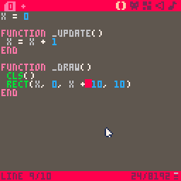

# Pico-8 Action Game

## Why Pico?
I consider Pico to be *the best* way to introduce newcomers to coding because of just how fun it is to code in it. Unlike traditional game engines, Pico manages to preserve a traditional coding feel while also streamlining the whole game development process: you still write legitimate Lua code and implement all game systems (like animation, physics, and scenes) yourself. This is good in the long run because that means that beginners get to actually code their games from scratch, rather than gluing together a bunch of pre-made elements. At the same time, however, Pico makes implement graphics, tilemaps, and even music a breeze by including all of those tools into the same package. This means that there's no more need in teaching beginners multiple pieces of software and how to make them work together, as everything is already there: for example, displaying a sprite from a spritesheet is as simple as `spr(0)`!

## Setup
This workshop requires a copy of [Pico-8](https://www.lexaloffle.com/pico-8.php), which unfortunately costs $15. The good news is that Pico is DRM-free, which means that you can share one license with your whole club.

It is also strongly recommended that you download this wonderful cheatsheet:


One common practice is to fullscreen it behind Pico, like so:


## Let's start!
Tired of complex workflows and high-definition graphics? Well, the Pico-8 fantasy console is here to help. Through the course of this workshop you will make [this](demos/final.html) action game. Along the way you'll learn how to use the Pico console along with the basics of Lua scripting.

<iframe src="demos/final.html" width="100%" height="700px">
  <image src="assets/final.gif">
</iframe>

A couple of basic pieces of information about Pico: there are three modes.

 * The console mode

   

   This is what you see on startup, and allows you to run a couple of basic commands. Don't worry too much about it for now.

 * The editor mode

   

   This is where you make your game. The editor has multiple tabs that give you access to various bits of functionality. **You can get to it by pressing `Esc` from the console mode.**
 * The game mode

   

   This is where you can test your game. **You can get to it by pressing `Ctrl-R`. To get back to the editor, press `Esc` twice.**

## Code, oh my
Before making the actual game, a bit of theory.


Every game has something called a gameloop, which is code that is called every frame. This gameloop is split into three parts: first, the game collects user input (is the right arrow pressed?). Then, the game updates some internal variables (move the player right). Finally, the game redraws the screen to reflect the new state.

In Pico-8, you can define that drawing phase by placing code in the following way:
```lua
function _draw()

 -- place code here!

end
```
Don't worry about what exactly is going on here, just understand that anything that goes in-between the `function` and `end` will be drawn onto the screen.

Side-not: in Pico, any line of code that begins with `--` is ignored, so it's useful for writing various comments about the code.

With that in mind, let's draw a rectangle.

```lua
function _draw()

 rect(0, 0, 10, 10)

end
```
`rect` is what is called a function: some code that can be run at any point. We can also pass information into functions, which is what we're doing in this example. Concretely, `rect` accepts 4 pieces of information (in this order):
 * x coordinate of top-left corner
 * y coordinate of top-left corner
 * x coordinate of bottom-right corner
 * y coordinate of bottom-right corner
This means that we're drawing a square with the top-left corner at `(0, 0)` and the bottom-right corner at `(10, 10)`.

  

When you actually execute this (`Ctrl-R`), you may notice two things: that the square is in a weird place and that there's junk on the screen. In order to solve the screen issue, you need to clear the screen by adding a `cls()` to the top of your `_draw` function.

```lua
function _draw()

 cls() -- this clears the screen
 rect(0, 0, 10, 10)

end
```
Now every frame will start from a blank screen.

The reason that the square is in the top-left corner is because coordinates actually work a little differently in Pico-8. As is drawn on the cheatshet, the y-axis  is actually flipped: this means that (0, 0) is actually the top-left corner. Remember this.


## Variables
Right now our "game" is a little boring, as the square isn't moving at all. The reason behind this is that we're always giving it the same coordinates. The solution? Variables.
Variables are essentially little boxes that allow you to store a value, like a number.
```lua
x = 3
```

Whenever Pico comes across a variable it replaces that variable with the value that is currently stored in it, so

```lua
x = 3
y = x -- y is now 3
```
turns into
```lua
x = 3
y = 3 -- y is now 3
```
Following the same principal, the following code will increment x by 1:
```lua
x = 3
x = x + 1 -- x is now 4
```
(turns into)
```lua
x = 3
x = 3 + 1 -- x is now 4
```
We can use this in our code by making an `x` variable and then changing it periodically.
```lua
x = 3

function _draw()
 cls()
 rect(x, 0, 10, 10)
end
```
Remember the game loop theory? Well, Pico provides another function for the update phase of the game-loop called `_update`. This function is run every loop before the `_draw` function, and so allows us to modify any variables we want. Let's modify the x variable so that the square moves to the right:
```lua
x = 0

function _update()
 x = x + 1 -- increment x by 1
end

function _draw()
 cls()
 rect(x, 0, 10, 10)
end
```


Notice that the square doesn't move as expected: the right side stays completely still! Remember that this is because the `rect` function takes in the two corners of the rectangle, so in this case we're only moving one of them. The fix for that is to move the other corner with the left one:

```lua
function _draw()
 cls()
 rect(x, 0, x + 10, 10)
end
```
Now, the right side of the square will always be 10 pixels in front of the left side.



## Values
A value is anything that you can place into a variable. The most basic type is a number. As you saw earlier, there are also several operations that result in numbers:
```lua
3 + 3 -- 6, addition
3 - 3 -- 0, subtraction
3 * 3 -- 9, multiplication
3 / 3 -- 1, division
3 ^ 3 -- 27, to the power of
```
Whenever Pico comes across one of these operations, it replaces the operation with its result, so `3 + 3` becomes `6`.

The other important type is a boolean, which is just `true` or `false`. There are also operations that result in booleans:
```lua
4 == 4 -- true, equal to
4 ~= 4 -- false, not equal to

4 < 4 -- false, less than
4 <= 4 -- true, less than or equal to
4 > 4 -- false, greater than
4 >= 4 -- true, greater than or equal to

true and false -- false
true or false -- true
``
We can combine these to form complex expressions, like

## User input
Before coding a solution to any problem, it's always way more useful to approach it from a high level. So here's a problem: how do we give the user the ability to control the square?
 * Well, we need to make it so that the square only moves when the user presses certain buttons.
 * We need to increment x when the user presses 'right' and decrement x when the user presses 'left'.
 * We need to modify the `_update` function so that it check if 'right' or 'left' were pressed and modifies x accordingly.
But how do we run some code only sometimes? Welcome the `if` statement.
```lua
if true then
 print(1)
end
```
If the boolean between the `if` and `then` is `true` then the up to `end` is run. Otherwise, Pico just skips the whole expression. This becomes very powerful when you combine it with the `btn` function, which returns a boolean depending on whether a button is pressed. We can consult the cheatsheet to find out more:

![asset
