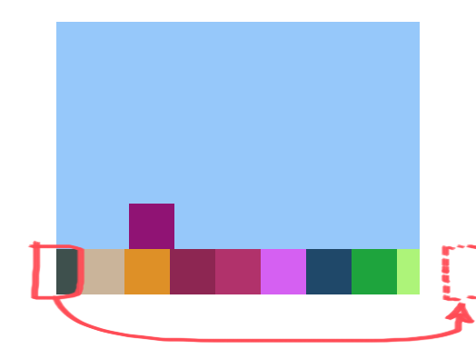
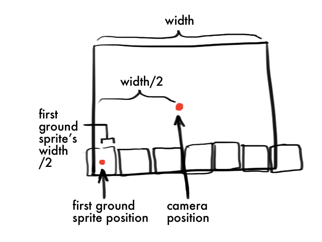

# Platformer

Short link to this workshop: https://workshops.hackclub.com/platformer/

Demo: [here](https://prophetorpheus.github.io/platformer/)

---

In this workshop we'll continue our foray into game development in p5.js by creating a simple platformer.

**Table of Contents**

- [Part I: Set-up](#part-i-set-up)
- [Part II: Building the World](#part-ii-building-the-world)
- [Part III: Creating the Player](#part-iii-creating-the-player)
- [Part IV: Adding Obstacles](#part-iv-adding-obstacles)
- [Part V: Ending Game](#part-v-ending-game)
- [Part VI: Keeping Score](#part-vi-keeping-score)
- [Part VII: Upgrading](#part-vii-upgrading)
- [Part VIII: Customizing](#part-viii-customizing)
- [Part IX: Publishing and Sharing](#part-ix-publishing-and-sharing)
- [Part X: Hacking](#part-x-hacking)

## Part I: Set-up

1. Open up `projects` workshop
2. Create new folder in `projects` folder, name it `platformer`
3. Create new `index.html` in `platformer`
4. Create new `game.js` in `platformer`

### Priming the HTML File

Type this basic template into the `index.html` file:

```html
<!DOCTYPE html>
<html>
  <head>
    <title>Platformer Game</title>
  </head>
  <body>
  </body>
</html>
```

Load in p5.js in script tag in **body**. Beneath that, load in p5.play.js in another script tag. Beneath both of those, load in our game file (`game.js`) in a third script tag.

```html
<body>
  <script type="text/javascript" src="https://cdnjs.cloudflare.com/ajax/libs/p5.js/0.4.23/p5.min.js"></script>
  <script type="text/javascript" src="https://cdn.rawgit.com/molleindustria/p5.play/master/lib/p5.play.js"></script>
  <script type="text/javascript" src="game.js"></script>
</body>
```

Then, save and open live preview.

### Priming the JavaScript File

Double-click `game.js` and add in the functions `setup()` and `draw()`:

```js
function setup() {
}

function draw() {
}
```

Save and refresh live preview.

## Part II: Building the World

### Setting the Stage

Call `createCanvas()` in `setup()`:

```js
createCanvas(400, 300);
```

Set the background to a light blue color `(150, 200, 250)`, in `setup()`, beneath `createCanvas()`:

```js
background(150, 200, 250);
```

We're going to be making a scrolling floor, so we need a series of sprites to illustrate the ground.

p5.play has a nice way to keep these organized, with [`Group`](http://p5play.molleindustria.org/docs/classes/Group.html). We can declare the variable at the top and define a new Group in `setup()`, like so:

```js
var groundSprites;

function setup() {
  createCanvas(400, 300);
  background(150, 200, 250);
  groundSprites = new Group();
}
```

Let's set the width of a ground sprite, so we know how many to lay across the canvas. I've decided to make each ground sprite have a width of 50 pixels. We can add this line right beneath our declaration of `groundSprites`:

```js
var groundSprites;
var GROUND_SPRITE_WIDTH = 50;
var GROUND_SPRITE_HEIGHT = 50;
```

I've added in the ground sprite height as well.

We can now determine and set the number of ground sprites in `setup()`:

```js
var groundSprites;
var GROUND_SPRITE_WIDTH = 50;
var GROUND_SPRITE_HEIGHT = 50;
var numGroundSprites;

function setup() {
  createCanvas(400, 300);
  background(150, 200, 250);
  groundSprites = new Group();

  numGroundSprites = width/GROUND_SPRITE_WIDTH;
}
```

And now we'll populate the empty `Group` we've created. The number of ground sprites we should create is `numGroundSprites`. Using a for-loop, we can keep track of how many times we'll be performing the actions of creating a new sprite and adding it to the Group.

```js
function setup() {
  createCanvas(400, 300);
  background(150, 200, 250);
  groundSprites = new Group();

  numGroundSprites = width/GROUND_SPRITE_WIDTH;
  for (var n = 0; n < numGroundSprites; n++) {
    var groundSprite = createSprite(n*50, height-25, GROUND_SPRITE_WIDTH, GROUND_SPRITE_HEIGHT);
    groundSprites.add(groundSprite);
  }
}
```

Don't forget to draw the sprites by calling `drawSprites()` in `draw()`:

```js
function draw() {
  drawSprites();
}
```

Not only are we leveraging our for-loop to perform a series of actions multiple times, we're also using it to set the x-position of each ground sprite, and having them line up along the bottom of the canvas.

Save and refresh live preview to see your beautiful ground!

You might notice there's a blank spot at the right edge of the ground. We could shift over our starting ground sprite, but since we want our ground to be scrolling, we'll just add in an extra ground sprite. We can generate an extra one by adding 1 to `numGroundSprites`. Now the for-loop will run one extra time, generating an extra ground sprite and adding it to the Group.

```js
numGroundSprites = width/GROUND_SPRITE_WIDTH + 1;
```

### Adding Gravity

Since our player will be jumping, we should introduce gravity to bring it back to the ground. We can define it at the top of the file, above `groundSprites`:

```js
var GRAVITY = 0.3;
```

The value is up to you. More gravity will mean that your player jumps get less height. Less gravity will mean higher jumps. We'll use this later.

That's it for our world. Next up, the player.

## Part III: Creating the Player

### Creating the Player Sprite

We'll be creating the player with `createSprite()`.

Declare the variable that will store the player sprite underneath our other global variables, at the top of the file.

```js
var numGroundSprites;

var player;
```

Let's make our sprite a 50x50 square for now. We'll give it an initial position of (100, height-75), putting it 75 pixels from the left edge of the screen, and 50 pixels above the bottom (remember that this accounts for half of the sprite's width and height), which sets it right on top of the ground. Type this line at the end of `setup()`:

```js
player = createSprite(100, height-75, 50, 50);
```

### Making our Player Move

Let's have the player move continuously by adding this line to `draw()`, before `drawSprites();`:

```js
player.position.x = player.position.x + 5;
```

Don't forget to redraw the background so the illusion is complete. Place the following line at the top of the `draw()` function:

```js
background(150, 200, 250);
```

Save and refresh live preview. Whoops! Your player disappears right off the screen!

### Using Camera to Track Player Movement

We can use the camera to follow the player's movement. p5.play offers the functionality of a camera, which is automatically created. We just reference it with `camera`.

Let's try setting the position of the camera to the position of the player. This will make the camera always follow the player. Add this line directly beneath the line that modifies player movement.

```js
camera.position.x = player.position.x;
```

Save and refresh to see the player in action!

### Adjusting Camera

Having the player at the center of the screen limits our visual of the obstacles.

We can adjust the camera x-position by setting it slightly ahead of the player, so that we get more screen real estate. Modify the previous line by adding to the camera x-position:

```js
camera.position.x = player.position.x + (width/4);
```

### Adjusting the Ground

What we'd like to do is modify the position of the first ground sprite so that it immediately follows the last ground sprite.



We can select the first ground sprite and store it in a variable by typing the following line in the `draw()` function. I put this logic beneath the line that sets camera x-position.

```js
var firstGroundSprite = groundSprites[0];
```

`[0]` refers to the sprite in the Group at [index 0](https://developer.mozilla.org/en-US/docs/Web/JavaScript/Reference/Global_Objects/Array).

Next, we'll check if it has moved off screen, by comparing its x-position with the left edge of the camera.

The x-position of the camera is `camera.position.x`. The x-position of the left edge of the camera is `camera.position.x - width/2`. Remember, the camera is at the middle of the screen.

We'll set up a conditional to check if the x-position of the ground sprite is less than that of the left edge of the camera.

We will put this conditional directly beneath the definition of the `firstGroundSprite` variable;

```js
var firstGroundSprite = groundSprites[0];
if (firstGroundSprite.position.x <= camera.position.x - (width/2)) {

}
```

If it is indeed off-screen, then we must remove it from its current index in Group, alter its x-position, and re-append it to the Group at the last index. It's important to note that we're removing it from the `groundSprites` Group, but not from our program.

It's like we're recycling the first ground sprite to be the last ground sprite by changing its position! We have to remove and re-add it so the "first" ground sprite in the Group is also the first ground sprite we see on screen.

```js
var firstGroundSprite = groundSprites[0];
if (firstGroundSprite.position.x <= camera.position.x - (width/2)) {
  groundSprites.remove(firstGroundSprite);
  firstGroundSprite.position.x = ??
  groundSprites.add(firstGroundSprite);
}
```

There's just one other thing: What do we set the x-position to? With a bit of arithmetic, we can figure out that the distance between its current x-position and position we'd like it to be is `numGroundSprites*firstGroundSprite.width`. So we should **add** that amount to its current position.

```js
var firstGroundSprite = groundSprites[0];
if (firstGroundSprite.position.x <= camera.position.x - (width/2)) {
  groundSprites.remove(firstGroundSprite);
  firstGroundSprite.position.x = firstGroundSprite.position.x + numGroundSprites*firstGroundSprite.width;
  groundSprites.add(firstGroundSprite);
}
```

Save and refresh live preview. Hm, does something look funny to you? Specifically, how the first ground sprite is just blipping off the left edge instead of smoothly sliding off?



This is an issue of not properly offsetting the sprite. Remember that the position of a sprite is at its center, so we must edit our conditional to include this offset. It should now read:

```js
if (firstGroundSprite.position.x <= camera.position.x - (width/2 + firstGroundSprite.width/2)) {
```

### Adding Player Controls

We'll define a certain strength our player can jump at the top of the file, underneath gravity:

```js
var JUMP = -5;
```

If you're wondering why this value is negative, remember that the y-axis on p5's coordinate system is flipped. Thus, higher numbers are further down, and smaller numbers are further up.

Let's have the up arrow control the jumping. Place this part in `draw()`, right above the line that modifies the player's x-position:

```js
if (keyDown(UP_ARROW)) {
}
```

p5.play has this handy function [`keyDown()`](http://p5play.molleindustria.org/docs/classes/p5.play.html#method-keyDown) that will check if the up arrow key was pressed.

To make the player jump, we'll modify its velocity in the y direction. p5.play has us covered, with this super straightforward `velocity` property, accessible by `player.velocity`. All we have to do is set it to `JUMP`. We'll do this within our conditional:

```js
if (keyDown(UP_ARROW)) {
  player.velocity.y = JUMP;
}
```

Save and refresh live preview, and give it a try by pressing your up arrow key!

Oops, looks like we never established gravity in our world! Place the following line within `draw()`, beneath `background(150, 200, 250)`:

```js
player.velocity.y = player.velocity.y + GRAVITY;
```

That should do it. The player will definitely come back down now. Save and refresh to check it out.

The player's going down, alright. In fact, it's going through the ground.

We'll have to place a restriction on this. That is, we want to check if the player intersects with the ground. If so, we'd like to set the player's y-velocity back to 0, and ensure that the player rests on the ground.

Add a conditional under the previous line, but before the conditional for jumping, like this:

```js
player.velocity.y = player.velocity.y + GRAVITY;

if (groundSprites.overlap(player)) {
  player.velocity.y = 0;
  player.position.y = (height-50) - (player.height/2);
}

if (keyDown(UP_ARROW)) {
  player.velocity.y = JUMP;
}
```

Here, we're checking if any sprites within the Group overlap with the player. If that does happen, then we stop moving the player downwards, and stabilize the player at ground-level.

## Part IV: Adding Obstacles

### Generating Obstacles

This isn't much of a game right now. All we can do is practice jumping.

Let's add some obstacles to jump over.

For this, we'll need to make another `Group`. Let's create one at the top, under our player declaration.

```js
var obstacleSprites;
```

Now we'll initialize it in `setup()`, in the same way we did `groundSprites`. Do this at the end of `setup()`, right after the creation of the player sprite:

```js
obstacleSprites = new Group();
```

Now that we've got somewhere to store the obstacles, we can start generating some within `draw()`.

We can set the x-coordinate as `camera.position.x + width` to ensure they're generated off-screen to the right. We'll have the obstacles sit on the ground, by giving each a y-coordinate of `(height-50)-15`. Finally, we'll set the height and width of each obstacle at 30 for now.

Let's type the following right above `drawSprites()`, inside `draw()`:

```js
var obstacle = createSprite(camera.position.x + width, (height-50) - 15, 30, 30);
```

Gah! Too many obstacles! Remember that the `draw()` function is called repeatedly, 60 times per second!

We can have randomized generation if we wrap the above line in a conditional. We'll use the [`random()`](https://p5js.org/reference/#/p5/random) function to generate a random number between 0 and 1, and create a new obstacle only if it's above 0.95. This means there's a 5% chance a new obstacle will be generated during every call of `draw()`.

Let's place the previous line into a conditional:

```js
if (random() > 0.95) {
  var obstacle = createSprite(camera.position.x + width, (height-50) - 15, 30, 30);
}
```

We'll also add the obstacle to our Group:

```js
if (random() > 0.95) {
  var obstacle = createSprite(camera.position.x + width, (height-50) - 15, 30, 30);
  obstacleSprites.add(obstacle);
}
```

And we'll set up some logic to remove from the program entirely when it goes off-screen, similar to how we created a check for the ground sprites.

Let's add this underneath the conditional for generation, like so:

```js
if (random() > 0.95) {
  var obstacle = createSprite(camera.position.x + width, (height-50) - 15, 30, 30);
  obstacleSprites.add(obstacle);
}

var firstObstacle = obstacleSprites[0];
if (firstObstacle.position.x <= camera.position.x - (width/2 + firstObstacle.width/2)) {
  removeSprite(firstObstacle);
}
```

First, we get the first sprite in `obstacleSprites`, and store it in a variable called `firstObstacle`. Then we check to see if it's disappeared off the screen (with offset of half the obstacle's width).

If it has, then we remove it from our program.

If you save and refresh live preview, you'll realize something seems to be wrong! Let's open up our external live preview and inspect. The error says `Uncaught TypeError: Cannot read property 'position' of undefined` 

This is because at the very beginning of the game, no obstacles have yet been generated! Our `obstacleSprites` is empty, and there are no obstacles to check the position of! To solve this, we must add the condition `obstacleSprites.length > 0` to our conditional:

Here we're saying "if `obstacleSprites` has more than 0 things, AND the right edge (offsetting!) of the first obstacle is less than the left-screen bound, then get rid of it."

Your modified conditional should now look like this:

```js
if (obstacleSprites.length > 0 && firstObstacle.position.x <= camera.position.x - (width/2 + firstObstacle.width/2)) {
  removeSprite(firstObstacle);
}
```

### Detecting Collisions

Great, we've got a good assortment of randomly generated obstacles. Let's add collisions!

We've used `.overlap()` with our `groundSprites` Group above, by providing just one argument. We also can use it on our `obstacleSprites` Group by providing two arguments, the thing to collide with, and a function to do something when there is a collision.

Add this to the `draw()` function, right before the call for `drawSprites()`:

```js
obstacleSprites.overlap(player, endGame);
```

In this line, we are handling a collision between any of the sprites in `obstacleSprites` and our player. When a collision happens, we'll run the `endGame` function (which we'll define next).

### Handling Collisions

At the bottom of `game.js`, below our `draw()` function, we can add our `endGame` function:

```js
function endGame() {

}
```

Let's use something called `console.log()` to create output in our console. If we add this to `endGame()`, we'll see "Game Over!" in our console in the Inspector.

```js
function endGame() {
  console.log("Game Over!");
}
```

Save and view your game in the external live preview. Check your console in the Inspector.

Great. Now that we've made sure that collisions get handled properly by this function, we can flesh out the game-over behavior a bit more.

## Part V: Ending Game

Similar to what we did in Dodge, we'll be splitting the `draw()` function into two modes: game over and game not over. Let's add a variable to keep track of this at the top of the file, and initialize it as `false` at the top of `setup()`.

```js
var isGameOver;

function setup() {
  isGameOver = false;
}
```

We'll add a line to set this flag to true within our `endGame()`, replacing the `console.log()`:

```js
function endGame() {
  isGameOver = true;
}
```

And we'll create the two modes now:

1. Add a conditional at the top for the game over mode

  ```js
  function draw() {
    if (isGameOver) {

    }

    background(150, 200, 250);

    ...
  }
  ```

2. Wrap the game logic we've written in `draw()` so far in `else { }`.

  ```js
  function draw() {
    if (isGameOver) {

    } else {
      background(150, 200, 250);

      ...
    }
  }
  ```

### Allowing Restart

We mustn't forget to flip the flag back to false, in order to restart the game. I'll tie my restart logic to a mouse click, by creating p5's `mouseClicked()` function beneath `endGame()`:

```js
function mouseClicked() {
  if (isGameOver) {
    isGameOver = false;
  }
}
```

### Resetting

To bring the game back to its original state, we have to perform the following actions before setting `isGameOver` back to false. Let's add all of this above `isGameOver = false` in our `mouseClicked()` function. We'll want to reset everything before we restart:

- reset the x-position of each ground sprite within `groundSprites`:

  ```js
  for (var n = 0; n < numGroundSprites; n++) {
    var groundSprite = groundSprites[n];
    groundSprite.position.x = n*50;
  }
  ```

- reset the player position back to its initial x and y coordinates

  ```js
  player.position.x = 100;
  player.position.y = height-75;
  ```

- clear the `obstacleSprites` Group by removing the existing obstacle sprites

  ```js
  obstacleSprites.removeSprites();
  ```

You should end up with a `mouseClicked()` function that looks like this:

```js
function mouseClicked() {
  if (isGameOver) {

    for (var n = 0; n < numGroundSprites; n++) {
      var groundSprite = groundSprites[n];
      groundSprite.position.x = n*50;
    }

    player.position.x = 100;
    player.position.y = height-75;

    obstacleSprites.removeSprites();

    isGameOver = false;
  }
}
```

### Fixing up our Game Over Screen

Let's create a Game Over screen, by telling `draw()` what should be drawn when `isGameOver` is true:

```js
function draw() {
  if (isGameOver) {
    background(0);
    fill(255);
    textAlign(CENTER);
    text("Game Over! Click anywhere to restart", camera.position.x, camera.position.y);
  } else {

    ...

  }
}
```

## Part VI: Keeping Score

### Keeping Track of Score

Let's add the scorekeeper now. First we'll need a variable to keep track of the score. Add it to the top of the file, right under `var isGameOver;`:

```js
var score;
```

And initialize it to 0 in `setup()`, beneath `isGameOver`:

```js
function setup() {
  isGameOver = false;
  score = 0;

  createCanvas(400, 300);
  background(150, 200, 250);

  ...
}
```

Now we'll increment the score in `draw()`. We'll just increment by 1 every time `draw()` is called. We can add this line beneath `drawSprites()`.

```js
score = score + 1;
```

Lastly, we'll need to reset our score to 0 in `mouseClicked()`. Place this line right before resetting `isGameOver`:

```js
score = 0;
```

### Displaying Score

Now we'll need to display the score during the game. We can use `text()` and position it relative to the camera. Type the following beneath the line that increments `score`, near the end of `draw()`, like this:

```js
score = score + 1;
textAlign(CENTER);
text(score, camera.position.x, 10);
```

Save and refresh. Your score should be proudly displayed now!

### Display Score in Game Over

Now, let's display the score after the game ends. We can add the value of `score` to text by **concatenating** the score onto our string with a `+`:

```js
"Your score was: " + score
```

Let's add this text to our Game Over screen by adding the following line above the "Game Over" text in `draw()`, like this. We'll offset it slightly in the y-direction to avoid overlap.

```js
text("Your score was: " + score, camera.position.x, camera.position.y - 20);
text("Game Over! Click anywhere to restart", camera.position.x, camera.position.y);
```

## Part VII: Upgrading

### Changing Y-Position of Obstacles

It's not too exciting right now since all of the obstacles are at the bottom. We can give them different y-coordinate values using our familiar friend, the `random()` function!

Find the line where we create obstacles and modify the argument we are passing in for the y-coordinate, like so:

```js
var obstacle = createSprite(camera.position.x + width, random(0, (height-50)-15), 30, 30);
```

## Part VIII: Customizing

It's time to add in our sprite images! This exercise is left to the user.

## Part IX: Publishing and Sharing

After making sure all files are saved, go to the terminal in Cloud9 and type the following git commands:

- `git add -A`
- `git commit -m "Add platformer game"`
- `git push`

Don't forget you'll need to input your username and password (hidden). After successfully pushing, your game will be live and playable on `USERNAME.github.io/platformer/`!!

Be sure to post your creation on the [`#shipit`](https://starthackclub.slack.com/messages/shipit/) channel on Slack!

## Part X: Hacking

- Create a Start Screen with a title card and instructions.
- Add jewels to collect for bonus points. Hint, it's just like obstacles, except instead of dying when you hit one, you gain a score boost.
- Change the terrain
- Modify the camera motion to be independent of the player. Instead of losing when you hit an obstacle, you lose when you get stuck and end up off-screen on the left.
