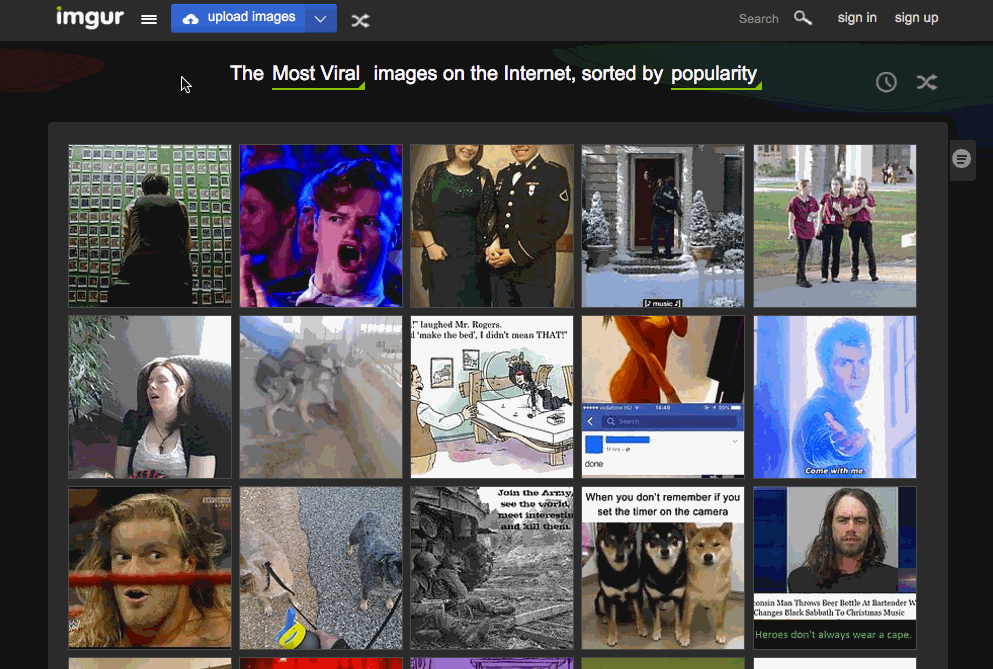
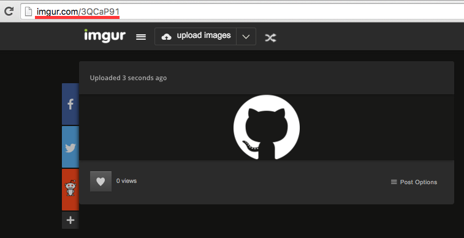
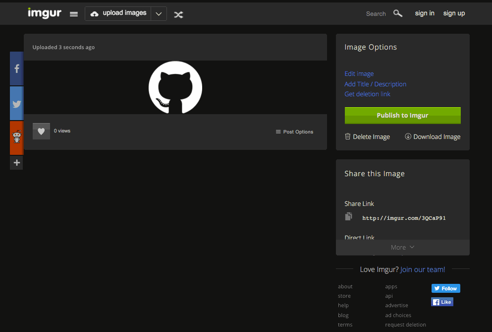

# Imgur

If you want to show your images in a web browser, they need to be able to be
accessed somewhere on the internet. Unfortunately, because your computer isn't
always and on we can't rely on it to always have that image.

Fortunately there are websites which exist to mitigate this problem. The one we
will use is called [Imgur](https://imgur.com). It is very popular and chances
are you have already accessed it through another website!

## Uploading an Image



## Including the Image on Your Page

When you are putting an image onto your website (using the `` tag, of
course) it is very important you use the *correct* link otherwise your browser
will get very confused.



This is the **wrong** link. Notice how it is the link of the webpage itself? If
we were to put this into an `` tags `src` setting, the browser would try
and embed the entire webpage. It would not succeed.

We can get the **correct** link from the "Direct Link" text field on the Imgur
page.



## Making it Appear on Your Page

Once you have this link you can use it in an `` tag just like any other
image. Here is an example, as a reminder.

```html

```
