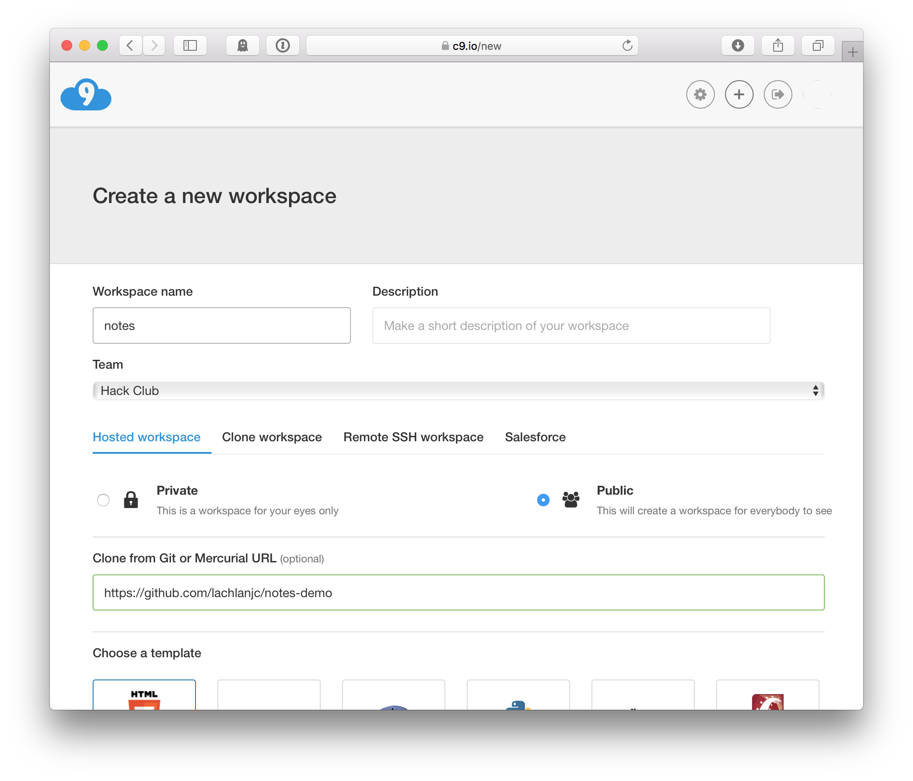
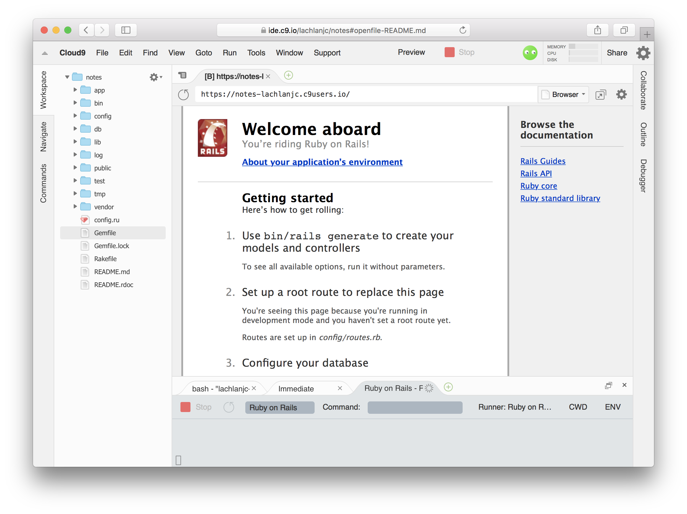
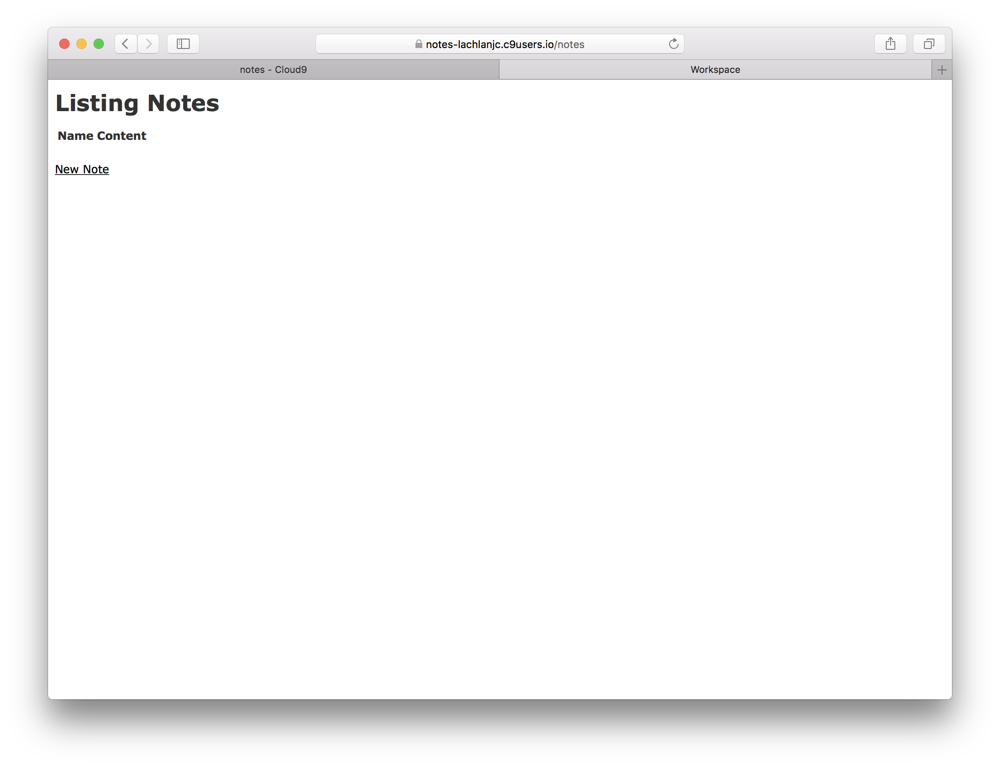
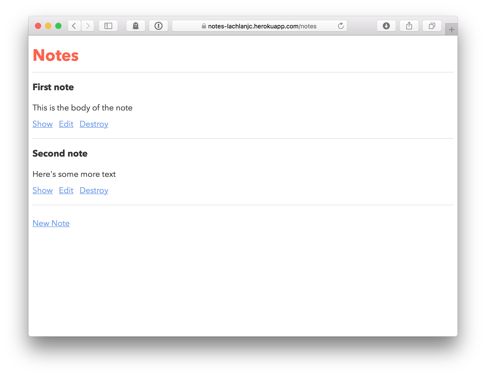

# Hack Club Workshop: Rails

So far we’ve been building one-off static webpages with HTML, CSS, and JavaScript. In this workshop, we’ll be building a real notes app!

See the [demo](https://notes-lachlanjc.herokuapp.com/) and the [final code](https://github.com/lachlanjc/notes-demo/tree/final).

We’re using a programming language called [Ruby](http://ruby-lang.org), and a framework for building web apps called [Ruby on Rails](http://rubyonrails.org). (A framework makes specific tasks with a programming language easier by including code you’ll need so you don’t have to write it.)

A few quick terms you should know before we get started:

- **Database:** a place for computers to store data with fast searching. There are many kinds of databases, such as MySQL, Redis, MongoDB, SQLite, and ElasticSearch. We’ll be using PostgreSQL in this workshop.
- **Backend:** the side of the website that runs on the server, saving data to the database and returning webpages.
- **Frontend:** the side of the website written in HTML, CSS, and JS that users interact with.
- **Request:** a visit to a specific URL.

At the end, we’ll **deploy** the app by uploading the code to a service called [Heroku](https://heroku.com), which runs servers for us without much configuration.

___

## Getting set up

1. Log in to [Cloud9](https://c9.io/).
2. Create a new workspace called `notes`, and clone from `https://github.com/lachlanjc/notes-demo`.



Cloud9 has now set up a development environment with Ruby and Rails already installed, and a new project set up!

Click *Run*, then *Preview* button to see your app so far:



Let’s quick set up Git as well. Click the `bash` tab, and commit the initial state of the app with these commands:

1. `git init`
2. `git add --all`
2. `git commit -m "Initial commit"`

___

## How Rails works

We’ll get to building in just a moment! First, a quick intro on Rails.

Rails runs on your server, sitting between incoming requests and your code. It’s what’s called **Model-View-Controller (MVC)** framework:

A **Model** is a structured piece of data. A site like Facebook might have models for `Post` and `Comment`. In this notes app, `Note` is the model. Models have attributes, such as `title` or `content`.

A **View** is the content of an actual webpage, like the HTML we’ve been writing. In Rails, your view files will not end with `.html`, but `.html.erb`. This is *embedded Ruby*: you can embed Ruby code in your webpage using special HTML tags:

```erb
<h1><%= note.name %></h1>
<div><%= note.content %></div>
```

A **Controller** connects *requests* (like for the `/notes` page) to your *view*, usually referencing a model. A Controller has (typically several) actions, which are different ways to interact with the `Note`. Here are the standard pages:

- **index** — like your `index.html` file. This page usually lists all/several items (like notes), from which you can tap to open one. URL: `/notes`
- **show** – a page for an individual item (like a note), shown in full detail. URL: `/notes/1`
- **new** – a page with a form for creating a new record. URL: `/notes/new`
- **edit** – a page for editing a specific record. URL: `/notes/1/edit`

That was a lot to take in! Don’t worry if you don’t understand it. Let’s write some code and you’ll see where all these pieces fit in.

___

## Start your app

We’re building an app for storing notes. We’ll need a `Note` model, the `NotesController` so we can see our notes in our browser, and views for our controller to render. That’s a lot to write, but Rails can help out!

Type this command in your console: `rails generate scaffold Note name:text content:text` and press <kbd>return</kbd>.

Wow! That’s a lot of things. What did we just do?

- We used a Rails “generator”, which creates and fills in a bunch of files so we don’t have to.
- We generated a “scaffold”, which includes a model, controller, views, and a few other things.
- We made a model called `Note` that has two attributes, `name` and `content`. Both of these attributes are of type `text` (you could also use `number`, `datetime`, etc).

Before seeing what Rails has put together, run another command: `rails db:migrate`. This will set up the `Note` model in the database.

Now click *Run Project*, *Preview*, and add `/notes` to the end of the URL! It should look like this:



Click on “New Note”, write in the boxes, and click “Create Note”. Your note has been saved in the database! Click “Back” and you’ll see it in your note list. Pretty cool, right? 😀 You can edit your note or destroy (delete) it, and add more notes.

This isn’t required, but poke around and read some of the files Rails wrote for you. What’s in your model (`app/models/note.rb`)? What about your controller (`app/controllers/notes_controller.rb`)? The views (`app/views/notes/index.html.erb`, `app/views/notes/show.html.erb`)? Read some of the code, and don’t worry if you can’t yet understand it all.

___

## Customizing your app

While our Notes app has some good functionality, it’s not very fun to use. Let’s customize it! Here are a few things you can easily change—it’s all up to you.

- **Root page.** Open `config/routes.rb` and add a root url, like this:

```rb
Rails.application.routes.draw do
  root 'notes#index'
  resources :notes
end
```
- **The page title.** You may have noticed your views aren’t complete HTML files: they’re just what goes inside the `<body>…</body>` HTML. There’s a template for this at `app/views/layouts/application.html.erb`. Try changing what’s inside `<title>…</title>` on line 4! When your refresh the page, you’ll see the new title.
- **The notification messages.** After creating a new note, saving changes to a note, or deleting a note, a message notifies the user they were successful. Open `app/controllers/notes_controller.rb` and change the text inside the quotes like `notice: 'Note was…'` text. Next time you create/change/delete a note, you’ll see your new message.
- **Styling!** You already have some experience writing CSS! Open up `app/assets/stylesheets/scaffolds.scss` and make some changes. On lines 19-21 you’ll find the CSS setting the color of links (HTML `<a>` tags). Change `#000` to your favorite color, like `cornflowerblue` or `tomato`.



When you’re done, commit to Git.

1. `git add --all`
2. `git commit -am “Add notes”`

___

## Deploying

1. Create an account on [Heroku](https://heroku.com), a service for deploying apps.
2. We’ll need to install Heroku’s tools on our command line.
	1. `sudo add-apt-repository "deb https://cli-assets.heroku.com/branches/stable/apt ./"`
	2. `curl -L https://cli-assets.heroku.com/apt/release.key | sudo apt-key add -`
	3. `sudo apt-get update && sudo apt-get install heroku —yes`
3. Log in to your Heroku account: `heroku login`
4. Create a new Heroku app: `heroku create` (or, if you want to use a custom name, `heroku create notes-MYNAME`)
	1. Copy the URL there. When we deploy, your app will be there.
5. Deploy! `git push heroku master`
6. Run the database migration: `heroku run rails db:migrate`

Now, open the URL you copied in a new tab. Your app is live!

Go ahead and show it off on [Slack](https://hackclub.slack.com)’s `#shipit` channel 🙂