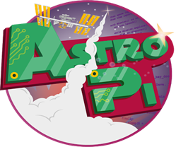
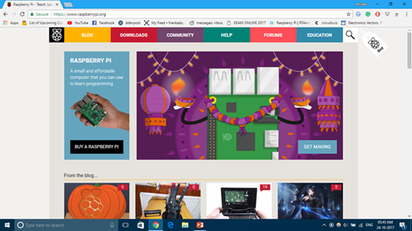
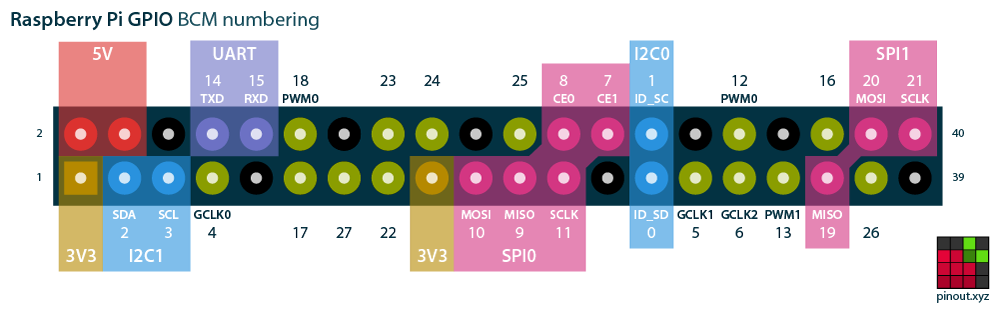

# Introduction to Raspberry Pi

> Credit card sized super cool mini PC

## What is Raspberry Pi?

Raspberry Pi is an extremely sleek and tiny computer. It is about the size of a normal credit card and runs on Linux based operating system. This board can be thought of as a miniaturized version of the motherboard in your CPU. It might not offer the same powerful processing capabilities as a normal PC, but it gets the job done.

The Raspberry Pi is a full computer. It has a processor, graphics processor, and memory, just like a normal computer or laptop – it’s just a lot smaller. The Raspberry Pi can be used in any situation a computer could be used. This can be as simple as being used as your desktop computer. Other people use them as mini servers in their house, as media computers for their TV, or as tiny computers to power their fun projects. It could be the brains of a robot, control a vegetable garden, or even just blink a light. The Raspberry Pi can be manipulated to control and read electronic components using its GPIO pins by using python programming. The possibilities with Raspberry Pi are limited only by your imagination.

Just like how you need to hook up your CPU to a monitor, keyboard, mouse, and LAN. The Raspberry Pi also offers USB ports for interfacing keyboard and mouse, an HDMI (High Definition Multimedia Interface) port to connect a monitor/TV, 3.5mm audio jack with composite video output for using with old RCA television, Camera connector, display connector and an Ethernet port to gain internet access. It also has inbuilt WiFi and Bluetooth.

The Raspberry Pi is powered by a 5v power supply. Just like you have a hard disk on normal computers, the raspberry pi uses an SD card that acts as the hard disk. The OS is loaded onto the SD card and plugged into the board. You can use various memory capacity SD cards: 8GB, 16GB, 32GB, etc.

Main attraction of Raspberry Pi compared to our normal PC is the availability of 40 GPIO pins.

## Story of Raspberry Pi

The Raspberry Pi came alive when the Raspberry Pi foundation based in UK thought of launching a cheap single-board computer to promote the learning of computer science in schools. But it became so popular that the Raspberry Pi was adopted by hobbyists and engineers. Raspberry Pi’s are often used to prototype IoT devices, entertainment equipment’s and robotics. One of the main reason for the growth of the Raspberry Pi, is its community support and resources.

As of now the Raspberry Pi foundation has sold more than 11 million Pi’s. Even the International Space Station have two Raspberry Pi's :)

# Specification and other details

There are different versions of the Raspberry Pi available. Some of the are:

1. Raspberry Pi 3 (Model B)
1. Raspberry Pi Zero W
1. Raspberry Pi 2 (Model B)
1. Raspberry Pi model A+
1. Raspberry Pi Model B+

Some of the main stream Raspberry Pi now available are the Raspberry Pi 3 and Pi Zero W. Raspberry Pi 3 is the powerful version of Raspberry Pi, offering a quad core processor, four USB ports, WiFi, Bluetooth and other features.

## Raspberry Pi 3 specs

**Processor:** 1.2GHz quad-core ARM processor

**Memory:** 1GB Networking: Ethernet, wireless

**Connectivity:** HDMI out, analogue audio/video out (3.5 mm headphone hack), Bluetooth 4.1, 4× USB 2.0 in, micro USB power, 40-pin GPIO, Camera Module port (CSI), Display Module port (DSI), micro SD card slot

**Dimensions:** 86 × 56 × 17 mm

**Weight:** 45 g

## Pi Zero W specs:

**Processor:** 1GHz single-core ARM processor

**Memory:** 512MB

**Networking:** Wireless

**Connectivity:** Mini HDMI out, Bluetooth 4.1, micro USB in, micro USB power, 40-pin GPIO, Camera Module port (CSI), micro SD card slot

**Dimensions:** 65 × 30 × 5 mm

**Weight:** 9 g

# Raspberry Pi Operating Systems

Raspberry Pi supports a wide variety of Linux based Operating systems like Raspbian, Kodi, Ubuntu MATE, LibreELEC, also an IoT version of Windows 10 known as Windows 10 IoT Core and some unofficial third party operating systems like Kali Linux, RTAndroid, Flint OS, RetroPie.

Officially supported operating systems can be downloaded from [https://raspberrypi.org](https://www.raspberrypi.org).

## Raspberry Pi GPIO pinout

> Credits: [https://pinout.xyz](https://pinout.xyz)

For more information visit the [official site](https://www.raspberrypi.org) of Raspberry Pi. They have lot of resources and materials to get you started 😊
