# Remote viewing with VNC on Raspberry Pi

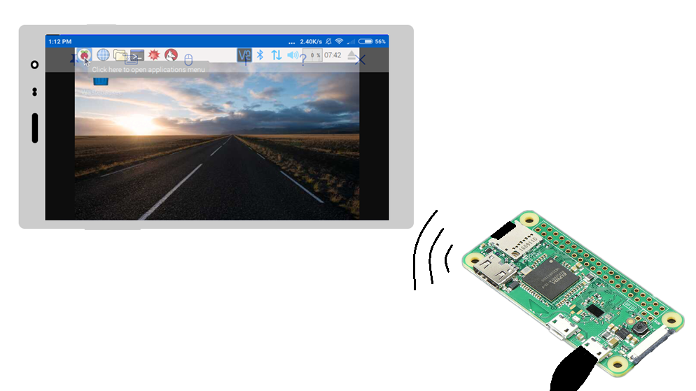

While building a project with Raspberry Pi, a monitor may not always be accessible for you. For this reason, we often connect to our Pi remotely from our computers. It allows you to view or control your Raspbian desktop (or other distributions that you have installed on your Pi) on a PC or smartphone that is connected to the internet.

## Setting Up a VNC server on Raspberry Pi

- Raspberry Pi setup with monitor, keyboard & mouse
- A PC or smartphone connected to the internet
- [RealVNC](https://www.realvnc.com/en/) for PC/smartphone (or alternatives with the same functionality)

Open "Terminal" (usually located on the task bar of Raspbian) and enter the following command:

```bash
sudo apt-get update
```


This command makes sure Raspbian and pieces of software installed are up to date. Wait until the command finishes executing.

After it is done, enter the command below.

```bash
sudo raspi-config
```

This command opens this configuration window in the terminal.

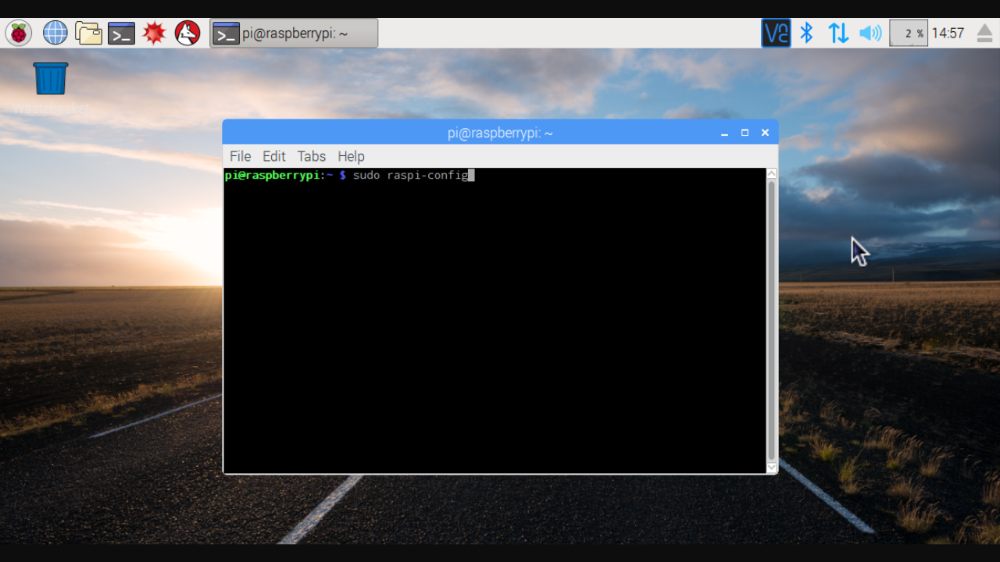

Next, make sure that you have the latest version of VNC Connect by running the following command:

```bash
sudo apt-get install realvnc-vnc-server realvnc-vnc-viewer
```

This command installs the latest version of `realvnc-vnc-server` and `realvnc-vnc-viewer` on your Pi.

You have now installed the required software. However, VNC Server is not enabled by default on your Pi for security concerns. Therefore, you need to enable the VNC Server by completing the following steps:

- Navigate to Interfacing Options.

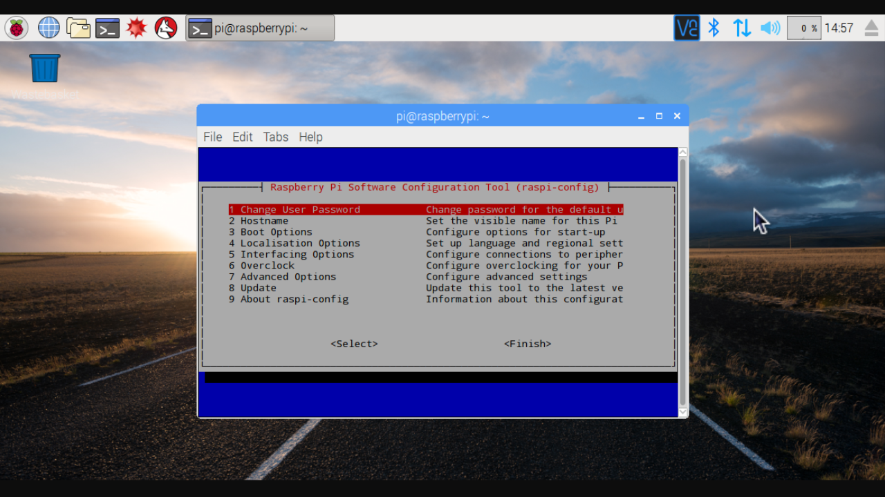

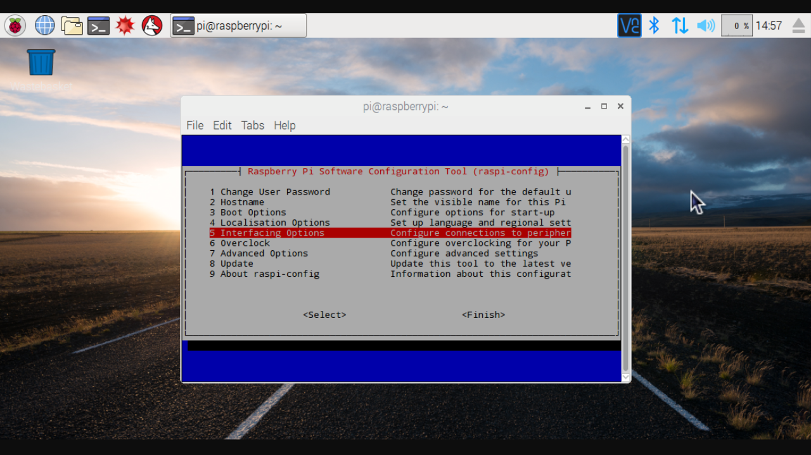

- Scroll down and select VNC > Yes, and select "finish" when done.

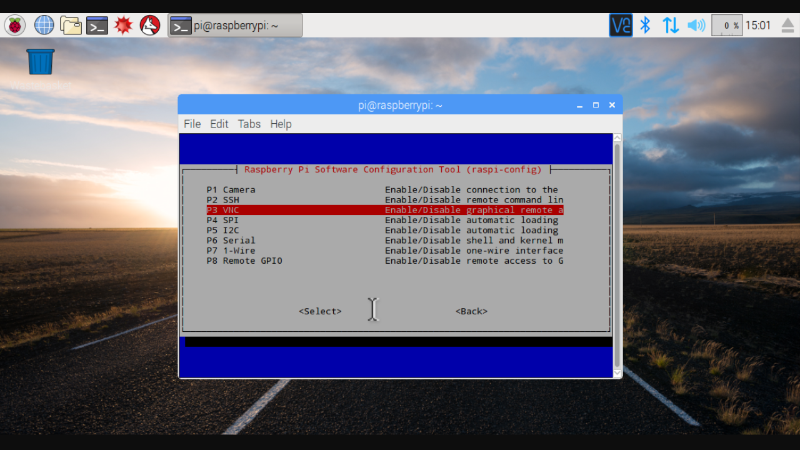

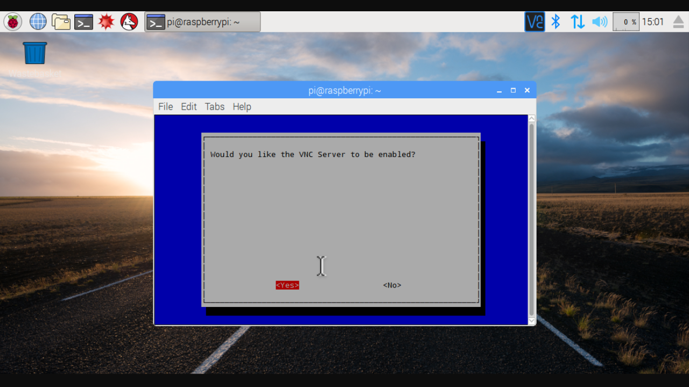

That's it! You have enabled the VNC server on your Pi.

## Find the IP address of your Pi

To connect to your Pi, you need to first find its IP address.

An Internet Protocol, or IP, is a set of rules that govern Internet activity and facilitate completion of a variety of actions on the World Wide Web. Therefore, an Internet Protocol address, or IP address, is basically your address on the world wide web.

Before we find the IP address, please make sure your ethernet cable is properly connected. If you would like to connect your Pi to a wireless network, please follow [this guide](https://www.raspberrypi.org/documentation/configuration/wireless/wireless-cli.md) from the Raspberry Pi documentation as it might require additional purchases of hardware as well as steps to set it up.

To get the IP address of your Pi, fire up the terminal just as we did in the last step, and execute the following command:

```bash
ifconfig
```

Your terminal window will now look something like this:

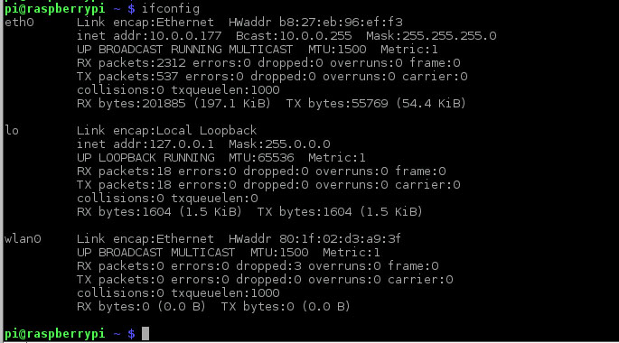

Next to the `eth0` entry you will see `inet addr`: `10.0.0.177` which is the IP address of the Raspberry Pi. Keep in mind that your IP address may be different.

Remember! If your IP address starts with `192.168.` or `10.0.`, it's an internal address - that means you can get OUT to the Internet but you cannot have someone outside your home or network reach your Pi via the IP address. This is important if you want to have a webserver running on a Pi that outside people can reach. In general, its much safer to keep your Pi on an internal network.

## Setting up VNC viewer on a PC/smartphone

Install the VNC app from [Google Play](https://play.google.com/store/apps/details?id=com.realvnc.viewer.android&hl=en). If you are using If you are using your PC, go to [this website](https://www.realvnc.com/en/connect/download/viewer/) to download VNC viewer.

We have provided a general example of the steps performed to connect from an Android device using RealVNC Viewer. Steps on other software or operating systems may be different, but they will ask for the same set of information.

_Note: Your PC/smartphone needs to be on the same network that you Pi is connected to._

1. Open the VNC app and click the **+** icon. Type in the IP address of your Pi.

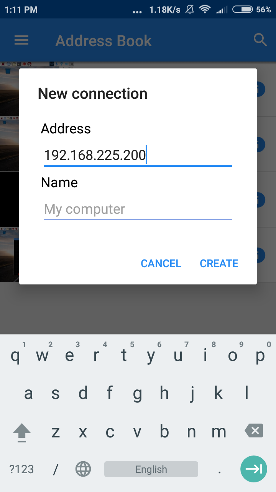

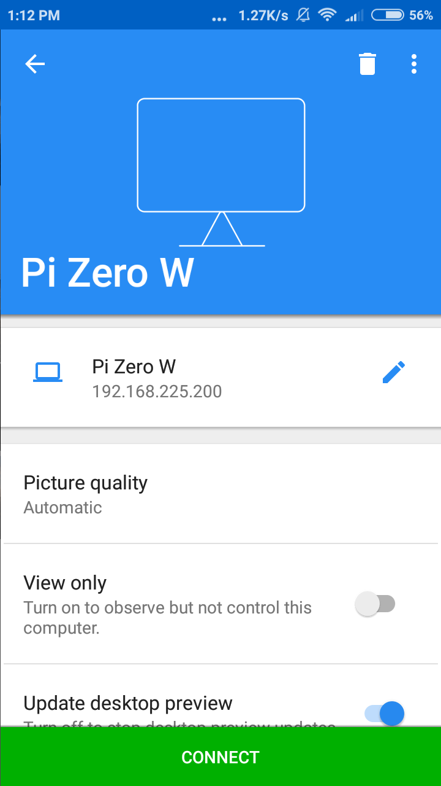

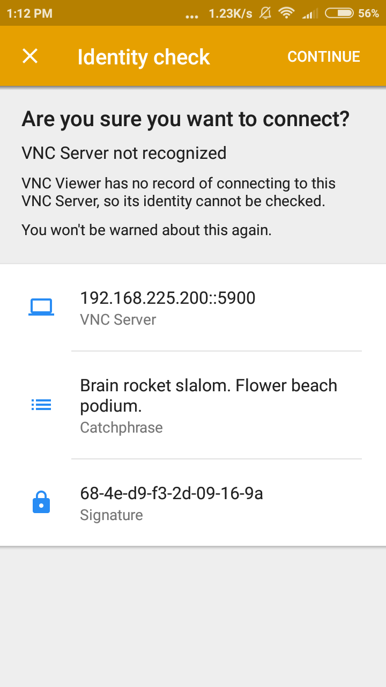


2. Click connect, and you will be prompted to confirm your connection. After confirming, simply enter your identity to log into your Pi.

The default identity for your Pi is

Username: `pi`

Password: `raspberry`

Then click "Continue".

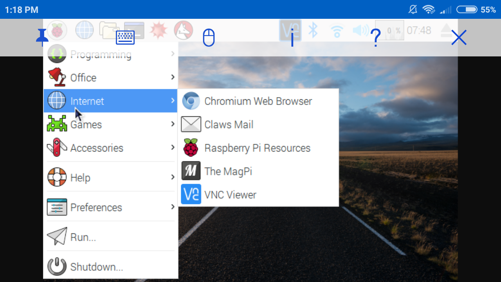

You will be welcomed with the fascinating UI of Raspbian.

That's it! Time to explore your Pi from your own device!
