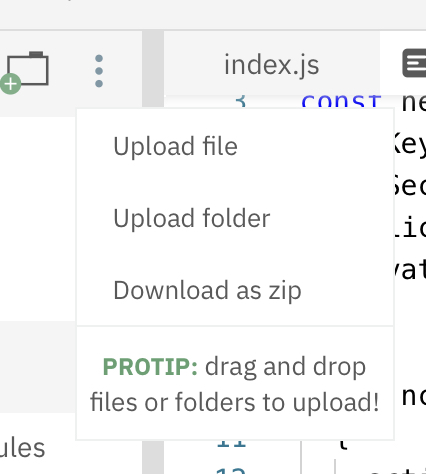

**This workshop requires advance preparation by a club leader. If you are a club leader, [click here]() to view the preparation steps.**

[](https://www.youtube.com/watch?v=dQw4w9WgXcQ)

Rickrolling has been around since the early days of the Internet. But have you ever wanted to take rickrolling to the next level, into the real world? That’s what you’re going to do today. In this workshop, you’re going to build a Node.js web app.js that calls your phone and rickrolls you.

## Getting started
Nexmo is a service that provides easy-to-use phone APIs—SMS, voice, etc. If you’ve ever heard of Twilio, it’s a lot like that. We’re going to use the Nexmo Voice API to place a call and play an audio stream.

Start a new Node.js project on repl.it by vising [repl.it/languages/nodejs](https://repl.it/languages/nodejs).
 
The first thing we need to do is authenticate with the Nexmo API. Your club leader should have created an account for your club and generated an API key, API secret, Application ID, and a private key stored as a file.

In order to make sensitive details private, we use environment variables. Environment variables are essentially “secret” variables: the server knows what they are, but they’re not in the code for anyone to see. Environment variables are stored in a `.env` file. If you create a `.env` file on repl.it, that file will only be visible to you. When you want to refer to an environment variable in your code, you use `process.env.ENV_VARIABLE_NAME`.

Let’s create a `.env` file and storing the keys we need to authenticate with Nexmo. Once you’ve created a new `.env.` file, get the API key, API secret, and Application ID from your club leader and add them to the file:

```
API_KEY=aPIkEyFrOmYouRcLuBLeaDEr
API_SECRET=aPisECReTfROmyOURcluBLeAdER
APP_ID=application-id-from-your-club-leader
```

Now, let’s navigate back to `index.js` and set up Nexmo. The first step is to import the Nexmo npm package:

```js
const Nexmo = require(‘nexmo’)
```

Next, let’s authenticate with Nexmo:

```js
const nexmo = new Nexmo({
  apiKey: process.env.API_KEY,
  apiSecret: process.env.API_SECRET,
  applicationId: process.env.APP_ID,
  privateKey: 'private.key',
})
```

Instead of offering a private key in plain text, Nexmo saves generated private keys in a file called `private.key` that you have to upload manually to the server your app is being hosted on. Obtain the `private.key` file from your club leader and download it to your computer. Then, upload the file to repl.it by clicking on the three dots at the top left of your screen and clicking “Upload file”.



Once your `private.key` file is uploaded, you’re all set to start making calls!

## Making a call
Interaction with the Nexmo Voice API happens via Nexmo Call Control Objects (NCCOs). NCCOs exist as [JSON arrays](https://www.w3schools.com/js/js_json_arrays.asp), so you can include one action, or you can chain actions together to create an interactive flow in your call. Check out the [full list of NCCOs in Nexmo’s documentation](https://developer.nexmo.com/voice/voice-api/ncco-reference).

For now, all we want is a single `stream` NCCO to play a stream of audio from an mp3 file. In Nexmo, this looks like:

```json
[
  {
    "action": "stream",
    "streamUrl": ["https://acme.com/streams/music.mp3"]
  }
]
```

The `streamUrl` is also stored as an array, which means you can either pass in one URL, or you can chain URLs together to play synchronously. Note that you must pass in a link to an mp3 file online; you can’t upload your own mp3 file and link to the local file.

Let’s create a NCCO in our project. At the end of the `index.js` file, add:

```js
const ncco = [
  {
    action: "stream",
    streamUrl: [""]
  }
]
```

Finally, let’s pass in a link to Never Gonna Give You Up:

```js
const ncco = [
  {
    action: "stream",
    streamUrl: ["https://raw.githubusercontent.com/hackclub/hackclub/rick-roll/workshops/rick_roll/never-gonna-give-you-up.mp3"]
  }
]
```

Awesome! Now that we’ve given Nexmo instructions for a call, it’s time to place a call.

Nexmo calls are created via `nexmo.calls.create`. Here’s what creating a call with Nexmo looks like:

```js
nexmo.calls.create(
  {
    to: [{ type: 'phone', number: 'PHONE_NUMBER' }],
    from: { type: 'phone', number: 'NEXMO_PHONE_NUMBER' },
    ncco,
  }
)
```

We’re ready to rickroll! Add the above code block at the bottom of your `index.js` file. Replace `PHONE_NUMBER` with your phone number and `NEXMO_PHONE_NUMBER` with the number your club leader provides you with.

Your entire `script.js` file should now look like this:

```js
const Nexmo = require('nexmo')

const nexmo = new Nexmo({
  apiKey: process.env.API_KEY,
  apiSecret: process.env.API_SECRET,
  applicationId: process.env.APP_ID,
  privateKey: 'private.key',
})

const ncco = [
  {
    action: "stream",
    streamUrl: ["https://raw.githubusercontent.com/hackclub/hackclub/rick-roll/workshops/rick_roll/never-gonna-give-you-up.mp3"]
  }
]

nexmo.calls.create(
  {
    to: [{ type: 'phone', number: 'PHONE_NUMBER' }],
    from: { type: 'phone', number: 'NEXMO_PHONE_NUMBER' },
    ncco,
  }
)
```

When you run your repl, you should receive a call from Nexmo, and Never Gonna Give You Up should start playing!

## Hacking
Rickrolling yourself is just the beginning. Take a look at [Nexmo’s documentation](https://developer.nexmo.com/documentation) to see all of the different APIs they offer. You can chain multiple audio streams together, program an entire conversation, chain multiple events together based on user input, and the list goes on. Now is your time to get wild and push the limits of interacting with phones.