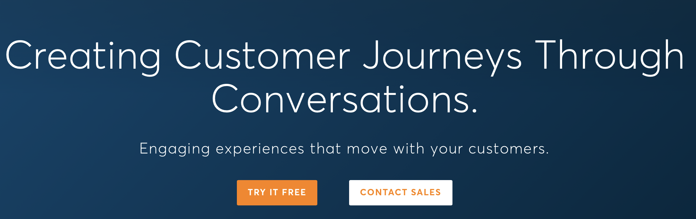
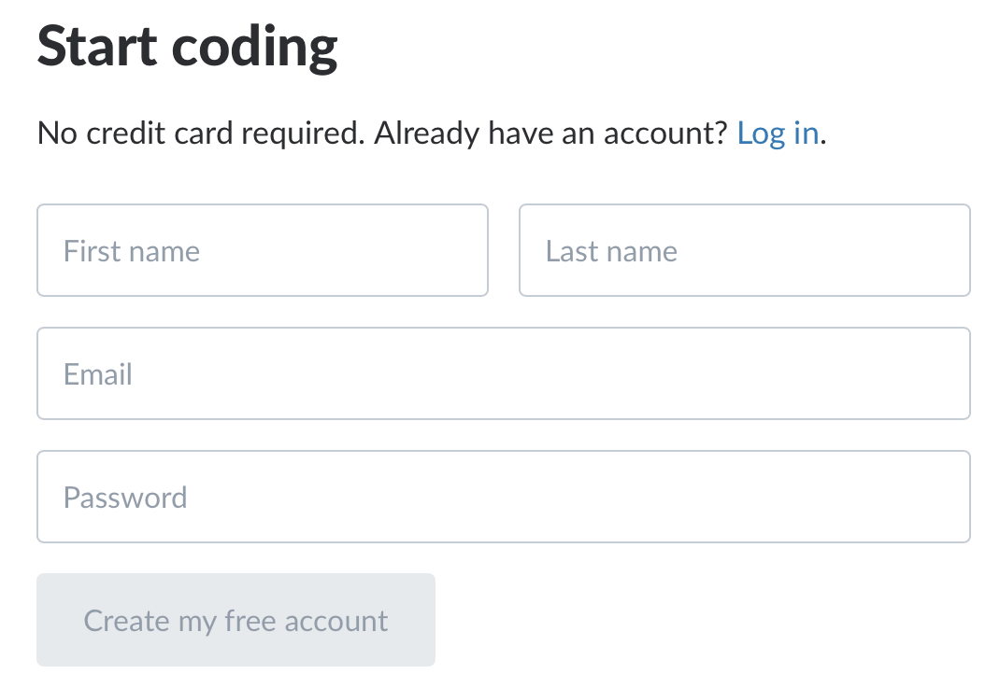
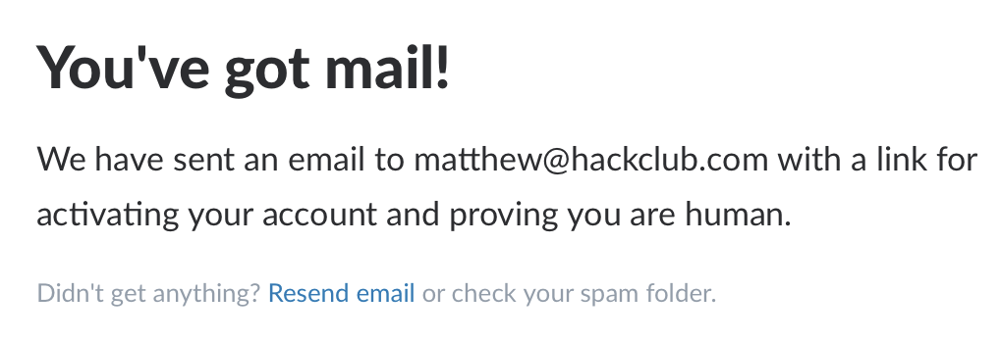
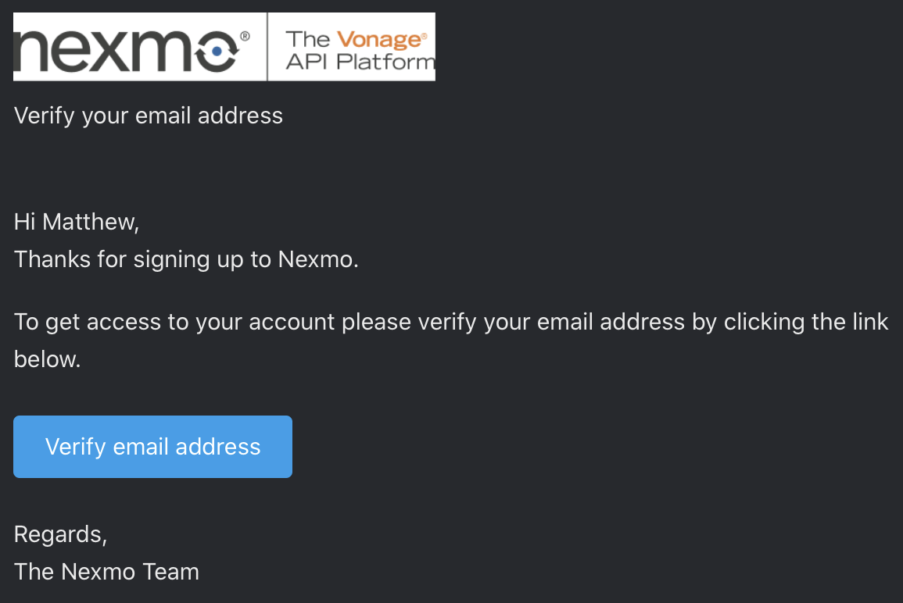
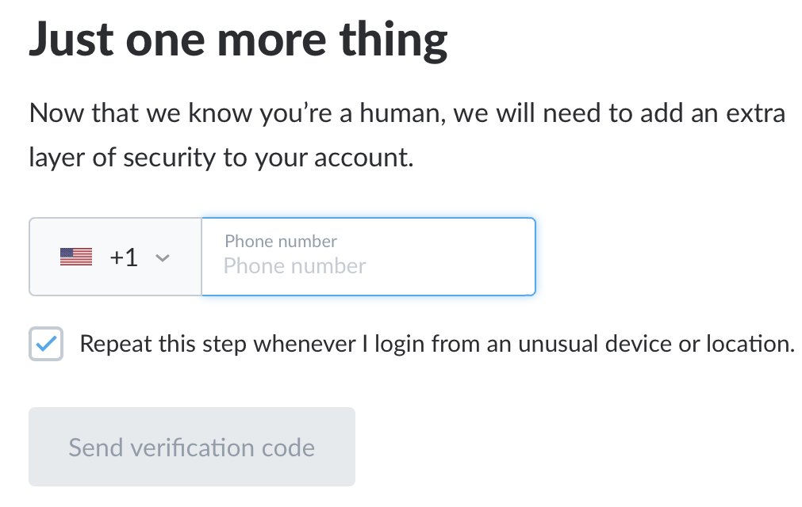
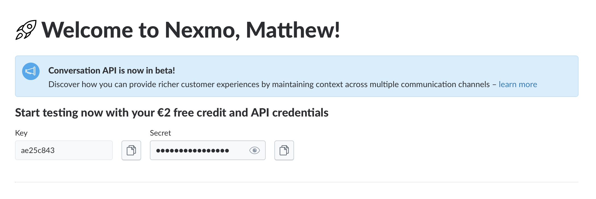
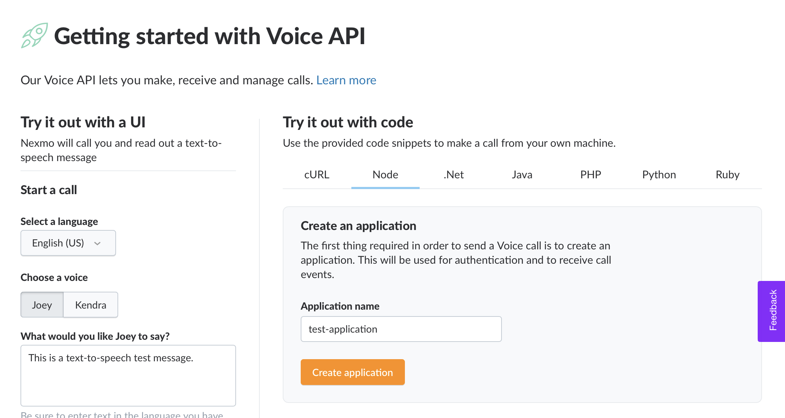

ljksdfjaklThe Rickroll workshop uses an API service called Nexmo. If you've heard of Twilio, it's a lot like that. We're using Nexmo for this workshop instead of Twilio because Nexmo doesn't require a credit card to sign up (unlike Twilio), authenticating an entire club with Nexmo is easier than with Twilio, and Nexmo's API is easier to use than Twilio's (at least for the purposes of this workshop).

The Rickroll workshop assumes club members have API credentials handy so that the workshop stays focused on building and playing around with the API instead of signing up for Nexmo and getting their own API credentials. Your job is to sign up for Nexmo and generate API credentials that you can provide to your club members when you run the workshop. **This takes a bit of time, so make sure you're doing this the night before your meeting at the very latest.**

*Note: you'll be required to provide a valid email address and phone number in order to generate Nexmo API credentials.*

## Signing up for Nexmo

Visit [Nexmo's website](https://nexmo.com) and sign up by clicking on "Try it free".

Fill out the signup form with the requested information.

You'll be sent a verification email.

Once you verify your email, you'll be taken to another page which asks you to input a phone number for extra verification.  Once you enter your phone number, you'll receive a text message with a verification code that you need to input. This phone number will be attached to your Nexmo account and will be used by default for making calls unless you specify otherwise.

Once you verify your phone number, you should be redirected to the Nexmo dashboard. You should also notice that you have $2 in free credit. Calls cost 1.39 cents per minute, so plan accordingly. If you lead a large club, you may want to consider adding some extra money to your account to ensure your funds don't run out during your meeting.

Copy the API key and API secret and store them somewhere where you can easily retrieve them.

## Creating an application

Navigate to "Voice –> Getting started" in the sidebar. You should be taken to this page, where you'll be able to create an application by typing in the name of your application. Once you click on "Create application", you should be prompted to download a file called `private.key`. Make sure you download this file—you'll need it for when your club members authenticate with your app. Nexmo stores application private keys in this file instead of storing them in plain text. Make sure to also copy the Application ID given to you and store it in a place where you can easily retrieve it.

## Using a Nexmo virtual number (optional)
By default, all calls using your Nexmo API credentials will come from the phone number you provided during signup. You'll have to share this phone number with your club members during the workshop. If you're okay with this, you don't need to complete this step. But if you don't want to share your personal phone number, you'll need to use a Nexmo virtual number instead.

Luckily, you don't have to pay for a virtual number; your Nexmo account comes with one for free for the first month. To find it, navigate to "Numbers –> Your numbers". Click on the number to copy it, then save it somewhere where you can easily retrieve it.

Note that during the workshop, your club members will have to format phone numbers in [E.164 format](https://www.twilio.com/docs/glossary/what-e164). For example, if your number were +1 (234) 567-8900, you would format it like 12345678900.

## Sharing credentials
That's it! You now have all of the credentials necessary for authenticating with Nexmo for this workshop. The last thing you need to worry about is easily sharing these keys with your club leaders. There are a few ways you can do this, so do what works best for you. I recommend writing down the API key, API secret, and App ID, and uploading to a [Notion](https://notion.so) document and share the public link with your club members. The link will be super long, so you'll have to shorten it somehow. If link shorteners are blocked in your school, you can fork [@itsmingjie's Airtable-based link shortener](https://github.com/itsmingjie/abls) and host your own version on repl.it.

It's easy to overlook this step, but I highly recommend taking some time right now to make sure your API credentials and private key file are ready to share easily with all of your club members in a moment's notice. You don't want to get stuck in the middle of your meeting because your club members don't have the necessary credentials to complete the workshop.

## Next steps
That's all you need to do for this workshop! Your club members now have access not only to rickroll themselves, but also [everything else Nexmo's Voice API offers](https://developer.nexmo.com/voice/voice-api/ncco-reference#stream). But keep in mind that this workshop only takes about 10 minutes to complete, and club members will be looking for more and more things to hack on. You may want to consider looking into the Nexmo SMS and Conversation APIs and creating separate applications for each one to give your club members access to as many Nexmo capabilities as possible.