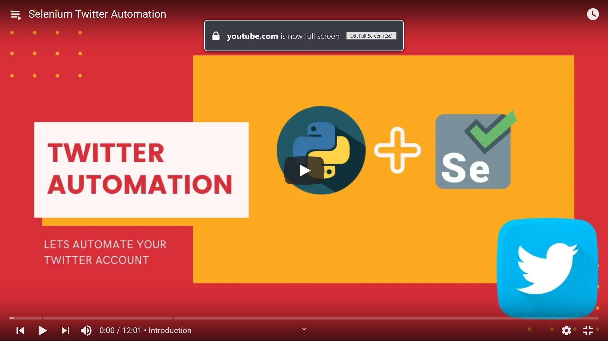
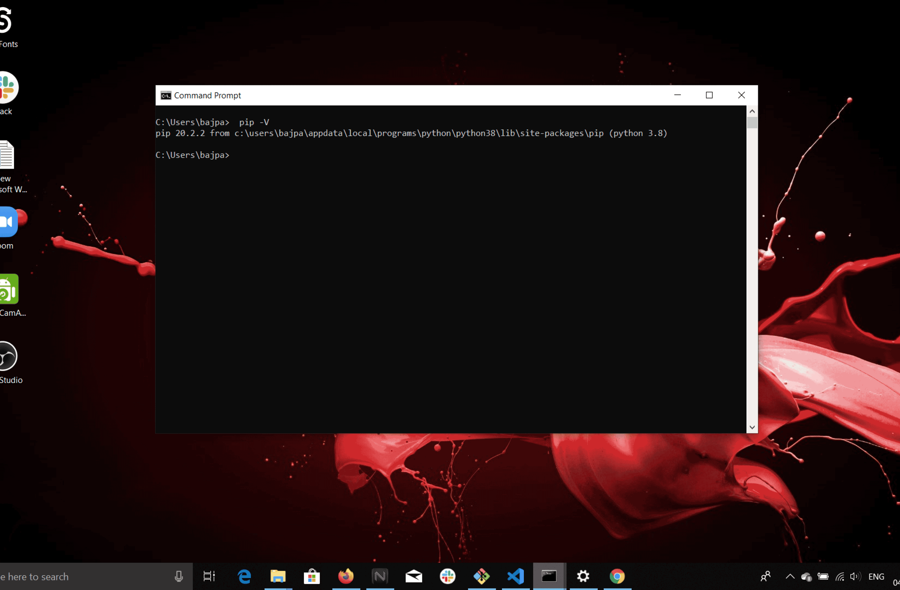
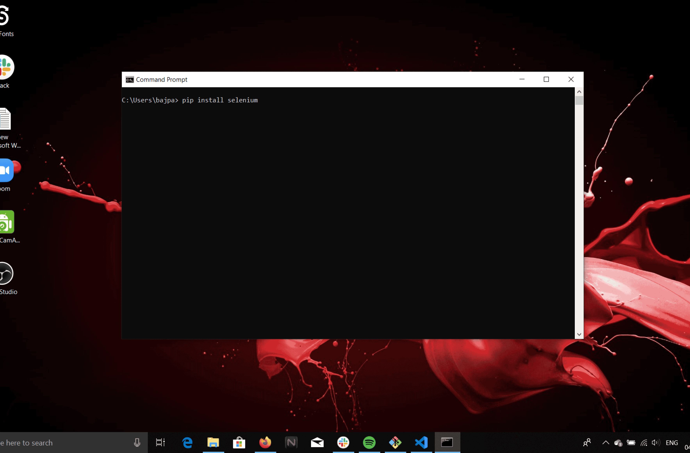
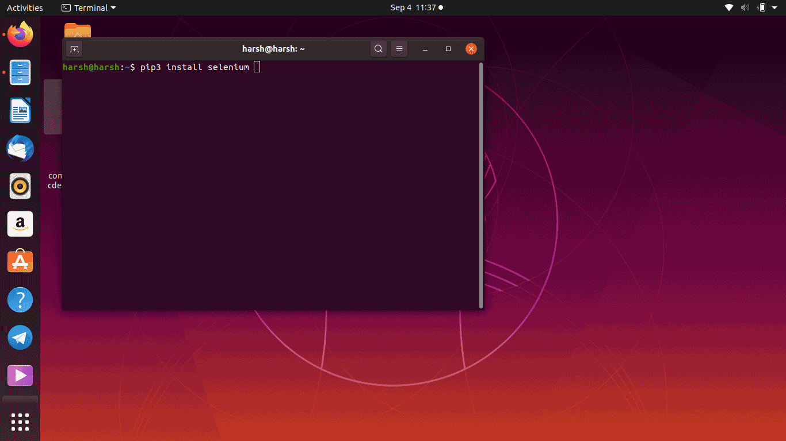
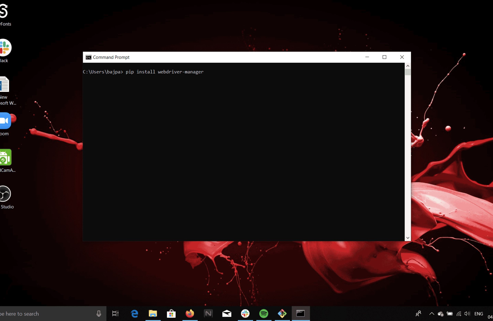
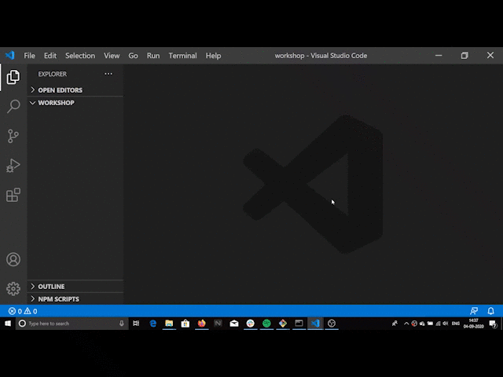
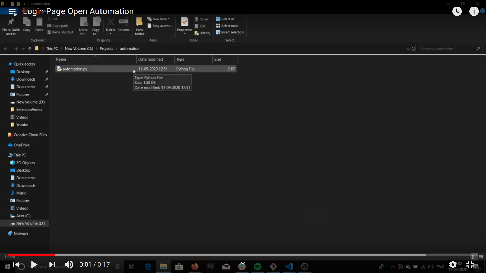
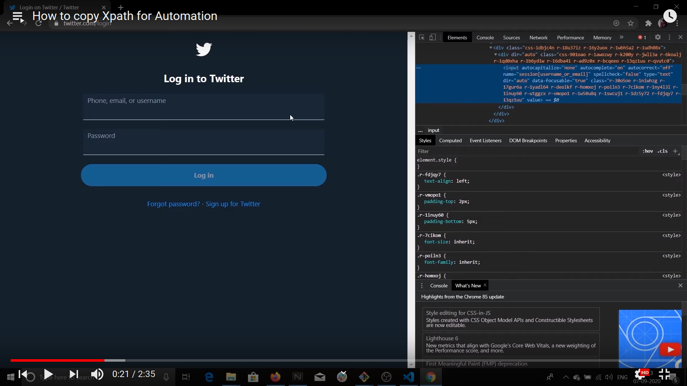
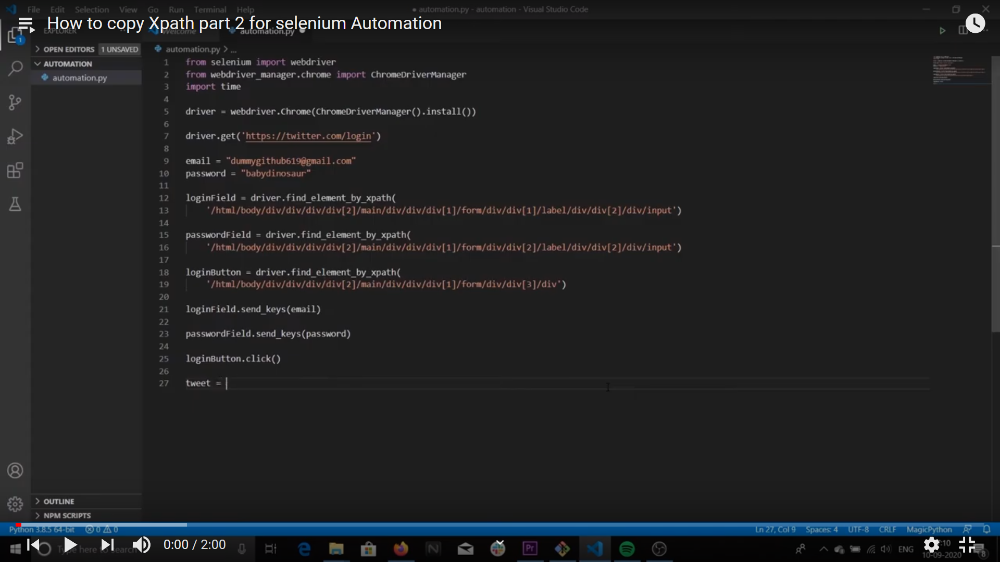

## Twitter Automation

In this workshop, we are going to automate twitter with the help of [Selenium](https://www.selenium.dev/) and Python.

We will be automating the process of **logging in to twitter and posting a tweet 🐦**

It will look something like this:


This is going to be super fun to make 🤘

This workshop should take around **_30 minutes_** to complete.

## Video version

A complete video version of this workshop is also available, **click on the below image to open and see the video version!**

<a href="https://www.youtube.com/watch?v=qn7OMo3WLYc&list=PLI1vug3dpq4pjVuLc7bMShzb7Bu_8GW1E&index=2" target="blank" ></img></a>

Here are some digital timestamp, which will help you to navigate through different sections of this workshop!

- Introduction: 0:00
- Setup: 0:40
- Programming: 3:19

## Download file

Click on this [link](https://drive.google.com/file/d/12sv3BHfHk3ddie88Wm8fnHc1AlQGUVMF/view?usp=sharing) to download the python file for this workshop!

## Prerequisites

This workshop is **ideal for anyone** with any level of programming experience and you are going to have a lot of fun making this automation.

It requires the knowledge of most basic concepts of Python like variables, packages, functions ( which are common programming concepts ).

## Setup

- ### Chrome browser

We are going to use [Chrome](https://www.google.com/chrome/) for our automation in this workshop, so make sure you have it on your computer.


- ### Installing Python and pip

The script will be written in Python and hence requires you to have Python installed in your system. You can download python from [here.](https://www.python.org/downloads/)


#### What is pip?

pip is the package management tool for Python, It is used to install and uninstall Python packages. If you have installed Python then it will be installed by default with it. To check if pip is working fine in your system:

- **For Windows users**:-
  Open cmd ( command prompt ) and type **_pip -V_**. If a version shows up in the terminal that means pip is working fine!



- **For Linux and Mac users**:-
  Open your terminal and type **_pip3 -V_** ( you use pip3 instead of pip ).


- **Troubleshooting**:-
  If you see an error when executing the pip or pip3 command than head over to these youtube videos, these might help!

  - <a href="https://www.youtube.com/watch?v=c_qNC1lL4qA" target="blank">For Windows</a>
  - <a href="https://www.youtube.com/watch?v=dpQEs6tE1XU" target="blank">For Linux</a>
  - <a href="https://evansdianga.com/install-pip-osx/" target="blank">For Mac (this is an article)</a>

### Installing Selenium

We will first install Selenium via pip ( or pip3 if you are on a Mac or a Linux ).

- ### Windows users:-

  Open CMD (command prompt) and type **pip install selenium** and hit Enter.
  

- ### Mac and Linux users:-

  Open your terminal and type <b>pip3 install selenium</b> ( basically wherever pip is used in Windows, Mac a Linux Users should use pip3 ) and hit Enter.

  

### Installing webdriver-manager

We need to install webdriver-manager via pip ( or pip3 if you are on a Mac or a Linux ) to proceed further.

### Why to install webdriver-manager?

Okay! So now in order to automate our browser we need something known as a driver, **_a driver is used by Selenium to automate the browser of your choice._**

[webdriver-manager](https://pypi.org/project/webdriver-manager/) is a Python library which is used to manage drivers for various browsers ( like Chrome, Firefox, Edge, etc )

- ### For Windows users:-

  Open CMD (command prompt) and type **pip install webdriver-manager** and hit Enter.

  

- ### Mac and Linux users:-

  Open your terminal and type <b> pip3 install webdriver-manager </b> and hit Enter.

  

Okay! So this was all you needed as an initial setup for this workshop, quite easy right 🤠

Now , from the next section, we will start coding this automation!

## Make a file automation.py

Go to your system and make a file named automation.py ( although name is optional but I am going to use this name ) open this file in your favourite editor ( VSCode, Atom, Notepad etc ). I will be using [VSCode](https://code.visualstudio.com/) in this workshop.



## Importing modules!

Now go to your _automation.py_ file and type the following code:

```python
from selenium import webdriver
from webdriver_manager.chrome import ChromeDriverManager
import time
```

Here in the above code, we are first importing:

- webdriver from selenium
- ChromeDriverManager from webdriver_manager ( As said earlier we will be using Chrome for automation in this workshop)
- time (to halt the program for some time at some specific points in the program )

Why we have imported all of these will be more clear as we will proceed through this workshop!

## First automation!

Okay, so as the first step in this workshop will be automating the process of the opening the [twitter login page](https://twitter.com/login) 🤠

Add the following lines of code in your automation.py file ( The new code to be added has been separated by a #### comment line )

```python
 from selenium import webdriver
 from webdriver_manager.chrome import ChromeDriverManager
 import time

 ######################## new code to add 👇 #######################

 driver = webdriver.Chrome(ChromeDriverManager().install())
 driver.get('https://twitter.com/login')
```

Now here we have declared a variable _driver_ and used it to store a chrome driver, The ChromeDriverManager().install() fetches the latest chrome driver binaries and installs them and give it to webdriver.Chrome() method as an argument.

webdriver.Chrome() method takes the Chrome driver as an argument.

Now, we give a call to driver.get('https://twitter.com/login'), this method will open up the chrome browser and automatically search for the URL provided to it as an argument ( in our case it is https://twitter.com/login ).

## Running the script!

Now go to your python file and simply **double click on it to run it!**

- ### Output:-
  After running the script your output will look something like this! **Click on the image to see the video.**

 <a href="https://www.youtube.com/watch?v=AJJ_qFYRmgo&list=PLI1vug3dpq4pjVuLc7bMShzb7Bu_8GW1E&index=3" target="blank" >
 </img>
 </a>

Congrats! You have completed your first Selenium Automation.


## Now automate the login process:

Okay , now we are going to automate the login process:

- ### Step1:- Create variables to store your credentials

  Okay! now create two variables **email and password** and store your email and password in them.

  ```python
  from selenium import webdriver
  from webdriver_manager.chrome import ChromeDriverManager
  import time
  ```

driver = webdriver.Chrome(ChromeDriverManager().install())
driver.get('https://twitter.com/login')

######################## new code to add 👇 #######################
email = "yourtwitteremail@gmail.com"
password = "yourtwitterpassword"

````
The above variables will be used to fill up your credentials when you login.

- ### Step2:- Copy the full XPaths!

 #### What are XPaths?

 XPaths will be used here to **_select the element with which our automation script should interact_**. ( believe me, this just sounds complex but is very simple 😎)

**The below video (click on the image to see the video) will explain to you how to copy various Xpaths and select web elements with them.**

 <a href="https://www.youtube.com/watch?v=sst49wuyKn0& list=PLI1vug3dpq4pjVuLc7bMShzb7Bu_8GW1E&index=6&pbjreload=101" target="blank">  </img>
 </a>
 <br/>

 Now after watching this video just append the code that you learned in it in the
 existing code!

 The below code contains the new lines of code you must add in your existing code. ( new code separated by ###### line comment from the existing code )


  **_An Important point to note is that these XPaths in the below code might not work in the future so if they don't work for you then watch the video to learn how to find XPaths!_**


  ```python
from selenium import webdriver
from webdriver_manager.chrome import ChromeDriverManager
import time

driver = webdriver.Chrome(ChromeDriverManager().install())
driver.get('https://twitter.com/login')

email = "yourtwitteremail@gmail.com"
password = "yourtwitterpassword"

######################## new code to add 👇 #######################

loginField = driver.find_element_by_xpath('/html/body/div/div/div/div[2]/main/div/div/div[1]/form/div/div[1]/label/div/div[2]/div/input')

passwordField = driver.find_element_by_xpath(
  '/html/body/div/div/div/div[2]/main/div/div/div[1]/form/div/div[2]/label/div/div[2]/div/input')

loginButton = driver.find_element_by_xpath('/html/body/div/div/div/div[2]/main/div/div/div[1]/form/div/div[3]/div')

````

Okay so in the above code we created 3 variable **loginField , passwordFiled , loginButton** respectively, and stored the respective web elements in them by using the driver.find_element_by_xpath() method and passing the respective XPaths of the elements in them.

Now we will automate our login process, add the following new code to your existing code! ( _new code separated by a #### comment line from the old code_)

```python
from selenium import webdriver
from webdriver_manager.chrome import ChromeDriverManager
import time

driver = webdriver.Chrome(ChromeDriverManager().install())
driver.get('https://twitter.com/login')

email = "yourtwitteremail@gmail.com"
password = "yourtwitterpassword"

loginField = driver.find_element_by_xpath('/html/body/div/div/div/div[2]/main/div/div/div[1]/form/div/div[1]/label/div/div[2]/div/input')

passwordField = driver.find_element_by_xpath(
  '/html/body/div/div/div/div[2]/main/div/div/div[1]/form/div/div[2]/label/div/div[2]/div/input')

loginButton = driver.find_element_by_xpath('/html/body/div/div/div/div[2]/main/div/div/div[1]/form/div/div[3]/div')

######################## new code to add 👇 #######################

loginField.send_keys(email)
passwordField.send_keys(password)

time.sleep(1)

loginButton.click()

```

**Done!**. In the above code, we have used the **send_keys()** method to stimulate the process of writing something in a TextField , _so in the above case, it is automating entering our email and password to the loginField and passwordField elements!_

**The click()** method used in the loginButton is used to stimulate the process of clicking a button! _So in our case it is stimulating pressing of the Login button on twitter._

**time.sleep(1)** halts the program for 1 second, it ensures a gap of **_1 second between entering credentials and hitting the login Button.!_**

## Run the script!

Run the python file by double clicking on it.

## Login process done!

See, you twitter login has been automated😎 ( I know it feels awesome )


## Automating witing tweets!

Okay! so now you have come so far and I know you already have got an idea of how to automate writing a tweet🤠

You need to find the **_Tweet TextField_** and store it in a variable by using **find_element_by_xpath()** as discussed earlier and have to do the same with the **_Tweet Button._**

Watch the below video to know how to find them!
**_Finding XPath of these elements is a little bit tricky so watching the below video is highly advisable._**

<a src="https://www.youtube.com/watch?v=-yQYCtXVvVc&list=PLI1vug3dpq4pjVuLc7bMShzb7Bu_8GW1E&index=7" target="blank" > </img> </a>

Now you have watched the video and have a good understanding of how this thing is going to work!

Now! add the below code to your existing code ( new code separated by ###### line comment from the existing code )

**_An important point to note is that these XPaths in the below code might change with time, so to find the XPaths of various elements please always prefer the above video!_**

```python
from selenium import webdriver
from webdriver_manager.chrome import ChromeDriverManager
import time

driver = webdriver.Chrome(ChromeDriverManager().install())
driver.get('https://twitter.com/login')

email = "yourtwitteremail@gmail.com"
password = "yourtwitterpassword"

loginField = driver.find_element_by_xpath('/html/body/div/div/div/div[2]/main/div/div/div[1]/form/div/div[1]/label/div/div[2]/div/input')

passwordField = driver.find_element_by_xpath(
  '/html/body/div/div/div/div[2]/main/div/div/div[1]/form/div/div[2]/label/div/div[2]/div/input')

loginButton = driver.find_element_by_xpath('/html/body/div/div/div/div[2]/main/div/div/div[1]/form/div/div[3]/div')

loginField.send_keys(email)
passwordField.send_keys(password)

time.sleep(1)

loginButton.click()


######################## new code to add 👇 #######################

tweet = "Hello Everyone! This is a tweet that I am sending from a selenium automated script written in Python ( It feels really awesome (: ) . \n If you too want to learn this supercool trick then visit Hack Club Workshops.\n https://workshops.hackclub.com"

tweetInputField = driver.find_element_by_xpath(
  '/html/body/div/div/div/div[2]/main/div/div/div/div/div/div[2]/div/div[2]/div[1]/div/div/div/div[2]/div[1]/div/div/div/div/div/div/div/div/div/div[1]/div/div/div/div[2]/div')

tweetInputField.send_keys(tweet)

time.sleep(1)

tweetButton = driver.find_element_by_xpath(
  '/html/body/div/div/div/div[2]/main/div/div/div/div/div/div[2]/div/div[2]/div[1]/div/div/div/div[2]/div[4]/div/div/div[2]/div[3]')

tweetButton.click()

```

- In the above code we are first storing our tweet in a variable **tweet**.

- Variables **tweetInputField , tweetButton** are storing Twitter Input Text Field and Tweet Button respectively ( The logic has been explained in the earlier sections of this workshop ).

- **tweetInputField.send_keys(tweet)** types our tweet stored in the tweet variable.

- **time.sleep(1)** is used to maintain a gap of 1 second between these events!

- **tweetButton.click()** then clicks the tweet button!

## Run the script!

Run your script by double clicking on your file.

## Great job!

After running the script your output must look something like this!


I want to say to you that you did a great job by completing this workshop. You are Awesome!


## Conclusion

This was a small and fun workshop to introduce you to Selenium. Share this workshop with your friends and share a video of your automation on the [`#ship`](https://app.slack.com/client/T0266FRGM/C0M8PUPU6) channel of [Hack Club's Slack](https://hackclub.com/slack/).

Try finding other hacks with this great tool and do remember to share them with your friends!.
