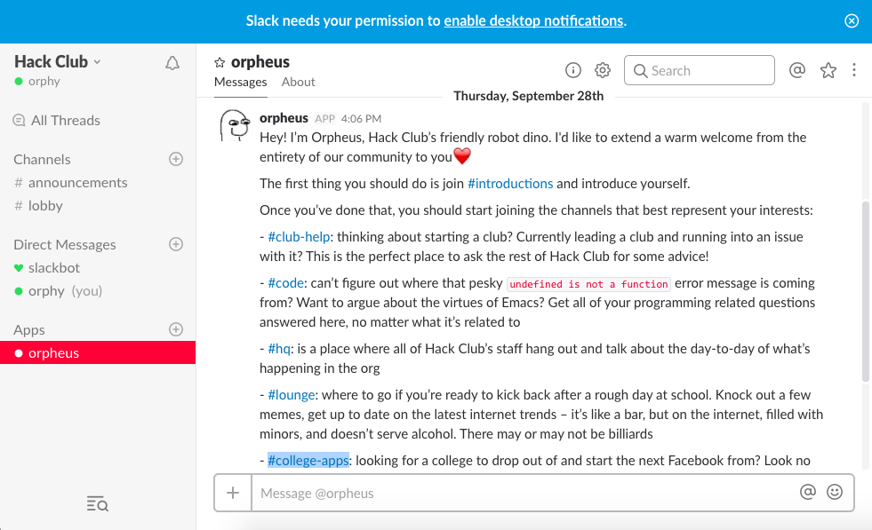
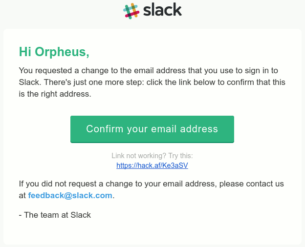

# 
Slack is an awesome tool for large group chats (check out their website at  https://slack.com). Hack Club's Slack is the home of our community. We use it to ask each other questions, talk about the problems we run into (as members and club leaders), and hang out with each other.

When you join this is what you’ll see.

If you're not already on Slack, let's get you into the community.  Just keep reading for instructions on joining the community. After you’re done you can introduce yourself. If you are interested in joining other channels check  the [#channels](##channels) part for some channels we recommend you to join.

**Before Joining Please read our [Code of Conduct](conduct.hackclub.com)**

# How To Join
Open up https://slack.hackclub.com in a new tab and fill out the registration form to join our workspace.

Once you join you’ll get a  temporary email address to login that looks something like: 
`slack+xkewma@mail.hackclub.com. `

You'll need to use the given temporary email for the first time you sign in into your account.  After that, you can use the email you signed up with.

Once you join head over at #introductions and introduce yourself to us.  We'd love to know your name, high school, and hobby's

# Channels
When you first join the server you’ll be automatically added in #announcments and #lobby.  To join a channel simply click on the channel name and click join. Here our some of our picks:

|Channel Name | Description |
|---------- |--------|
|`#introductions` | New to HackClub? Come join us and introduce yourself. | 
| `#lobby`| A place where everyone new joins. | 
| `#announcments`| All announcements and important stuff go here. | 
|`#hq` | A channel where the staff do HackClub business.| 
| `#hardware`| Arduinos, Raspberry Pi's, Microbits, :smile: | 
| `#code` | Pesky compiler errors? That code you wrote doesn't even build? Hack Club to the rescue.| 
| `#club-help` | A Perfect place for any HackClub questions.| 
| `#studycorner`| Can't understand that math homework? Some part confuses you? The HackClub community here to help you solve your homework or prepare you for a test.|
|`#college-apps`| Going to College? Don't know how to fill that entire paperwork you have. HackClub here to help.|

# Custom Slack Invite Strategies
Custom Slack invites are a way for club leaders to design their own invites for their incoming members. You can set it up as to include which channels they will be joining, a custom theme, custom greeting. To get started message @orpheus.

