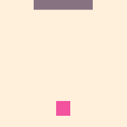
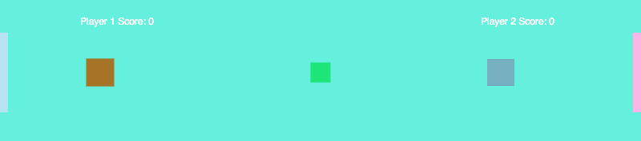
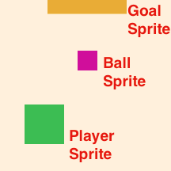
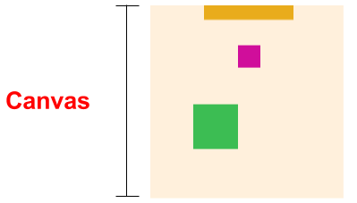
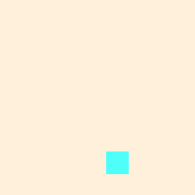

# Soccer

_This workshop has been retired and is no longer maintained or recommended._

---

Note to leaders running this workshop: we're replacing Soccer with [Dodge](../dodge/). We recommend running this in your clubs instead.

---

In this tutorial, we'll walk you through building a single-player soccer game.

[][demo_output]

[][demo_output]

[][demo]

[demo_output]: https://jsbin.com/gist/6d634e61d71794b9878b
[demo]: https://jsbin.com/gist/6d634e61d71794b9878b

From there, the tutorial is designed to have you continue to expand on your game. Here is an example of what you could end up making:

[][demo_advanced_output]
[][demo_advanced_output]
[][demo_advanced]

[demo_advanced_output]: https://jsbin.com/gist/b86701e13602fea28bd6
[demo_advanced]: https://jsbin.com/gist/b86701e13602fea28bd6

## How to Use This Tutorial

Don't feel that you have to follow along step-by-step. Figure out the best way to navigate this tutorial for you. This might look like the following:

**If you have never programmed before:**

- Amazing! Walk through the tutorial step-by-step! We got your back!

**If you have programmed a _little_:**

- Huzzah! Feel free to follow along step-by-step and skim through sections you understand.

**If you have more experience:**

- You already know the basics of coding. Your goal here is to learn how to use the JavaScript game frameworks [p5.js](http://p5js.org/) and [p5.play.js](http://p5play.molleindustria.org) and then make your own stuff with it.
- You might spend most of your time jumping around from section to section and just picking and choosing what you need.

## Setup

1. If you're more experienced and want to use your own editor, follow [these instructions](own_editor.md).
2. If you haven't already, make sure you have a JS Bin account first. <a href="https://jsbin.com/register" target="_blank">Create one here.</a>
3. Then open [this JS Bin][starter]. It has all the starter code we need for this tutorial. Write any new code in this JS Bin. We'll refer to this JS Bin as your _"working bin"_.

[starter]: https://jsbin.com/gist/9b98de6863f4f314ea24

## Some Quick Vocabulary

Each interactive element in the game (the player, ball, and the goal) is called a _sprite_.

> 

<!-- Editable Drawing in: https://docs.google.com/drawings/d/1Px_9MVqn2qv6ASDl7vxglR2lXVpHVaNsvT9lyrqWzmM/edit -->

The entire area on which everything lives is called the _canvas_:

> 

## Getting Started

The instructions below will walk you through step-by-step of how to build a single player soccer game.

| **[   1. Initial Setup](initial_setup.md)** | **[   2. Add Player Sprite](add_player_sprite.md)** | **[   3. Mouse Movement](mouse_movement.md)** |
| ----------------------------------------------------------------- | ------------------------------------------------------------------------- | ------------------------------------------------------------------- |
| **[   4. Dribble Ball](dribble_ball.md)**   | **[   5. Add Goal](add_goal.md)**                   |                                                                     |

## F.A.Q

**What programming languages and libraries are we using?**

- We are learning to use JavaScript game framework [p5.js](http://p5js.org/) and [p5.play.js](http://p5play.molleindustria.org).

## Listing of Computer Science Concepts

- Functions
  - `createSprite`, step 2
- Variable
  - `player`, step 2
