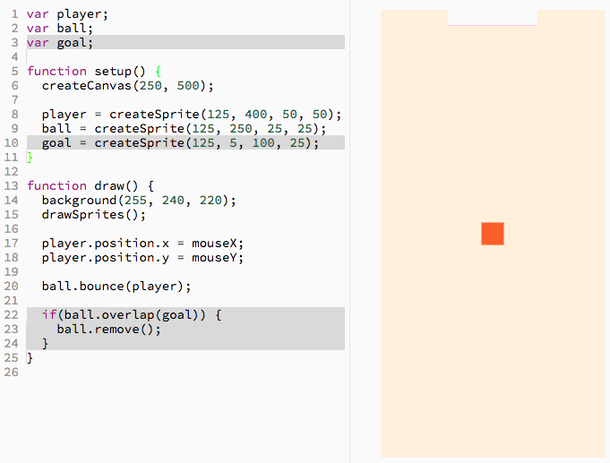
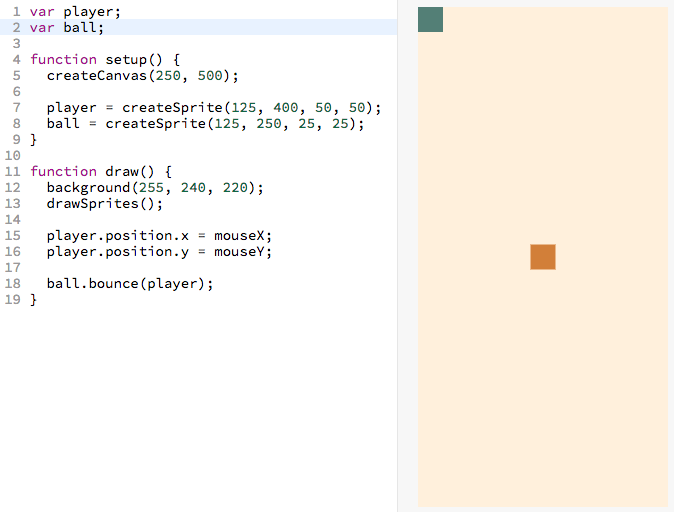
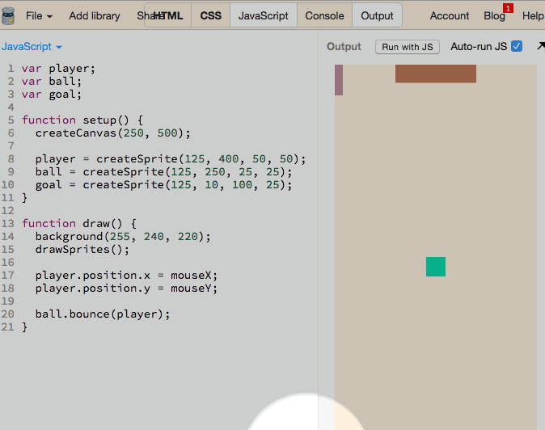
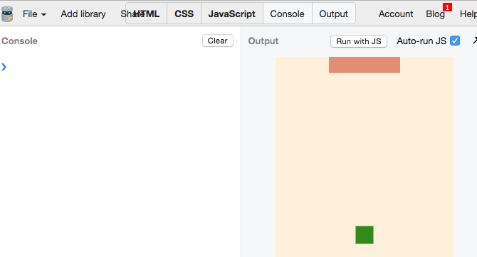
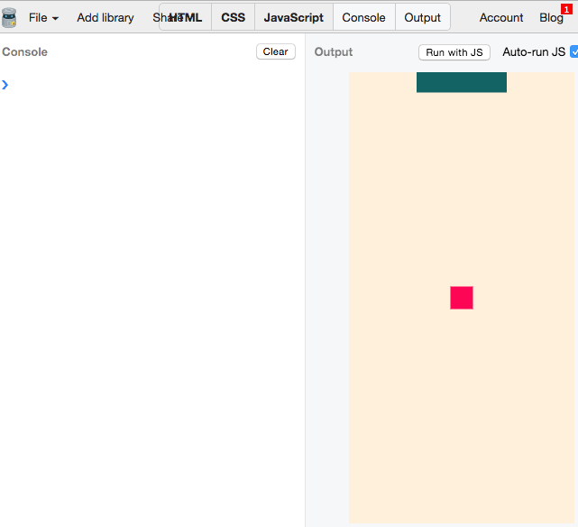
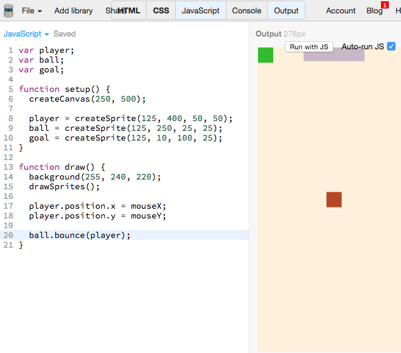
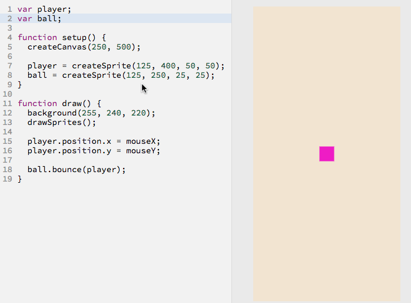

# Step 5: Add Goal

## Background

| From step 4: we added a ball we can dribble <br>  |  Now we need a goal to score in <br>   |
|----------------------------------------------------------------------|-----------------------------------------------------------|

## Outcome of This Step

When the ball touches the goal, we want the ball to disappear. There are two
things you will learn to do this:

- how to make a sprite disappear
- how to detect when one sprite touches another

Here is the resulting code (_the new code is highlighted in gray_):



<a href="http://jsbin.com/dikevu/30/edit?js,output" target="_blank">
  
</a>

## Choose Your Own Path

- [**Walk me through this code step-by-step.**]
  (#walk-through-of-the-code-step-by-step)
    - Recommended for those who
      - are beginners
      - who want an in depth understanding of the code
- [**Give me a brief overview of this code.**](#brief-overview-of-the-code)
    - Recommended for those who
      - have more experience
      - want to cover more ground but have a less in depth understanding
      - want to recap what they did in the step-by-step section

# Walk Through of the Code Step-By-Step

## Creating the Goal Sprite

Create a goal sprite in a similar way that you created the player sprite in
[step 2](add_player_sprite.md).

Here's the code that contains the new code to add a ball sprite:

```js
var player;
var ball;
var goal;                                   // <-- NEW

function setup() {
  createCanvas(250, 500);

  player = createSprite(125, 400, 50, 50);
  ball = createSprite(125, 250, 25, 25);
  goal = createSprite(125, 5, 100, 25);     // <-- NEW
}

function draw() {
  background(255, 240, 220);
  drawSprites();

  player.position.x = mouseX;
  player.position.y = mouseY;

  ball.bounce(player);
}
```

- [ ] _Go ahead and add these new lines of code. If you don't quite understand
       how they work, feel free to review the analogous code in
       [step 2](add_player_sprite.md)._

> 

Now that we have the goal to score in, we need to learn how to:

- Make a sprite disappear
- Detect when sprites touches another

Let's learn by using the console:

## Opening the Console

The console inside of JS Bin lets us run one line of code at a time.

- [ ] Go ahead and open up the JS Bin console by clicking "Console":
- [ ] The to give yourself more room, click the `JavaScript` tag to close it:

> 

### Removing the Ball

We can write

```js
ball.remove();
```

in the console. When we press entier, it will remove the ball.

- [ ] _Try doing this yourself in your own working bin_



### Overlap

We can detect whether two sprites are touching by writing the following code:

```js
ball.overlap(goal)
```

This is a function with one output, either `true` or `false`. If the ball is
touching the goal, it will return `true`. Otherwise, it will return `true`.

> 

### Putting It All Together

Let's go ahead and write in the final code:

```js
if (ball.overlap(goal)) {
  ball.remove();
}
```

- You can read the above as **`if`** the **`ball`** **`overlaps`** the **`goal`**
  - then **`remove`** the **`ball`**

We can add this code as follows:

- [ ] _Go ahead and add the above code. Don't forget to close the console and
      open the JavaScript tab again first._



### And that's a wrap

The section immediately below section is the "Give me a brief overview of this
code". You already did the "Walk me through this code step-by-step" section
so no need to do it.

[Click here to skip to the next section.](#finish)

# Brief Overview of the Code

Reproduced below is the code that adds a goal and makes the ball disappear if it
touches the goal.

New lines marked with
`// <-- NEW LINE`.

```js
var player;
var ball;
var goal;                                   // <-- NEW

function setup() {
  createCanvas(250, 500);

  player = createSprite(125, 400, 50, 50);
  ball = createSprite(125, 250, 25, 25);
  goal = createSprite(125, 5, 100, 25);     // <-- NEW
}

function draw() {
  background(255, 240, 220);
  drawSprites();

  player.position.x = mouseX;
  player.position.y = mouseY;

  ball.bounce(player);

  if(ball.overlap(goal)) {                  // <-- NEW
    ball.remove();                          // <-- NEW
  }                                         // <-- NEW
}
```

- [ ] Go ahead and add the `NEW LINES` to your code:

> 

<a href="http://jsbin.com/dikevu/30/edit?js,output" target="_blank">
  
</a>

## Understanding New Concepts

In addition to adding new `goal` sprite, this is the only new piece of code:

```js
if (ball.overlap(goal)) {
  ball.remove();
}
```

You can read the above as **`if`** the **`ball`** **`overlaps`** the **`goal`**
then **`remove`** the **`ball`**

- [ ] Go ahead and add this to your code.

## Finish!

Yay you finished the Linear Tutorial!

> 

Now make this game yours! Go add features to it that you think would be really
cool! Transform it into a completely different game of your own!

You can checkout some cool examples in the Adding Functionality section in the
main README [adding more functionality to your app]
(README.md#part-2-adding-more-functionality).

## Steps

| **[ <br> 1. Initial Setup] (initial_setup.md)** | **[ <br> 2. Add Player Sprite]  (add_player_sprite.md)** | **[  <br> 3. Mouse Movement](mouse_movement.md)** |
|--------------------------------------------------------------------|-----------------------------------------------------------------------------|----------------------------------------------------------------------|
| **[ <br> 4. Dribble Ball](dribble_ball.md)**    | **[ <br> 5. Add Goal](add_goal.md)**                     | **[ <br> Back to the README.md](README.md)**      |
