# Step 2: Adding The Player Sprite

## Background

| We made a blank canvas in Step 1: &nbsp;&nbsp;&nbsp;&nbsp;&nbsp;&nbsp;&nbsp;&nbsp;&nbsp;&nbsp;&nbsp;&nbsp;&nbsp;&nbsp;&nbsp;&nbsp;&nbsp;&nbsp;&nbsp;&nbsp;&nbsp;&nbsp;&nbsp;&nbsp;&nbsp;&nbsp;&nbsp;&nbsp;&nbsp;&nbsp;&nbsp;&nbsp;&nbsp;&nbsp;&nbsp;&nbsp;&nbsp;&nbsp;&nbsp;&nbsp;&nbsp;&nbsp;&nbsp;&nbsp;&nbsp;&nbsp;&nbsp;&nbsp;&nbsp;&nbsp; <br>  <br> | Eventually in step 3, we want to add a player sprite that follows the mouse: <br>  | But for now (step 2) we are just adding a sprite that does not move: &nbsp;&nbsp;&nbsp;&nbsp;&nbsp;&nbsp;&nbsp;&nbsp;&nbsp;&nbsp;&nbsp;&nbsp;&nbsp;&nbsp;&nbsp;&nbsp;<br>  |
|-----------------------------------------------------------------------------------------------------------------------------------------------------------------------------------------------------------------------------------------------------------------------------------|--------------------------------------------------------------------------------------------|--------------------------------------------------------------------------------------|

## Outcome of This Step

After you finish this step, you will learn how to add the player sprite. Here is
the code you will end up with (_the new code is highlighted in gray_):

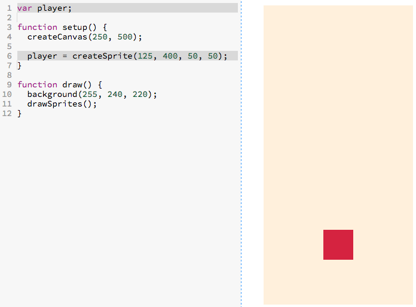

<a href="http://jsbin.com/dikevu/23/edit?js,output" target="_blank">
  
</a>

## Choose Your Own Path

- [**Walk me through this code step-by-step.**]
  (#walk-through-of-the-code-step-by-step)
    - Recommended for those who
      - are beginners
      - want an in depth understanding of the code
- [**Give me a brief overview of this code.**](#brief-overview-of-the-code)
    - Recommended for those who
      - have more experience
      - want to cover more ground but have a less in-depth understanding
      - want to recap what they did in the step-by-step section

# Walk Through of the Code Step-By-Step

## Creating the Actual Sprite

We can create a sprite by writing the code:

```js
createSprite();
```

Because we only want to create the sprite once, we want to write this in the
`setup` function because the `setup` function is only run once.

- [ ] _Go ahead and `createSprite();` at the bottom of the `setup` function:_

> 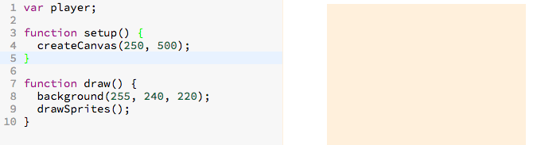

_Do you see the sprite created above on the top left hand side of the canvas?_

Over the sections below, we're going to slowly add to the `createSprite()`
function

### Centering the Sprite Horizontally

Let's center the sprite horizontally. Since our canvas is `250` pixels wide, the
center of it is `125`.

To set the x coordinate of our sprite to `125` we can change our code to the
following:

```
createSprite(125);
              ^
              └ sets the *x* coordinate of sprite to 125
```

- [ ] Update your `createSprite` function to `createSprite(125);`.

> 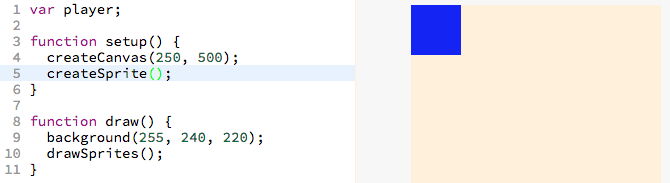

### Centering the Sprite Vertically

Let's center the sprite vertically too. Since the canvas is 500 pixels in
height, the center is 250.

Let's set the center of the sprite to `250`

```
createSprite(125, 250);
                   ^
                   └ sets the *x* coordinate of sprite to 250
```

> 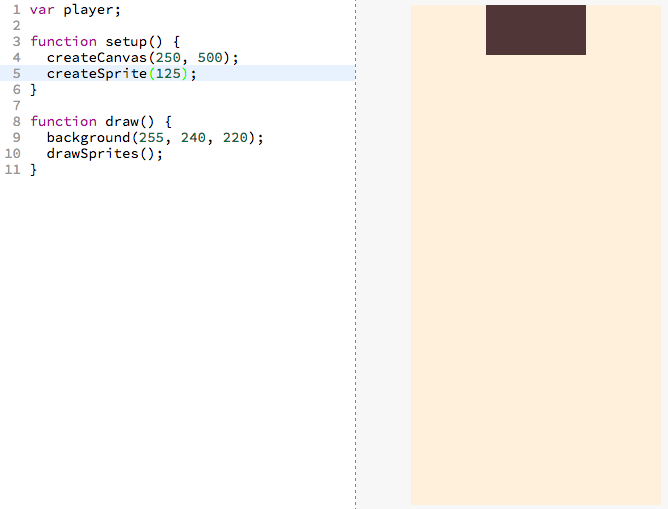

### Understanding the Coordinate System

Here is how the coordinate system is laid out:

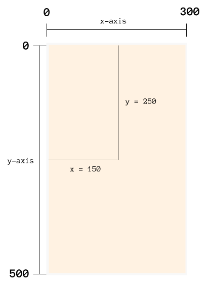


And this is what means for our sprite to have it's coordinates set to
 `x = 125` and `y = 250`

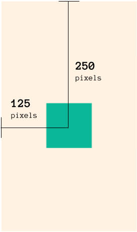

<!-- https://docs.google.com/drawings/d/1dKWjE7QMisQgdS7rO5su6tnEKo7ckGX6IFEN-hOeysQ/edit -->

### Shrinking the Width

I want to make the width of the sprite a bit smaller. The width is by default
`100`. Let's make the width `50` instead.

```
createSprite(125, 250, 50);
                       ^
                       └ sets the *width* of the sprite to 50 pixels.
```

- [ ] _Modify your code so that it reflects the above:_

> 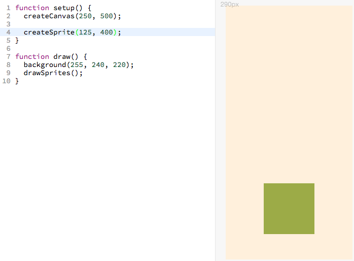

### Shrinking the Height

Let's make the height 50 pixels instead of the default `100` as well.

```
createSprite(125, 250, 50, 50);
                           ^
                           └ sets the *height* of the sprite to 50 pixels

```

- [ ] _Modify your code so that it reflects the above:_

> 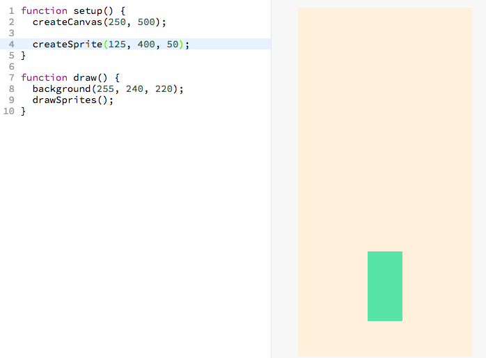

### Recap of createSprite

```
createSprite(150, 100, 50, 50);
              ^    ^    ^   ^
              |    |    |   └ height
              |    |    |
              |    |    └ width
              |    |
              |    └ y-coordinate
              |
              └ x-coordinate
```

## Remembering the Sprite

In order for a computer program to remember something exists, it needs to store
it in a **_variable_**.

So although, we have already created the sprite, the program will not remember
it unless you store it in a variable.

Let's create a variable named `player`:

```js
var player;
```

- [ ] _Go ahead and add this line to the top of your code:_

> 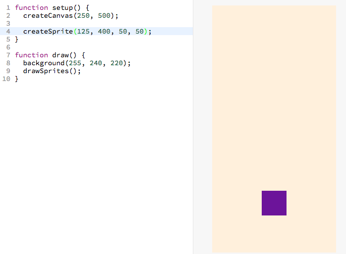

Now that the variable is created, we can assign the **_output_** of the
createSprite **_function_** to `player`.

```
player = createSprite(125, 250, 50, 50);
```

- [ ] _Go ahead and update your code with this change:_

> 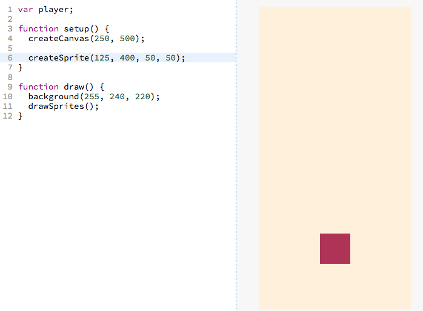

### And that's a wrap!

The section immediately below is the "Give me a brief overview of this
code". You already did the "Walk me through this code step-by-step" section so
there's no need to do it.

[Click here to skip to the next section.](#next-up)

# Brief Overview of the Code

Reproduced below is the code that addes the new sprites:

New lines marked with
`// <-- NEW LINE`.

```js
var player;                                 // <-- NEW LINE

function setup() {
  createCanvas(250, 500);

  player = createSprite(125, 250, 50, 50);  // <-- NEW LINE
}

function draw() {
  background(255, 240, 220);
  drawSprites();
}
```

- [ ] Go ahead and add the `NEW LINES` to your code:

> 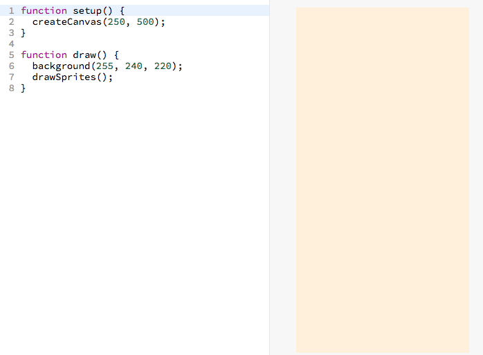

<a href="http://jsbin.com/dikevu/23/edit?js,output" target="_blank">
  
</a>


## Brief Explanation

```
player = createSprite(150, 100, 50, 50);
      ^                  ^    ^    ^   ^
      |                  |    |    |   └ sprite height
      |                  |    |    |
      |                  |    |    └ sprite width
      |                  |    |
      |                  |    └ sprite y-coordinate
      |                  |
      |                  └ sprite x-coordinate
      |
      └ the variable where
        the new sprite being
        created is stored
```

## Next Up

| **[  <br> 3. Mouse Movement](mouse_movement.md)** |
|--------------------------------------------------------------------|

## Steps

| **[ <br> 1. Initial Setup] (initial_setup.md)** | **[ <br> 2. Add Player Sprite]  (add_player_sprite.md)** | **[  <br> 3. Mouse Movement](mouse_movement.md)** |
|--------------------------------------------------------------------|-----------------------------------------------------------------------------|----------------------------------------------------------------------|
| **[ <br> 4. Dribble Ball](dribble_ball.md)**    | **[ <br> 5. Add Goal](add_goal.md)**                     | **[ <br> Back to the README.md](README.md)**      |
