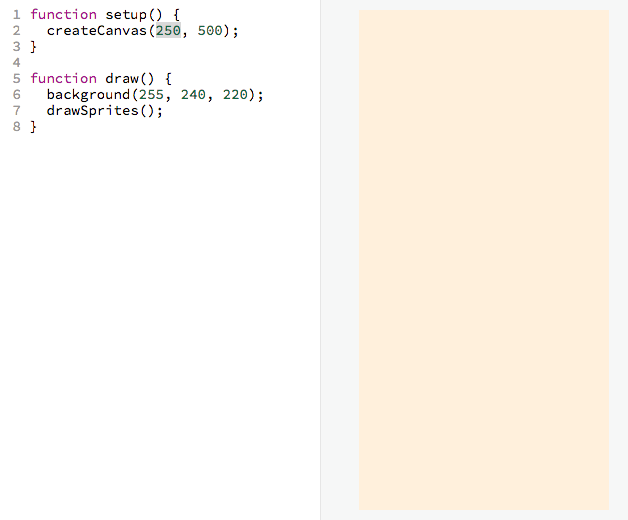
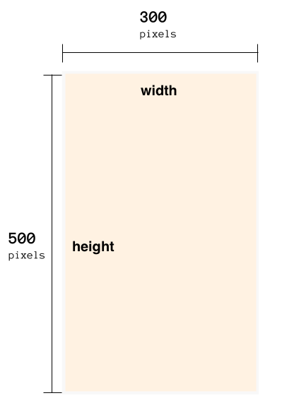
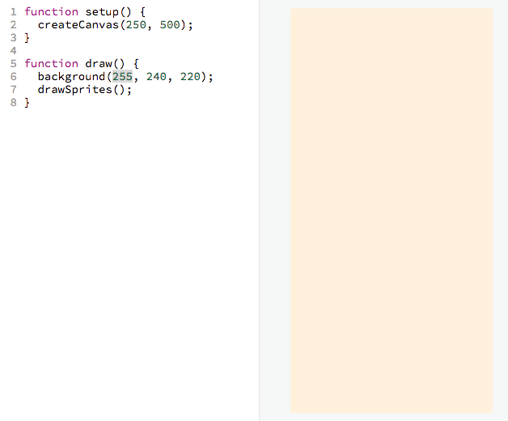
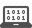
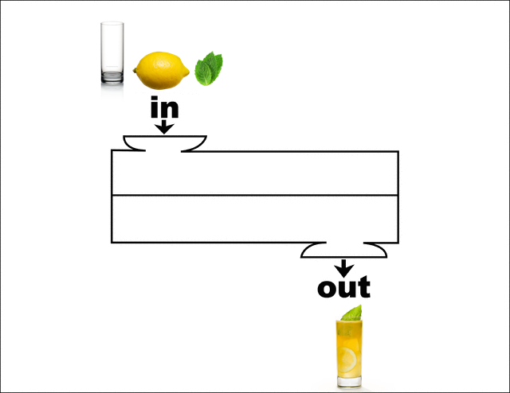

# Step 1: Understanding the Initial Setup

In this tutorial, you will be writing JavaScript code and using the p5.js and
p5.play.js library. You can learn more about them by Googling for `JavaScript`,
`p5.js` and `p5.play.js` respectively.

## Setup

- [ ] First off, make sure you've followed the
      [setup directions](README.md#setup) to create your working bin on the
      previous page.
- [ ] Make sure two tabs open, one for your working bin, and one for these
      workshop directions.

## Understanding the Code in the Working Bin

The the code for the working bin has 2 parts:

1. the HTML
2. the JavaScript

### HTML

The HTML adds the p5.js and p5.play.js libraries. Learn more about what the HTML
does [here](own_editor.md).

We won't really talk about the HTML that much in this tutorial. Our primary
focus will be the JavaScript code.

# Understanding the JavaScript

```js
function setup() {                           ┐
  createCanvas(300, 500);                    ├ setup function
}                                            ┘

function draw() {                            ┐
  background(255, 240, 220);                 ├ draw function
  drawSprites();                             │
}                                            ┘
```

- Everything inside `setup` function is only run once.
- Everything inside the `draw` function is run over and over again _forever_!

Don't worry about this too much now, we'll touch on this more later.

## Overview

For the rest of this section, we're going to understand the following lines of
code:

  - `createCanvas(300, 500);`
  - `background(255, 240, 220);`
  - `drawSprites();`

## Understanding `createCanvas`

Let's understand what this code does:

```js
createCanvas(300, 500);
```

### Understanding through Tinkering

- [ ] _In your working bin, try changing some of the values of `createCanvas` to
      understand what the values affect. Below is an example of how I play
      around with the values of `createCanvas` to try understand what it does:_

> 

### Explanation

As a reminder, the area on which everything lives is called the **canvas**:

> 

`createCanvas` creates and sets the size of the canvas. Here is an example:

```
createCanvas(300, 500);
              ^    ^
              |    └ set the *height* of the canvas to 500
              |
              └ set the *width* of canvas to 300
```

Here is a diagram representing the result of the above code:



<!-- Google Drawing https://docs.google.com/drawings/d/1c0rai1S-RTuSrfU_WTnUKDH8o3c-eaeobzf7O58ad0k/edit?usp=sharing -->

## Understanding `background`

### Understanding Through Tinkering

- [ ] _Try changing some of the values of `createCanvas` to see what it
      changes. Below is an example of how I play around with the values of
      `background` to try understand what it does:_

> 

### Explanation

```
This code sets the background color of the canvas:

  background(255, 255, 255);
              ^    ^    ^
              |    |    └ set how much *red* there is
              |    |
              |    └ set how much *green* there is
              |
              └ set how much *blue* there is
```

## Understanding `drawSprites`

Remember from the previous page that each of the interactive elements on the
page are called sprites.

> 

The code `drawSprites()` is responsible for drawing all of those sprites to the
page once they are created. But how do you create a sprite? You'll find out in
the next section!


## Next

| **[  <br> 2. Add Player Sprite](add_player_sprite.md)** |
|----------------------------------------------------------------------------|

# Appendix

## Documentation

**Links to the official p5.js Documentation**

- [`background(255, 255, 255)`](http://p5js.org/reference/#/p5/background)
- [`createCanvas(300, 500);`](http://p5js.org/reference/#/p5/createCanvas)

## Computer Science Fundamentals 

**_This Section is Coming Soon!_**—In the mean time, here is a sneak peek:

### Functions

`createCanvas` and `background` are what we call _**functions**_.

Functions can have the following:

- Inputs
- Side effects
- Outputs

#### Lemonade Analogy

Consider the lemonade making machine as a function:



In the above drawing, you can see that

- The inputs are a glass, lemon, and mint
- The output is lemonade

But what are the side effects?

- The lemonade juicing machine gets hot from use.
- You, the user, who is not an input, get better at learning how to make
  lemonade.
- You and your friends bond over making lemonade.

Sometimes, you care more about the side effects than the outputs.

#### `background`

Let's examine the components of `background(255, 255, 255)`

##### Inputs

The inputs are whatever in the parentheses.

In this case the `background` function has 3 inputs:

```
background(255, 255, 255);
            ^    ^    ^
            |    |    └ input 3
            |    |
            |    └ input 2
            |
            └ inputs 1
```

##### Side Effects

The side effect of this function is to set the color of the canvas.

##### Outputs

This function has no output. This may not seem like it makes sense right now,
but if you visit the functions section of createSprite (which doesn't exist
yet), it will make much more sense.

## Steps

| **[ <br> 1. Initial Setup] (initial_setup.md)** | **[ <br> 2. Add Player Sprite]  (add_player_sprite.md)** | **[  <br> 3. Mouse Movement](mouse_movement.md)** |
|--------------------------------------------------------------------|-----------------------------------------------------------------------------|----------------------------------------------------------------------|
| **[ <br> 4. Dribble Ball](dribble_ball.md)**    | **[ <br> 5. Add Goal](add_goal.md)**                     | **[ <br> Back to the README.md](README.md)**      |

--------------------------------------------------------------------------------
