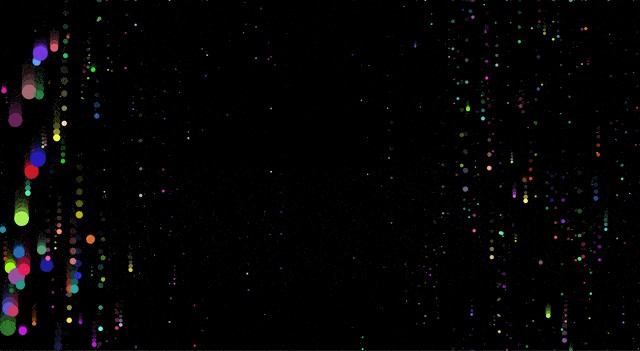
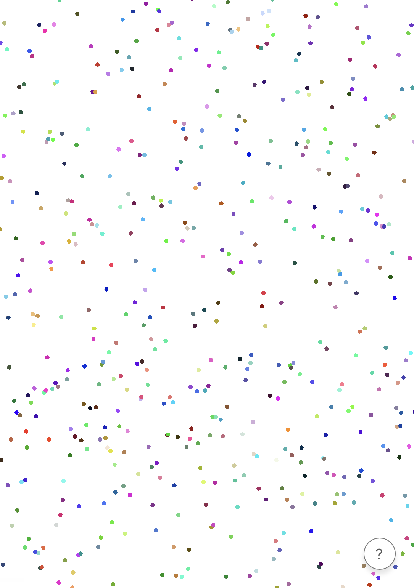

Sound visualization is one of the coolest things that modern-day web development tools have made accessible. There’s something surreal and indescribably satisfying about *seeing* the sounds around you on your screen and somehow understanding what you’re seeing.



In this workshop, you’re going to create a galaxy out of shimmering particles that expand and move based on microphone input, in less than 50 lines of code.

[Link to demo](https://sound-galaxy--techbug2012.repl.co)

## Getting started
We’re going to be using [p5.js](https://p5js.org), a JavaScript library for creative coding, to make this project. This project requires two separate p5.js libraries: `p5.js` and `p5.sound.js`.

Get started from the starter project by [clicking here](https://repl.it/@TechBug2012/sound-galaxy-starter). Once your project spins up, navigate to the `index.html` file. Then, just before the end of your `<head>` tag, import these two libraries:

```html
<script src="https://cdnjs.cloudflare.com/ajax/libs/p5.js/0.10.2/p5.min.js"></script>
<script src="https://cdnjs.cloudflare.com/ajax/libs/p5.js/0.10.2/addons/p5.sound.js"></script>
```

Great! Now that we’ve imported p5, we’re ready to start writing JavaScript.

## About the Fourier Transform
At the center of everything we’re building in this workshop is something called a Fourier Transform: a mathematical operation that takes a frequency (e.g. the sound frequency picked up by your computer’s microphone) and decomposes it into the individual wavelengths that make it up. You don’t need to understand how the Fourier Transform works—it’s built into p5 and super easy to use—but if you’re interested, 3Blue1Brown made [a great video](https://youtu.be/spUNpyF58BY) explaining it.

## Setting up p5
p5.js is primarily composed of two functions: `setup()` and `draw()`. The `setup()` function runs only once when the project first starts up, and the `draw()` function runs continuously afterwards. Let’s start by creating these two functions in your `script.js` file:

```js
function setup() {

}

function draw() {

}
```

Everything in p5.js happens on a p5 canvas. Let’s create a canvas that fills our window in the `setup()` function:

```js
function setup() {
  createCanvas(windowWidth, windowHeight)
  noStroke()
}
```

By default, p5 adds an outline around objects in a canvas. `noStroke()` removes this outline.

Now, let’s tell p5 to listen for microphone input.

```js
function setup() {
  createCanvas(windowWidth, windowHeight)
  noStroke()
  
  let mic = new p5.AudioIn()
  mic.start()
}
```

Next, let’s initialize p5’s Fast Fourier Transform algorithm. We’ll be using this throughout the project, so we want to declare it globally and initialize it in the `setup()` function:

```js
let fft

function setup() {
  createCanvas(windowWidth, windowHeight)
  noStroke()
  
  let mic = new p5.AudioIn()
  mic.start()
  
  fft = new p5.FFT()
  fft.setInput(mic)
}

function draw() {

}
```

## Creating a Particle
We’re almost ready to start drawing—but as of now, we don’t have anything to draw! Let’s create a Particle object and give it some basic properties. Above the `setup()` function, add:

```js
let Particle = function(position) {

}
```

This is how [objects](https://www.w3schools.com/js/js_objects.asp) are created in JavaScript. If we want to create a new Particle, we would use `let particle = new Particle()`.

We want to give the Particle object a standard set of properties that can be changed for each instance of a Particle. For now, let’s start with `position`, `speed`, and `color`—but think of some other properties that your particles can have!

```js
let Particle = function(position) {
  this.position = position
  this.speed = createVector(0, 1)
  this.color = [random(0, 255), random(0,255), random(0,255)]
}
```

Here, we’re setting:

- `position` to a position given to the Particle when it’s created
- `speed` to 0 in the x direction and 1 in the y direction
- `color` to a random [RGB](https://www.w3schools.com/colors/colors_rgb.asp) color.

Now that we've created our Particle object, let’s create a bunch of particles and randomly distribute them across our screen. The starter project you started with comes with a handy `galaxyManager`, which gives you a few functions to easily manage your galaxy with. The `positionParticles()` function creates an array of 1024 particles at random places on your screen. Let's add this function to the bottom of `setup()`.

```js
function setup() {
  createCanvas(windowWidth, windowHeight)
  noStroke()

  let mic = new p5.AudioIn()
  mic.start()

  fft = new p5.FFT()
  fft.setInput(mic)

  positionParticles()
}
```

## Drawing particles
Before we can draw our particles, we need to think about what “drawing” a particle even means. As of now, a “particle” is just an abstract idea that we made up. We've given it certain properties, but we haven't used these properties anywhere.

Let’s go back to our `Particle` object and write a [method](https://www.w3schools.com/js/js_object_methods.asp) that gives instructions for drawing a particle.

```js
let Particle = function(position) {
  this.position = position
  this.speed = createVector(0, 1)
  this.color = [random(0, 255), random(0,255), random(0,255)]
  
  this.draw = function() {
    ellipse(
      this.position.x, this.position.y,
      this.diameter, this.diameter
    )
    fill(this.color)
  }
}
```

The `draw` method that we just added creates an ellipse at the `x` and `y` coordinates of the particle of equal diameter (so, a circle) and fills it with the color assigned to it. Now, instead of being an abstract idea, a Particle is a randomly-colored circle.

Now, if we wanted to draw a Particle called `awesomeParticle` at the top left corner of the screen, we could do it with `awesomeParticle.draw()`.

Now that our particles are real objects, we can finally draw them on our canvas! In the p5 `draw()` function (the function under `setup()`, not the method you just created), add:

```js
function draw() {
  drawParticles()
}
```

`drawParticles()` is another function offered by the galaxy manager that calls the `draw` method on every instantiated particle.

If you run your repl now, you should see this:



Nice! We've just given life to our particles! If you want to make your canvas look more like space, you can add

```js
background(0, 0, 0)
```

to your `draw()` function to make the background black.

```js
function draw() {
  background(0, 0, 0)
  drawParticles()
}
```

## Updating particles
We have one more problem: the particles don’t move or change at all! Currently, they’re just being drawn according to the properties we gave them earlier. Let’s put the Fast Fourier Transform to use and make our particles update according to the microphone input.

Just like for drawing particles, we need to set instructions for what “updating” a particle means via a method. Under the `draw` method in the `Particle` object, add

```js
this.update = function(energy) {

}
```

We’re passing in an `energy`, which is the intensity of sound at each part of the FFT spectrum. In our case, this means the intensity of each particle.

There are endless ways to update a particle based on intensity of sound, but here’s what I personally came up with:

```js
this.update = function(energy) {
  this.diameter = random(5,7) + (energy * 100)
  this.position.y += this.speed.y * energy * 10
  if (this.position.y > height) {
    this.position.y = 0
  }
}
```

This makes the particles shimmer (like stars in a galaxy), updates the diameter and speed based on sound intensity, and resets each particle to the top of the screen once they reach the bottom of the screen to make it look like a continuous stream of particles.

This is where you shine! Play around with these numbers, think of other ways to update the particles—don’t walk out of this meeting with this block of code unchanged!

Now that we’ve given instructions for updating a particle, we can finally put the Fast Fourier Transform to use and continuously draw updated particles! In the `draw()` function, remove `drawParticles()` and replace it with these two lines:

```js
let spectrum = fft.analyze()
updateParticles(spectrum)
```

This runs p5’s Fast Fourier Transform algorithm and updates each particle accordingly using another handy function from the galaxy manager.

Congratulations! You did it! Here’s what your entire `script.js` file should now look like:

```js
let fft

let Particle = function(position) {
  this.position = position
  this.speed = createVector(0, 1)
  this.color = [random(0, 255), random(0,255), random(0,255)]
  this.draw = function() {
    ellipse(
      this.position.x, this.position.y,
      this.diameter, this.diameter
    )
    fill(this.color)
  }
  this.update = function(energy) {
    this.position.y += this.speed.y * energy * 10
    if (this.position.y > height) {
      this.position.y = 0
    }
    this.diameter = random(5,7) + (energy * 100)
  }
}

function setup() {
  createCanvas(windowWidth, windowHeight)
  noStroke()

  let mic = new p5.AudioIn()
  mic.start()

  fft = new p5.FFT()
  fft.setInput(mic)

  positionParticles()
}

function draw() {
  background(0, 0, 0)
  let spectrum = fft.analyze()
  updateParticles(spectrum)
}
```

Run your repl now, then **open it in a new window** by clicking the window button at the top right corner. Make sure the page has access to your microphone, then click once on the screen. You should start seeing a shimmering galaxy that you can control with your voice!

## Hacking
There are endless ways to make this project completely your own! Go back through your code and look for anything that can be played with. Try changing the default values of your Particles, playing with the numbers in the `update` method, and think of ways you can add to this to make it even better!

Here are some examples of projects that stem from this project but take it even further:

- **Raining particles**: [Demo](https://observant-wild-sunspot.glitch.me) [Code](https://glitch.com/edit/#!/observant-wild-sunspot?path=sketch.js:1:0)
- **Raining particles 2**: [Demo](https://icy-married-crabapple.glitch.me) [Code](https://glitch.com/edit/#!/icy-married-crabapple?path=sketch.js:1:0)
- **Using mp3 files as input**: [Demo](https://sound-viz-song-2--techbug2012.repl.co) [Code](https://repl.it/@TechBug2012/sound-viz-song-2)