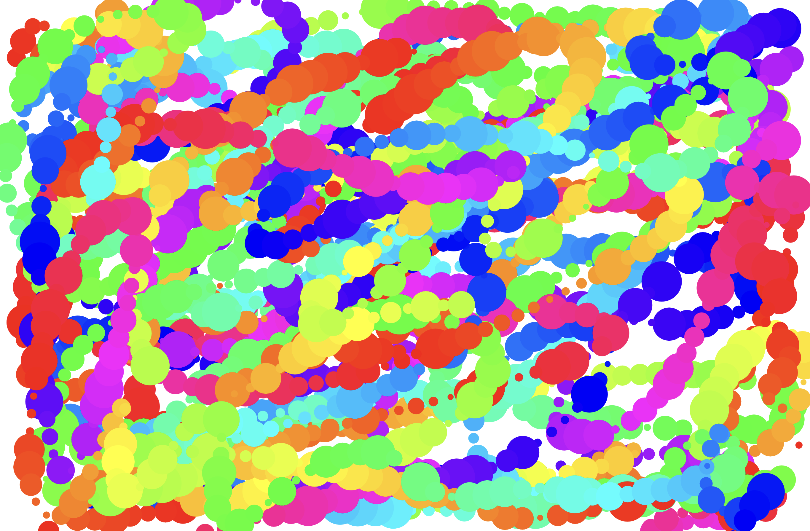
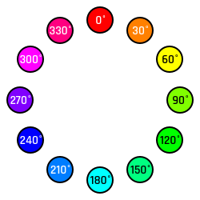
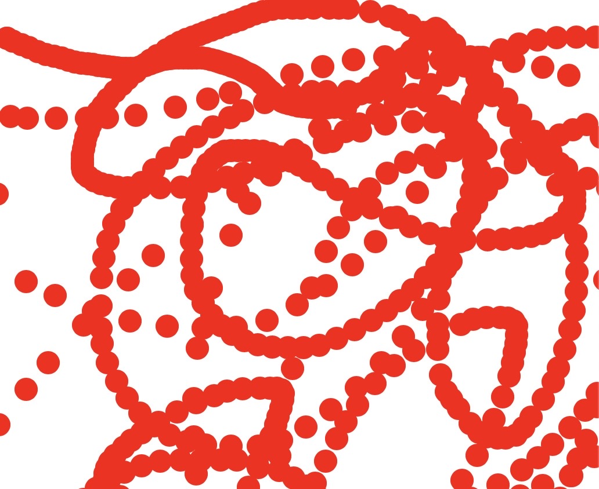
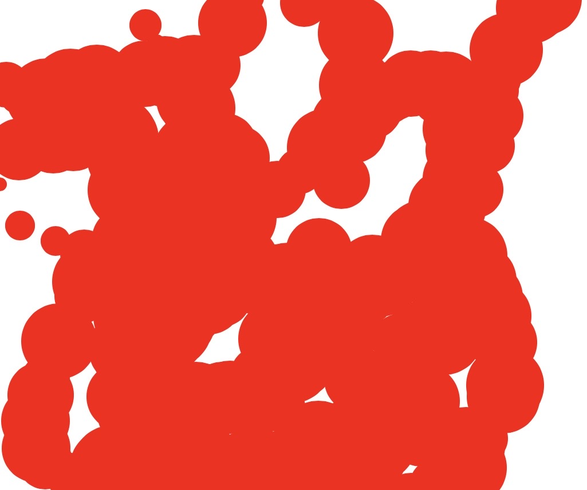
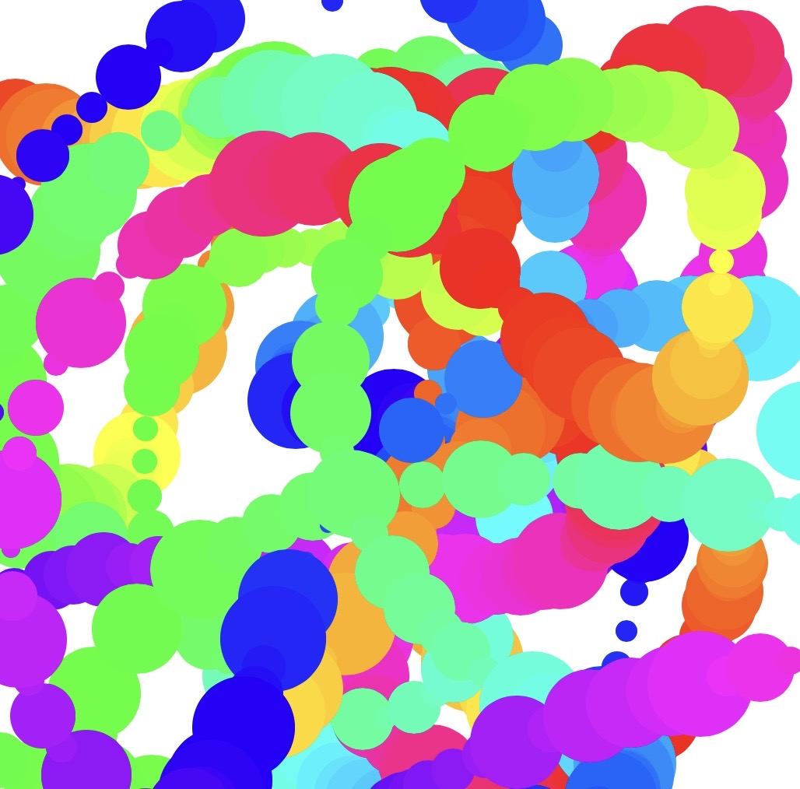

**Warning: the following workshop involves flashing colors and is not recommended for those with a history of epilepsy.**

One of the most common myths about coding among people who are first learning to code is that coding mostly consists of sitting in a dark room all day writing ~Algorithms~ in a black terminal window with green text, solving complex mathematical equations, and generally being a genius. You’re going to crush this myth in this workshop by making crazy, colorful splatter paint right in your web browser, in only 20 minutes.



## Getting started

Start by creating a new HTML project on repl.it by going to [repl.it/languages/html](https://repl.it/languages/html).

We’re going to be using a library called [Paper.js](http://paperjs.org), which makes it easy to create cool visuals on an [HTML canvas](https://www.w3schools.com/html/html5_canvas.asp).

To import a JavaScript library in HTML, we use the `<script>` tag and include a link to the library we want to import. For Paper.js, this looks like:

```html
<script src="https://unpkg.com/paper@0.11.5/dist/paper-full.min.js"></script>
```

Add a script tag that imports Paper.js somewhere in the `<head>`. Then, directly under it, add the following:

```html
<script
  type="text/paperscript"
  canvas="splatterPaint"
  src="/script.js"
></script>
```

Let’s go over what each attribute of this tag does:

1. `type="text/paperscript"` tells Paper.js that the code in the script is Paper.js code
2. `canvas="splatterPaint"` refers to the ID of the HTML canvas that Paper.js will operate on (we haven’t created this canvas yet, but we will in a second)
3. `src="/script.js"` means that the content of this script is located in your `script.js` file

Remember when we referred to a canvas called `splatterPaint` that hasn’t been created yet? Let’s create that canvas. In the `<body>`, remove the line that imports `script.js` and replace it with

```html
<canvas id="splatterPaint"></canvas>
```

Amazing—we’ve got ourselves a canvas!

## Drawing some circles

Now that we’ve successfully imported Paper.js and created a canvas to work on, it’s time to write the JavaScript code that will create our splatter paint.

Let’s write a function that draws a circle at the cursor’s position whenever the mouse is moved.

Navigate to your `script.js` file and create a function called `onMouseMove`:

```js
function onMouseMove(event) {}
```

Although you can normally call functions whatever you want, it’s important that this function is called `onMouseMove` and passes in an `event`. Paper.js knows what `onMouseMove` is—when it sees this function, it will know to run the code you write inside it every time your mouse moves, and that the `event` you pass in is a [Paper.js Mouse Event](https://paperjs.org/reference/mouseevent/). Cool, right?

Time to draw our circle! Inside the function you just created, add this code snippet, which creates a circle at the mouse cursor with a radius of 10px:

```js
var path = new Path.Circle({
  center: event.middlePoint,
  radius: 10
})
```

If you run your repl now and move your mouse around, you’ll see...nothing. You are, in fact, drawing circles, but the circles are currently transparent. So, let’s give them some color. Under the previous code snippet, still in the `onMouseMove` function, add:

```js
path.fillColor = {
  hue: 0,
  saturation: 1,
  brightness: 1
}
```

Right now, your entire `script.js` file should look like this:

```js
function onMouseMove(event) {
  var path = new Path.Circle({
    center: event.middlePoint,
    radius: 10
  })
  path.fillColor = {
    hue: 0,
    saturation: 1,
    brightness: 1
  }
}
```

Instead of using the more common hexademical or RGB color systems, Paper.js uses the HSB color system, which uses angles on a color wheel to describe color. In the HSB color system, 0 = 0° = red, and `360*n`° is also red.



(If you’re interested in learning more about the HSB color system, check out [this fantastic explanation](https://learnui.design/blog/the-hsb-color-system-practicioners-primer.html))

With this in mind, try running your repl now. Because you set `hue` to 0, you’re now drawing red circles! But your circles only appear in the top left corner of the screen. That’s because the width and height of your canvas are currently set to the Paper.js defaults (300px by 150px).

Let’s make your canvas fill the whole screen. In your `style.css` file, add the following:

```css
canvas {
  width: 100%;
  height: 100%;
}
```

Run your repl again.

Almost there. The CSS you just wrote set the canvas width and height to 100% of the parent element. In your `index.html` file, `<body>` is parent element of the `<canvas>` because you created the canvas in between the `<body>` tags.

`<body>` is currently as big as its own parent element, `<html>`, which doesn’t quite fill the whole screen. With this in mind, add the following to your CSS file:

```css
html,
body {
  width: 100%;
  height: 100%;
  margin: 0;
}
```

This sets the width and height of the body to the width and height of your screen, and removes any extra space between the edge of your screen and the body.

Just to recap: your entire CSS file should now look like this:

```css
html,
body {
  width: 100%;
  height: 100%;
  margin: 0;
}
canvas {
  width: 100%;
  height: 100%;
}
```

If you run your repl again, you should notice that your red circles are now filling the entire screen. Woohoo!



## Making it splattery

We’re getting somewhere, but this still doesn’t feel very splattery.


Part of what makes splatter paint so fun to create and look at is the chaotic randomness of everything on the canvas. So, if you want to get your website as close to splatter paint as possible, the best way to do it is to introduce some randomness.

Change the radius of your circles from `10` to `Math.floor(Math.random() * 30) + 5`. This makes the radius a random number between 5 and 30. Then run the repl again.



Not bad, but it feels sort of mashed together, doesn’t it? Maybe we can make each circle unique by making it a different color than the last. Try changing the hue from `0` to `event.count * 3`. Run the repl and see what happens.



`event.count * 3` creates a rainbow effect by setting the hue on each circle to the total number of times a circle has been drawn multiplied by 3, which jumps around the HSB color wheel. And it looks great!

Congratulations—you can now splatter colorful circles all over your screen! If you haven’t already, open your repl in a new tab and treat yourself to a bigger canvas to go crazy on.

## Hacking

Your journey is far from over. There are endless directions you can take this project in. Here are a few suggestions.

1. If you want to increase the distance between each circle, you can add `tool.fixedDistance = SOME_NUMBER` to the top of your `script.js` file. This will fire the event after your cursor has moved every `SOME_NUMBER`px instead of every time your mouse moves. You can set it to fixed number, or you can make it random!
2. If you find the rainbows too predictable, you can set the hue to a random number between 0 and 360 (remember, this covers every color on the HSB system).
3. Who says your canvas has to be white? Try setting the background color of your website to something custom—your favorite color, an image, or even a [gradient](https://developer.mozilla.org/en-US/docs/Web/CSS/linear-gradient)—and/or change it every time a new circle is created.
4. Who says you have to draw circles? Try drawing a random mix of circles, ovals of random lengths and widths, and other shapes.
5. Randomness is fun, but controlled randomness is even more fun. Take a look at the [Paper.js docs on mouse events](https://paperjs.org/reference/mouseevent/). How can you use the properties of the MouseEvent to play with the radius? (here’s what I came up with: try setting the radius to `event.delta.length` and see what happens)
6. If you want to hurt your eyes and ears, try using the [Tone.js](https://tonejs.github.io) library to play a synth sound of a random frequency whenever a new circle is created.

Here are some example projects that have stemmed from this project:

- [https://welllitvelvetyoperation.techbug2012.repl.co](https://welllitvelvetyoperation.techbug2012.repl.co)
- [https://splatter-paint-crazy.techbug2012.repl.co](https://splatter-paint-crazy.techbug2012.repl.co) (**WARNING: FLASHY COLORS**)
- [https://wlhc-paperjs-demo-custom1.glitch.me](https://wlhc-paperjs-demo-custom1.glitch.me)

Now, your task is to spend the rest of the meeting making this project insanely cool and totally unique.
