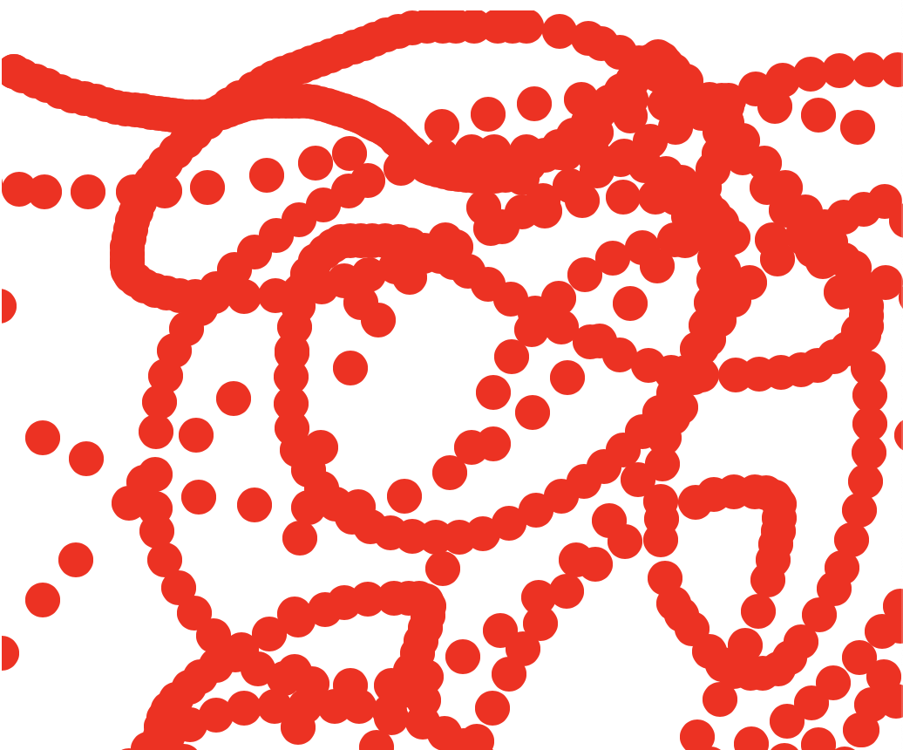
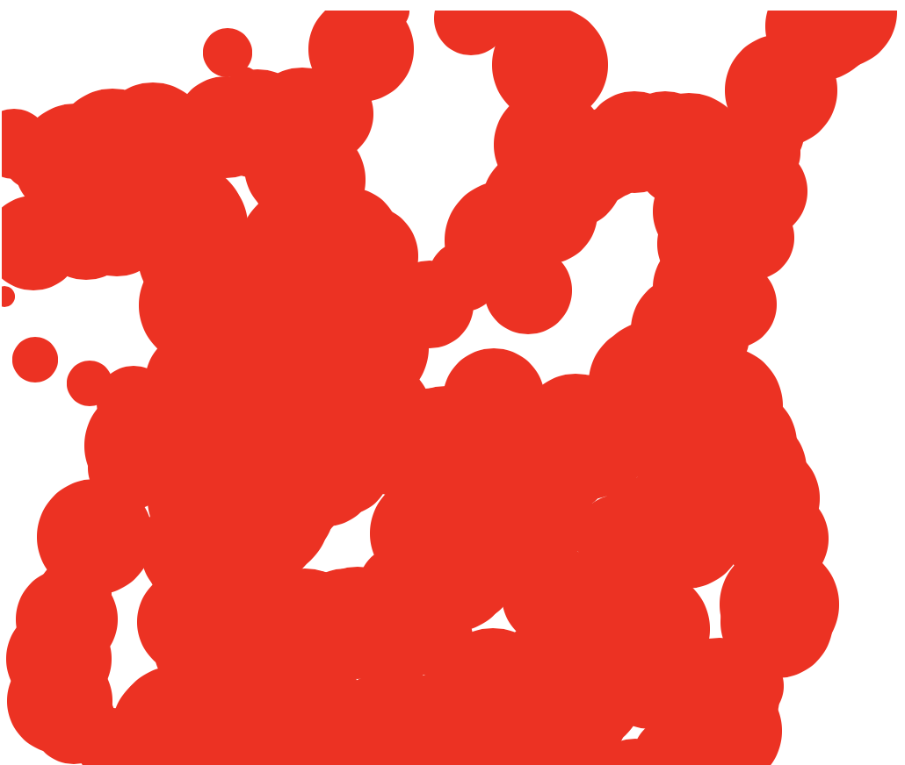
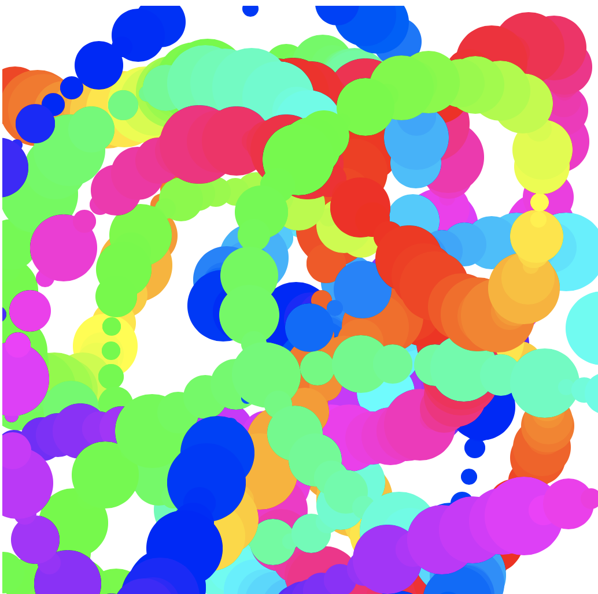

**Warning: the following workshop involves flashing colors and is not recommended for those with a history of epilepsy.**

One of the biggest fears that many people have when learning to code is that coding requires solving complex mathematical problems and a deep technical understanding of how computers work. We’re going to crush this myth in this workshop by making crazy, colorful splatter paint right in your browser.


## Getting started
Create a new HTML project on repl.it by going to [repl.it/languages/html](https://repl.it/languages/html)

We’re going to be using a library called [Paper.js](http://paperjs.org), which makes it easy to create cool visuals on an [HTML canvas](https://www.w3schools.com/html/html5_canvas.asp).

To import a Javascript library in HTML, we use the `<script>` tag and include a link to the library we want to import. For Paper.js, this looks like:

```html
<script src="https://unpkg.com/paper@0.11.5/dist/paper-full.min.js"></script>
```

Add a script tag that imports Paper.js somewhere in your `<head>` tag. Then, directly under it, add the following:

```html
<script type=“text/paperscript” canvas=“splatterPaint” src=“/script.js”></script>
```

Let’s go over what each attribute of this tag does:

1. `type=“text/paperscript”` tells Paper.js that the code in the script is Paper.js code
2. `canvas=“splatterPaint”` refers to the HTML canvas that Paper.js will operate on
3. `src=“script.js”` means that the content of this script is located in your `script.js` file

Remember when we referred to a canvas called “splatterPaint” that hasn’t been created yet? Let’s create that canvas. In the `<body>`, remove the line that imports `script.js` (we already did that above!) and replace it with

```html
<canvas id=“splatterPaint”></canvas>
```

Amazing—we’ve got ourself a canvas!

## Writing the script
Now that we’ve successfully imported Paper.js and created a canvas to work on, it’s time to write the code that will create our splatter paint.

Navigate to your `script.js` file and add this line to the top of the file:

```js
var layer = project.activeLayer
```

This stores the currently active [Paper.js Layer](https://paperjs.org/reference/layer) to be used later.

### Making some circles!
Let’s write a function that draws a circle at the cursor’s position whenever the mouse is moved.

Start by creating an `onMouseMove()` function:

```js
function onMouseMove(event) {

}
```

Paper.js knows what `onMouseMove()` is—when it sees this function, it will run it every time the mouse is moved.

Time to draw our circle! Inside the function you just created, add this code snippet, which creates a circle at the mouse cursor with a radius of 10px:

```js
var path = new Path.Circle({
	center: event.middlePoint,
	radius: 10
})
```

If you run your repl now, you’ll see...nothing. You are drawing circles, but the circles are currently transparent. So, let’s add some color to our circles. Under the previous code, still in the `onMouseMove()` function, add:

```js
path.fillColor = {
	hue: 0,
	saturation: 1,
	brightness: 1
}
```

Instead of using hexademical or RGB colors which most people are familiar with, Paper.js uses the HSB color system, which is a system that uses angles to describe color. In the HSB color system, 0 = 0° = red, and `360*n`° is also red.


With this in mind, try running your repl now! You’ll notice that you’re now drawing red circles, but only in the top left corner of the screen. That’s because we haven’t told the canvas to fill our entire screen. Let’s fix that.

In your `style.css` file, add the following:

```css
canvas {
	width: 100%;
	height: 100%;
}
```

Run your repl again.

Almost there. The CSS you just wrote set the canvas width and height to 100% of the parent element. In our case, this is the `<body>`, which is as big as the `<html>`. With that in mind, add the following to your CSS file.

```css
html, body {
	width: 100%;
	height: 100%;
	margin: 0;
}
```

This sets the width and height of the body to the width and height of your screen, and removes any spaces between the edge of your screen and the body.

Try running your repl again.

Woohoo! You’re drawing red circles!



Try playing with the `hue`. What happens when you change it to 50? 100? 300?

You can also now play with the radius of your circles. Take a look at the [Paper.js docs on mouse events](https://paperjs.org/reference/mouseevent/). How can you use the properties of the MouseEvent to play with the radius? (here’s what I came up with: try setting the radius to `event.delta.length` and see what happens)

So far, this looks cool, but not very splattery. Let’s try changing the radius to something more fun. Change the radius from `10` to `Math.floor(Math.random() * 30) + 5`. This makes the radius a random number between 5 and 30. Run the repl again.



Not bad, but it all sort of blends together, doesn’t it? Maybe we can change the color to be fun. Try changing the hue from `0` to `event.count * 3`. Run the repl and see what happens.



Looking great!

## Hacking
There are a bunch of directions you can take this project in. Here are a few small suggestions.

1. If you want to increase the distance between each circle, you can add `tool.fixed distance = SOME_NUMBER` to the top of your `script.js` file. This will fire the event after your cursor has moved every x distance instead of every time your mouse moves.
2. If rainbows are too predictable, you can set the hue to a random number between 0 and 360 (remember, this covers every color on the HSB system)
3. Who says your canvas has to be white? Try setting the background color of your website to something custom, and change it every time a new circle is created.
4. If you want to hurt your eyes and ears, try using the [Tone.js](https://tonejs.github.io) library to play a synth sound of a random frequency whenever a new circle is created.

Here are some example projects that have stemmed from this project:

- [https://welllitvelvetyoperation.techbug2012.repl.co](https://welllitvelvetyoperation.techbug2012.repl.co)
- [https://splatter-paint-crazy.techbug2012.repl.co](https://splatter-paint-crazy.techbug2012.repl.co) (**WARNING: FLASHY COLORS**)
- [https://wlhc-paperjs-demo-custom1.glitch.me](https://wlhc-paperjs-demo-custom1.glitch.me)

Your task now is to spend the rest of the meeting making this project insanely cool and totally unique.