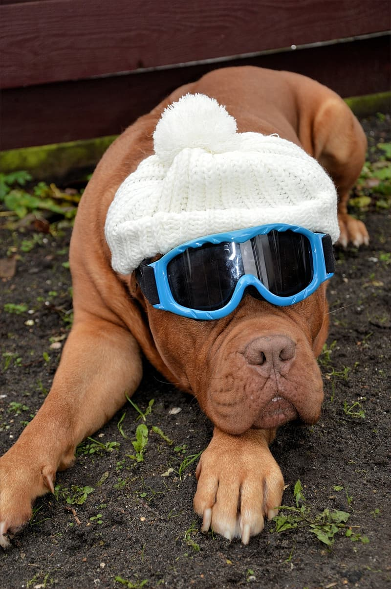
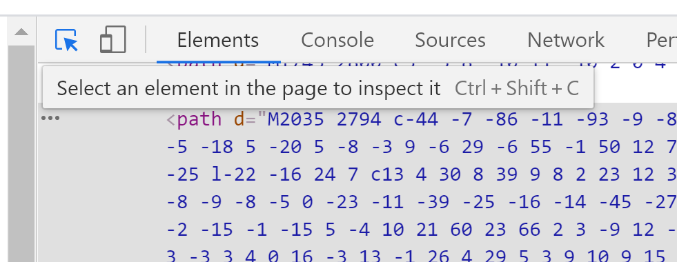
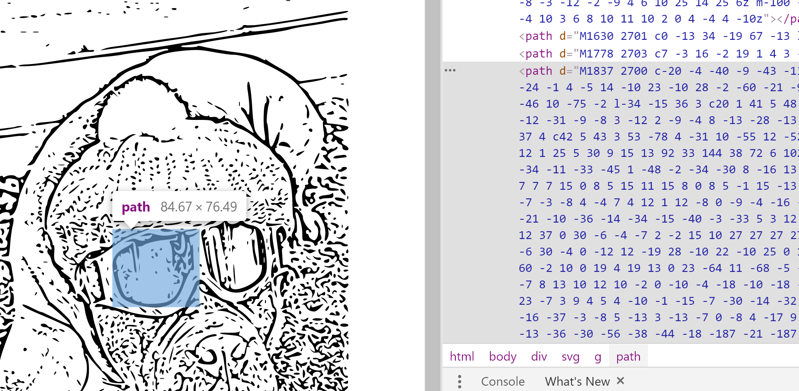
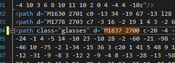

# SVG Fun

What you'll be building:

We are going to convert an image to SVG, then pick out specific paths and selectively change the color with a java script button press.

## Part I: Find an image (or use this one)

Find an image you like somewhere out there on the interwebs.
But it won't hurt our feelings if you just want to use this one for right now.



## Part II: Convert your image to SVG

What is SVG? 
SVG stands for Scalable Vector Graphics. SVG allows you to define the way an image looks with XML (very similar to HTML). 
SVG graphics are useful because they can be dynamically changed and they SCALE very easily. That means you can make them bigger or smaller without making them loose resolution or get blurry.

How do I convert my .jpg image to an SVG?? 
If you google 'convert an image to svg, you will get all kinds of results. 

https://picsvg.com/ is one that works pretty well.

Upload your image and download the SVG file. You can open the SVG file in Chrome or Safari (or any modern browser) to view the result. 
Take a look at [dog-with-hat-glasses.svg](dog-with-hat-glasses.svg). You'll notice it is really long and has lots of tags and numbers. Kinda confusing.
We are going to treat these elements just like we treat HTML elements. 

## Part III: Make an HTML file

Make a brand new html file.

```html
<!DOCTYPE html>
<html>
  <head>
    <title>SVG Fun</title>
    <meta name="viewport" content="width=device-width, initial-scale=1" />
    <meta charset="utf-8" />
  </head>

  <body>
    <h1>Who knew SVG could be so fun?</h1>
    <hr />

    <div align="center">

    <!-- Paste your SVG element here with all of its children elements -->
    
    </div>

    <script
      src="https://code.jquery.com/jquery-3.1.1.min.js"
      integrity="sha256-hVVnYaiADRTO2PzUGmuLJr8BLUSjGIZsDYGmIJLv2b8="
      crossorigin="anonymous"
    ></script>
    <script type="text/javascript" src="script.js"></script>
  </body>
</html>
```

## Part IV: Find the SVG paths we want to dynamically color

Chances are, your SVG is full of about a million path elements. Each one of these represent a little shape of black in your svg rendering. We want to find the paths that represent the glasses on the dog so we can color them another color. 
To do this, we are going to take a look at our new html file in the browser's develoer tools and find the path that represents the glasses. To open developer tools on your browser, use the F12 key when your browser is in the foreground.

Use this button to activate the element selector in the browser developer tools:


Zoom in if you need to - remember these graphics are easily scaled!



Find the same element in your html file, using the first 8 characters (in this case 'M1837 2700'), and add a class="glasses" attribute.
This is kinda tricky. Kinda feels like you are hacking something... LOL



## Part V: Make a javascript file

Make a brand new java script file and put this in it.
Notice that we aren't even using jQuery to find the elements with the class glasses. jQuery doesn't give you easy access to SVG, so we are going to use old-school javascript - without jQuery.
In this little function, we are just finding the elements that have the class named 'glasses' and changing the fill color to whatever color name is passed in.

```js
function changeGlasses(color) {
    var x = document.getElementsByClassName("glasses");
    var i;
    for (i = 0; i < x.length; i++) {
        x[i].style.fill = color;
    }
}
```

## Part VI: Add a couple buttons

When you click on these buttons, you dynamically change the fill color of the paths that you identified!

```html
    <div align="center">
        <button onclick="changeGlasses('red')">
            Glasses should be Red!
        </button>
        <button onclick="changeGlasses('green')">
            No, Green!
        </button>
        <button onclick="changeGlasses('purple')">
            Purple is best!
        </button>
    </div>
```


## Part VII: Whatever you do... 

Whatever you do, please don't take pictures of your friends or pets and selectively and dynamically color them! LOL

