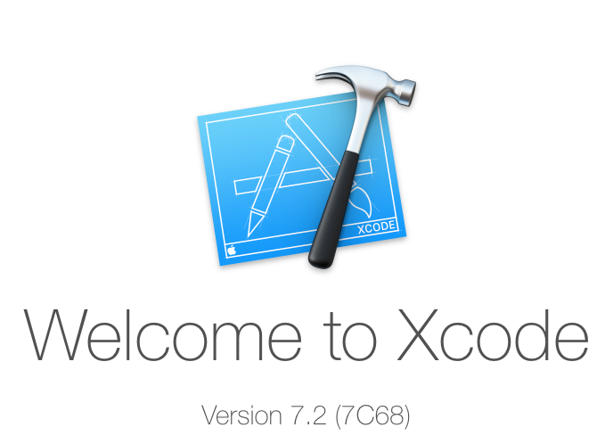
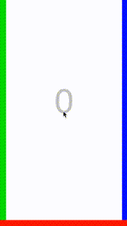
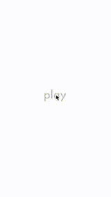

# Swiper

### What You Are Going To Make

This tutorial is an introduction to iOS Game Development with Swift. Along with
making a fun and simple game, you will learn the basics of:

- Xcode (where you code the app)
- Swift (the language you write in)

Here is a demo of the final game:

### How to Use This Tutorial

Don't feel obligated to follow this tutorial step-by-step. Everybody learns at
their own pace and with their own style. Here are some suggestions on how to get
the most out of this tutorial:

**If you have never programmed before:**

- No worries! Walk through the tutorial step-by-step!

**If you have programmed a _little_:**

- Follow along or skim through this tutorial step-by-step.

**If you have more experience:**

- You already know the basics of coding. Maybe you have followed one of the
  other game workshops here and you want to learn about iOS development. Jump
  around in this tutorial to get the most out of it. Feel free to skip some
  sections and make the game your own.

### Steps

| **[   1. Set Up Xcode](set_up_xcode.md)**                     | **[   2. Create Play Screen](play_screen.md)**    | **[   3. Create the Walls](walls.md)**                  |
| ---------------------------------------------------------------------------------- | --------------------------------------------------------------------- | ---------------------------------------------------------------------------- |
| **[   4. Create Score Label](score_label.md)**                | **[   5. Create Box Spawning](box_spawning.md)**   | **[   6. Swipe Functionality](swipe_functionality.md)** |
| **[   7. Add Collision Detection](collision_detection.md)** | **[   8. Create Retry Screen](retry_screen.md)** |                                                                              |
