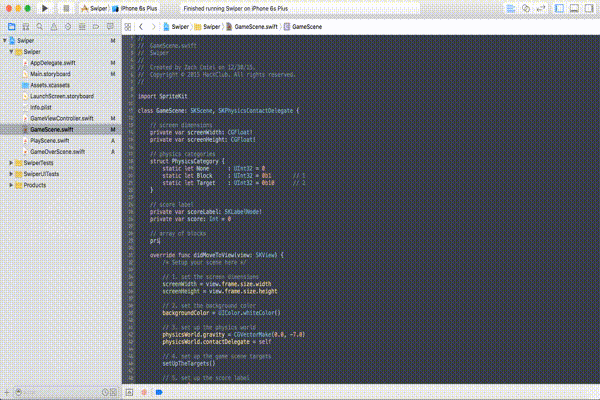

# Box Spawning

### Arrays

Now we are going to set up the `GameScene.swift` file for the spawning of the boxes. First we need to create an `NSMutableArray` to store all of the boxes in. This will enable us to keep track of all of the boxes we create. An array is a special type of object that can hold other objects. It is like a container of objects. An `NSMutableArray` is an array that can be changed, modified, and *mutated* overtime. The opposite is an `NSArray` which cannot be changed.

Below the block of code in which we declared the `scoreLabel` and score `Int`, let's define our `NSMutableArray` and `Int`.

	// array of blocks
    private var arrayOfBlocks: NSMutableArray!
    private var numOfBlocks: Int = 0

### Initializing the Array and Spawning Boxes

In order to utilize the array, we need to initialize it first. All initializing it does is prep it for objects to be put in it. Then we make sure that `numOfBlocks` is equal to `0`.

After that, we create a couple of `SKAction`'s. The first is an `SKAction` that delays the game from running for `0.75` seconds. Then an `SKAction` for running a block of code. Lastly we start to bundle all of these actions together. We firstly sequence the delay and block action together. Then we tell the program to repeat this sequence of actions forever. Then we run this action. You will get an error on the line of `self.createBlock()`, but this will get fixed later on.

		// 6. initialize the array of blocks
        arrayOfBlocks = NSMutableArray()
        numOfBlocks = 0
        
        // 7. start spawning the blocks
        let wait = SKAction.waitForDuration(0.75)
        let makeBlock = SKAction.runBlock { () -> Void in
            self.createBlock()
        }
        let sequence = SKAction.sequence([wait, makeBlock])
        let repeatForever = SKAction.repeatActionForever(sequence)
        runAction(repeatForever)
            
### Creating Blocks

We will create the method to create the blocks we are going to be spawning in two parts. Here is the first part where we add a block to a screen. In the first part we need to select a random color to set the box. To do this we first create a variable of type `UIColor`. The default value will be blue. Then, we create an `Int` that stores a random value from 0-2. Based on this random value, we set the color to either red, green, or blue. Now that the color is created, we create the block, but you will not see it on the screen because the alpha will be set to 0 so we can have a cool fade in animation on it. We do this the same as the walls. We create an `SKSpriteNode` and then create the `physicsBody` to attach. Place this code right underneath the `createWalls()` method we created before.

	func createBlock() {
        // 1. create the block
        var color = UIColor.blueColor()
        let rand = arc4random_uniform(3)
        
        if rand == 0 {
            color = UIColor.redColor()
        } else if rand == 1 {
            color = UIColor.greenColor()
        } else if rand == 2 {
            color = UIColor.blueColor()
        }
        
        let block = SKSpriteNode(color: color, size: CGSizeMake(screenWidth * 0.1, screenWidth * 0.1))
        block.position = CGPointMake(screenWidth / 2.0, screenHeight / 2.0)
        block.alpha = 0.0
        addChild(block)
        
        block.physicsBody = SKPhysicsBody(rectangleOfSize: block.size)
        block.physicsBody?.dynamic = true
        block.physicsBody?.affectedByGravity = false
        block.physicsBody?.categoryBitMask = PhysicsCategory.Block
        block.physicsBody?.contactTestBitMask = PhysicsCategory.Target
        block.physicsBody?.collisionBitMask = PhysicsCategory.None
    }
    
Now we need to make the block fall to the ground. First to keep track of the blocks, let's add it to the array. Then we need to play around with the physics of the block. First we apply what is called an impulse to the block. We fade in the block and once it is finished animating in, we apply an impulse to the left or right depending on how many blocks have been created. After each animation, we increment the `numOfBlocks` variable. Write this in right above the `}` of the last code block we wrote. 
    
    	// 2. add block to array
        arrayOfBlocks.addObject(block)
        
        // 3. apply impulse either right or left depending on the number of blocks is even (right) or odd (left)
        block.runAction(SKAction.fadeAlphaTo(1.0, duration: 0.1), completion: {
            block.physicsBody?.affectedByGravity = true
            if self.numOfBlocks % 2 == 0 {
                block.physicsBody?.applyImpulse(CGVectorMake(self.screenWidth * 0.01, self.screenWidth * 0.025))
            } else {
                block.physicsBody?.applyImpulse(CGVectorMake(-(self.screenWidth * 0.01), self.screenWidth * 0.025))
            }
        })
        
        // 3. increment the number of blocks
        numOfBlocks++
                
### Run the Project

Now, let's run the project! Once you press play, you should see the boxes being spawned!

### Recap

You learned how to:

* Create an `NSMutableArray`
* Initialize an `array`
* Use `SKAction`
* Generate a random `Int`
* Animate an `SKSpriteNode` in
* Add an object to an `NSMutableArray`
* Apply an `impulse` to a `physicsBody`

--------------------------------------------------------------------------------

We are getting close to a complete game! In Part 6, we are going to be able to swipe the blocks left and right!