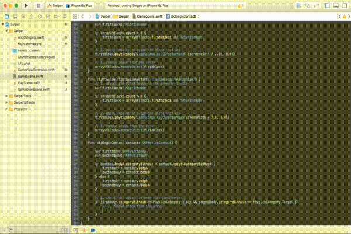

# Collision Detection

### Implementing the Delegate Method

All right! We finally can make this a game a game! How are we going to do this?? Add physics! Remember when we added the `SKPhysicsContactDelegate` to the `GameScene.swift` file?? Well, now we can use the delegate's special method for collision detection called the `didBeginContact()` method. The code below is the basic setup for the method. First you create two variables, one for each physics body that you are checking collisions for. The second part, is beyond the scope of this tutorial, but just know that it sets up the code for the rest of the method. Write in this code before the last `}` in the file.

	func didBeginContact(contact: SKPhysicsContact) {
        
        var firstBody: SKPhysicsBody
        var secondBody: SKPhysicsBody
        
        if contact.bodyA.categoryBitMask < contact.bodyB.categoryBitMask {
            firstBody = contact.bodyA
            secondBody = contact.bodyB
        } else {
            firstBody = contact.bodyB
            secondBody = contact.bodyA
        }
    }
    
### Set Up The If Statement

Now, let's start filling out the method. This, `if` statement checks the `PhysicsCategory` of the two physics bodies to check to see if the collision was indeed between a block and a target. This is just the frame of the `if` statement. Write this before the `}` of the method.

	// 1. check for contact between block and target
   	if firstBody.categoryBitMask == PhysicsCategory.Block && secondBody.categoryBitMask == PhysicsCategory.Target {
            
    }
    
### Remove the Block From the Array

Let's start filling the `if` statement in. The first line that we will add, will remove the block in the collision from the `arrayOfBlocks`. This allows to access the next block in the array and not swipe the same block every time. Write this inside of the `{}` of the if statement.

	// 2. remove block from the array
    arrayOfBlocks.removeObject(firstBody.node!)
    

    
### Create Variables for the Block and Target

Now, we set up the last, final `if` statement. We create two variables of type `SKSpriteNode` for the block and the target. This will go underneath the block removal code we just wrote.

	// 3. check to see if block was swiped to correct side
    let block = firstBody.node as! SKSpriteNode
    let target = secondBody.node as! SKSpriteNode
    

 
### Check Collision

Get ready for the last bit of code we will write in the `GameScene.swift` file! This last part will be an `if` statement. Let's check to see if the block's color corresponds with the target's color. This will then increment the `score` variable, consequently update the `scoreLabel` with the updated `score` and then finally remove the block from the screen. If the color's do not respond, we stop the blocks from spawning by the line of code: `removeAllActions()`. Then we remove all blocks from the screen, and lastly we transition to the `GameOverScene`. Fill this in at the bottom of the method before the `}`.

	if block.color == target.color {
    	// 4. increment the score
      	score++
                
     	// 5. update the score label
		scoreLabel.text = "\(score)"
                
		// 6. remove the block
		firstBody.node?.removeFromParent()
 	} else {
    	// remove all actions so the blocks stop spawning
		removeAllActions()
                
		// remove all blocks on the screen
		removeChildrenInArray(arrayOfBlocks as AnyObject as! [SKNode])
                
		// wait for a second and then create the game over screen
    	runAction(SKAction.waitForDuration(1.0), completion: {
   			let gameOver = GameOverScene(size: self.scene!.size)
			gameOver.scaleMode = .AspectFill
			self.view?.presentScene(gameOver, transition: SKTransition.revealWithDirection(.Left, duration: 0.5))
		 })
	}
	
### Set Up the Game Over Screen

As we have with the `PlayScene.swift` and `GameScene.swift` let's prep the `GameOverScene.swift` to transition to. You should know how this goes by now.

### Run the Project

Finally, let's run the project to see what we've just done! Run it and have fun playing our nearly complete game!

### Recap

You learned how to:

* Set up the `didBeginContact()`
* Check for a `collision` using a `PhysicsCategory`
* Update an `SKLabelNode`
* Stopping an `SKAction`
* Remove all nodes on the screen using an `array`

--------------------------------------------------------------------------------

One more part left! Next we will fill out the `GameOverScene.swift`, and finish out your first game!
