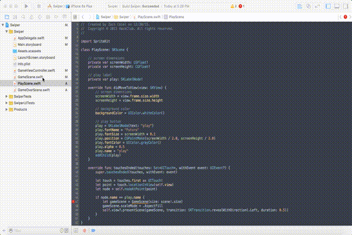

# Creating the Play Screen

### Variables

Variables are in every program you see. They are one of the building blocks of
programming. A variable is a block of memory that holds a piece of data. There
are two types of variables in Swift. One is a `constant` and the other is a
`variable`. A `constant` is defined by the `let` keyword and its value cannot be
changed once its set. A `variable` is defined by the `var` keyword and its value
can be changed at any time. Now lets make our first variables in the
`PlayScene.swift` file.

```swift
// screen dimensions
private var screenWidth: CGFloat!
private var screenHeight: CGFloat!

// play label
private var play: SKLabelNode!
```

Write the above code under this line:

```swift
class PlayScene: SKScene {
```

In the above code we create three variables. The first two as stated by the
comment above it creates two variables of type `CGFloat` meaning they can hold
floating point numbers or decimals. We do not set the value for either of these
yet though. The third variable is actually a special type of variable, an
**object**. It is of type `SKLabelNode` meaning that it is a label that can be
displayed on screen.

### Creating the Play Label

Now that we have created the variables necessary to get started, we can create
the play label and display it on the screen! A `method` is a block of code in
which an action is carried out.

So to do a quick recap, we have learned 3 important keywords so far: `class`
`object` and `method`. Think of a `class` as like a container for all of your
code. An object represents all of the elements and characters of your game. A
method performs actions on all of the objects such as making the object jump or
allowing the play button to be interacted with.

In the code snippet below, the code is in the `method` named `didMoveToView()`.
This method is the first bit of code that runs in an `SKScene`. All of your
setup code will be written in this method. First you set the screen dimension
`variables`. These variables will help with positioning and sizing sprites on
screen based on the size of the device. Next, you set the background color of
the screen to be white. If you notice you did not need to define the
`backgroundColor` variable. This is because `backgroundColor` comes with the
`SKScene` class. Once you state that the `PlayScene` is a `SKScene` the
`backgroundColor` variable is defined. The next block of code creates the play
button. An `SKLabelNode` has a bunch of `properties` that allow you to modify
the object. These `properties` include the `fontName` `fontSize` `position`
`fontColor` `alpha` and `name`. The `name` property helps with later code so you
do not need to understand what this property is. Everything else should be
pretty self explanatory, but if you need any further clarification read more
[here in Apple's Documentation](https://developer.apple.com/library/ios/documentation/SpriteKit/Reference/SKLabelNode_Ref/).
Now write this code below where we defined the three variables.

```swift
override func didMoveToView(view: SKView) {
	// screen dimensions
   	screenWidth = view.frame.size.width
	screenHeight = view.frame.size.height

	// background color
	backgroundColor = UIColor.whiteColor()

	// play button
	play = SKLabelNode(text: "play")
	play.fontName = "Futura"
	play.fontSize = screenWidth * 0.1

   	play.position = CGPointMake(screenWidth / 2.0, screenHeight / 2.0)
	play.fontColor = UIColor.grayColor()
	play.alpha = 0.5
	play.name = "play"
	addChild(play)
}
```

### Handling Touches

Just like the `backgroundColor` variable, a whole bunch of methods come along
with `SKScene` including `touchesBegan` `touchesMoved` and `touchesEnded`. These
three methods handle when the user touches the screen, when the user moves
his/her finger on the screen, and when the user lifts his/her finger off the
screen respectively. We will be handling our touches in the `touchesEnded`
method.

In this method three `constants` are created storing the touch, the point at
which the touch is on the screen, and the node or sprite which the touch is
touching. Using the node `constant` we can see if the touch is touching the play
`SKLabelNode` we created earlier. This is where the `name` property comes in
handy. The name is like a unique tag that we can give nodes. We can use this tag
to retrieve that specific node at any time. In this case we will use an if
statement to see if the node's name is the same as the play label's name then we
can transition to the `GameScene`. Copy this code down below the ending `}` of
the `didMoveToView()` method.

```swift
override func touchesEnded(touches: Set<UITouch>, withEvent event: UIEvent?) {
	super.touchesEnded(touches, withEvent: event)

 	let touch = touches.first as UITouch!
	let point = touch.locationInView(self.view)
  	let node = self.nodeAtPoint(point)

	if node.name == play.name {
  		let gameScene = GameScene(size: scene!.size)
 		gameScene.scaleMode = .AspectFill
   		self.view?.presentScene(gameScene, transition: SKTransition.revealWithDirection(.Left, duration: 0.5))
 	}
}
```

Now, there should be an error icon popping up inside the if statement somewhere
near this line of code `let gameScene = GameScene(size: scene!.size)`. This is
because we have done nothing to the `GameScene.swift` file to make it ready to
be transitioned to! In order to fix this we need to do the same thing we did to
the `PlayScene` and change it to be of type `SKScene`.



Now you can run the project, press the play button and see the game transition
to the `GameScene` which is a dark gray screen with nothing on it, but hey it's
something!


### Recap

You learned how to:

- Create a `variable`
- Create a `method`
- Set the `backgroundColor` of an `SKScene`
- Create a `SKLabelNode`
- Handle touches and use the `name` property of a `node` to see if a specific
  `node` was touched
- Transition to a different `SKScene`

--------------------------------------------------------------------------------

You are ready to go to Part 3 where you start to create the `GameScene` by
adding walls!
