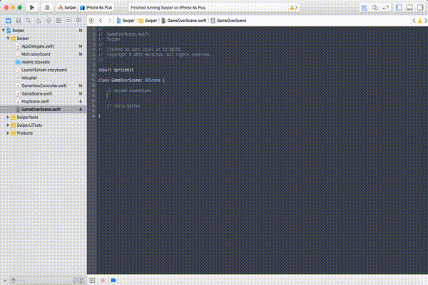
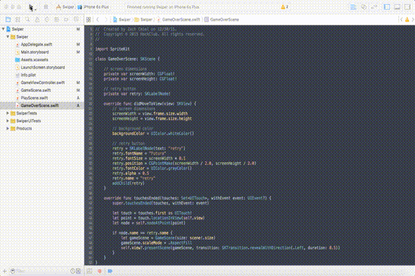

# Game Over

### Screen Dimension Variables and Retry Label

Like the rest of the files, let's set up the class by making our `screenWidth` and `screenHeight` variables. But let's also declare an `SKLabelNode` variable right underneath it.

```swift
// screen dimensions
private var screenWidth: CGFloat!
private var screenHeight: CGFloat!
    
// retry button
private var retry: SKLabelNode!
```
    


### Set Up the Label

Now, let's create the `didMoveToView()` method and add the `SKLabelNode` to the screen. We should know how to do this, but here's the code just in case.

```swift
override func didMoveToView(view: SKView) {
	// screen dimensions
	screenWidth = view.frame.size.width
	screenHeight = view.frame.size.height
        
	// background color
	backgroundColor = UIColor.whiteColor()
        
	// retry button
	retry = SKLabelNode(text: "retry")
	retry.fontName = "Futura"
	retry.fontSize = screenWidth * 0.1
	retry.position = CGPointMake(screenWidth / 2.0, screenHeight / 2.0)
  	retry.fontColor = UIColor.grayColor()
	retry.alpha = 0.5
	retry.name = "retry"
	addChild(retry)
}
```
    
### Interact With the Label

Finally, let's implement the `touchesEnded()` method.

```swift
override func touchesEnded(touches: Set<UITouch>, withEvent event: UIEvent?) {
	super.touchesEnded(touches, withEvent: event)
        
	let touch = touches.first as UITouch!
	let point = touch.locationInView(self.view)
	let node = self.nodeAtPoint(point)
        
	if node.name == retry.name {
		let gameScene = GameScene(size: scene!.size)
		gameScene.scaleMode = .AspectFill
		self.view?.presentScene(gameScene, transition: SKTransition.revealWithDirection(.Left, duration: 0.5))
	}
}
```
    
No surprises here. We track the touches and then transition to the `GameScene.swift` file once the label is touched.

### Run the Project

Let's run the project!



### Conclusion

Congratulations! You finished your first iOS game! I hope that this tutorial helps you and gives you the confidence to create more games and apps! This tutorial wasn't intended to teach you all aspects of coding with Swift and SpriteKit. This was just supposed to be an introduction; after all the Swift language is far too vast to learn everything. But learning just enough is all you need to make awesome apps. When you code, you learn something new everyday and when you run into a problem, your best friend is... Google! Look up your questions and read through the various tutorials, articles, and forum questions. [Here's a good guide on learning difficult concepts.](https://medium.com/learning-new-stuff/a-simple-technique-to-learn-hard-stuff-ffaa7879bf7c#.x5eeecmiw)

Thank you for sticking with me in this tutorial! Once again, I hope that this helped! If you have any questions, comments, or feedback, feel free to email me at zachary.cmiel@gmail.com! Good luck!
