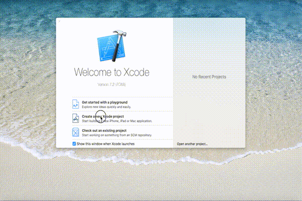
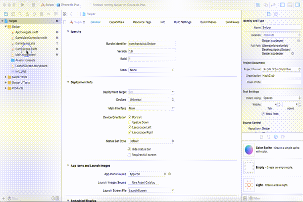
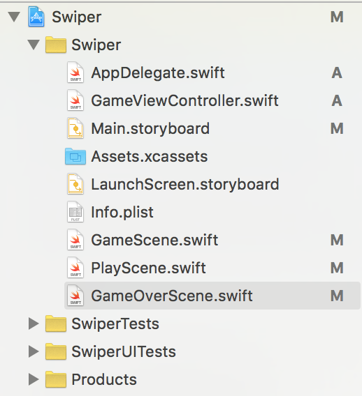
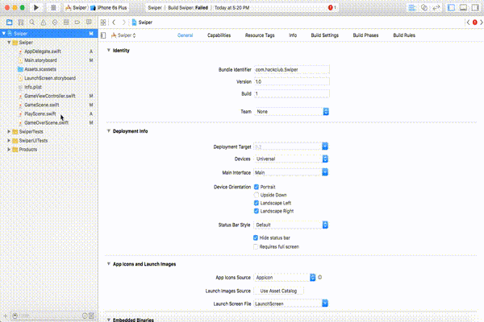

# Installing Xcode

### Setting Up Your Workplace

Xcode is the space that you write all of your code in. It is a free Mac app that you can download from the App Store. This tutorial assumes that you have already downloaded Xcode and are prepared to create your first project with it.

If you haven't downloaded Xcode yet, [here is a great guide, directly from Apple, to get you started](https://developer.apple.com/library/ios/referencelibrary/GettingStarted/DevelopiOSAppsSwift/). Just scroll down to the section titled **To download the latest version of Xcode**.

Alright, once you have Xcode installed, you are ready to create your first project! First, press the Xcode icon on your dock. This should create a pop-up, prompting you to create a project or open an existing one. First, click *Create a New Xcode Project* which should take you to a screen asking you what kind of project to make. Select *Game* and press *Next*. Now you need to fill in your project information. The product name can be whatever you would like. We will call this game *Swiper*. The organization name is the same as your company name which can be whatever you wish. The field directly below that, the organization identifier, will be in the format **com.organization-name**. Make sure Swift is set as the language, devices set to Universal, and both of the boxes below checked. Select *Next* and then choose a location for which you want the project.

### Xcode Simulator

Now, that you have the project created, you can run your project! Press the play button in the top left corner and what is called the **Xcode Simulator** will appear. The Xcode Simulator is a tool that comes with Xcode in which you can test and play with your game.

### Classes

Now, let's start setting up the project so we can start making the game! First we have to delete a couple of files. Right click on both `GameScene.swift` and `GameScene.sks` and click *Delete*. Select *Move to Trash* in the pop-up that appears.

Alright! Now we can start creating. First we must create the class that the bulk of the code for the game will be. A class is the container in which the code will be in. Each class will contain the code for a screen. So we will have three of them. One for the Title Screen, Game Screen, and Game Over Screen. To make a class, click *File* -> *New* -> *File*. Then, name the file `GameScene.swift`. Then click *Create*. This will be your new Game Scene. 

Repeat the last step of creating a class two more times to create a file named `TitleScene.swift` and `GameOverScene.swift`.

### The SpriteKit Framework

To start to code our game, we are going to begin with the title screen. To utilize the SpriteKit framework, we must modify the `PlayScene.swift` file a little.

> The SpriteKit framework is a bunch of pre-made code, created by Apple. It assists the game creator in making games by making it easier to add sprites (characters) onto the screen and animating them and interacting with them.

Swift files by default, when created, won't be utilizing the SpriteKit Framework. In order to use it, we need to modify the code in the `PlayScene.swift` file. At the top of the file it has an `import` statement. We need to change this line to say `SpriteKit` instead of `Foundation`.

`import Foundation -> import SpriteKit`

Then add this code directly underneath the new `import` statement.

`class PlayScene: SKScene {`

`}`

This code defines the `class PlayScene` as of type `SKScene`, meaning that you can now add sprites to the `PlayScene`.

To finish up part one of this tutorial, we will now navigate to the `GameViewController.swift` file. This is the file that transitions to the first scene of your game. In our case this would be the `PlayScene`. Once you are in the `GameViewController.swift` file notice how at the top of the file there are seven lines prefixed by two backslashes `//`. This indicates that the line is a **comment**. A comment is a line or lines of code that will not be registered by the compiler meaning they have no affect on the program. They are commonly used to label code and explain in plain English what the following lines of code will do. You will see more examples of this later on. Under these lines of code, delete everything, and replace it with this code.

	import UIKit
	import SpriteKit
	import GameKit

	class GameViewController: UIViewController{
    
    	override func viewDidLoad() {
     		super.viewDidLoad()
        
       		//Create the game scene
        	let scene = PlayScene(size: view.bounds.size)
        	let skView = view as! SKView
        	skView.showsFPS = false
        	skView.showsNodeCount = false
        	skView.ignoresSiblingOrder = true
        	scene.scaleMode = .ResizeFill
        	skView.presentScene(scene)
    	}
    
   		override func prefersStatusBarHidden() -> Bool {
        	return true
    	}
	} 

You do not need to understand all of the code above. Just know that this is the file that is responsible for creating the `PlayScene` and displaying it on the screen.

### Recap

You learned how to:

* Create a new Xcode Project
* Use the Xcode simulator
* Create new classes
* Delete classes
* Utilize SpriteKit

--------------------------------------------------------------------------------

You are ready to go to Part 2 where you create the `PlayScene`!
