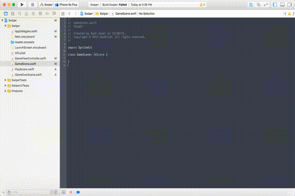
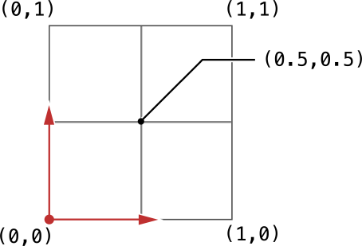

# Creating the Walls

### Setting Up Physics

Now we will start to build out the GameScene! There are three main elements on the screen:

* the walls
* the score label
* the box spawner

In this part of the tutorial, we will build out the walls. First though, we need to set up the physics of the game meaning how we handle collisions between two nodes. In order to this we need to make the `GameScene.swift` file follow the `SKPhysicsContactDelegate`. This means that once you follow this delegate you can use a method in order to handle contact/collisions between nodes. In order to this we just need to add the keyword `SKPhysicsContactDelegate` to the line starting with `class`, so it looks like this.

```swift
class GameScene: SKScene, SKPhysicsContactDelegate {
```



Now, if you just add a method to this file you can handle collisions! But first we have to add nodes and characters to collide in the first place!

### Screen Dimensions and Physics Categories

First, we need to set up the class to be responsive to each device. So, let's create the screen dimension variables like in the `PlayScene.swift` file.

```swift
// screen dimensions
private var screenWidth: CGFloat!
private var screenHeight: CGFloat!
```


Now, let's create the Physics Categories. These work just like the `name` property that we used on the play label in the last part. They are each essentially just a number. The category `None` is equal to `0`, `Block` is equal to `1`, and `Target` is equal to `2`. We can assign each of the upcoming nodes that we create in order to access them in the physics collision method. More on these to come. Just write the below code right under the screen dimensions code we wrote.

```swift
// physics categories
struct PhysicsCategory {
	static let None      : UInt32 = 0
	static let Block     : UInt32 = 0b1       // 1
	static let Target    : UInt32 = 0b10      // 2
}
```
    
### Set Up Code

Now we can move to the `didMoveToView()` method. Remember that?? We will do the same as before in that we will set the screen dimensions variables and then set the background color. Now we will do more set up for the physics. The object, `physicsWorld` comes with following the `SKPhysicsContactDelegate`. The first line sets the `gravity` of the `physicsWorld` to be a vector of `(0.0, -7.0)`. Then the next line sets the delegate to self which enables the scene to start listening for collisions. 

The next line of code that says `setUpTheTargets()` will call the method that creates the walls. This means that once the compiler hits that line, it will jump to the method named `setUpTheTargets()` which we will create next. Write this code right underneath the Physics Category block of code.

```swift
override func didMoveToView(view: SKView) {
	/* Setup your scene here */
        
	// 1. set the screen dimensions
	screenWidth = view.frame.size.width
	screenHeight = view.frame.size.height
        
	// 2. set the background color
	backgroundColor = UIColor.whiteColor()
        
	// 3. set up the physics world
	physicsWorld.gravity = CGVectorMake(0.0, -7.0)
	physicsWorld.contactDelegate = self
        
	// 4. set up the game scene targets
	setUpTheTargets()
}
```
    
### Create the Walls

Now, let's create the walls! Each target will be of type `SKSpriteNode` which is just like `SKLabelNode` but it is created by setting the size and the color or the image. In this tutorial we will be setting it by the color. So first we create the `target` variable. This line sets both the color and the size. The part of the code that says `SKSpriteNode(color: UIColor.blueColor(), size: CGSizeMake(screenWidth * 0.05, screenHeight))` is a constructor for `SKSpriteNode`. This is a special type of method that creates an object. The next line sets the anchor point for the node which is where the node is anchored to, position-wise. Here's a good diagram explaining the anchor point from Apple.



Then we set the position of the node, and finally add it to the scene. 

The code underneath sets the physics body on each node. The physics body attaches itself to each node and does whatever the node does. The first line creates the physics body by outlining the node with a rectangle shape. You don't need to understand the next line for now. The next three lines set the physics body up for collisions. The first sets the physics category for each node, which would be `Target`. The next sets the contact category meaning that this node will look around for a node with the category `Block`. We do this three times for each wall.

```swift
func setUpTheTargets() {
	// 1. set up the right target
	let rightTarget = SKSpriteNode(color: UIColor.blueColor(), size: CGSizeMake(screenWidth * 0.05, screenHeight))
	rightTarget.anchorPoint = CGPointMake(1.0, 0.5)
	rightTarget.position = CGPointMake(screenWidth, screenHeight / 2.0)
        addChild(rightTarget)
        
	rightTarget.physicsBody = SKPhysicsBody(rectangleOfSize: rightTarget.size)
	rightTarget.physicsBody?.dynamic = false
	rightTarget.physicsBody?.categoryBitMask = PhysicsCategory.Target
	rightTarget.physicsBody?.contactTestBitMask = PhysicsCategory.Block
	rightTarget.physicsBody?.collisionBitMask = PhysicsCategory.None
        
	// 2. set up the left target
	let leftTarget = SKSpriteNode(color: UIColor.greenColor(), size: CGSizeMake(screenWidth * 0.05, screenHeight))
	leftTarget.anchorPoint = CGPointMake(0.0, 0.5)
	leftTarget.position = CGPointMake(0.0, screenHeight / 2.0)
	addChild(leftTarget)
        
	leftTarget.physicsBody = SKPhysicsBody(rectangleOfSize: leftTarget.size)
	leftTarget.physicsBody?.dynamic = false
	leftTarget.physicsBody?.categoryBitMask = PhysicsCategory.Target
	leftTarget.physicsBody?.contactTestBitMask = PhysicsCategory.Block
	leftTarget.physicsBody?.collisionBitMask = PhysicsCategory.None
        
	// 3. set up the bottom target
	let bottomTarget = SKSpriteNode(color: UIColor.redColor(), size: CGSizeMake(screenWidth, screenWidth * 0.05))
	bottomTarget.anchorPoint = CGPointMake(0.5, 0.0)
	bottomTarget.position = CGPointMake(screenWidth / 2.0, 0)
	addChild(bottomTarget)
        
	bottomTarget.physicsBody = SKPhysicsBody(rectangleOfSize: bottomTarget.size)
	bottomTarget.physicsBody?.dynamic = false
	bottomTarget.physicsBody?.categoryBitMask = PhysicsCategory.Target
	bottomTarget.physicsBody?.contactTestBitMask = PhysicsCategory.Block
	bottomTarget.physicsBody?.collisionBitMask = PhysicsCategory.None
}
```
    
### Run the Project

Finally, you can run the project and if you press play, you will see three amazing looking walls on the screen!


### Recap

You learned how to:

* Set up a file with the `SKPhysicsContactDelegate`
* Create `Physics Categories`
* Set up the `physicsWorld`
* Call a `method`
* Create a `method`
* Create an `SKSpriteNode`
* Set up `physicsBody`'s for each `SKSpriteNode`

--------------------------------------------------------------------------------

You are now ready to move on to Part 4 where you will be able to create the score label for the `GameScene`!