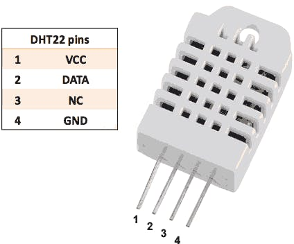
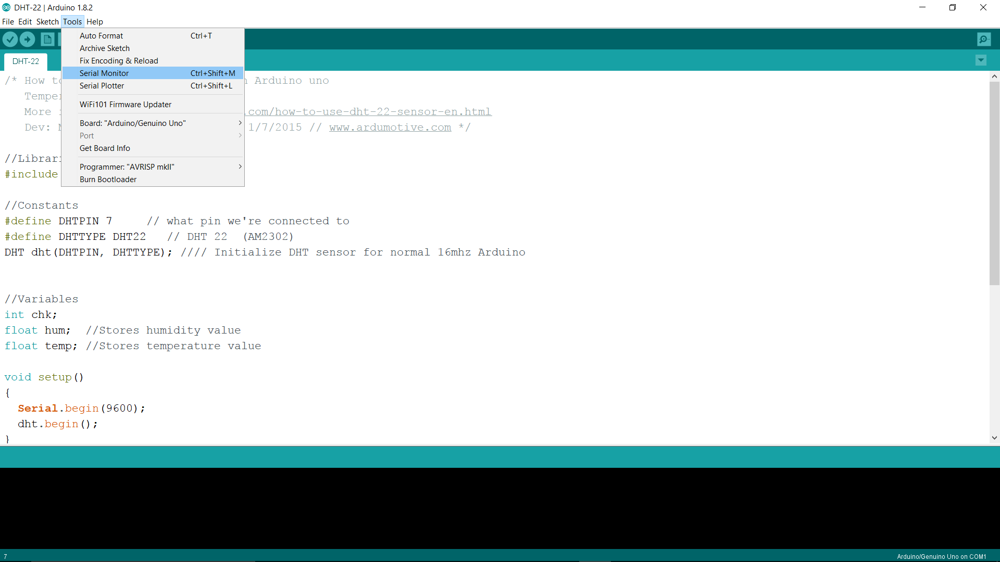
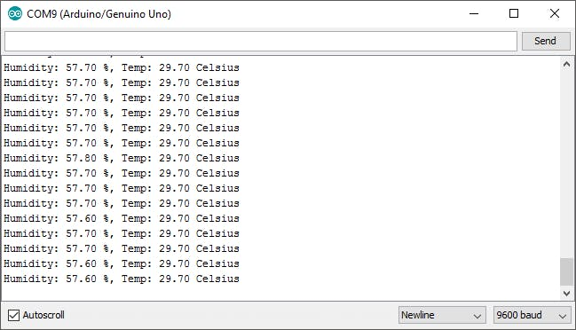

# Temperature Monitoring With DHT22 & Arduino

- Reference [www.arduino.cc](http://www.arduino.cc)

**ABOUT THIS PROJECT**

This is very simple project which hooks the DHT22 Temperature and Humidity sensor to the Arduino Uno & lets you measure your room Temperature & Humidity

Here, we are using the DHT22 Temperature and Humidity sensor with Arduino Uno R3 and getting it's data from the Arduino Serial Monitor. The Humidity Range of the DHT22 is 0-100% and Temperature range is -40 - 125°C (the reason why I like DHT22 over DHT11).

**Hardware Required:**

- 1x Arduino/Genuino Uno
- 1x DHT22 Sensor
- 1x Bread Board
- 3x Jumper Wires

## DHT22 Pin Configuration



## Steps

1. Pin `1` is `VCC`, connect it to `5V`.
1. Pin `2` is for data, connect it to digital Pin `7`.
1. And finally connect Pin `4` to `GND`


## The Arduino Sketch

[Click here](https://halckemy.s3.amazonaws.com/uploads/document/file/143452/DHT-22.ino) to download the sketch in `.ino` format

```C++
/* How to use the DHT-22 sensor with Arduino uno
   Temperature and humidity sensor
*/

//Libraries
#include <DHT.h>;

//Constants
#define DHTPIN 7     // the pin its connected to
#define DHTTYPE DHT22   // DHT 22  (AM2302)
DHT dht(DHTPIN, DHTTYPE); //// Initialize DHT sensor for normal 16mhz Arduino


//Variables
int chk;
float hum;  //Stores humidity value
float temp; //Stores temperature value

void setup()
{
  Serial.begin(9600);
  dht.begin();
}

void loop()
{
    delay(2000);
    //Read data and store it to variables hum and temp
    hum = dht.readHumidity();
    temp= dht.readTemperature();
    //Print temp and humidity values to serial monitor
    Serial.print("Humidity: ");
    Serial.print(hum);
    Serial.print(" %, Temp: ");
    Serial.print(temp);
    Serial.println(" Celsius");
    delay(10000); //Delay 2 sec.
}
```

## Now upload the code to the Arduino

Open the Serial Monitor to see the output



## Here's how my output screen looks like :)


