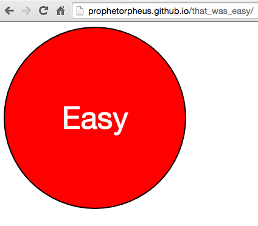
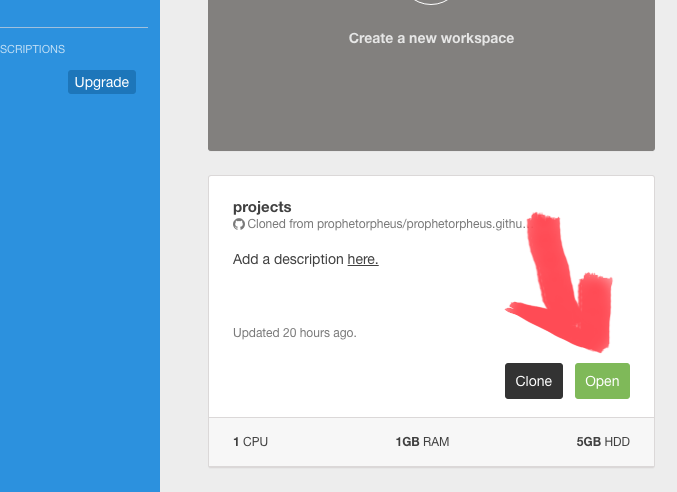

# That Was Easy Workshop



Short link to this workshop: [https://workshops.hackclub.com/that_was_easy](https://workshops.hackclub.com/that_was_easy)

[Demo](http://prophetorpheus.github.io/that_was_easy/)

---

Today we're going to create a button on a webpage that will emit a sound when clicked.

Much like in Personal Website workshop, we'll be using HTML to create stuff visible on the browser. We'll also be using JavaScript, a programming language commonly used in web development, to include interactivity in our project. In addition, we will be making use of jQuery, which is a library that will make using JavaScript in the browser much simpler. This may seem like an exorbitant number of new tools, but we'll be biting off manageable pieces.

**Table of Contents**

- [Part I: Set-up](#part-i-set-up)
- [Part II: The HTML File](#part-ii-the-html-file)
- [Part III: The JavaScript File](#part-iii-the-javascript-file)
- [Part IV: The CSS File](#part-iv-the-css-file)
- [Part V: Rejoicing](#part-v-rejoicing)
- [Part VI: Upgrading](#part-vi-upgrading)
- [Part VII: Publishing and Sharing](#part-vii-publishing-and-sharing)
- [Part VIII: Hacking](#part-viii-hacking)

## Part I: Set-up

### Setting up Folders and Files

1. We'll begin by going to our Cloud9 workspace by clicking "Open" in our dashboard.

   

2. Next, we'll create a new folder for this workshop. Right-click your `projects` folder, select "New Folder," and name it `that_was_easy`.
3. In this folder, right-click again, select "New File," and name the new file `index.html`. This is where we will be writing HTML to actually create the button.
4. Create another file in the `that_was_easy` folder, and name this one `main.js`. This is where we will be writing our JavaScript to make the button play sounds.
5. Create another file in the `that_was_easy` folder, and name this one `styles.css`. This is where we will be making our button look pretty.
6. We've provided an amusing sound for you [here](sounds/that_was_easy.mp3). If you click on the filename, and then click `View Raw`, you should be at a page with an audio player. Right-click that page and choose `Save As`.
7. Then, drag the file you've just saved into the `that_was_easy` directory in the Cloud9 sidebar.
8. Now, open up `index.html` and type the following:

  ```html
  <!DOCTYPE html>
  <html>
    <head>
      <title>That Was Easy</title>
    </head>
    <body>
    </body>
  </html>
  ```

  Similar to our HTML file in the Personal Website workshop, we've created a bare template upon which we will build interactions for the user. As you can see, we've named this page "That Was Easy" using the title (`<title>`) tag.
9. Save your `index.html` and open up the Live Preview by selecting `Preview > Live Preview File` in the menu bar. You should see a blank page.

### Adding `main.js` to the HTML File

Now we must connect the two files. Since HTML file depends on JavaScript file to make our button play sounds, we must include a reference to the JavaScript file within the HTML file. We can do this by using an HTML tag called the script tag (`<script>`), which is how JavaScript files are included in HTML files.

The script tag has an attribute called source (`src`), which is where we will fill in the URL to the JavaScript file we want to include.

Let's write this line of code inside the **body** of the HTML file, to include our `main.js` file:

```html
<script src="main.js"></script>
```

There! Now our HTML file knows that it should grab the `main.js` file.

For this workshop, we'll be using the handy library called jQuery inside our `main.js`. jQuery is a collection of functions and JavaScript code written to make writing JavaScript for the browser much easier. It provides a cleaner and simpler way to make things happen, almost like shortcuts.

We'll let the browser know that we'll be using jQuery by once again using a `<script>` tag. jQuery can be found at [this URL](https://code.jquery.com/jquery-2.2.3.min.js), so that's what we will put as the value for `src`.

Since we will be using jQuery in `main.js`, `main.js` will be reliant on jQuery. Thus, we will put the script tag containing jQuery **above** the one containing `main.js` in the **body** of `index.html` in order to load jQuery before loading `main.js`.

```html
<body>
  <script src="https://code.jquery.com/jquery-2.2.3.min.js"></script>
  <script src="main.js"></script>
</body>
```

Now we have successfully hooked up the JavaScript to the HTML. Our `index.html` now looks like this:

```html
<!DOCTYPE html>
<html>
  <head>
    <title>That Was Easy</title>
  </head>
  <body>
    <script src="https://code.jquery.com/jquery-2.2.3.min.js"></script>
    <script src="main.js"></script>
  </body>
</html>
```

### Adding `styles.css` to the HTML File

Lastly, we'll add our `styles.css` to the HTML file. Add it to the **head** of `index.html` under the title, like so:

```html
<head>
  <title>That Was Easy</title>
  <link href="styles.css" rel="stylesheet">
</head>
```

`index.html` now looks like this:

```html
<!DOCTYPE html>
<html>
  <head>
    <title>That Was Easy</title>
    <link href="styles.css" rel="stylesheet">
  </head>
  <body>
    <script src="https://code.jquery.com/jquery-2.2.3.min.js"></script>
    <script src="main.js"></script>
  </body>
</html>
```

## Part II: The HTML File

### Adding the Button

Now that we've set up our HTML file, let's add a button using the [`<button>` element](https://developer.mozilla.org/en-US/docs/Web/HTML/Element/button).

We use the button tag by typing the text we want on the button between the start (`<button>`) and close (`</button>`) tags. Create a button in the **body** of `index.html`, by typing a line above the `script` tags, like so:

```html
<body>
  <button>Easy</button>

  <script src="https://code.jquery.com/jquery-2.2.3.min.js"></script>
  <script src="main.js"></script>
</body>
```

This button will say "Easy" on it. Save and refresh live preview to see it.

You can have any text on your button.

Now `index.html` looks like this:

```html
<!DOCTYPE html>
<html>
  <head>
    <title>That Was Easy</title>
    <link href="styles.css" rel="stylesheet">
  </head>
  <body>
    <button>Easy</button>

    <script src="https://code.jquery.com/jquery-2.2.3.min.js"></script>
    <script src="main.js"></script>
  </body>
</html>
```

As a user, we can identify this button as the "Easy" button. But how will we identify it in code? One easy way is to supply each with an attribute known as an "`id`."

### Adding an `id` to the Button

An `id` is a unique-valued attribute we can add to HTML elements. We'll give our button its own `id` by modifying the previously added line, which will help us assign the corresponding sound to it.

```html
<button id="easy">Easy</button>
```

Our HTML now looks like this:

```html
<!DOCTYPE html>
<html>
  <head>
    <title>That Was Easy</title>
    <link href="styles.css" rel="stylesheet">
  </head>
  <body>
    <button id="easy">Easy</button>

    <script src="https://code.jquery.com/jquery-2.2.3.min.js"></script>
    <script src="main.js"></script>
  </body>
</html>
```

## Part III: The JavaScript File

Now it's time to write the functionality behind our sound-playing button. We can separate this into several steps:

- playing a sound
- creating a function that plays the sound
- detecting a click on the button, and executing the function when that happens

Let's open up `main.js` and start writing JavaScript!

### Playing the Sound

JavaScript makes using audio easy with the Audio object. We are going to play audio in our code by creating an Audio object for our `.mp3` file.

We'll be storing the Audio object in a variable. A variable in JavaScript is something that stores a value. First, let's declare the existence of our variable by typing the following into `main.js`:

```js
var thatWasEasy;
```

Next, we'll make a new Audio object with the `that_was_easy.mp3`, and assign it to our variable, by modifying the line we just added:

```js
v̶a̶r̶ ̶t̶h̶a̶t̶W̶a̶s̶E̶a̶s̶y̶;̶
var thatWasEasy = new Audio("that_was_easy.mp3");
```

Here, we've created a new `Audio` object that will have the sound `that_was_easy.mp3`, and assigned the Audio object to a variable named `thatWasEasy` which we declared in the same line.

And we'll play the sound by using a built-in method (`.play()`) included in the Audio object. We'll add this line beneath the creation of `thatWasEasy`, like so:

```js
var thatWasEasy = new Audio("that_was_easy.mp3");
thatWasEasy.play();
```

`.play()` is a function that is a part of the Audio object, and it plays the sound.

Now, if you save your `main.js` file, you'll note that upon reloading live preview, the `index.html` page now says "That was easy!" And it was!

Yay! We've added audio to our webpage.

### Creating Functions

If we save our file and let the live preview reload, we hear "That was easy!". But we don't want this. We want the sound to play, but only at our command.

To have a little more control over this, let's create a function that will play the sound only when we call the function. A function in JavaScript stores a set of instructions in a variable. We can call the function to execute these instructions whenever we want.

We can create a function by **enclosing the code we've already written in the following way**:

```js
v̶a̶r̶ ̶t̶h̶a̶t̶W̶a̶s̶E̶a̶s̶y̶ ̶=̶ ̶n̶e̶w̶ ̶A̶u̶d̶i̶o̶(̶"̶t̶h̶a̶t̶_̶w̶a̶s̶_̶e̶a̶s̶y̶.̶m̶p̶3̶"̶)̶;̶
t̶h̶a̶t̶W̶a̶s̶E̶a̶s̶y̶.̶p̶l̶a̶y̶(̶)̶;̶

function sayThatWasEasy() {
  var thatWasEasy = new Audio("that_was_easy.mp3");
  thatWasEasy.play();
}
```

Now, if we run our project, we'll find that there is no sound at all. Even when we press the button, there is no sound.

It's time to connect the button to our sound function.

### Detecting the Click

In order to connect the button and the function, we must first identify the button in `main.js`. Conveniently, we've given the button an `id` attribute in our `index.html`, making it easy to refer to in `main.js`.

We can [use jQuery to find the button](https://learn.jquery.com/using-jquery-core/selecting-elements/), by using special syntax. We'll type this below our function, in `main.js`:

```js
$("#easy");
```

Now that we have selected our button in the JavaScript by its `id`, we can access the methods attached to the button.

One of the methods is `.on()`. This method sets the button to execute some instructions when something happens. Things that happen on the page by way of the user doing something are referred to as ["events."](https://learn.jquery.com/events/introduction-to-events/) When we use the [`.on()`](https://learn.jquery.com/events/handling-events/) method, we pair an event with a function that we want to be called when the event happens.

Here, we will use the method to detect the "click" event, so we'll provide `"click"` as the first argument to `.on()`:

```js
$̶(̶"̶#̶e̶a̶s̶y̶"̶)̶;̶
$("#easy").on("click");
```

`.on()` takes two arguments, the second of which is what you want to happen when the event has occurred. In our case, we want the browser to say "That was easy!", so we add the function `sayThatWasEasy` which we have already written, as an argument.

```js
$̶(̶"̶#̶e̶a̶s̶y̶"̶)̶.̶o̶n̶(̶"̶c̶l̶i̶c̶k̶"̶)̶;̶
$("#easy").on("click", sayThatWasEasy);
```

To reiterate, we are:

1. Selecting the "Easy" button, using jQuery and its syntax (i.e., notation) for recognizing elements by `id`, and specifying the `easy` id.
2. Calling the method associated with the button called `.on()`, which is able to bind a certain function with a certain event and thus dictate that the function be called when the event occurs.
3. Choosing to detect the "click" event.
4. Passing as an argument the function `sayThatWasEasy()`, to tell `.on()` that upon noticing a click, it should execute the function (which in turn plays the `that_was_easy.mp3` sound).

Now, save your `main.js` file and try clicking on the "Easy" button! Congratulations!

Your JavaScript file should now look like this:

```js
function sayThatWasEasy() {
  var thatWasEasy = new Audio("that_was_easy.mp3");
  thatWasEasy.play();
}

$("#easy").on("click", sayThatWasEasy);
```

## Part IV: The CSS File

Our button looks a little pathetic in its small default form. Open up `styles.css` and let's spruce it up with some CSS!

First, let's select it! Using our very handy `id`:

```css
#easy {

}
```

And now let's make it bigger. A lot bigger.

```css
#easy {
  width: 300px;
  height: 300px;
}
```

Looking good so far. Let's change the shape:

```css
#easy {
  width: 300px;
  height: 300px;
  border-radius: 150px;
}
```

Next, we'll set the border color to be black and the background color to red:

```css
#easy {
  width: 300px;
  height: 300px;
  border-radius: 150px;
  border-color: black;
  background-color: red;
}
```

Finally, we'll increase the text size and change the text color to white:

```css
#easy {
  width: 300px;
  height: 300px;
  border-radius: 150px;
  border-color: black;
  background-color: red;
  font-size: 50px;
  color: white;
}
```

It's beautiful!

## Part V: Rejoicing

Yay! It works! It was so easy! Now you can terrorize everyone by clicking this button on your phone's mobile browser whenever anyone does anything.

## Part VI: Upgrading

Maybe you'd like to use this button mouse-free. Maybe you prefer using the keyboard to navigate your computer. Well, we can make that happen.

### Detecting Keyboard Inputs on the Page

First, we must set up our JavaScript so that the page can detect that we have pressed a key. Thanks to jQuery, we can add this feature easily, with the following line of code, which we will type at the bottom of our `main.js`:

```js
$(document).keypress();
```

jQuery has a method called `.keypress()`, which takes a function as an argument. It then executes this function when a key is pressed. Much like `.on()`, `.keypress()` listens for an event; specifically, it listens for the key pressed event. Here, we are specifying that we want to listen for a key press on the entire document, hence `$(document)`. `$(document)` is how jQuery refers to the whole page.

Now that we have set up the page to react when a key is pressed, we just need to tell it how to react. And we will do this by writing a function that gives instructions on what to do in the event that a key is pressed.

We will declare this function and name it `delegateKeypress` and pass it as an argument to the method `.keypress()` like so:

```js
$̶(̶d̶o̶c̶u̶m̶e̶n̶t̶)̶.̶k̶e̶y̶p̶r̶e̶s̶s̶(̶)̶;̶
$(document).keypress(delegateKeypress);

function delegateKeypress(event) {

}
```

`delegateKeypress()` takes an event as an argument, since that is where the information about the event is contained. Information that we need, such as which key was pressed.

### Attaching Keyboard Inputs to Sound

Speaking of that, we need to assign keys to our sounds, so let's find the key code for the key you want to use. You can find key codes by putting the line `console.log(event.charCode);` in your `delegateKeypress` function, opening up external live preview, and looking at the console in the Inspector while you press a key.

Now that we've gotten the key code, we'll use a conditional in the event of a key press event to check if the key that was pressed was the key that we designated to make the sound.

We'll add this in our `delegateKeypress()` function:

```js
if (event.charCode == 32) {

}
```

Here we are saying, if the event's `charCode` is equal to 32 (that's the character code for the space character), then do something (we haven't yet specified what). `event.charCode` is an attribute of the event, and it contains the value of the character code of the key that was pressed.

So, if the character code is indeed 32, I would like the browser to tell me "That was easy!". No problem, we are already well-versed in playing sounds:

```js
function delegateKeypress(event) {
  if (event.charCode == 32) {
    var thatWasEasy = new Audio("that_was_easy.mp3");
    thatWasEasy.play();
  }
}
```

Simple enough, we just repeat the same code we typed earlier. Now if we press the space bar, we will hear "That was easy!".

But wait, we already have preexisting code to play the `that_was_easy` sound. It's in `sayThatWasEasy()`, and the sound will be played when the button is clicked (à la `$("#easy").on("click", sayThatWasEasy);`)! If only we could somehow use that for this key press function.

Well, we can. Everything is set up for the button to play a sound once it gets clicked, so why don't we just click it...with code?

What? We can click things using code? Of course. A click is just an event. We can trigger events with JavaScript by doing just that. jQuery offers a method called `.trigger()` which takes, you guessed it, a type of event.

That said, we can now replace our repetitive code like so:

```js
function delegateKeypress(event) {
  if (event.charCode == 32) {
    v̶a̶r̶ ̶t̶h̶a̶t̶W̶a̶s̶E̶a̶s̶y̶ ̶=̶ ̶n̶e̶w̶ ̶A̶u̶d̶i̶o̶(̶"̶t̶h̶a̶t̶_̶w̶a̶s̶_̶e̶a̶s̶y̶.̶m̶p̶3̶"̶)̶;̶
    t̶h̶a̶t̶W̶a̶s̶E̶a̶s̶y̶.̶p̶l̶a̶y̶(̶)̶;̶
    $("#easy").trigger("click");
  }
}
```

And just like that, we have leveraged jQuery to select the "Easy" button (`$("#easy")`) and trigger a click event on it (`.trigger("click")`).

What do you think happens next? Once the click event is triggered on the button, the button detects the click and responds by calling `sayThatWasEasy()`, thanks to the previously added line `$("#easy").on("click", sayThatWasEasy);`.

Our JavaScript file now looks like this:

```js
function sayThatWasEasy() {
  var thatWasEasy = new Audio("that_was_easy.mp3");
  thatWasEasy.play();
}

$("#easy").on("click", sayThatWasEasy);

$(document).keypress(delegateKeypress);

function delegateKeypress(event) {
  if (event.charCode == 32) {
    $("#easy").trigger("click");
  }
}
```

And that's it! Save your `main.js` and try out the key binding!

## Part VII: Publishing and Sharing

Now it's time to save your work with git and publish your code to GitHub and your personal website. Make sure you've saved all of your files on Cloud9!

Open up the console in Cloud9 if you don't see it already, by going to `View > Console`. Then, making sure you are on the tab that has a prompt with your username and workspace, type the following git commands:

1. `git add --all`
2. `git commit -m "Create a 'That Was Easy' button"`
3. `git push`

Enter your username and password, and you should be all set. This should update your personal website so that your "Easy" button can be found at `https://USERNAME.github.io/that_was_easy/`.

Post on [`#shipit`](https://starthackclub.slack.com/messages/shipit) with the URL, so everyone can see and play with your amazing creation!

## Part VIII: Hacking

Now that you know how to add sounds to buttons, you can do many things, including but not limited to:

- Customize with more sounds (just add more buttons and sounds) [Orpheus Remix](http://prophetorpheus.github.io/soundboard/)
  - Use sounds of someone speaking and construct silly sentences
- `setInterval` for looping. Tell someone how easy it was, forever.
- Change what this button does. Maybe it doesn't play a sound. Maybe it changes the background color! Maybe it trolls the user and closes the tab!
- Bind more actions to keys. Surprise me.
