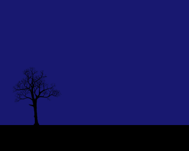

Ever wanted your own private, portable thunderstorm?

Well I have, so I built one—[check it out here](https://thunderstorm--polytrope.repl.co).



All you need is three simple parts:

- A flashing background for lightning
- Some audio clips for rain/thunder
- An image for the foreground

Plus some simple JavaScript to flash the background and play thunder when you click.

**[Click here](https://repl.it/@polytrope/thunderstorm-starter) to begin.**

(Tech used: Basic HTML/CSS, `setTimeout`, Howler, `Math.random`)

## Let’s Make a Sky

To start, I’ve given you some audio clips, an image, and a basic HTML file with 3 parts:

```html
<style>
  /* Your CSS will go here... */
</style>

<body>
  <!-- Your HTML will go here... -->
</body>

<script>
  // Your JS will go here...
</script>
```

We’ll use the `body` element as our sky. Let’s give it some color in our `style` section

```html
<style>
  body {
    background: MidnightBlue;
  }
</style>
```

Now if you hit Run, you should see a dark blue sky.

## Make it Flash

Now let’s use js to make the sky change colors.

```html
<script>
  var body = document.body

  body.style.background = 'white'
</script>
```

Run the site—the background should immediately turn white.

We want each click to trigger a flash, so let’s create a `flashOn` function and “call” (trigger) it whenever we click anywhere in the window.

```html
<script>
  var body = document.body

  function flashOn() {
    console.log('Flashing On')
    body.style.background = 'white'
  }

  // This Event Listener will trigger a flash with every click
  window.addEventListener('click', flashOn)
</script>
```

Of course, we also want to reset the background color. So we create a `flashOff` function.

```html
<script>
  var body = document.body

  function flashOn() {
    console.log('Flashing On')
    body.style.background = 'white'
  }

  function flashOff() {
    console.log('Flashing Off')
    body.style.background = 'MidnightBlue'
  }

  // This Event Listener will trigger a flash with every click
  window.addEventListener('click', flashOn)
</script>
```

However, we want the screen to stay white for a brief moment. So we’ll create a timer with `setTimeout` that calls `flashOff` 10 milliseconds after `flashOn`.

```javascript
// ...

function flashOn() {
  console.log('Flashing On')
  body.style.background = 'white'

  // setTimeout will call flashOff after 10ms
  setTimeout(flashOff, 10)
}
```

Now hit Run, click the sky, and you should get a flash!

## Make it rain

Let’s make some sounds. We’ll use a tool called [Howler](https://github.com/goldfire/howler.js#documentation), which makes it really simple to work with sound in js.

Copy in this `script` element, just after the `body` and just before your other `script`. This will import Howler so you can use it in your project.

```html
<body>
  <!--...-->
</body>

<script src="https://cdnjs.cloudflare.com/ajax/libs/howler/2.0.15/howler.min.js"></script>

<script>
  // ...
</script>
```

Now create a new "Howl" at the top of your script for the file I called "rain.mp3". I also set the volume to 0.2 (20%).

```html
<script>
  var rain = new Howl({
    src: 'rain.mp3',
    volume: 0.2
  })

  // ...
</script>
```

Now we just need to call `rain.play()` to start the show.

We _could_ put that in the `flashOn` function. But we only want this sound to play the _first_ time a user clicks.

So instead we'll create a new function called `click` which will trigger `rain.play()` once, and `flashOn` every time. We'll also create a boolean (true/false) variable called `firstClick`.

```html
<script>
  // ...

  var firstClick = true

  function click() {
    console.log('Clicking')
    flashOn()

    // If this is the first click, start the rain and set firstClick to false.
    if (firstClick) {
      rain.play()
      firstClick = false
    }
  }

  // This Event Listener will trigger a flash with every click
  window.addEventListener('click', click)
</script>
```

So your full script should look like…

```html
<script>
  var rain = new Howl({
    src: 'rain.mp3',
    volume: 0.2
  })

  var body = document.body

  function flashOn() {
    console.log('Flashing On')
    body.style.background = 'white'

    // setTimeout will call flashOff after 10ms
    setTimeout(flashOff, 10)
  }

  function flashOff() {
    console.log('Flashing Off')
    body.style.background = 'MidnightBlue'
  }

  var firstClick = true

  function click() {
    console.log('Clicking')
    flashOn()

    // If this is the first click, start the rain and set firstClick to false.
    if (firstClick) {
      rain.play()
      firstClick = false
    }
  }

  // This Event Listener will trigger a flash with every click
  window.addEventListener('click', click)
</script>
```

Now if you hit Play and click the sky, the rain should start after a single flash—just make sure your sound is on!

## Make it Storm

Okay, now let's turn up the storminess with a big thunderclap at the start.

First we create a new Howl for "thunder_start.mp3", and a `playBigThunder` function that does exactly what is sounds like.

```html
<script>
  var rain = new Howl({
    src: 'rain.mp3',
    volume: 0.2
  })

  var bigThunder = new Howl({
    src: 'thunder_start.mp3',
    volume: 0.5
  })

  function playBigThunder() {
    console.log('Playing Big Thunder')
    bigThunder.play()
  }

  // ...
</script>
```

Then we'll trigger the opening thunderclap on the first click, using `setTimeout` again for a 1 second delay:

```javascript
function click() {
  console.log('Clicking')
  flashOn()

  // If this is the first click, start the rain and set firstClick to false.
  if (firstClick) {
    rain.play()
    firstClick = false

    // Play the starting thunder after a 1000ms delay
    setTimeout(thunderStart.play, 1000)
  }
}
```

## Make it Random

For everything after the first click, let's play a randomized thunder sound.

I packed four random thunder sounds into one file called "thunder_sprites.mp3". Go ahead and listen to it in the Files section on the left side of your repl.it project.

Each sound is 8 seconds long; so 0–8s is Thunder A, 8–16s is Thunder B, and so on. I broke the sound up into 4 "sprites" so the computer loads one file instead of four.

Let's create a Howl for "thunder_sprites.mp3" with an option called `sprites`, which gives the time range for each thunder sound in milliseconds.

We'll also create a function called `playRandomThunder`, which does exactly what it sounds like. This function uses `Math.random()`, which provides a random number between 0 and 1.

```html
<script>
  // ...

  function playBigThunder() {
    console.log('Playing Big Thunder')
    bigThunder.play()
  }

  var thunder = new Howl({
    src: ['thunder_sprites.mp3'],
    // Four sprites, each 8 seconds
    sprite: {
      a: [0, 8000],
      b: [8000, 16000],
      c: [16000, 24000],
      d: [24000, 32000]
    },
    volume: 0.5
  })

  function playRandomThunder() {
    console.log('Playing Random Thunder')
    // This will create a random number between 0 and 4 and round it down
    var index = Math.floor(Math.random() * 4)
    // This will pick 'a' for index=0, 'b' for index=1, etc.
    var sprite = 'abcd'[index]
    // This will play the randomly-chosen thunder sprite
    thunder.play(sprite)
  }

  // ...
</script>
```

Then we'll trigger it on everything _but_ the first click, after a 2–5s delay.

```javascript
function click() {
  console.log('Clicking')
  flashOn()

  // If this is the first click, start the rain and set firstClick to false.
  if (firstClick) {
    rain.play()
    firstClick = false

    // Play the starting thunder after a 1000ms delay
    setTimeout(thunderStart.play, 1000)
  }
  // Otherwise, play thunder after a random delay between 2000ms and 5000ms
  else {
    var delay = 2000 + Math.floor(Math.random() * 3000)
    setTimeout(playRandomThunder, delay)
  }
}
```

Now if you hit Play and click the sky, you will get randomized thunder sounds!

Your full script should look like this:

```html
<script>
  var rain = new Howl({
    src: 'rain.mp3',
    volume: 0.2
  })

  var bigThunder = new Howl({
    src: 'thunder_start.mp3',
    volume: 0.5
  })

  function playBigThunder() {
    console.log('Playing Big Thunder')
    bigThunder.play()
  }

  var thunder = new Howl({
    src: ['thunder_sprites.mp3'],
    // Four sprites, each 8 seconds
    sprite: {
      a: [0, 8000],
      b: [8000, 16000],
      c: [16000, 24000],
      d: [24000, 32000]
    },
    volume: 0.5
  })

  function playRandomThunder() {
    console.log('Playing Random Thunder')
    // This will create a random number between 0 and 4 and round it down
    var index = Math.floor(Math.random() * 4)
    // This will pick 'a' for index=0, 'b' for index=1, etc.
    var sprite = 'abcd'[index]
    // This will play the randomly-chosen thunder sprite
    thunder.play(sprite)
  }

  var body = document.body

  function flashOn() {
    console.log('Flashing On')
    body.style.background = 'white'

    // setTimeout will call flashOff after 10ms
    setTimeout(flashOff, 10)
  }

  function flashOff() {
    console.log('Flashing Off')
    body.style.background = 'MidnightBlue'
  }

  var firstClick = true

  function click() {
    console.log('Clicking')
    flashOn()

    // If this is the first click, start the rain and set firstClick to false.
    if (firstClick) {
      rain.play()
      firstClick = false

      // Play the starting thunder after a 1000ms delay
      setTimeout(playBigThunder, 1000)
    }
    // Otherwise, play thunder after a random delay between 2000ms and 5000ms
    else {
      var delay = 2000 + Math.floor(Math.random() * 3000)
      setTimeout(playRandomThunder, delay)
    }
  }

  // This Event Listener will trigger a flash with every click
  window.addEventListener('click', click)
</script>
```

## Make it Flashier

Real lightning doesn't flash just once. At the end of each flash, there should be a _chance_ for one more flash; that way some strikes will flash once, but most will flash 3 or 5 or 8 times.

Let's add some code to our `flashOn` function to trigger another flash 75% of the time.

```javascript
function flashOn() {
  console.log('Flashing On')
  body.style.background = 'white'

  // setTimeout will call flashOff after 10ms
  setTimeout(flashOff, 10)

  // There is a 75% chance that each flash will trigger another flash
  if (Math.random() < 0.75) {
    setTimeout(flashOn, 100)
  }
}
```

Let's add some time variation—it looks unnatural when each flash is exactly 100ms from the last one.

We'll change that `100` to a randomized value between 50 and 500.

```javascript
// There is a 75% chance that each flash will trigger another flash
if (Math.random() < 0.75) {
  setTimeout(flashOn, 50 + Math.random() * 450)
}
```

## Finishing Touches

Finally, let's set the mood a little bit. A good thunderstorm needs a good landscape.

We’ll add some ground to complement our sky using HTML. Add a `div` inside `body` and name it "ground":

```html
<body>
  <div id="ground"></div>
  <body></body>
</body>
```

Now we need to give it some color and make sure it fills some space at the bottom of the page.

In our `style` section, we’ll set this `div` to be:

- `position: absolute;`, which lets us set the position and size directly
- `left: 0; right: 0; bottom: 0;`, which means the left, right, and bottom sides will touch the edges of the page
- `height: 100px;`, which makes it 100px high
- `background: black;` which makes it a nice black silhouette

```html
<style>
  /* ... */

  #ground {
    position: absolute;

    left: 0;
    right: 0;
    bottom: 0;
    height: 100px;

    background: black;
  }
</style>
```

Now if you hit Run, you should see a "landscape”—which is really just a black box.

Let's put something _on_ the landscape now. I used a picture of a tree, which I copied out of an old xkcd comic (thanks Randall Munroe!).


But _you_ should use something of your own choosing! Code is creative—think about what would go well in a storm, find it on google, and maybe use an image editor to make it into a black silhouette…


Drag/drop the image into your repl.it window to upload it into your project. Name the file something like "thing.png" or "thing.jpg" (whatever the original file was—probably .png or .jpg—use that).

Then add an image to your HTML (``), name it "thing", and:

```html
<body>
  <div id="ground"></div>
  
  <body></body>
</body>
```

Then, add another block to your `style` for "thing". This one will look similar to the one we just added for our ground, but we’ll position it a little differently:

```html
<style>
  /* ... */

  #thing {
    position: absolute;

    left: 0;
    bottom: 0;

    height: 100px;
    width: 100px;
  }
</style>
```

## The End

That’s it y’all. You got yourself a storm.
