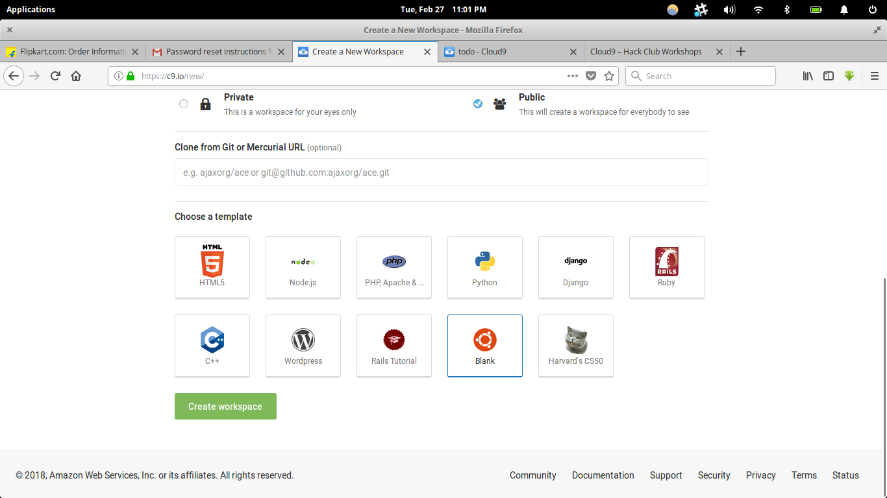
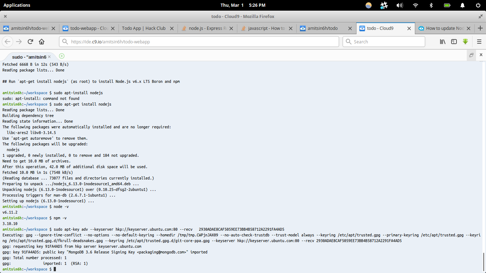
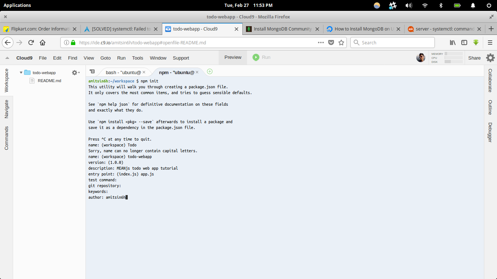
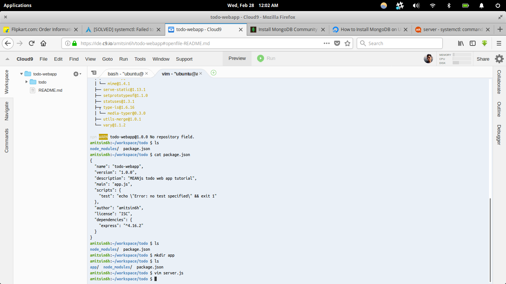
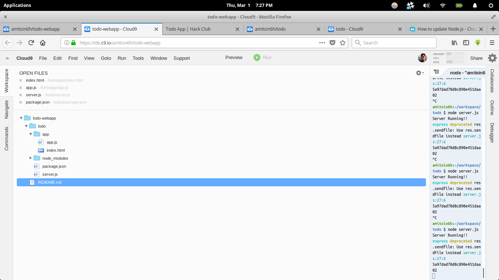
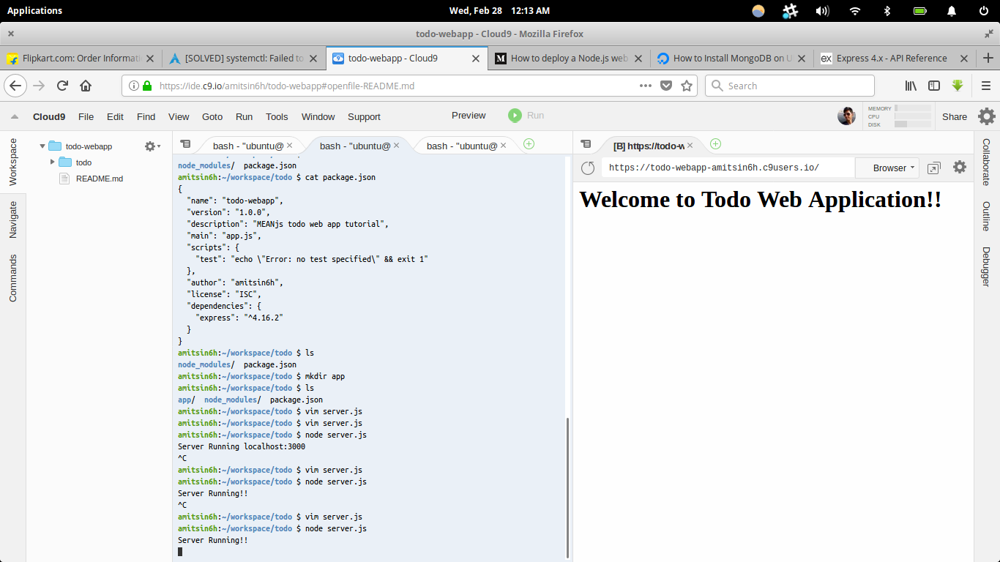
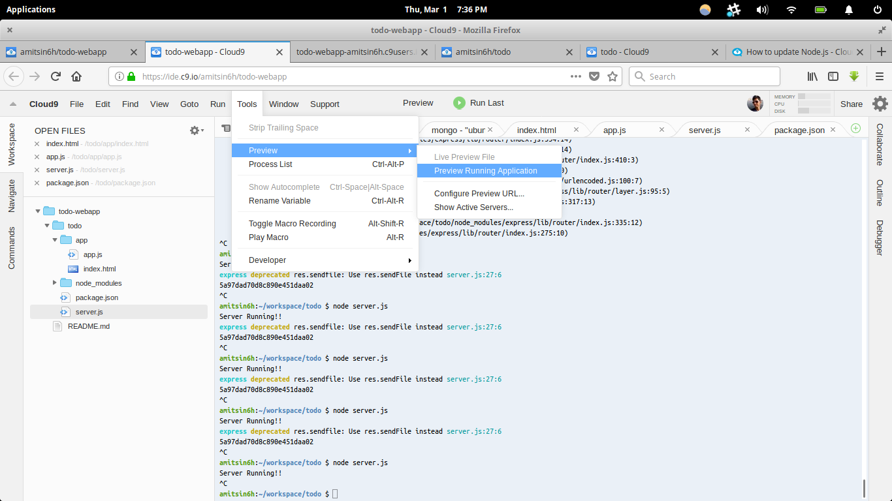
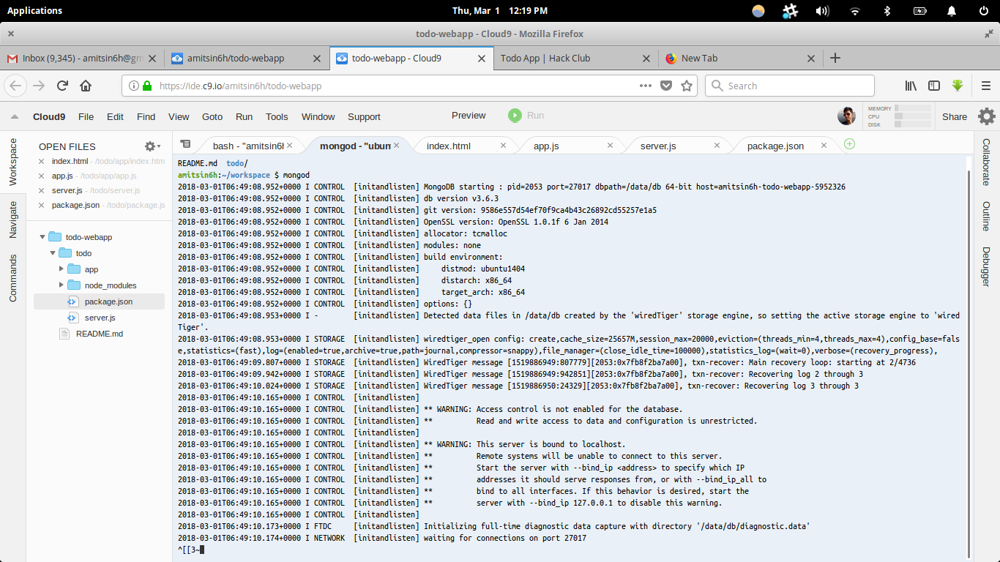
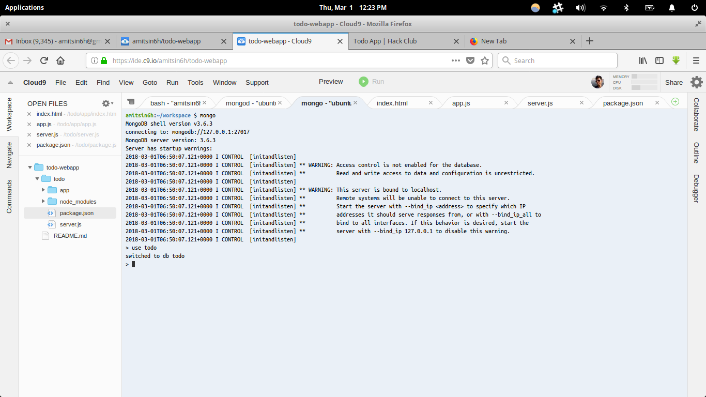
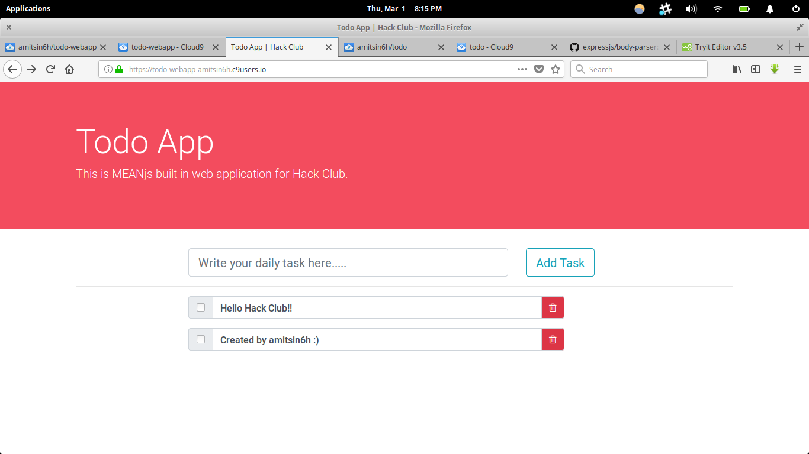

_Hello friends! We need a community member to update this workshop to work without Cloud9. Interested? Message an admin in slack! Until then, this will live in the Retired section._

# To-do MEAN.js Application

Short link to this workshop: https://workshops.hackclub.com/todo_app_using_meanjs/

**What you'll build:**


Here's a link to the [live demo][live_demo] and the [final code][final_code]. This workshop should take around 1-2 hours.

_We recommend going through this workshop in Google Chrome or Mozilla Firefox._

[live_demo]: https://todo-webapp-amitsin6h.c9users.io/
[final_code]: https://github.com/amitsin6h/todo-mean-app

---

## About the Application

In this workshop we'll be creating a To-do app using MEAN.js. This To-do app will have feature like create task and once we complete our task we can delete it.

## Let's Start

Before we start to code lets us first understand few things to get our basics clear.

### So, what is MEAN?

MEAN stands for:

- **MongoDB:** MongoDB is the leading NoSQL database, empowering businesses to be more agile and scalable.
- **Express:** Express is a minimal and flexible node.js web application framework, providing a robust set of features for building single and multi-page, and hybrid web applications.
- **AngularJS:** AngularJS lets you extend HTML vocabulary for your application. The resulting environment is extraordinarily expressive, readable, and quick to develop.
- **Node.js:** Node.js is a platform built on Chrome's JavaScript runtime for easily building fast, scalable network applications.

**Requirements**

| Cloud9 Blank Project              |
| --------------------------------- |
|  |

- Cloud9 with blank Ubuntu project
- Brain

**Table of Contents**

- [Part I: Setting up Node.js](#part-i-setting-up-nodejs)
- [Part II: Installing MongoDB](#part-ii-installing-mongodb)
- [Part III: Building Project](#part-iii-building-project)
- [Part IV: Installing Express](#part-iv-installing-express)
- [Part V: Starting our Node.js Server](#part-v-starting-our-nodejs-server)
- [Part VI: Creating Frontend using AngularJS](#part-vi-creating-frontend-using-angularjs)
- [Part VII: Creating Our Database](#part-vii-creating-our-database)
- [Part IX: Installing Body-Parser](#part-ix-installing-body-parser)
- [Part X: Working with Backend](#part-x-working-with-backend)
- [Part XI: Now let’s run our final application](#part-xi-now-lets-run-our-final-application)

## Part I: Setting up Node.js



- Open your terminal
- Type the below command in the terminal to install Node.js

  ```bash
  $ sudo –s
  $ curl -sL https://deb.nodesource.com/setup_6.x | sudo -E bash -
  $ sudo apt-get install nodejs
  $ exit
  ```

- Once the installation process is done we can check our Node.js version using the below command.

  ```bash
  $ node –v #(display the node version)
  ```

- We can also check our npm (Node Package Manager) version using the below command.

  ```bash
  $ npm –v #(display the npm version)
  ```

- Node Package Manager is basically used to build projects and to download Node.js library.

## Part II: Installing MongoDB


- To install MongoDB we need to run the below command.

  ```bash
  $ sudo apt-key adv --keyserver hkp://keyserver.ubuntu.com:80 --recv   2930ADAE8CAF5059EE73BB4B58712A2291FA4AD5

  $ echo "deb [ arch=amd64 ] https://repo.mongodb.org/apt/ubuntu trusty/mongodb-org/3.6 multiverse" | sudo tee /etc/apt/sources.list.d/mongodb-org-3.6.list

  $ sudo apt-get update

  $ sudo apt-get install -y mongodb-org
  ```

- Once we've installed MongoDB, we're ready for Part III.

## Part III: Building Project



- To build use the below command.
- First create a separate directory for your project, in our case it is `/todo`
- Run `$ npm init` command it will ask few things related to project like version and will create `package.json` for the project.

So far our `main.js` looks like this (your URLs and keys will be different):

## Part IV: Installing Express



We can install Express with the following command:

```bash
$ npm install express –-save
```

Now, we've got Express installed and added to our `package.json`.

## Our Complete Project Structure

| Complete Project Structure     |
| ------------------------------ |
|  |

## Part V: Starting our Node.js Server

Let's first create `server.js` file inside todo folder (so `todo/server.js`).

```js
// calling express library
var express = require('express')
var app = express()

// GET request
app.get('/', function(req, res) {
  res.send('<h1>Welcome to Todo Web Application!!')
})

app.listen('8080', function() {
  console.log('Server Running!!')
})
```

Let’s start our server—use this command:

```bash
$ node server.js
```

**Nice!! Server Running :) **



To see a preview of our application, we need to follow the guide shown in the below image.



Now, we will build our application frontend using AngularJS.

## Part VI: Creating Frontend using AngularJS

Before we build our frontend, let's create a folder named `app` inside the `todo` folder where we will store our frontend files. Later, we'll see how to connect our frontend with our server.

Let’s start building our frontend! We're using AngularJS and Bootstrap.

`todo/app/index.html`

```html
<!doctype html>
<html lang="en" ng-app="todoApp">
  <head>
    <!-- Required meta tags -->
    <meta charset="utf-8">
    <meta name="viewport" content="width=device-width, initial-scale=1, shrink-to-fit=no">

    <!-- Bootstrap CSS -->
    <link rel="stylesheet" href="https://maxcdn.bootstrapcdn.com/bootstrap/4.0.0/css/bootstrap.min.css" integrity="sha384-Gn5384xqQ1aoWXA+058RXPxPg6fy4IWvTNh0E263XmFcJlSAwiGgFAW/dAiS6JXm" crossorigin="anonymous">
    <script src="https://ajax.googleapis.com/ajax/libs/angularjs/1.6.4/angular.min.js"></script>
    <script type="text/javascript" src="app/app.js"></script>

    <title>Todo App | MEANjs</title>
    <style type="text/css">
        .bg-hackclub{
            background: #F34C5E;
            color: #fff;
        }
    </style>
    <link rel="stylesheet" href="https://maxcdn.bootstrapcdn.com/font-awesome/4.7.0/css/font-awesome.min.css" type="text/css" />
  </head>
  <body>
    <div class="jumbotron jumbotron-fluid bg-hackclub">
      <div class="container">
        <h1 class="display-4">Todo App</h1>
        <p class="lead">This is MEANjs built in web application for Hack Club.</p>
      </div>
    </div>

    <div class="container">
        <div class="row" ng-controller="createTodoController">
          <div class="col-md-6 offset-md-2">
            <div class="input-group input-group-lg">
              <input  type="text" ng-model="todo.task" class="form-control" placeholder="Write your daily task here....." aria-label="Large" aria-describedby="inputGroup-sizing-sm">
            </div>
          </div>

          <div class="col-sm-3">
            <button type="button" ng-click="createTodo()" class="btn btn-outline-info btn-lg" >Add Task</button>
          </div>
        </div>
        <hr>
        <div ng-controller="myCtrl">

            <div class="row" ng-repeat="task in tasks.data">
              <div class="col-md-7 offset-md-2">
                <div class="input-group mb-3">
                  <div class="input-group-prepend">
                    <div class="input-group-text">
                      <input type="checkbox" aria-label="Checkbox for following text input">
                    </div>
                  </div>
                   <h1 class="form-control">{{task.task}}</h1>

                  <div class="input-group-append">
                    <div class="input-group-text bg-danger" ng-click="deleteTask(task._id)">
                      <i class="fa fa-trash-o text-white"></i>
                    </div>
                  </div>
                </div>
              </div>
            </div>
          </div>
      </div>
    </div>
  </div>

    <!-- Optional JavaScript -->
    <!-- jQuery first, then Popper.js, then Bootstrap JS -->
    <script src="https://code.jquery.com/jquery-3.2.1.slim.min.js" integrity="sha384-KJ3o2DKtIkvYIK3UENzmM7KCkRr/rE9/Qpg6aAZGJwFDMVNA/GpGFF93hXpG5KkN" crossorigin="anonymous"></script>
    <script src="https://cdnjs.cloudflare.com/ajax/libs/popper.js/1.12.9/umd/popper.min.js" integrity="sha384-ApNbgh9B+Y1QKtv3Rn7W3mgPxhU9K/ScQsAP7hUibX39j7fakFPskvXusvfa0b4Q" crossorigin="anonymous"></script>
    <script src="https://maxcdn.bootstrapcdn.com/bootstrap/4.0.0/js/bootstrap.min.js" integrity="sha384-JZR6Spejh4U02d8jOt6vLEHfe/JQGiRRSQQxSfFWpi1MquVdAyjUar5+76PVCmYl" crossorigin="anonymous"></script>
  </body>
</html>
```

**Creating app.js file to load our AngularJS components.**

`todo/app/app.js`

```js
var app = angular.module('todoApp', [])

app.controller('createTodoController', function($scope, $http) {
  $scope.createTodo = function() {
    //console.log($scope.todo);
    $http.post('api/create/todo', $scope.todo).then(
      function(success) {
        //success callback
        console.log($scope.todo)
        console.log(success.status)
      },
      function(error) {
        //error callback
        console.log(error.status)
      }
    )
  }
})

app.controller('myCtrl', function($scope, $http) {
  $http.get('api/get/tasks').then(function(tasks) {
    $scope.tasks = tasks
    //console.log(tasks);
  })

  $scope.deleteTask = deleteTask

  function deleteTask(taskId) {
    $http.delete('/api/delete/task/' + taskId).then(
      function() {
        //success callback
        console.log('success')
      },
      function(error) {
        //error callback
        console.log('Error')
      }
    )
  }
})
```

(You can also uncomment `console.log()` to see how the data gets send or received.)

## Part VII: Creating Our Database

Before creating the database using MongoDB, let's start the MongoDB server:

```bash
$ mongod
```



Once we see our server is running, let's create the database. Open a new terminal tab and run the below commands:

```bash
$ mongo
$ use todo
```



Once it's done, we need to connect our MongoDB with our MEAN.js application.

**Note: Don’t stop the MongoDB server! Otherwise, the application server will not be able to function.**

## Part VIII: Connecting to MongoDB

- To connect, first we need to call the MongoDB library used by Express.

- Install the mongoose library:

  ```bash
  $ npm install mongoose –-save
  ```

This will install mongoose and will add it in the `package.json` file.

## Part IX: Installing Body-Parser

We will be using Body-Parser to parse middleware.

- Use the below command to install.

  ```bash
  $ npm install body-parser --save
  ```

## Part X: Working with Backend

Now we will work with our `server.js` file to handle:

- Connection request to MongoDB
- Creating Model to store our daily task
- Working HTTP GET, POST and DELETE method
- Configuring our app to use static files and body-parser

`todo/server.js`

```js
// calling express library
var express = require('express')
var app = express()
var bodyparser = require('body-parser')
var mongoose = require('mongoose')

// connecting to MongoDB
mongoose.connect('mongodb://127.0.0.1:27017/todo')

// creating model
var TaskSchema = mongoose.Schema(
  {
    task: { type: String }
  },
  { collection: 'task' }
)

var TaskModel = mongoose.model('TaskModel', TaskSchema)

// configure app
app.use('/app', express.static(__dirname + '/app')) //use static file
app.use(bodyparser.json()) // for parsing application/json
app.use(bodyparser.urlencoded({ extended: true })) // for parsing application/x-www-form-urlencoded

// GET request
app.get('/', function(req, res) {
  res.sendfile('app/index.html')
})

// POST request to save todo task in database
app.post('/api/create/todo', createTodo)
function createTodo(req, res) {
  var todoTask = req.body
  //console.log(todoTask);

  //save the todoTask in db
  TaskModel.create(todoTask).then(
    function(success) {
      console.log('Success')
    },
    function(error) {
      console.log('Error')
    }
  )

  res.json(todoTask)
}

// GET all task
app.get('/api/get/tasks', getAllTasks)
function getAllTasks(req, res) {
  TaskModel.find().then(
    function(tasks) {
      res.json(tasks)
    },
    function(err) {
      res.sendStatus(400)
    }
  )
}

// DELETE task
app.delete('/api/delete/task/:id', deleteTask)
function deleteTask(req, res) {
  var taskId = req.params.id
  //console.log(taskId);
  TaskModel.remove({ _id: mongoose.Types.ObjectId(taskId) }).then(
    function() {
      res.sendStatus(200)
    },
    function() {
      res.sendStatus(400)
    }
  )
}

app.listen('8080', function() {
  console.log('Server Running!!')
})
```

## Part XI: Now let's run our final application

Our app is ready! Run the server again:

```bash
$ node server.js
```




Create a task, check off tasks, delete tasks—everything's working!

**Happy Hacking!!**
