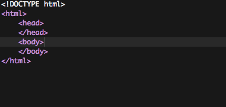
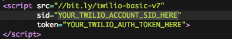
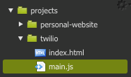
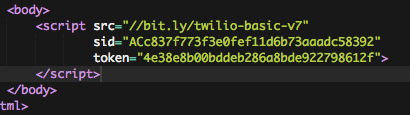
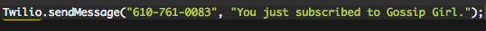
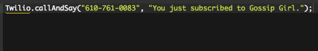
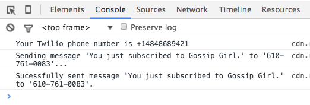

# Introduction to Twilio

Short link to this workshop: https://workshops.hackclub.com/twilio

-------------------------------------------------------------------------------

In this workshop, you will learn how to use the a modified version of the
Twilio API to make phone calls and send text messages that allow you to make
things like group texting apps.

> Note: An API is an agreed upon way for one program to interact with another.
APIs are cool because they let even our very simple programs to interact with
very powerful programs with minimal code.

 In this workshop, you probably won't understand how it all works and that's
 totally cool. Your objective is to learn how to make things happen.

## Part A: Setup

### 1) Use Google Chrome

Please use Google Chrome for this tutorial

1. Install Google Chrome on your computer if you haven't already
2. Use Google Chrome for the rest of this tutorial

### 2) Cloud 9 Setup

1. Log in to https://c9.io
2. Open your **projects** workspace (the one you created in the
   [personal website](../personal_website/README.md) workshop)
3. Create a new folder called `twilio` in the `projects` folder

When you're done with it, your folder structure should look like this:


### 3) Create the HTML file for your website

Create an `index.html` file inside of the `twilio` folder:

1. Right click the `twilio` folder you just created
2. Click **"New File"**
3. Then name the file **`index.html`**

   

5. Open the newly created `index.html` and type the below HTML template into it:

```html
<!DOCTYPE html>
<html>
    <head>
    </head>
    <body>
    </body>
</html>
```

### 4) Add the Twilio Library

To add the capability to send text messages and make phone calls, we need to
add the Twilio Basic JavaScript library.

1. Copy and paste the below `script` tag inside the `body` tag.

  ```html
  <script src="//bit.ly/twilio-basic-v7"
                  sid="YOUR_TWILIO_ACCOUNT_SID_HERE"
                  token="YOUR_TWILIO_AUTH_TOKEN_HERE">
          </script>
  ```

  

### 5) Set your Twilio `sid` and `token`

1. Change `"YOUR_TWILIO_ACCOUNT_SID_HERE"` and `"YOUR_TWILIO_AUTH_TOKEN_HERE"`
   to your actual `sid` and `token`. The facilitator should have given you an
   SID and a token. If not, you should ask them for one.

   > Note: If you are the facilitator (or if you're just doing this workshop by
     yourself), follow the directions [here](../lib/twilio-basic/signup.md) to
     get your own Twilio SID and token.

  

### 6) Creating our JavaScript File

If **HTML** is for the content, and **CSS** is for the look and feel of the
website, **JavaScript** is used for interactivity, such as sending and receiving
phone calls and text messages.

Just like we wrote **HTML** in `.html` files and **CSS** in `.css` files, we
write JavaScript in `.js` files.

Create an `main.js` file inside of the `twilio` folder:

1. Right click the **`twilio`** folder you just created
2. Click **"New File"**
3. Then name the file **`main.js`**



### 7) Linking the JavaScript file

Although we've created our JavaScript file, the HTML will not run it until you
explicitly include it with a **`script`** tag, like so:

```html
<script src="main.js"></script>
```

1. Add the above script tag **_underneath_** the current `script` tag

   

## Part II: Writing Your First Line of Twilio Code

### 1) Writing the Code to Call Your Phone

1. Type the following into your `main.js` file (don't forget the parentheses
   commas, and quotation marks.):

   ```js
   Twilio.sendMessage("555-555-5555", "You just subscribed to Gossip Girl");
   ```

   - This code JavaScript calls the phone number `555-555-5555` and says the
     message `You just subscribed to Gossip Girl.` We don't want that.

2. Change `555-555-5555` to your cell phone number


### 2) Running the JavaScript code

Our the code in our `main.js` file will now run every time the `index.html` page
is open:

1. Open `index.html`
2. Click **"Preview"** → **"Live Preview File"**
3. You should now receive a text message!

   

### 3) Adding Some Text

Just to add some clarity to our currently blank webpage:

1. Add the below text to the `body` of the HTML:

  ```html
  <p>Refresh the page to run the code again</p>
  ```

  

### 3) Modifying And Running New Code

Let's say we want to change the code.

1. Make sure you have a preview of the `index.html` open
2. Then open `main.js` and change `Twilio.sendMessage` to `Twilio.callAndSay`
   
3. Save your `main.js` file by clicking **"File"** → **"Save"** (or use the
   shortcut **CTRL + S / Command + S**)
   - Notice that when you save, the page flashes. This means that the page is
     refreshing and each time your page refreshes, it runs your JavaScript code
     again. In this case this sends you a text message.

### 4) Have some fun

Try calling a bunch of phones at once. Ask your neighbors for their phone number.
Then you duplicate the code to call more people's phones!

> 

### 5) Peeking Under the Hood

The live preview inside of Cloud9 is great for testing out HTML & CSS, but it
is not powerful enough for us to test out our JavaScript. For that we will use
Google Chrome's developer tools. This will let us see **console messages** and
**JavaScript errors**.

To open your website in Google Chrome

1. In the live preview window, click the button that looks like this
   
2. Now open the developer console.
    - **Mac Directions**
      1. Click **"View"** → **"Developer"** → **"JavaScript Console"** (or use
         the shortcut **`Command + option + j`**
    - **PC Directions**
      1. Use the shortcut **`CTRL + Shift + J`**


In the console here, you can see what's happening underneath the hood:

> 

- You can learn that `Your Twilio phone number is +14848689421`
- You can see when text messages are sent

This is just a taste of the console, we'll be using it a lot more later.

# Hack!

The remainder of this workshop you will be focused on building your own project
with Twilio. Below is a possible way you can pursue your project with some
suggested time frames. If you get stuck on any of the below steps, ask your club
leader for help!

1. _[4 minutes]_ — Try opening and playing around with at least 1 example in the
   [examples section](#examples).
2. _[1 minutes]_ — Read through the
   [Twilio Documentation](#twilio-documentation) to see what else Twilio can do.
3. _[5 minutes]_ — Then brainstorm as many possible project ideas incorporating
   Twilio by writing down at least 10 ideas down on paper. (The secret is
   realizing there are no bad ideas)
4. _[Remainder of time]_ - From the list of projects, choose 1 project to start
   trying to build.

## Examples

1. When you open an example, before you do anything else, click **"File"** →
**Clone** before you start modifying anything
2. Replace `YOUR_TWILIO_ACCOUNT_SID_HERE` and `YOUR_TWILIO_AUTH_TOKEN_HERE` with
   your own `sid` and `token`

- [Group Messaging][example_1] - Text a number to send a single message to
  multiple friends.
- [Colors][example_2] - Text a number a color to change the background color of
  a website.
- [Group Chat _(advanced)_][example_3] - Expanding on Group Messaging, a proper
  group chat application.
- [GIF Search _(advanced)_][example_4] - Text a number to search the internet
  for GIFs.
- [GIF Background _(advanced)_][example_5] - Set the background of a website to
  a GIF that matches what you text.

[example_1]: https://jsbin.com/gist/488f8384c28d25a4844f?html,js,console,output
[example_2]: https://jsbin.com/gist/c30c196a80adf5758870?html,js,console,output
[example_3]: https://jsbin.com/gist/784721ab6c6535616700?html,js,console,output
[example_4]: https://jsbin.com/gist/96cd1ae7856da04d9344?html,js,console,output
[example_5]: https://jsbin.com/gist/fbc17a8a8f43a7b9e5ea?html,js,console,output

## Twilio Documentation

- [Send text message][sms]
- [Make phone call and say sentence][call_and_say]
- [Make phone call and play music][call_and_play]
- [Receive text messages][receive_texts]
- [Get latest text message][get_latest_text]
- [Get all messages][get_all_texts]

[sms]: #send-text-message
[call_and_say]: #call-and-say
[call_and_play]: #call-and-play
[receive_texts]: #receive-text-messages
[get_latest_text]: #get-latest-text-message
[get_all_texts]: #get-all-text-messages

### Send Text Message

Send a text message to the given phone number.

```js
Twilio.sendMessage("1-555-555-5555", "This is a text message");
```

### Call and Say

Call the given phone number and say the given words.

```js
Twilio.callAndSay("1-555-555-5555", "Words words words");
```

### Call and Play

Call the given phone number and play the given music file (in the below example,
an MP3).

```js
Twilio.callAndPlay("1-555-555-5555", "http://mean2u.rfshq.com/downloads/music/giveyouup.mp3");
```

You can choose to play any of your favorite songs from YouTube by following
these directions:

#### Directions for Playing Music from YouTube Over Twilio

1. Copy and paste the URL of a YouTube video you want to play
2. Use http://www.youtube-mp3.org/ to convert the YouTube video into a
   downloadable mp3
3. Download the mp3 file
4. Drag the mp3 file into the sidebar of Cloud9 to upload it
5. In Cloud9, Right click on the mp3 file and click **"Preview"**
6. In the preview of the mp3, click the arrow link:
   
7. Copy the URL of the mp3 file
8. Update your `Twilio.callAndPlay` function to use this new URL.

### Receive Text Messages

Listen for messages and run the given function whenever one is received.

```js
// When a text message is received...
Twilio.listenForMessages(function (msg) {
  // log the received message to the console
  console.log(msg.body)
});
```

### Get Latest Text Message

Get the most recently received text message.

```js
// Get the most recent text message...
Twilio.getLatestMessage(function (msg) {
  // And once it's retrieved, log it to the console
  console.log(msg);
});
```

### Get All Text Messages

Retrieve all of the received text messages.

```js
Twilio.getAllMessages(function (messageArray) {
  // Print the number of received messages
  console.log(messageArray);
});
```


# Feedback!

One last thing. Please click a rating below to rate this workshop. It'll only
take 3 seconds.

_How likely is it that you would recommend this workshop to a friend?_

| [1][r1] | [2][r2] | [3][r3] | [4][r4] | [5][r5] | [6][r6] | [7][r7] | [8][r8] | [9][r9] | [10][r10] |
| ------- | ------- | ------- | ------- | ------- | ------- | ------- | ------- | ------- | --------- |

[r1]: https://feedback-redir.hackclub.com/1H3FEaja2L1fY9JNNYbObFm9hDcFzJOphnODItaNJQBE?ip=entry.78173348&rfield=entry.559841237&r=1
[r2]: https://feedback-redir.hackclub.com/1H3FEaja2L1fY9JNNYbObFm9hDcFzJOphnODItaNJQBE?ip=entry.78173348&rfield=entry.559841237&r=2
[r3]: https://feedback-redir.hackclub.com/1H3FEaja2L1fY9JNNYbObFm9hDcFzJOphnODItaNJQBE?ip=entry.78173348&rfield=entry.559841237&r=3
[r4]: https://feedback-redir.hackclub.com/1H3FEaja2L1fY9JNNYbObFm9hDcFzJOphnODItaNJQBE?ip=entry.78173348&rfield=entry.559841237&r=4
[r5]: https://feedback-redir.hackclub.com/1H3FEaja2L1fY9JNNYbObFm9hDcFzJOphnODItaNJQBE?ip=entry.78173348&rfield=entry.559841237&r=5
[r6]: https://feedback-redir.hackclub.com/1H3FEaja2L1fY9JNNYbObFm9hDcFzJOphnODItaNJQBE?ip=entry.78173348&rfield=entry.559841237&r=6
[r7]: https://feedback-redir.hackclub.com/1H3FEaja2L1fY9JNNYbObFm9hDcFzJOphnODItaNJQBE?ip=entry.78173348&rfield=entry.559841237&r=7
[r8]: https://feedback-redir.hackclub.com/1H3FEaja2L1fY9JNNYbObFm9hDcFzJOphnODItaNJQBE?ip=entry.78173348&rfield=entry.559841237&r=8
[r9]: https://feedback-redir.hackclub.com/1H3FEaja2L1fY9JNNYbObFm9hDcFzJOphnODItaNJQBE?ip=entry.78173348&rfield=entry.559841237&r=9
[r10]: https://feedback-redir.hackclub.com/1H3FEaja2L1fY9JNNYbObFm9hDcFzJOphnODItaNJQBE?ip=entry.78173348&rfield=entry.559841237&r=10

[demo]: https://jsbin.com/gist/b16a00cc53a7827c725b
