# Text Adventure 1: Twine

Welcome! In this workshop you'll be creating your very own text adventure using a tool called [Twine](http://twinery.org). It uses an easy-to-follow interface to lay out your story, but you'll also be using some very basic functions called "macros", which we'll be discussing later. [Here's an example of what you'll have created by the end of this workshop](https://bruggie.com/twine).

A text adventure is like any sort of adventure game today, but everything is described through, as the name suggests, text. These were popular in the early days of computing, before every computer had the power to render "complex" graphics, even though many early graphics were only pixel art! Because they are simple in this way, they're a great platform for us to target when starting out. However, just because they only display text doesn't mean they can't be complex in their own rights. Here are some examples of very complex text adventures:

- [Zork](https://en.wikipedia.org/wiki/Zork) - One of the earliest text adventures created, it was essentially the definition of the genre, as it was able to understand more complex commands, through the usage of prepositions and conjunctions.
- [The Hitchhiker's Guide to the Galaxy](http://www.bbc.co.uk/programmes/articles/1g84m0sXpnNCv84GpN2PLZG/the-hitchhikers-guide-to-the-galaxy-game-30th-anniversary-edition) - Based on the book of the same title, this is one of the most complicated text adventures created. It's known for its extreme user-unfriendliness. If you try it... expect to die! A lot!

You'll be creating something a bit less complex than those examples, but still with its own interesting functionality. [Here's an example of one made by a staff member](https://hire.bruggie.com). This one has multiple endings, and some interactive functionality. These are somewhat advanced concepts, but nothing outside of what you can do with Twine. If you're ever stuck, you can take a look at this for an idea of the format of a text adventure. Let's get started!

## Creating your story

We'll be using the online Twine editor to create our text adventure. [You can find it by clicking here](http://twinery.org/2).

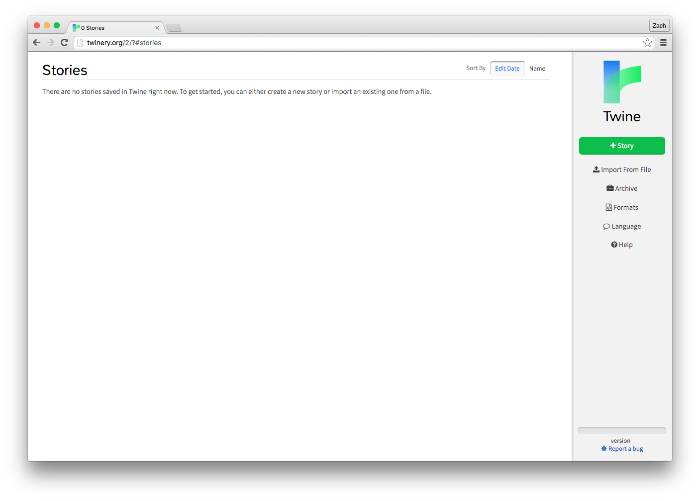

This is the Twine dashboard. For now, we just want to focus on one thing: creating our story! Click on the big green "+ Story" button, and choose a name for your story. As it mentions, you can change this later.

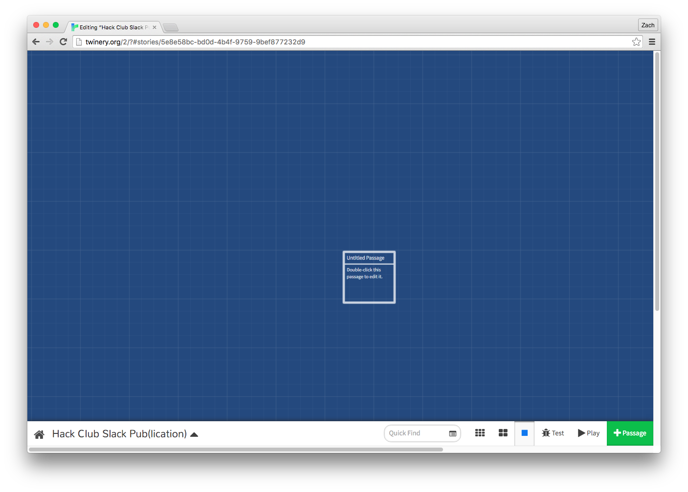

After you entered the name, you'll notice that the story overview has launched. Towards the middle, you'll notice a box that says "Untitled passage". A passage can be seen like a page of a book, as you'll write your story in these passages. As well, you'll be adding links to other passages from a passage. For now, let's just change the text. Double click on the passage to open the passage editor, and enter something to start your story with. In general, a text adventure will describe the reader's current surroundings, any actions that may have just happened, and what the user can do next. Since the adventure just started, just a brief description will do.

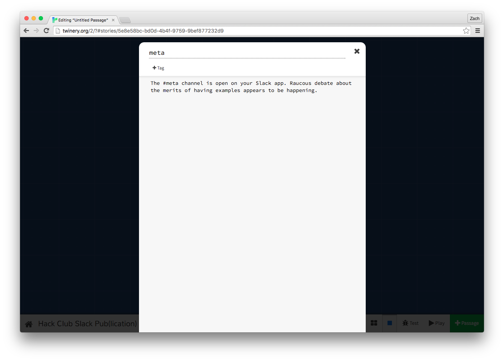

You'll also likely want to change the title of the passage. Once you're done, just click the little X on the popup, and it'll automatically save what you wrote. We're now back in the story overview. You can drag around the passage boxes to organize them in a way that makes most sense to you.

Now, let's make sure this works. In the bottom right, click on the "Test" button. This should open a new tab with your story.

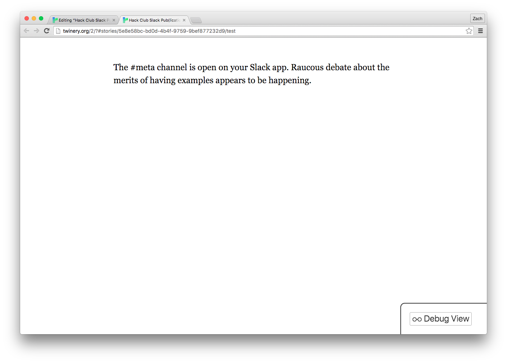

Awesome! You should see what you wrote in that first passage. As well, you'll notice a "Debug View" button in the bottom right. We'll be using that later. You can close this tab for now if you want, but whenever you want to test out your story, you should press the "Test" button in the bottom right of the story overview.

## Adding new passages

So far, our story is pretty simple: It's just one passage! For this to be an adventure, we're probably going to want a bit more. Thankfully, this is pretty easy to do in Twine. This is also going to be the first we use what's called "syntax", which refers to special instructions that computer programs use to understand what you want to do.

Let's open up our first passage again by double clicking on it. So far, we've wrote about the #meta channel on Slack. Let's add a link to the #random channel. To create a new passage, it's pretty simple: With a special syntax, we tell Twine what the title of our new passage is. Our new passage is going to be called "random". We'll create a couple of blank lines in the editor, and then enter this: `[[random]]`.

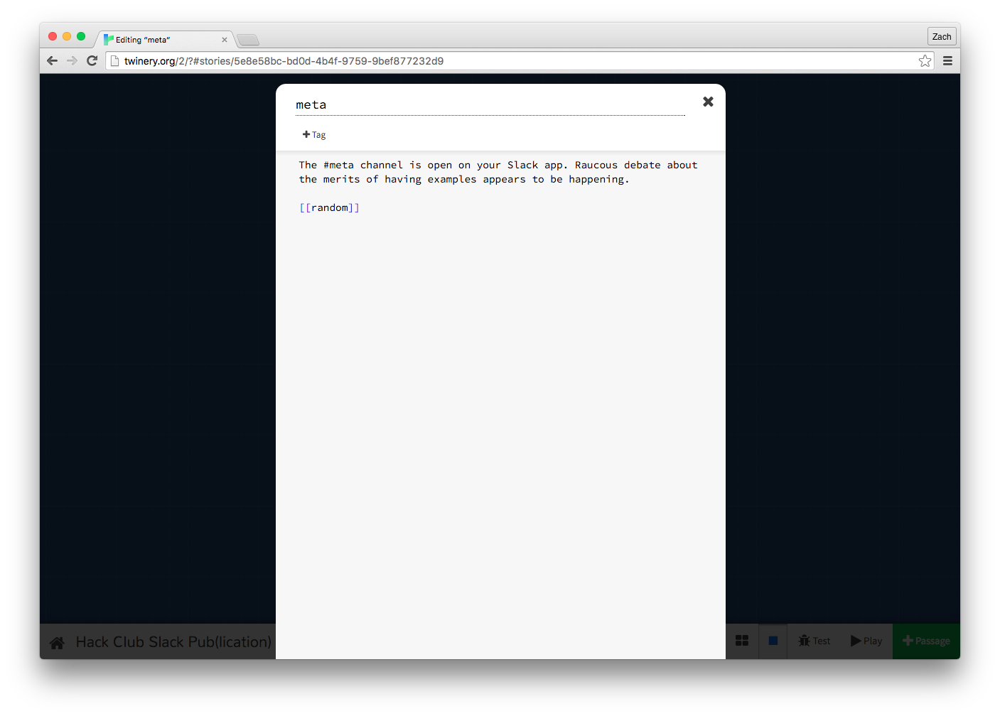

That syntax of wrapping the title in two square brackets tells Twine that we want to create a clickable link, and when clicked, show the contents of the passage with the title we gave it. Close out of the passage editor, and you'll notice something...

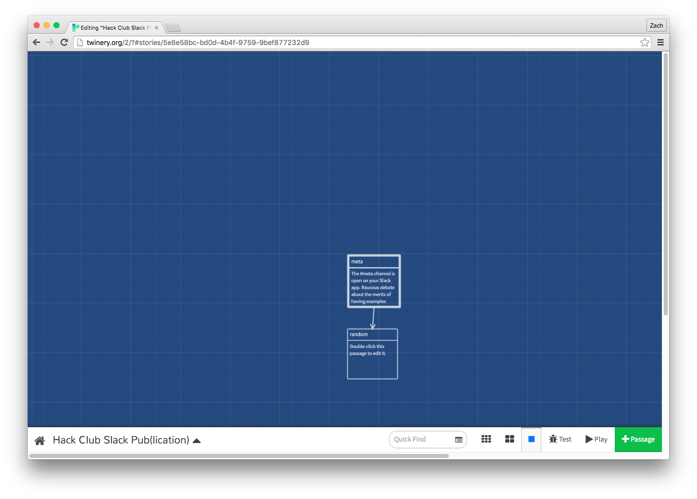

Twine recognized that the passage we specified didn't exist, so it made it for us. How convenient! You'll also notice there's an arrow going between the first passage and this new passage. This is Twine letting us know that the link is functional. In other terms, it parsed the syntax we wrote correctly. Let's add something to our new passage the same way we did with our first, by double clicking it. We'll also add a link back to our first passage, just to show again how we create links.

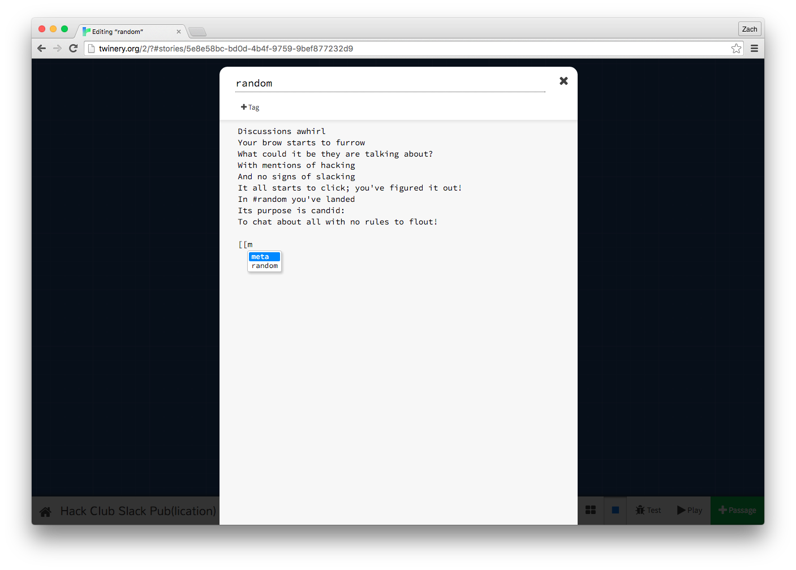

You'll have noticed that if you started typing out a link to your previous passage, Twine auto-suggested the name. This is a good way to ensure you're linking to the right passage. When you close out of the editor again, you'll notice the arrow now runs two-ways, letting us know that the link is functional both ways. Let's hit "Test" again at the bottom right, and try out our new links.

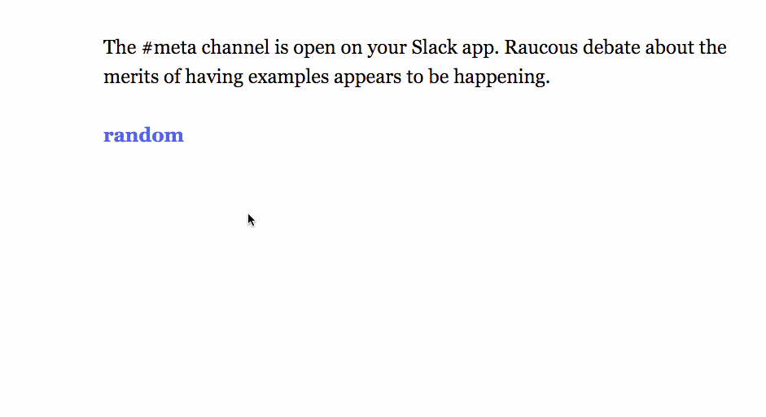

Radical! At this point, you now know the basics of Twine: You create passages with a special syntax, and link them together. You might want to take some time now to write out more of your story. Before you do though, let's learn one more helpful piece of syntax.

## Customizing link text

So far, when the links are shown in our story, they've just been the name of the passage. Although you could make the names of the rooms whatever you want to be shown in the story, this could lead to problems later. For example, you might want to have the same text in multiple places, but not have them link to the same passage. As well, this overall might become disorganized, since the sentences may be out of context, and it'll be confusing to go through in the story overview.

Instead, we can use some syntax to specify what the link says when shown in the story. If we wanted our link to the `random` passage to say "Go to the #random channel", we would replace `[[random]]` with `[[Go to the #random channel->random]]` You'll notice we added an arrow, with `->`.

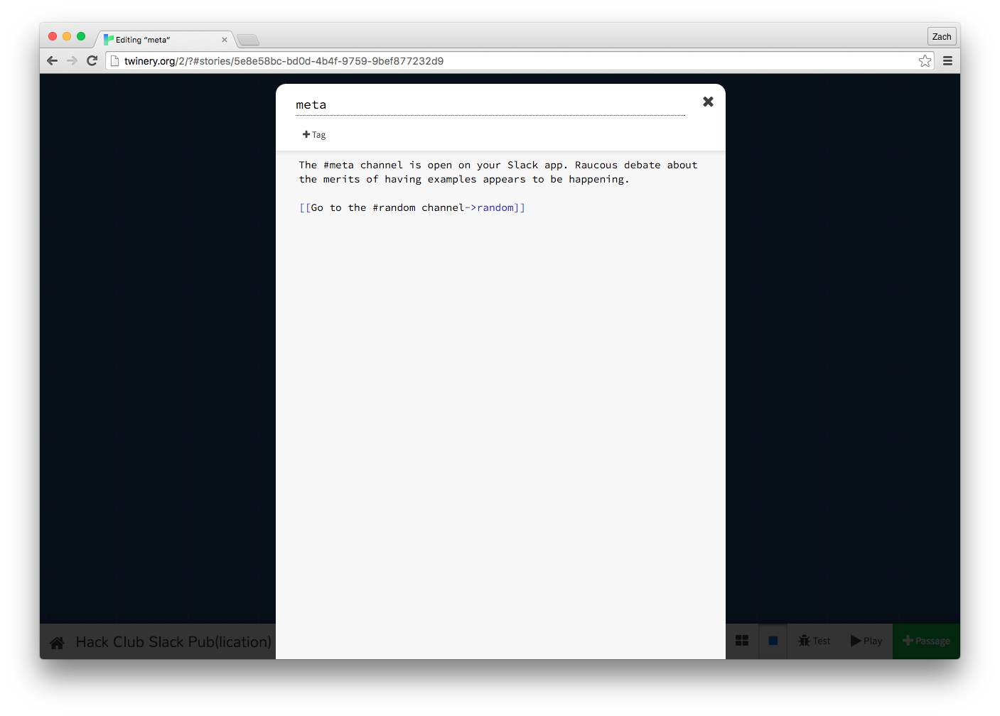

Anything that comes after the `->` arrow will display as the text when going through our story. Make sure to write it exactly like our example, where there's no space between the passage title and arrow, and the arrow and display text.

Equipped with these two pieces of syntax, you can start making some real progress on your text adventure. When you've written something fun, you can start on the next sections, which will talk about formatting your text with new syntax, and how to use a macro to generate content dynamically.

If you're stuck on your story, feel free to work with others! Collaboration is super important when coding, and can lead to some great results. Don't worry: there's no cheating in Hack Club.

## Formatting your story

Through things like **bolding** and *italicizing*, you can help to convey different types of tone throughout your story. You can see [a full reference of the types of text styling here](http://twine2.neocities.org/#markup_style), but here's a quick cheatsheet:

- `*Italics*` -> Creates *Italics*
- `**Bolding**` -> Creates **Bolding**
- `***Bold italics***` -> Creates ***Bold italics***
- `~~Crossed out~~` -> Creates ~~Crossed out~~

You'll also notice on that page it mentions that macros can be used to format your text. Let's talk about what a macro is, and how you can use them.

## Adding macros to your story

As mentioned in the formatting documentation linked previously, Twine has macros that can be used to do a variety of functions. [Twine defines them as so](http://twine2.neocities.org/#markup_macro):

> A macro is a piece of code that is inserted into passage text. Macros are used to accomplish many effects, such as altering the game's state, displaying different text depending on the game's state, and altering the manner in which text is displayed.

In other words: A macro is another piece of Twine's syntax that can be used for content that is not pre-defined, or "dynamically generated." In general, macros return some sort of result. Macros are also very similar to what's known as a "function" in other programming languages. They technically have some differences, but for our purposes, they are equivalent.

Twine's macros generally return text. However, the text may be altered, such as being a different color, or or it may be dynamically generated, such as showing the current time. As you can see from [this list of macros](http://twine2.neocities.org/#macro_set), there are a lot of macros that you can use, and some of them are quite advanced. We're going to try using a pretty simple one, that changes the color of the text. [Here's the documentation on this macro](http://twine2.neocities.org/#macro_text-colour). It's called `text-colour`, but it's also called just `color` for ease of use. Here's their example usage:

```
(color: red + white)[Pink]
```

Let's break down this syntax into two parts:

- `(color: red + white)` - We start with a regular bracket, and then type out the word `color`, followed the colon. This is the macro call, which tells Twine that we want to do. After the colon, we put our color. In their case, they've highlighted that Twine will combine colors if you use a `+` symbol in between color names, so you can have a wide range of colors. We'll experiment with that in a second. After the last color, we put a closing bracket, to show we've finished the macro call.
- `[Pink]` After that, there's a single square bracket, followed by the word "Pink", and then a closing square bracket. This is the text we want Twine to color, which in this case is `red + white`, which makes pink. Any amount of text can go in-between the opening and closing square brackets. Let's add this to our story:

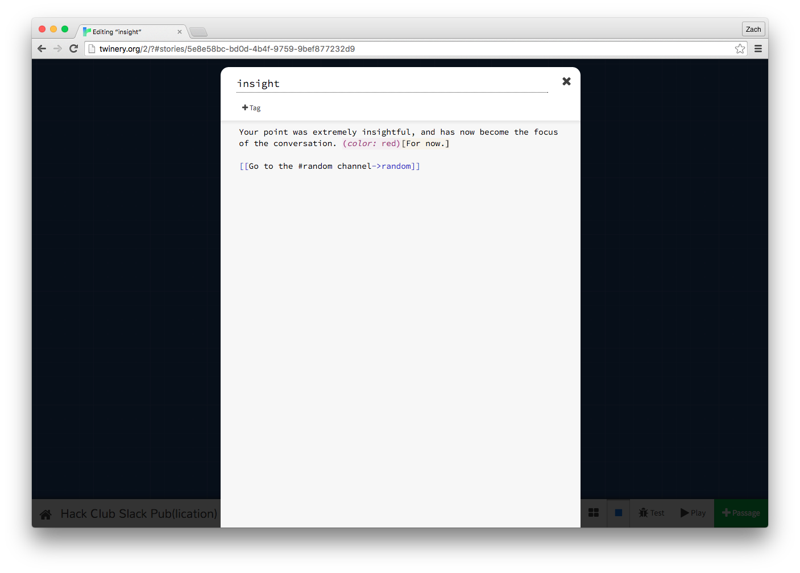

In our case, we made the text just plain red. However, you can try experimenting with colors. Try combining a couple different colors to see what you get.

If you looked at the documentation previously, you'll also noticed it mentioned we can use a "CSS-style color" instead. We'll be talking about CSS in a later workshop, but for now, you can use a [color picker like this one](http://www.colorpicker.com/), pick out a color, copy the letters and numbers above the color picker next to the hashtag, and put it in the color like this: `(color: "#90C3D4")(My custom color!)` Notice that we had to add double-quotes around the letters and numbers, and also add the `#` symbol (also known as an "octothorpe") before it. Again, we'll be talking more about why this is later, but just note that you'll need to do this.

Before we finish up, let's test our story again, to make sure we got the syntax right. If everything loads correctly, let's also do one more thing: Press the "Debug View" button in the bottom right of your story preview.

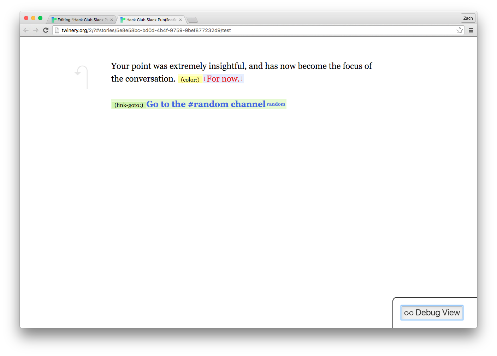

The debug view will show where you're using macros, among other things. You'll notice your colored text now shows the macro next to it. However, you'll also notice your link has a macro next to it, that says `(link-goto:)`. What does this mean? Well, when you use the double square bracket syntax to define a link to another passage, you're actually using the shorthand for the `link-goto` macro!

You could create all of your links by typing `(link-goto: "Display text", "Passage title")`, but we used the shorthand with the double square brackets and `->` arrow because it's a lot quicker to do. The Twine passage editor also doesn't automatically create a new passage if you use the full macro syntax. In general, many things in programming have shortcuts to make them easier. These are sometimes called "abstractions", as they mask over what might take a lot of code with something much simpler.

## Adding your adventure to your website

To finish up, we need to do one last thing: Save our stories! Twine automatically saves your story as you go, but this is only within your browser. Some computers may not remember this data when the browser is closed, or when the computer is logged out of. Thankfully, Twine has us covered here. First, click on the Home button in the bottom left of the story overview. You should be back on your Twine dashboard. You'll see that your story now has a place on the dashboard. Click the gear icon on your story, and choose "Publish to file" in the menu that pops up.

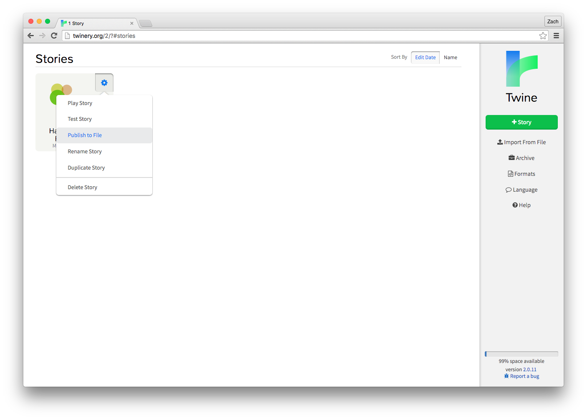

Twine will automatically download your story into an HTML file. To add it to your website, create a new directory called `twine_workshop` in the Cloud9 sidebar of your projects' workspace. Once you have that, drag the downloaded HTML file into that directory. Then go to the console at the bottom of the screen and run the following commands to add your adventure to your GitHub repository (and therefore your website).

1. `git add -A` to add all changes.
2. `git commit -m 'Add Twine story'` to make a commit with the message 'Add Twine story.'
3. `git push` to push that commit to your `USERNAME.github.io` repo.
4. You may need to authenticate as well. (Remember, characters won't show up when typing your password, but rest assured, they are being typed!)

Now you can view it at `USERNAME.github.io/twine_workshop/STORYNAME.html` (make sure to replace `USERNAME` and `STORYNAME` with your GitHub username and text adventure's name, respectively)!

You can also open your downloaded file anywhere, whether you're online or offline, and be able to play through your story. If you wish to edit this story again at a later date, simply go to the Twine dashboard, and click the "Import From File" button underneath the "+ Story" button. Then, upload your downloaded file. Twine will recognize it, and add it back to your dashboard. You'll want to save your story to your computer whenever you're done editing it, such as at the end of a meeting. Your computer may save your progress automatically without doing this, but to err on the side of caution, always save the story to a local file.

## Wrap-up

Great work! It may not have seemed like you did a lot of coding, but through this workshop, you were introduced to some fundamental basics, such as the idea of using syntax to tell a computer to do something, or using macros to return a result from an input. Here are some ideas for how you could expand your story:

- Try using some different macros! [There's a full list of them here](http://twine2.neocities.org/#macro_set), all with explanations and example usages. Some of the terminology may be new to you, but try researching what you don't know.
- The documentation linked to in the last point also has some other text formatting that we didn't go over here. Try experimenting with those.

Overall, by the end of this meeting, you should have a solid story written. It doesn't have to be super long or complicated, but you should be proud of it! Until next time!
