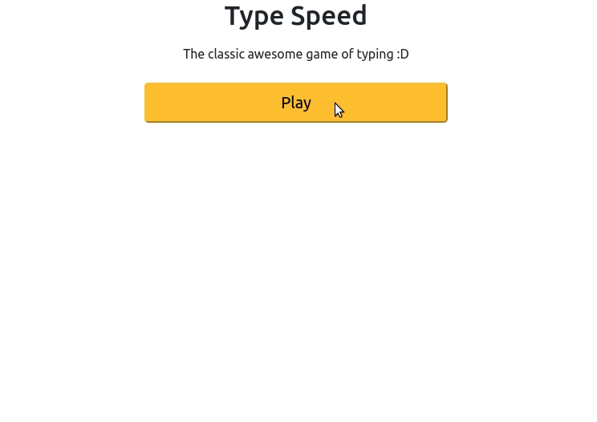

Game development is one of the scarest topics for developers, but not in this workshop, you will learn about HTML, CSS and Javascript while developing your own game. You’re going to create a simple game: type speed game where you can both train your typing and have fun.



[Link to demo](https://TypeSpeed.f2acode.repl.co)

## Getting started

We’re going to be using some Javascript libraries: [animejs](https://animejs.com/), for animating elements, [d3js](https://d3js.org/), which we use for loading a JSON file and [bootstrap](https://getbootstrap.com/) which allow us to improve the design of the project.

Get started from the starter project by [clicking here](https://repl.it/@f2acode/TypeSpeedStarter). Once your project spins up, navigate to the `index.html` file. Then, just before the end of your `<head>` tag, import these three libraries:

```html
<script src="https://cdnjs.cloudflare.com/ajax/libs/animejs/3.2.1/anime.min.js"></script>

<script src="https://d3js.org/d3.v5.min.js"></script>

<link
  href="https://cdn.jsdelivr.net/npm/bootstrap@5.0.0-beta1/dist/css/bootstrap.min.css"
  rel="stylesheet"
  integrity="sha384-giJF6kkoqNQ00vy+HMDP7azOuL0xtbfIcaT9wjKHr8RbDVddVHyTfAAsrekwKmP1"
  crossorigin="anonymous"
/>
```

Great! Now that we’ve imported the libraries, we’re ready to start writing the code.

## User interface

For the user interface we will use the Bootstrap library, so it's much easier rather than write plain CSS code and allow us to focus on the game mechanics.

We will define the Home Page which will start visible and other screens which will start hidden.

### Home Page

First, we will create the initial screen of the game. Inside of the body, add the code below:

```html
<div class="d-grid gap-2 col-6 mx-auto">
  <h1 class="text-center">Type Speed</h1>
  <p class="text-center">The classic awesome game of typing :D</p>

  <button
    type="button"
    class="btn-lg btn-warning"
    id="playButton"
    onclick="play()"
  >
    Play
  </button>
</div>
```

We have a simple structure for the main page, a `div` which groups the elements, and three children:

1. `h1`, a title for the game;
2. `p`, a description for the game;
3. `button`, a button for starting the game.

With Bootstrap we use classes for most of the style definitions. So for the classes we have:

- `d-grid gap-2` to define block children buttons for the element;
- `col-6` to fill half of the width;
- `mx-auto` for horizontal centering;
- `text-center` to centralize the text;
- `btn-lg` defines a large button;
- `btn-warning` defines a warning style for this button (background yellow and text black).

We also have an `id` which will be used to show and hide the play button and the `onclick` function call, which will be defined later.

### Game Over page

The structure for the game over page is the same, the difference are the texts and the function called on the button.

```html
<div
  class="d-grid gap-2 col-6 mx-auto"
  id="gameOver"
  style="visibility: hidden"
>
  <h1 class="text-center">GAME OVER</h1>
  <button type="button" class="btn-lg btn-warning" onclick="showMenu(true)">
    Play Again
  </button>
</div>
```

### You Won page

Here we defined a basic screen where we have an id `youWon` for the main element, a title and a button with another function call.

```html
<div id="youWon" style="visibility: hidden">
  <h1>You Won</h1>
  <button onclick="showMenu(true)">Play Again</button>
</div>
```

## Game Page

Now we have a bigger code for the game page, where we have a `form` for the user to input the word they are reading on the screen and three statistics about the user performance: misses, hits and words remaining.

```html
<div class="container">
  <div class="row justify-content-start">
    <div
      class="col"
      id="status"
      style="position: fixed; bottom: 0;visibility: hidden;"
    >
      <form onsubmit="typeWord();return false" autocomplete="off">
        Enter the word: <input id="winput" type="text" />
        <input type="submit" />
      </form>
      <div>
        <div style="display: flex;">
          <div>Misses:</div>
          <div id="missedWords" style="margin: 0px 5px;">0</div>

          <div>- Hits:</div>
          <div id="hittedWords" style="margin: 0px 5px;">0</div>

          <div>- Remaining:</div>
          <div id="remainingWords" style="margin: 0px 5px;">0</div>
        </div>
      </div>
    </div>
  </div>
</div>
```

Now we have an invisible element which will be triggered when the user hit play (will become visible), we defined the ids of each one to update their values with Javascript.

## Javascript side

On this workshop we will use a [great base of common words](https://github.com/dariusk/corpora/blob/master/data/words/common.json), you will have the file with the words on the starter project (`words.json`). Now let's add some behaviour to our elements with your `script.js` file, first define two global variables at the top:

```javascript
var hittedWords = 0
var missedWords = 0
```

Bellow that write the following function to randomize our array of words:

```javascript
const shuffle = (arr) =>
  [...arr].reduceRight(
    (res, _, __, arr) => (
      res.push(arr.splice(0 | (Math.random() * arr.length), 1)[0]), res
    ),
    []
  )
```

Then a function to toggle the visibility of the main menu of our game::

```javascript
const showMenu = function (show) {
  if (show) {
    document.getElementById('status').style.visibility = 'hidden'
    document.getElementById('playButton').style.visibility = 'visible'

    document.getElementById('gameOver').style.visibility = 'hidden'
    document.getElementById('youWon').style.visibility = 'hidden'
  } else {
    document.getElementById('status').style.visibility = 'visible'
    document.getElementById('playButton').style.visibility = 'hidden'
  }
}
```

This function uses the `document.getElementById` to get the elements then set their visibilities accordinly to the `show` value, if true:

- Hide the status bar of the player;
- Hide game over screen;
- Hide you won screen;
- Shows the play screen;

Otherwise:

- Shows the status bar of the player;
- Hide the play screen.

Then, write the last small function, which will handle the user input for trying to hit a word:

```javascript
const typeWord = function () {
  typedWord = document.forms[0].winput.value

  document.forms[0].winput.value = ''

  if (typedWord) {
    const wordFound = document.querySelector('.' + typedWord)

    if (wordFound) {
      hittedWords += 1

      document.getElementById('hittedWords').innerText = hittedWords
      wordFound.remove()

      if (anime.running.length == 1) {
        document.getElementById('youWon').style.visibility = 'visible'
      }
    }
  }
}
```

It gets the value of the input form, check if there is a word and tries to find the element on the HTML, if so this increases the `hittedWords`, and remove the element from the HTML. If there is just one word remaining on the screen then that shows the you won screen.

### Main function for the playing

Now create the main function which will be called once the player hit `Play`:

```javascript
const play = function () {
  var body = document.body
  var playing = true

  document.getElementById('missedWords').innerText = '0/10'
  document.getElementById('hittedWords').innerText = 0
  document.getElementById('remainingWords').innerText = 0

  hittedWords = 0
  missedWords = 0

  showMenu(false)

  d3.json('words.json').then(function (data_json) {
    const words = shuffle(data_json['commonWords'])

    document.getElementById('remainingWords').innerText = words.length

    const interval = setInterval(function () {
      const word = words.pop()

      if (word) {
        document.getElementById('remainingWords').innerText = words.length

        var wordTag = document.createElement('h1')
        var wordTextTag = document.createTextNode(word)
        wordTag.appendChild(wordTextTag)

        body.appendChild(wordTag)

        function getRandomInt(max) {
          return Math.floor(Math.random() * Math.floor(max))
        }

        wordTag.style.position = 'fixed'

        const randomHeight = getRandomInt(window.innerHeight - 100) + 'px'
        wordTag.style.top = randomHeight

        wordTag.className = word

        var animation = anime({
          targets: wordTag,
          right: '0px',
          easing: 'easeInOutQuad',
          scale: 1.5,
          duration: 4000,
          complete: function (anim) {
            try {
              body.removeChild(wordTag)

              if (playing) {
                missedWords += 1
                document.getElementById('missedWords').innerText =
                  missedWords + '/10'

                if (missedWords == 10) {
                  playing = false
                  document.getElementById('gameOver').style.visibility =
                    'visible'

                  clearInterval(interval)
                }
              }
            } catch (e) {}
          }
        })
      } else {
        clearInterval(interval)
      }
    }, 1000)
  })
}
```

We do some small steps at the beginning:

- Define `body` of the page so that we can reuse that;
- Define `playing` variable which will be explained later;
- Reset the statistic elements;
- Reset the statistic global variables;
- Call the function `showMenu` we defined ealier.

The `d3.json` reads our file of words, then with its return we define a `words` variable with the words already shuffled by our previous function `suffle` then we define the remaining words on the element of the with the `remainingWords` id.

The `setInterval` is a native function of the browser to create recurrence functions which will be called every some milliseconds, we attribute that to a variable to that we can force it to stop. The function called every 1 second (1000 milliseconds) will extract one word from the array and check if the array is not empty (the word was extracted). If it's empty we stop the `interval` recurrence. **If not** it:

- Updates the remaining words;
- Creates an word element with `h1` (a title);
- Add a text with the random word to the created element;
- Add the word to the `body`;
- Define a function for getting random int values;
- Define a specific height for the word to start, since it will move from the left to the right with other word then it's good to have different random heights on the screen;
- Then, it creates an animation with the `anime` function with some parameters: `right` where the word should place at the end of the animation, `easing` the type of animation, `scale` make the element bigger in some scale, `duration` how many milliseconds the animation will last, `complete` a callback function once the animation finishes.

The callback function deserves a in-depth explanation:

- We use a `try-catch` block to avoid errors if it tries to remove an element from the `body` if there isn't the element, because it will be removed once the user hits the word;
- The lifecycle of the animations will define the score of the user, once the animation finishes it increases the missing words of the user, however when the missing words max number is reached we need to stop the game (and not allow the animations function to increase the missing words number), then we check the `playing` variable which allow us to handle that;
- Then we:
  - Increase the `missingWords`;
  - Update the missings word on the HTML.
  - If the `missingWords` is equal to 10 we:
    - Set `playing` to false;
    - Make the game over screen visible;
    - Stop the function recurrence.

It's good to notice that this function will run while the user is typing words (hitting the `typeWord` function) to avoid them to finish the animation.

## Hacking - WIP

There are many ways to improve this project and make it your own customized project, here are some of the examples you can check:

- **Type Speed - customized input word list**: [Demo]() [Code]()
- **Type Speed - improve styles**: [Demo]() [Code]()
- **Type Speed - open API word list**: [Demo]() [Code]()
