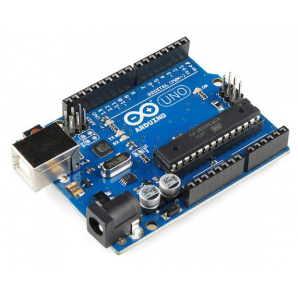
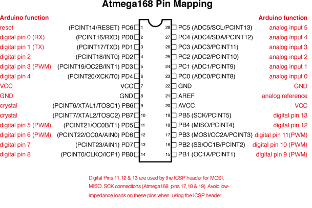

# Arduino Uno

- Reference: [www.arduino.cc](https://www.arduino.cc)

**Arduino Uno** is a microcontroller board based on the ATmega328P. It has 14 digital input/output pins (of which 6 can be used as PWM outputs), 6 analog inputs, a 16 MHz quartz crystal, a USB connection, a power jack, an ICSP header and a reset button. It contains everything needed to support the microcontroller; simply connect it to a computer with a USB cable or power it with a AC-to-DC adapter or battery to get started. You can tinker with your UNO without worrying too much about doing something wrong, worst case scenario you can replace the chip for a few dollars and start over again. "Uno" means one in Italian and was chosen to mark the release of Arduino Software (IDE) 1.0. The Uno board and version 1.0 of Arduino Software (IDE) were the reference versions of Arduino, now evolved to newer releases. The Uno board is the first in a series of USB Arduino boards, and the reference model for the Arduino platform; for an extensive list of current, past or outdated boards see the Arduino index of boards.

## Warnings

The Arduino Uno has a resettable fuse that protects your computer's USB ports from shorts and overcurrent. Although most computers provide their own internal protection, the fuse provides an extra layer of protection. If more than 500 mA is applied to the USB port, the fuse will automatically break the connection until the short or overload is removed.

## Differences with other boards

The Uno differs from all preceding boards in that it does not use the FTDI USB-to-serial driver chip. Instead, it features the ATmega16U2 (ATmega8U2 up to version R2) programmed as a USB-to-serial converter.

## Power

The Arduino Uno board can be powered via the USB connection or with an external power supply. The power source is selected automatically.

External (non-USB) power can come either from an AC-to-DC adapter (wall-wart) or battery. The adapter can be connected by plugging a 2.1mm center-positive plug into the board's power jack. Leads from a battery can be inserted in the GND and VIN pin headers of the POWER connector.

The board can operate on an external supply from 6 to 20 volts. If supplied with less than 7V, however, the 5V pin may supply less than five volts and the board may become unstable. If using more than 12V, the voltage regulator may overheat and damage the board. The recommended range is 7 to 12 volts.

The power pins are as follows:

- VIN. The input voltage to the Arduino/Genuino board when it's using an external power source (as opposed to 5 volts from the USB connection or other regulated power source). You can supply voltage through this pin, or, if supplying voltage via the power jack, access it through this pin.
- 5V.This pin outputs a regulated 5V from the regulator on the board. The board can be supplied with power either from the DC power jack (7 - 12V), the USB connector (5V), or the VIN pin of the board (7-12V). Supplying voltage via the 5V or 3.3V pins bypasses the regulator, and can damage your board. We don't advise it.
- 3V3. A 3.3 volt supply generated by the on-board regulator. Maximum current draw is 50 mA.
- GND. Ground pins.
- IOREF. This pin on the Arduino/Genuino board provides the voltage reference with which the microcontroller operates. A properly configured shield can read the IOREF pin voltage and select the appropriate power source or enable voltage translators on the outputs to work with the 5V or 3.3V.

## Memory

The ATmega328 has 32 KB (with 0.5 KB occupied by the bootloader). It also has 2 KB of SRAM and 1 KB of EEPROM (which can be read and written with the EEPROM library).

## Pin Mapping

## Arduino IDE

The open-source Arduino Software (IDE) makes it easy to write code and upload it to the board. It runs on Windows, Mac OS X, and Linux. The environment is written in Java and based on Processing and other open-source software. This software can be used with any Arduino board.

[Click here](https://www.arduino.cc/en/Guide/Environment#toc1) to read more about the IDE
