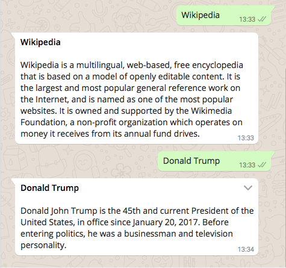
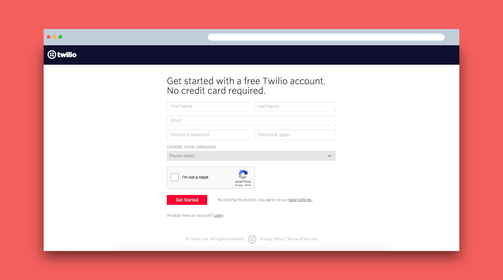
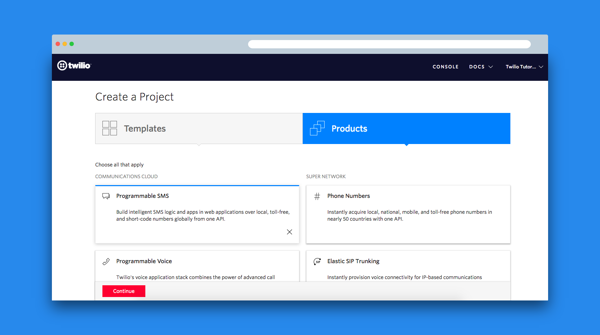
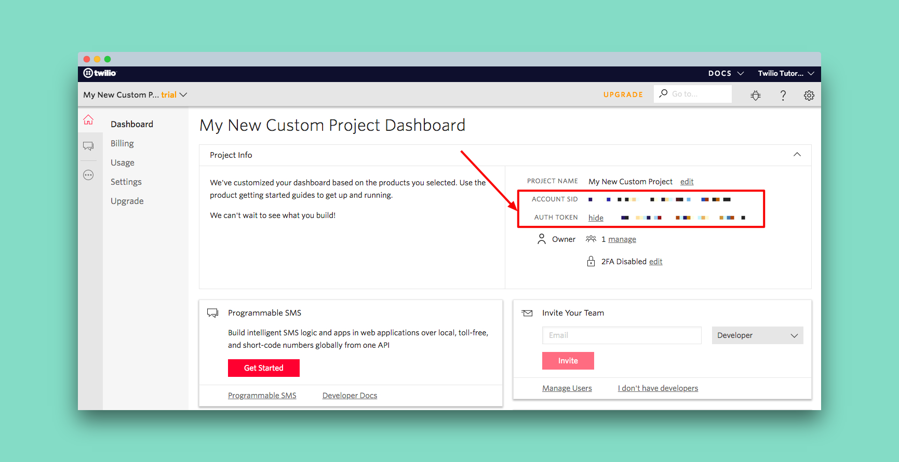
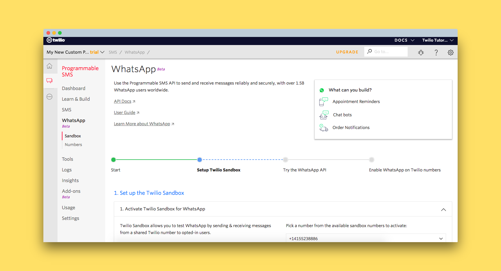
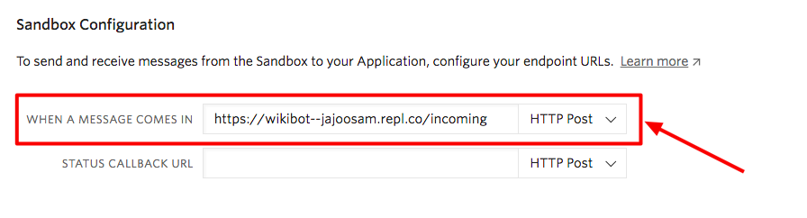
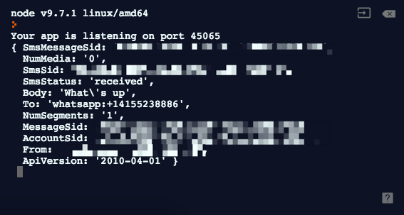

# WikiBot 💬 🤖

A few months ago, I'd started making chatbots on [Telegram](https://t.me)—I'd seen APIs for WhatsApp but they were unofficial and there was a chance for getting your number blocked 📱 ❌

A week ago, I saw that [Twilio](https://twilio.com) had an official WhatsApp API. 30 minutes later, I made a [Wikipedia bot on WhatsApp](https://wikibot.4ty2.fun) 👇



This is a workshop to help you make a something like this, and make your own chatbots on WhatsApp, in just 30 minutes 🎓

## 🔑 Accounts and Keys

First, Sign up for [Twilio](https://www.twilio.com/try-twilio)—it's free and you won't need a credit card 💳



Once you're done verifying your phone number, select Products > Programmable SMS and then continue to name your project.



Feel free to skip steps for adding teammates—you won't need that for now.

You must now take note of some authentication keys you'll need for building the WhatsApp bot 👇



The final step—[set up your WhatsApp Sandbox](https://www.twilio.com/console/sms/whatsapp/sandbox)—choose any number, and join your sandbox following instructions on the page.



…and you're done with credential setup! Don't worry, that was the toughest part of this tutorial 😛

## 🚀 Getting Started

So that we don't spend too much time on setup, I've created an environment (with repl.it!) you can use within your browser. Head over [here](https://repl.it/@jajoosam/wikibot-start), and wait for a couple of seconds to fork it.

Next, open up `server.js` and put in your Account SID and Auth Token, on lines `7` and `8`

```js
const accountSid = 'XXXXXXXXXXXXXXXXXXXXXXXXXXXXXXXXXX' // Account SID
const authToken = 'XXXXXXXXXXXXXXXXXXXXXXXXXXXXXXXX' // Auth Token
```

You can see, this environment already has dependencies installed, and an `express` server set up. We still need to give Twilio a URL to send incoming messages to, though 🔗

Let's go back to the [WhatsApp Sandbox](https://www.twilio.com/console/sms/whatsapp/sandbox), and put in a webhook URL for incoming messages.



This URL must be what you see on the preview panel of your [repl.it](http://repl.it) project + `/incoming`


We can now finally read messages that are sent to the bot. Add a simple `console.log()` in your webhook handler 👇

```js
app.post('/incoming', (req, res) => {
  console.log(req.body)
})
```

When you send a message to your bot, you should be able to see something like this in your repl.it console 👨‍💻



Building an Echo bot would look something like this, using `twiml` to write a message 👇

```js
app.post('/incoming', (req, res) => {
  const twiml = new MessagingResponse()
  twiml.message(req.body.Body)
  res.writeHead(200, { 'Content-Type': 'text/xml' })
  res.end(twiml.toString())
})
```

But, since we're actually trying to build a useful bot—let's use informative APIs!

## 🌐 Fetching Information

DuckDuckGo has an amazing, free instant answer API. It takes in a query and returns back a summary from Wikipedia and more.

A few examples 👉 [Wikipedia](https://api.duckduckgo.com/?skip_disambig=1&format=json&pretty=1&q=Wikipedia), [MacBook Pro](https://api.duckduckgo.com/?skip_disambig=1&format=json&pretty=1&q=MacBook%20Pro), [Twilio](https://api.duckduckgo.com/?skip_disambig=1&format=json&pretty=1&q=Twilio)

I spent some time creating a decent parser which usually returns information from this API. Try pasting this code in your [repl.it](http://repl.it) project, and your [console](https://dsh.re/f7477c) should have stuff about Trump in it 😛

```js
const base =
  'https://api.duckduckgo.com/?skip_disambig=1&format=json&pretty=1&q='
const query = 'Donald Trump'

request(base + query, (error, response, body) => {
  body = JSON.parse(body)
  if (body['Abstract'] == '') {
    body['Abstract'] = body['RelatedTopics'][0]['Text']
  }
  const msg = body['Heading'] + '\n\n' + body['Abstract']
  console.log(msg)
})
```

Pretty straight forward, right? 😄

## 🛠️ Putting it all together

To make our actual bot, all we need to do is get the query from our request—which we can get as `req.body.Body`—and use `twmil` to send across the data we collected in `msg`

```js
app.post('/incoming', (req, res) => {
  const twiml = new MessagingResponse()
  const base =
    'https://api.duckduckgo.com/?skip_disambig=1&format=json&pretty=1&q='
  const query = req.body.Body

  request(base + query, (error, response, body) => {
    body = JSON.parse(body)

    if (body['Abstract'] == '') {
      body['Abstract'] = body['RelatedTopics'][0]['Text']
    }

    const msg = twiml.message(body['Heading'] + '\n\n' + body['Abstract'])
    res.writeHead(200, { 'Content-Type': 'text/xml' })
    res.end(twiml.toString())
  })
})
```

You now have a fully-functioning WhatsApp bot! Send anything you want to know about your bot 🤖 and you should see it respond super fast 💬 ⚡

Adding welcome messages and a little formatting is quite simple, look at the final [repl](https://repl.it/@jajoosam/wikibot) to see how I did it 👨‍💻

## 🔗 Sharing the bot

For others to use this bot, they'll need to join your sandbox first—and send a message just like you did earlier 👉 `join <two-words>`

You can create links with this text too. For example, this link lets you join my bot 👇

    https://wa.me/14155238886?text=join ultramarine-tapir

`14155238886` is my bot's number, while `ultramarine-tapir` is the sandbox phrase.

Now, go ahead and share your bot on the `#ship` channel on the [Hack Club Slack](https://slack.hackclub.com)!

## ⚡ What's next?

Now that you know how to build a bot on WhatsApp, try sending notifications to yourself, and use different JSON APIs to create bots 🤖

Here are some you can play with 👇

- [QOTD API](https://favqs.com/api/qotd) (Gives you a new quote everyday)
- [Jokes API](https://08ad1pao69.execute-api.us-east-1.amazonaws.com/dev/random_joke) (Warning: jokes are **bad**)
- [Chuck Norris](https://api.chucknorris.io/jokes/random) (Jokes on _American Rajinikanth_)
- [Tonald Dump API](https://api.tronalddump.io/random/quote) (Stupid things Donald Trump has said)
- [Datamuse API](https://www.datamuse.com/api) (A super cool API to find meaningful/rhyming words with specific criteria)

All code for my WikiBot is on [GitHub](https://github.com/jajoosam/wikibot), feel free to refer to it ✨
